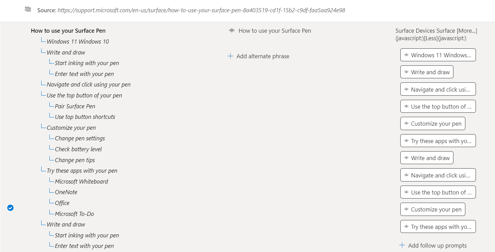
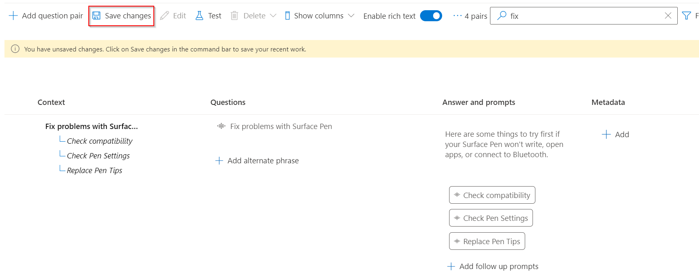

# Add guided conversations with multi-turn prompts

In this tutorial, you learn how to:

> [!div class="checklist"]
> * Add new question and answer pairs to your existing project
> * Add follow-up prompts to create guided conversations
> * Test your multi-turn prompts

## Prerequisites

 In this tutorial, we use [Surface Pen FAQ](https://support.microsoft.com/surface/how-to-use-your-surface-pen-8a403519-cd1f-15b2-c9df-faa5aa924e98) to create a project.

If you have never created a question answering project before we recommend starting with the [getting started](../how-to/create-test-deploy.md) article, which will take you step-by-step through the process.

## View question answer pair context

For this example, let's assume that users are asking for additional details about the Surface Pen product, particularly how to troubleshoot their Surface Pen, but they are not getting the correct answers. So, we add more prompts to support additional scenarios and guide the users to the correct answers using multi-turn prompts.

Multi-turn prompts that are associated with question and answer pairs, can be viewed by selecting **Show columns** > **Context**. By default this should already be enabled on the **Edit project** page in the Language Studio question answering interface.

> [!div class="mx-imgBorder"]
> 

This displays the context tree where all follow-up prompts linked to a QnA pair are shown: 

> [!div class="mx-imgBorder"]
> 

## Add question pair with follow-up prompts

To help users solve issues with their Surface Pen, we add follow-up prompts:

- Add a new question pair with two follow-up prompts
- Add a follow-up prompt to one of the newly added prompts

1. Add a new QnA pair with two follow-up prompts **Check compatibility** and **Check Pen Settings**
Using the editor, we add a new QnA pair with a follow-up prompt by clicking on **Add question pair**

    > [!div class="mx-imgBorder"]
    > 
    
    A new row in **Editorial** is created where we enter the question answer pair as shown below:
    
    |Field|Value|
    |-----|----|
    |Questions | Fix problems with Surface |
    |Answers and prompts | Here are some things to try first if your Surface Pen won't write, open apps, or connect to Bluetooth.|
    
2. We then add a follow-up prompt to the newly created question pair by choosing **Add follow-up prompts**. Fill the details for the prompt as shown:
    
    > [!div class="mx-imgBorder"]
    > 
    
    We provide **Check Compatibility** as the “Display text” for the prompt and try to link it to a QnA. Since, no related QnA pair is available to link to the prompt, when we search “Check your Surface Pen Compatibility”, we create a new question pair by clicking on **Create link to new pair** and select **Done**. Then select **Save changes**.
    
    > [!div class="mx-imgBorder"]
    > 
    
3. Similarly, we add another prompt **Check Pen Settings** to help the user troubleshoot the Surface Pen and add question pair to it.
    
    > [!div class="mx-imgBorder"]
    > 

4. Add another follow-up prompt to the newly created prompt. We now add “Replace Pen tips’ as a follow-up prompt to the previously created prompt “Check Pen Settings”.

    > [!div class="mx-imgBorder"]
    > 
    
5. Finally, save the changes and test these prompts in the **Test** pane:
    
    > [!div class="mx-imgBorder"]
    > 
    
    For a user query **Issues with Surface Pen**, the system returns an answer and presents the newly added prompts to the user. The user then selects one of the prompts **Check Pen Settings** and the related answer is returned to the user with another prompt **Replace Pen Tips**, which when selected further provides the user with more information. So, multi-turn is used to help and guide the user to the desired answer.
    
    > [!div class="mx-imgBorder"]
    > 

## Next steps

