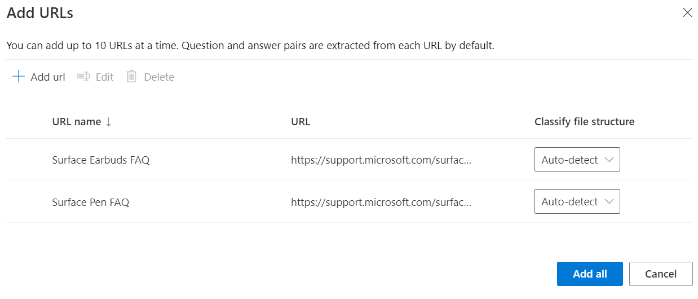
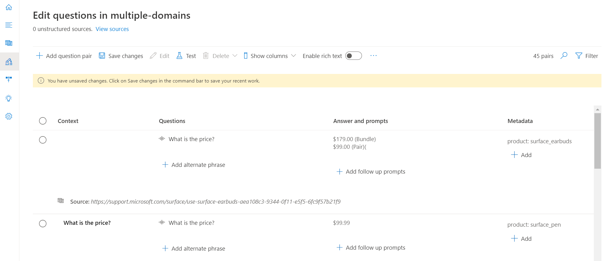
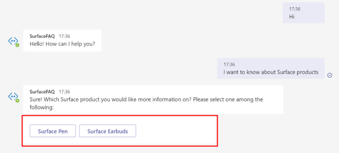
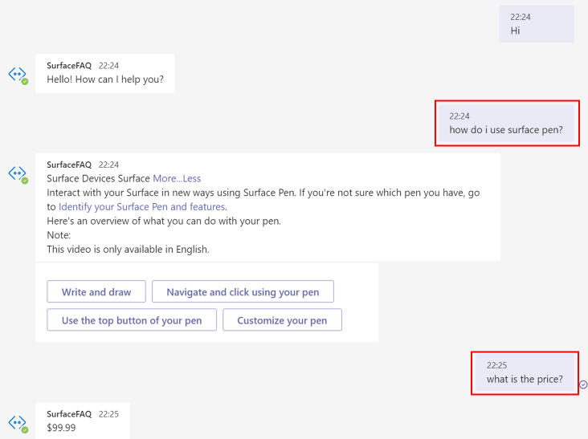

# Add multiple categories to your FAQ bot

In this tutorial, you learn how to:

> [!div class="checklist"]
> * Create a project and tag question answer pairs into distinct categories with metadata
> * Create a separate project for each domain
> * Create a separate language resource for each domain

When building a FAQ bot, you may encounter use cases that require you to address queries across multiple domains. Let's say the marketing team at Microsoft wants to build a customer support bot that answers common user queries on multiple Surface Products. For the sake of simplicity here, we will be using two FAQ URLs, [Surface Pen](https://support.microsoft.com/surface/how-to-use-your-surface-pen-8a403519-cd1f-15b2-c9df-faa5aa924e98), and [Surface Earbuds](https://support.microsoft.com/surface/use-surface-earbuds-aea108c3-9344-0f11-e5f5-6fc9f57b21f9) to create the project.

## Create project with domain specific metadata

The content authors can use documents to extract question answer pairs or add custom question answer pairs to the project. In order to group these question and answers into specific domains or categories, you can add metadata.

For the bot on Surface products, you can take the following steps to create a bot that answers queries for both product types:

1. Add the following FAQ URLs as sources by selecting **Add source** > **URLs** > and then **Add all** once you have added each of the URLS below:
   
   [Surface Pen FAQ](https://support.microsoft.com/surface/how-to-use-your-surface-pen-8a403519-cd1f-15b2-c9df-faa5aa924e98)<br>[Surface Earbuds FAQ](https://support.microsoft.com/surface/use-surface-earbuds-aea108c3-9344-0f11-e5f5-6fc9f57b21f9)

    >[!div class="mx-imgBorder"]
    >[](../media/multiple-domains/add-url.png#lightbox)

2. In this project, we have question answer pairs on two products and we would like to distinguish between them such that we can search for responses among question and answers for a given product. In order to do this, we could update the metadata field for the question answer pairs.

   As you can see in the example below, we have added a metadata with **product** as key and **surface_pen** or **surface_earbuds** as values wherever applicable. You can extend this example to extract data on multiple products and add a different value for each product.

   >[!div class="mx-imgBorder"]
   >[](../media/multiple-domains/product-metadata.png#lightbox)

4. Now, in order to restrict the system to search for the response across a particular product you would need to pass that product as a filter in the question answering REST API.

    The REST API prediction URL can be retrieved from the Deploy project pane:

   >[!div class="mx-imgBorder"]
   >[](../media/multiple-domains/prediction-url.png#lightbox)

    In the JSON body for the API call, we have passed *surface_pen* as value for the metadata *product*. So, the system will only look for the response among the QnA pairs with the same metadata.

    ```json
        {
          "question": "What is the price?",
          "top": 3
        },
        "answerSpanRequest": {
          "enable": true,
          "confidenceScoreThreshold": 0.3,
          "topAnswersWithSpan": 1
        },
        "filters": {
          "metadataFilter": {
            "metadata": [
              {
                "key": "product",
                "value": "surface_pen"
              }
            ]
          }
        }
    ```

    You can obtain metadata value based on user input in the following ways: 

    * Explicitly take the domain as input from the user through the bot client. For instance as shown below, you can take product category as input from the user when the conversation is initiated.

      

    * Implicitly identify domain based on bot context. For instance, in case the previous question was on a particular Surface product, it can be saved as context by the client. If the user doesn't specify the product in the next query, you could pass on the bot context as metadata to the Generate Answer API.

      

    * Extract entity from user query to identify domain to be used for metadata filter. You can use other Azure AI services such as [Named Entity Recognition (NER)](../../named-entity-recognition/overview.md) and [conversational language understanding](../../conversational-language-understanding/overview.md) for entity extraction.

      

### How large can our projects be?

You can add up to 50000 question answer pairs to a single project. If your data exceeds 50,000 question answer pairs, you should consider splitting the project.

## Create a separate project for each domain

You can also create a separate project for each domain and maintain the projects separately. All APIs require for the user to pass on the project name to make any update to the project or fetch an answer to the user's question.  

When the user question is received by the service, you would need to pass on the `projectName` in the REST API endpoint shown to fetch a response from the relevant project. You can locate the URL in the **Deploy project** page under **Get prediction URL**:

`https://southcentralus.api.cognitive.microsoft.com/language/:query-knowledgebases?projectName=Test-Project-English&api-version=2021-10-01&deploymentName=production`

## Create a separate language resource for each domain

Let's say the marketing team at Microsoft wants to build a customer support bot that answers user queries on Surface and Xbox products. They plan to assign distinct teams to access projects on Surface and Xbox. In this case, it is advised to create two question answering resources - one for Surface and another for Xbox. You can however define distinct roles for users accessing the same resource.
