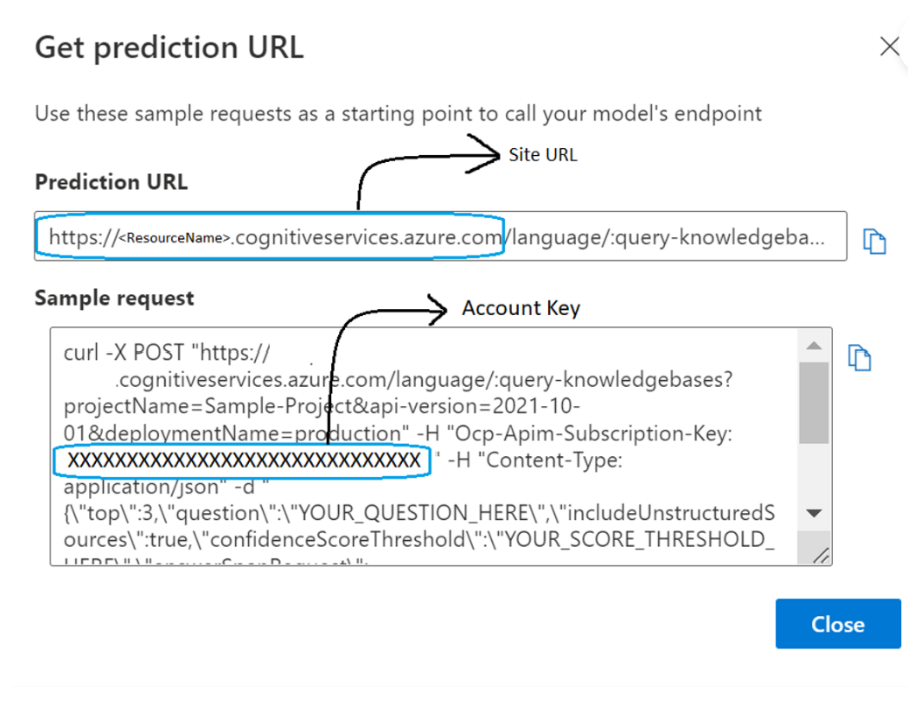
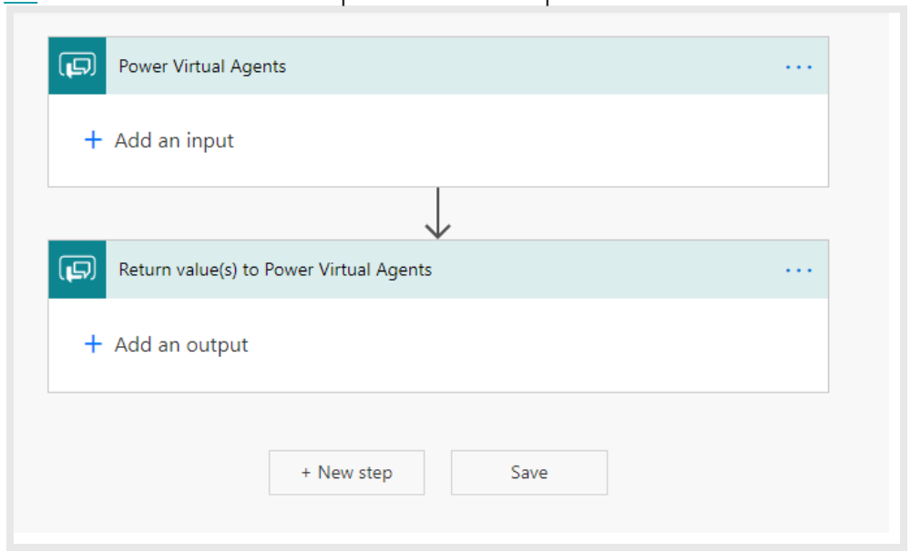
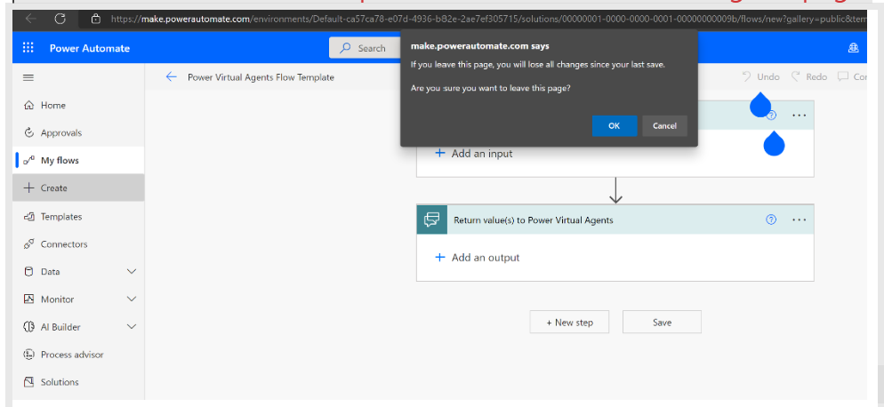
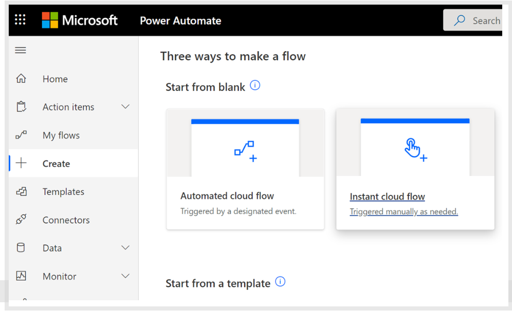
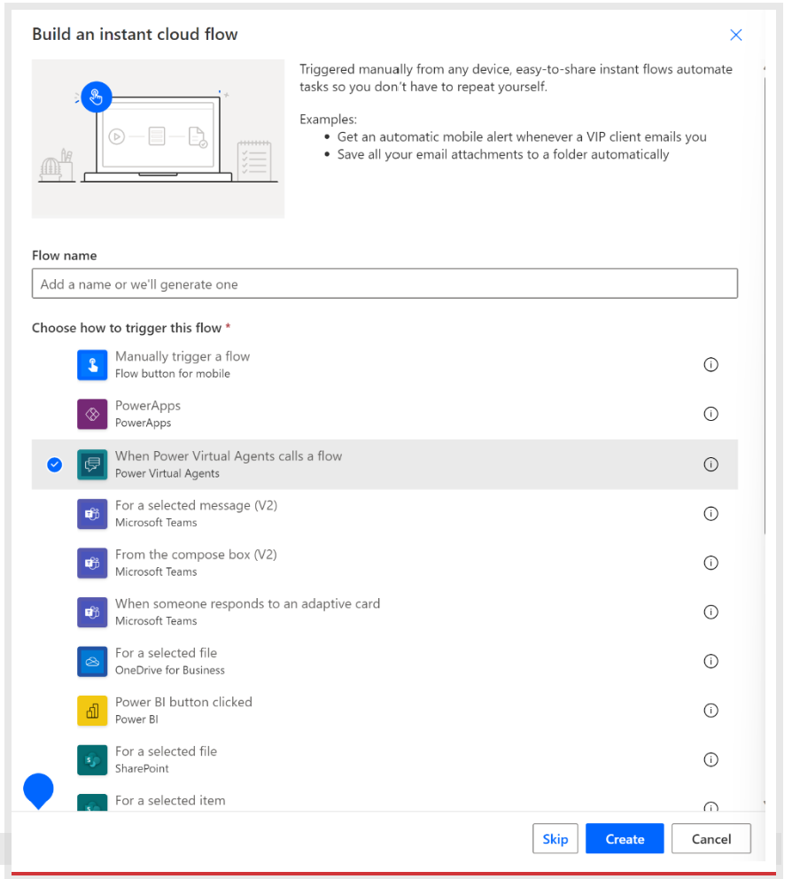
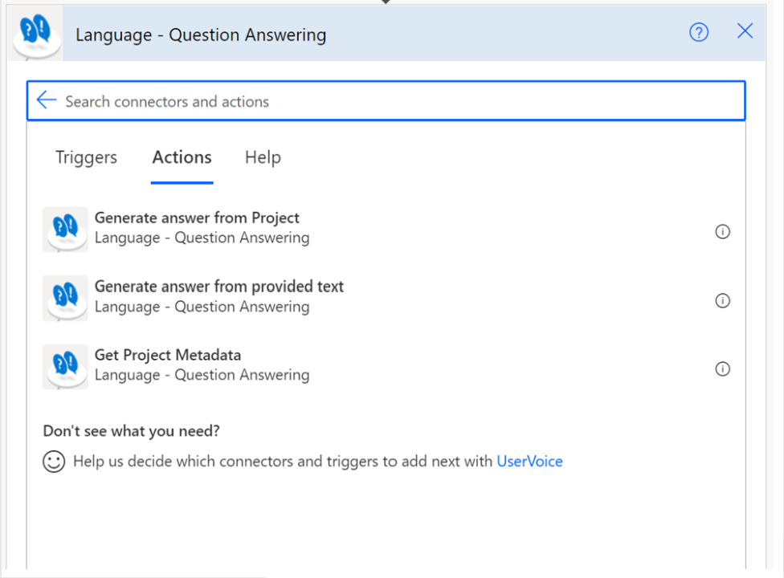
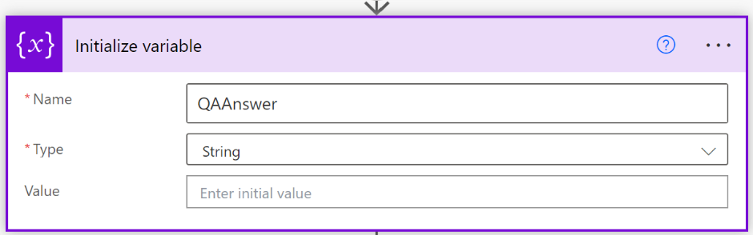
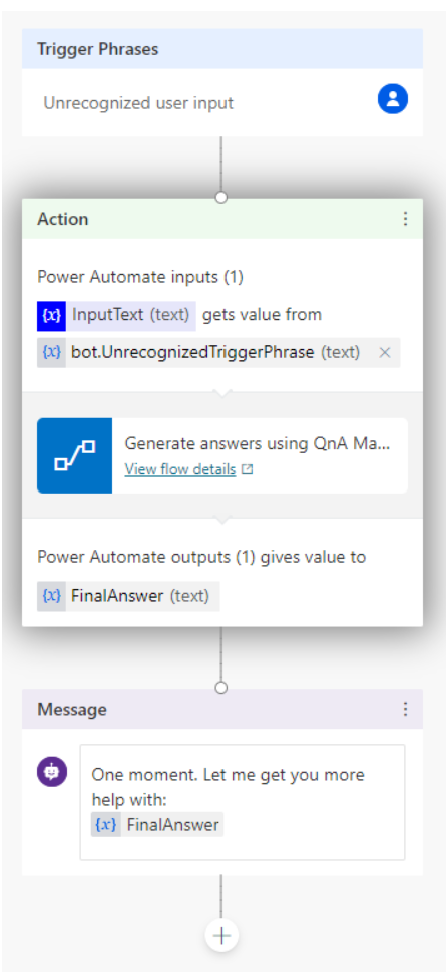
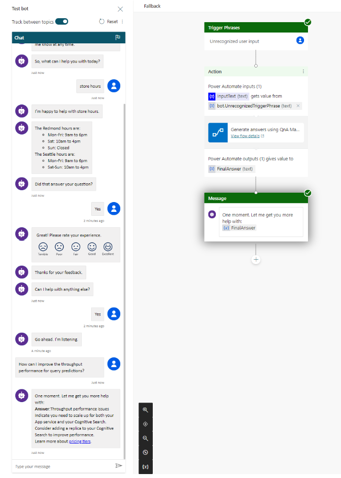

# Add your Question Answering project to Power Virtual Agents

Create and extend a [Power Virtual Agents](https://powervirtualagents.microsoft.com/) bot to provide answers from your project. 

> [!NOTE]
> The integration demonstrated in this tutorial is in preview and is not intended for deployment to production environments. 

In this tutorial, you learn how to: 
> [!div class="checklist"]
> * Create a Power Virtual Agents bot 
> * Create a system fallback topic
> * Add Question Answering as an action to a topic as a Power Automate flow
> * Create a Power Automate solution
> * Add a Power Automate flow to your solution
> * Publish Power Virtual Agents
> * Test Power Virtual Agents, and receive an answer from your Question Answering project

> [!NOTE]
> The QnA Maker service is being retired on the 31st of March, 2025. A newer version of the question and answering capability is now available as part of [Azure AI Language](../../index.yml). For question answering capabilities within the Language Service, see [question answering](../overview.md). Starting 1st October, 2022 you won’t be able to create new QnA Maker resources. For information on migrating existing QnA Maker knowledge bases to question answering, consult the [migration guide](../how-to/migrate-qnamaker.md).

## Create and publish a project
1. Follow the [quickstart](../quickstart/sdk.md?pivots=studio) to create a Question Answering project. Once you have deployed your project.
2. After deploying your project from Language Studio, select “Get Prediction URL”. 
3. Get your Site URL from the hostname of Prediction URL and your Account key which would be the Ocp-Apim-Subscription-Key.

> [!div class="mx-imgBorder"]
> 

4. Create a Custom Question Answering connector: Follow the [connector documentation](/connectors/languagequestionansw/) to create a connection to Question Answering.
5. Use this tutorial to create a Bot with Power Virtual Agents instead of creating a bot from Language Studio.

## Create a bot in Power Virtual Agents
[Power Virtual Agents](https://powervirtualagents.microsoft.com/) allows teams to create powerful bots by using a guided, no-code graphical interface. You don't need data scientists or developers.

Create a bot by following the steps in [Create and delete Power Virtual Agents bots](/power-virtual-agents/authoring-first-bot).

## Create the system fallback topic
In Power Virtual Agents, you create a bot with a series of topics (subject areas), in order to answer user questions by performing actions.

Although the bot can connect to your project from any topic, this tutorial uses the system fallback topic. The fallback topic is used when the bot can't find an answer. The bot passes the user's text to Question Answering Query knowledgebase API, receives the answer from your project, and displays it to the user as a message.

Create a fallback topic by following the steps in [Configure the system fallback topic in Power Virtual Agents](/power-virtual-agents/authoring-system-fallback-topic).

## Use the authoring canvas to add an action
Use the Power Virtual Agents authoring canvas to connect the fallback topic to your project. The topic starts with the unrecognized user text. Add an action that passes that text to Question Answering, and then shows the answer as a message. The last step of displaying an answer is handled as a [separate step](../../../QnAMaker/Tutorials/integrate-with-power-virtual-assistant-fallback-topic.md#add-your-solutions-flow-to-power-virtual-agents), later in this tutorial.

This section creates the fallback topic conversation flow.

The new fallback action might already have conversation flow elements. Delete the **Escalate** item by selecting the **Options** menu.

> [!div class="mx-imgBorder"]
> 

Below the *Message* node, select the (**+**) icon, then select **Call an action**.

> [!div class="mx-imgBorder"]
> 

Select **Create a flow**. This takes you to the Power Automate portal.

> [!div class="mx-imgBorder"]
> 

Power Automate opens a new template as shown below.

> [!div class="mx-imgBorder"]
> 
**Do not use the template shown above.**

Instead you need to follow the steps below that creates a Power Automate flow. This flow:
- Takes the incoming user text as a question, and sends it to Question Answering.
- Returns the top response back to your bot.

select **Create** in the left panel, then click "OK" to leave the page.

> [!div class="mx-imgBorder"]
> 

Select "Instant Cloud flow"

> [!div class="mx-imgBorder"]
> 

For testing this connector, you can select “When PowerVirtual Agents calls a flow” and select **Create**.

> [!div class="mx-imgBorder"]
> 

Select "New Step" and search for "Power Virtual Agents". Choose "Add an input" and select text. Next, provide the keyword and the value.

> [!div class="mx-imgBorder"]
> 

Select "New Step" and search "Language - Question Answering" and choose "Generate answer from Project" from the three actions.

> [!div class="mx-imgBorder"]
> 

This option helps in answering the specified question using your project. Type in the project name, deployment name and API version and select the question from the previous step.

> [!div class="mx-imgBorder"]
> 

Select "New Step" and search for "Initialize variable". Choose a name for your variable, and select the "String" type.

> [!div class="mx-imgBorder"]
> 

Select "New Step" again, and search for "Apply to each", then select the output from the previous steps and add an action of "Set variable" and select the connector action.

> [!div class="mx-imgBorder"]
> 

Select "New Step" and search for "Return value(s) to Power Virtual Agents" and type in a keyword, then choose the previous variable name in the answer.

> [!div class="mx-imgBorder"]
> 

The list of completed steps should look like this.

> [!div class="mx-imgBorder"]
> 

Select **Save** to save the flow.

## Create a solution and add the flow

For the bot to find and connect to the flow, the flow must be included in a Power Automate solution.

1. While still in the Power Automate portal, select Solutions from the left-side navigation.
2. Select **+ New solution**.
3. Enter a display name. The list of solutions includes every solution in your organization or school. Choose a naming convention that helps you filter to just your solutions. For example, you might prefix your email to your solution name: jondoe-power-virtual-agent-question-answering-fallback.
4. Select your publisher from the list of choices.
5. Accept the default values for the name and version.
6. Select **Create** to finish the process.

**Add your flow to the solution**

1. In the list of solutions, select the solution you just created. It should be at the top of the list. If it isn't, search by your email name, which is part of the solution name.
2. In the solution, select **+ Add existing**, and then select Flow from the list.
3. Find your flow from the **Outside solutions** list, and then select Add to finish the process. If there are many flows, look at the **Modified** column to find the most recent flow.

## Add your solution's flow to Power Virtual Agents

1. Return to the browser tab with your bot in Power Virtual Agents. The authoring canvas should still be open.
2. To insert a new step in the flow, above the **Message** action box, select the plus (+) icon. Then select **Call an action**.
3. From the **Flow** pop-up window, select the new flow named **Generate answers using Question Answering Project...**. The new action appears in the flow.

> [!div class="mx-imgBorder"]
> 

4. To correctly set the input variable to the QnA Maker action, select **Select a variable**, then select **bot.UnrecognizedTriggerPhrase**.

> [!div class="mx-imgBorder"]
> 

5. To correctly set the output variable to the Question Answering action, in the **Message** action, select **UnrecognizedTriggerPhrase**, then select the icon to insert a variable, {x}, then select **FinalAnswer**.
6. From the context toolbar, select **Save**, to save the authoring canvas details for the topic.

Here's what the final bot canvas looks like:

> [!div class="mx-imgBorder"]
> 

## Test the bot

As you design your bot in Power Virtual Agents, you can use the [Test bot pane](/power-virtual-agents/authoring-test-bot) to see how the bot leads a customer through the bot conversation.

1. In the test pane, toggle **Track between topics**. This allows you to watch the progression between topics, as well as within a single topic.
2. Test the bot by entering the user text in the following order. The authoring canvas reports the successful steps with a green check mark.

|**Question order**|**Test questions**                                                 |**Purpose**                                                                                                                           |
|------------------|-------------------------------------------------------------------|--------------------------------------------------------------------------------------------------------------------------------------|
|1                 |Hello                                                              |Begin conversation                                                                                                                          |
|2                 |Store hours                                                        |Sample topic. This is configured for you without any additional work on your part.                                                                                                                            |
|3                 |Yes                                                                |In reply to "Did that answer your question?"                                                                                                                                     |
|4                 |Excellent                                                          |In reply to "Please rate your experience."                                                                                                                                     |
|5                 |Yes                                                                |In reply to "Can I help with anything else?"                                                                                                                                     |
|6                 |How can I improve the throughput performance for query predictions?|This question triggers the fallback action, which sends the text to your project to answer. Then the answer is shown. the green check marks for the individual actions indicate success for each action.|

> [!div class="mx-imgBorder"]
> 

## Publish your bot

To make the bot available to all members of your organization, you need to publish it.

Publish your bot by following the steps in [Publish your bot](/power-virtual-agents/publication-fundamentals-publish-channels).

## Share your bot

To make your bot available to others, you first need to publish it to a channel. For this tutorial we'll use the demo website.

Configure the demo website by following the steps in [Configure a chatbot for a live or demo website](/power-virtual-agents/publication-connect-bot-to-web-channels).

Then you can share your website URL with your school or organization members.

## Clean up resources

When you are done with the project, remove the QnA Maker resources in the Azure portal.

## See also

* [Tutorial: Create an FAQ bot](../tutorials/bot-service.md)
