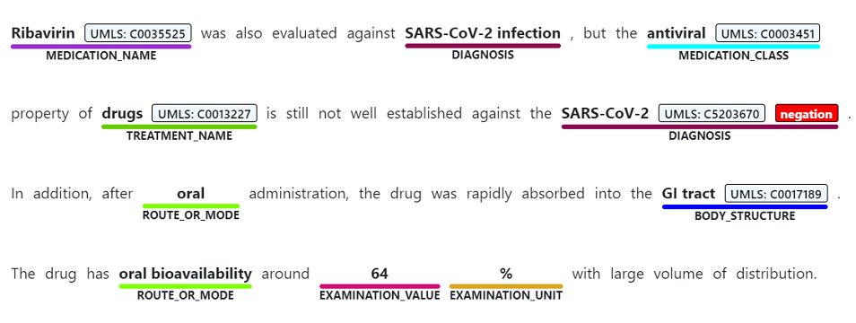

# [Named Entity Recognition](#tab/ner)

Named entity recognition is used to perform a semantic extraction of words and phrases mentioned from unstructured text that are associated with any of the [supported entity types](../concepts/health-entity-categories.md), such as diagnosis, medication name, symptom/sign, or age.

> [!div class="mx-imgBorder"]
> 

# [Relation Extraction](#tab/relation-extraction)

Relation extraction is used to identify meaningful connections between concepts mentioned in text that are associated with any of the [supported relations](../concepts/relation-extraction.md), such as the "time of condition" relation, which connects a condition name with a time. 

> [!div class="mx-imgBorder"]
> 

# [Entity Linking](#tab/entity-linking)

Entity linking is used to disambiguate the extracted entities by associating them with preferred names and codes from the biomedical vocabularies supported by the [Unified Medical Language System (UMLS) Metathesaurus](https://www.nlm.nih.gov/research/umls/sourcereleasedocs/index.html).

> [!div class="mx-imgBorder"]
> 

# [Assertion Detection](#tab/assertion-detection) 

[Assertion detection](../concepts/assertion-detection.md) is used to preserve the meaning of medical content by   adding contextual modifiers to the extracted entities using these categories: 
* Certainty
* Conditionality
* Association
* Temporality

> [!div class="mx-imgBorder"]
> 

---
