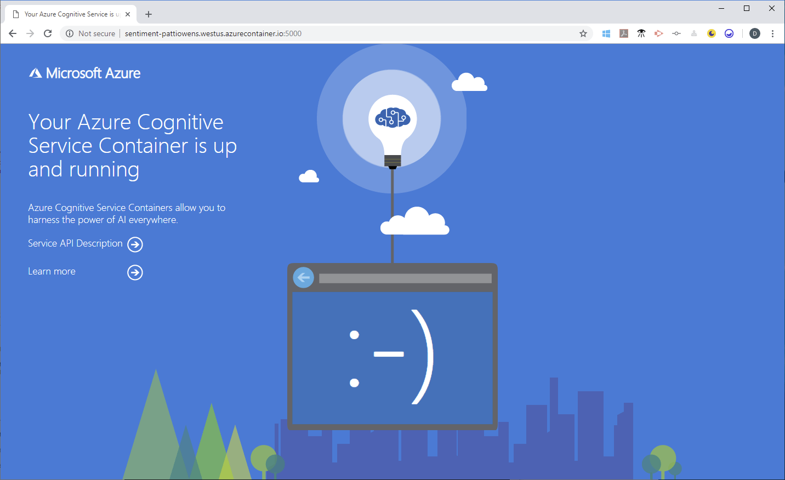

# Deploy a key phrase extraction container to Azure Kubernetes Service

Learn how to deploy a [key phrase extraction Docker container](../key-phrase-extraction/how-to/use-containers.md) image to Azure Kubernetes Service (AKS). This procedure shows how to create a Language resource, how to associate a container image, and how to exercise this orchestration of the two from a browser. Using containers can shift your attention away from managing infrastructure to instead focusing on application development. While this article uses the key phrase extraction container as an example, you can use this process for other containers offered by Azure AI Language

## Prerequisites

This procedure requires several tools that must be installed and run locally. Don't use Azure Cloud Shell. You need the following:

* An Azure subscription. If you don't have an Azure subscription, create a [free account](https://azure.microsoft.com/free/cognitive-services) before you begin.
* A text editor, for example, [Visual Studio Code](https://code.visualstudio.com/download).
* The [Azure CLI](/cli/azure/install-azure-cli) installed.
* The [Kubernetes CLI](https://kubernetes.io/docs/tasks/tools/install-kubectl/) installed.
* An Azure resource with the correct pricing tier. Not all pricing tiers work with this container:
    * **Azure AI Language** resource with F0 or standard pricing tiers only.
    * **Azure AI services** resource with the S0 pricing tier.

[!INCLUDE [Create an Azure AI Language resource](../includes/containers/create-text-analytics-resource.md)]

[!INCLUDE [Create a language container on Azure Kubernetes Service (AKS)](../../containers/includes/create-aks-resource.md)]


## Deploy the Key Phrase Extraction container to an AKS cluster

1. Open the Azure CLI, and sign in to Azure.

    ```azurecli
    az login
    ```

1. Sign in to the AKS cluster. Replace `your-cluster-name` and `your-resource-group` with the appropriate values.

    ```azurecli
    az aks get-credentials -n your-cluster-name -g -your-resource-group
    ```

    After this command runs, it reports a message similar to the following:

    ```output
    Merged "your-cluster-name" as current context in /home/username/.kube/config
    ```

    > [!WARNING]
    > If you have multiple subscriptions available to you on your Azure account and the `az aks get-credentials` command returns with an error, a common problem is that you're using the wrong subscription. Set the context of your Azure CLI session to use the same subscription that you created the resources with and try again.
    > ```azurecli
    >  az account set -s subscription-id
    > ```

1. Open the text editor of choice. This example uses Visual Studio Code.

    ```console
    code .
    ```

1. Within the text editor, create a new file named *keyphrase.yaml*, and paste the following YAML into it. Be sure to replace `billing/value` and `apikey/value` with your own information.

    ```yaml
    apiVersion: apps/v1beta1
    kind: Deployment
    metadata:
      name: keyphrase
    spec:
      template:
        metadata:
          labels:
            app: keyphrase-app
        spec:
          containers:
          - name: keyphrase
            image: mcr.microsoft.com/azure-cognitive-services/keyphrase
            ports:
            - containerPort: 5000
            resources:
              requests:
                memory: 2Gi
                cpu: 1
              limits:
                memory: 4Gi
                cpu: 1
            env:
            - name: EULA
              value: "accept"
            - name: billing
              value: # {ENDPOINT_URI}
            - name: apikey
              value: # {API_KEY}
     
    --- 
    apiVersion: v1
    kind: Service
    metadata:
      name: keyphrase
    spec:
      type: LoadBalancer
      ports:
      - port: 5000
      selector:
        app: keyphrase-app
    ```

  > [!IMPORTANT]
  > Remember to remove the key from your code when you're done, and never post it publicly. For production, use a secure way of storing and accessing your credentials like [Azure Key Vault](../../../key-vault/general/overview.md). See the Azure AI services [security](../../security-features.md) article for more information.

1. Save the file, and close the text editor.
1. Run the Kubernetes `apply` command with the *keyphrase.yaml* file as its target:

    ```console
    kubectl apply -f keyphrase.yaml
    ```

    After the command successfully applies the deployment configuration, a message appears similar to the following output:

    ```output
    deployment.apps "keyphrase" created
    service "keyphrase" created
    ```
1. Verify that the pod was deployed:

    ```console
    kubectl get pods
    ```

    The output for the running status of the pod:

    ```output
    NAME                         READY     STATUS    RESTARTS   AGE
    keyphrase-5c9ccdf575-mf6k5   1/1       Running   0          1m
    ```

1. Verify that the service is available, and get the IP address.

    ```console
    kubectl get services
    ```

    The output for the running status of the *keyphrase* service in the pod:

    ```output
    NAME         TYPE           CLUSTER-IP    EXTERNAL-IP      PORT(S)          AGE
    kubernetes   ClusterIP      10.0.0.1      <none>           443/TCP          2m
    keyphrase    LoadBalancer   10.0.100.64   168.61.156.180   5000:31234/TCP   2m
    ```

## Verify the Key Phrase Extraction container instance

1. Select the **Overview** tab, and copy the IP address.
1. Open a new browser tab, and enter the IP address. For example, enter `http://<IP-address>:5000 (http://55.55.55.55:5000`). The container's home page is displayed, which lets you know the container is running.

    

1. Select the **Service API Description** link to go to the container's Swagger page.

1. Choose any of the **POST** APIs, and select **Try it out**. The parameters are displayed, which includes this example input:

    ```json
    {
      "documents": [
        {
          "id": "1",
          "text": "Hello world"
        },
        {
          "id": "2",
          "text": "Bonjour tout le monde"
        },
        {
          "id": "3",
          "text": "La carretera estaba atascada. Había mucho tráfico el día de ayer."
        },
        {
          "id": "4",
          "text": ":) :( :D"
        }
      ]
    }
    ```

1. Replace the input with the following JSON content:

    ```json
    {
      "documents": [
        {
          "language": "en",
          "id": "7",
          "text": "I was fortunate to attend the KubeCon Conference in Barcelona, it is one of the best conferences I have ever attended. Great people, great sessions and I thoroughly enjoyed it!"
        }
      ]
    }
    ```

1. Set **showStats** to `true`.

1. Select **Execute** to determine the sentiment of the text.

    The model that's packaged in the container generates a score that ranges from 0 to 1, where 0 is negative and 1 is positive.

    The JSON response that's returned includes sentiment for the updated text input:

    ```json
    {
      "documents": [
        {
          "id": "7",
          "keyPhrases": [
            "Great people",
            "great sessions",
            "KubeCon Conference",
            "Barcelona",
            "best conferences"
          ],
          "statistics": {
            "charactersCount": 176,
            "transactionsCount": 1
          }
        }
      ],
      "errors": [],
      "statistics": {
        "documentsCount": 1,
        "validDocumentsCount": 1,
        "erroneousDocumentsCount": 0,
        "transactionsCount": 1
      }
    }
    ```

We can now correlate the document `id` of the response payload's JSON data to the original request payload document `id`. The resulting document has a `keyPhrases` array, which contains the list of key phrases that have been extracted from the corresponding input document. Additionally, there are various statistics such as `characterCount` and `transactionCount` for each resulting document.

## Next steps

* Use more [Azure AI containers](../../cognitive-services-container-support.md)
* [Key phrase extraction overview](../overview.md)
