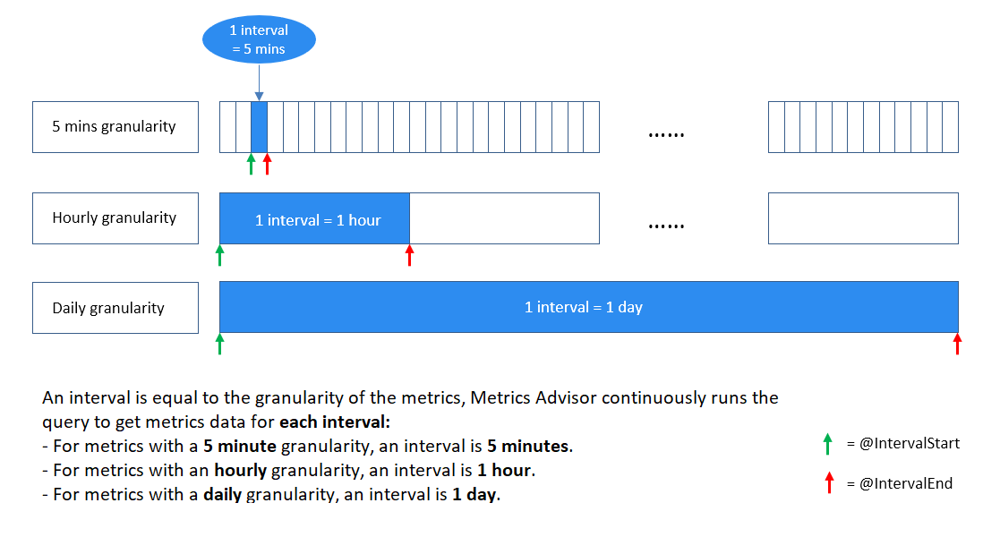

# Metrics Advisor glossary of common vocabulary and concepts

This document explains the technical terms used in Metrics Advisor. Use this article to learn about common concepts and objects you might encounter when using the service.

## Data feed

> [!NOTE]
> Multiple metrics can share the same data source, and even the same data feed.

A data feed is what Metrics Advisor ingests from your data source, such as Azure Cosmos DB or a SQL server. A data feed contains rows of:
* timestamps
* zero or more dimensions
* one or more measures. 

## Interval
Metrics need to be monitored at a certain granularity according to business requirements. For example, business Key Performance Indicators (KPIs) are monitored at daily granularity. However, service performance metrics are often monitored at minute/hourly granularity. So the frequency to collect metric data from sources are different.

Metrics Advisor continuously grabs metrics data at each time interval, **the interval is equal to the granularity of the metrics.** Every time, Metrics Advisor runs the query you have written ingests data at this specific interval. Based on this data ingestion mechanism, the query script **should not return all metric data that exists in the database, but needs to limit the result to a single interval.**

<!--  -->

## Metric

A metric is a quantifiable measure that is used to monitor and assess the status of a specific business process. It can be a combination of multiple time series values divided into dimensions. For example a *web health* metric might contain dimensions for *user count* and the *en-us market*.

## Dimension

A dimension is one or more categorical values. The combination of those values identifies a particular univariate time series, for example: country/region, language, tenant, and so on.

## Multi-dimensional metric

What is a multi-dimension metric? Let's use two examples. 

**Revenue of a business**

Suppose you have data for the revenue of your business. Your time series data might look something like this:

| Timestamp | Category | Market | Revenue |
| ----------|----------|--------|----- |
| 2020-6-1 | Food | US | 1000 |
| 2020-6-1 | Apparel | US | 2000 |
| 2020-6-2 | Food | UK | 800 | 
| ...      | ...  |... | ... |

In this example, *Category* and *Market* are dimensions. *Revenue* is the Key Performance Indicator (KPI) which could be sliced into different categories and/or markets, and could also be aggregated. For example, the revenue of *food* for all markets.
 
**Error counts for a complex application**

Suppose you have data for the number of errors logged in an application. Your time series data might look something like this:

| Timestamp	| Application component | Region | Error count |
| ----------|----------|--------|----- |
| 2020-6-1 | Employee database | WEST EU | 9000 |
| 2020-6-1 | Message queue | EAST US | 1000 |
| 2020-6-2 | Message queue | EAST US | 8000| 
| ...      | ...           | ...     |  ...|

In this example, *Application component* and *Region* are dimensions. *Error count* is the KPI which could be sliced into different categories and/or markets, and could also be aggregated. For example, the error count of *Message queue* in all regions.

## Measure

A measure is a fundamental or unit-specific term and a quantifiable value of the metric.

## Time series

A time series is a series of data points indexed (or listed or graphed) in chronological order. Most commonly, a time series is a sequence taken at successive, equally spaced points in time. It is a sequence of discrete-time data.

In Metrics Advisor, values of one metric on a specific dimension combination are called one series.

## Granularity

Granularity indicates how frequent data points will be generated at the data source. For example, daily, hourly.

## Ingest data since(UTC)

Ingest data since(UTC) is the time that you want Metrics Advisor to begin ingesting data from your data source. Your data source must have data at the specified ingestion start time.

## Confidence boundaries

> [!NOTE]
> Confidence boundaries are not the only measurement used to find anomalies. It's possible for data points outside of this boundary to be flagged as normal by the detection model. 

In Metrics Advisor, confidence boundaries represent the sensitivity of the algorithm used, and are used to filter out overly sensitive anomalies. On the web portal, confidence bounds appear as a transparent blue band. All the points within the band are treated as normal points.

Metrics Advisor provides tools to adjust the sensitivity of the algorithms used. See [How to: Configure metrics and fine tune detection configuration](how-tos/configure-metrics.md) for more information.

## Hook

Metrics Advisor lets you create and subscribe to real-time alerts. These alerts are sent over the internet, [using a hook](how-tos/alerts.md).

## Anomaly incident

After a detection configuration is applied to metrics, incidents are generated whenever any series within it has an anomaly. In large data sets this can be overwhelming, so Metrics Advisor groups series of anomalies within a metric into an incident. The service will also evaluate the severity and provide tools for [diagnosing an incident](how-tos/diagnose-an-incident.md).

### Diagnostic tree

In Metrics Advisor, you can apply anomaly detection on metrics, then Metrics Advisor automatically monitors all time series of all dimension combinations. Whenever there is any anomaly detected, Metrics Advisor aggregates anomalies into incidents.
After an incident occurs, Metrics Advisor will provide a diagnostic tree with a hierarchy of contributing anomalies, and identify ones with the biggest impact. Each incident has a root cause anomaly, which is the top node of the tree.

### Anomaly grouping

Metrics Advisor provides the capability to find related time series with similar patterns. It can also provide deeper insights into the impact on other dimensions, and correlate the anomalies.

### Time series comparison

You can pick multiple time series to compare trends in a single visualization. This provides a clear and insightful way to view and compare related series.

## Detection configuration

>[!Note]
>Detection configurations are only applied within an individual metric.

On the Metrics Advisor web portal, a detection configuration (such as sensitivity, auto snooze, and direction) is listed on the left panel when viewing a metric. Parameters can be tuned and applied to all series within this metric.

A detection configuration is required for every time series, and determines whether a point in the time series is an anomaly. Metrics Advisor will set up a default configuration for the whole metric when you first onboard data. 

You can additionally refine the configuration by applying tuning parameters on a group of series, or a specific one. Only one configuration will be applied to a time series:
* Configurations applied to a specific series will overwrite configurations for a group
* Configurations for a group will overwrite configurations applied to the whole metric.

Metrics Advisor provides several [detection methods](how-tos/configure-metrics.md#anomaly-detection-methods), and you can combine them using logical operators.

### Smart detection

Anomaly detection using multiple machine learning algorithms.

**Sensitivity**: A numerical value to adjust the tolerance of the anomaly detection. Visually, the higher the value, the narrower the upper and lower boundaries around the time series.

### Hard threshold

Values outside of upper or lower bounds are anomalies.

**Min**: The lower bound

**Max**: The upper bound

### Change threshold

Use the previous point value to determine if this point is an anomaly.

**Change percentage**: Compared to the previous point, the current point is an anomaly if the percentage of change is more than this parameter.

**Change over points**: How many points to look back.

### Common parameters

**Direction**: A point is an anomaly only when the deviation occurs in the direction *up*, *down*, or *both*.

**Not valid anomaly until**: A data point is only an anomaly if a specified percentage of previous points are also anomalies.

## Alert settings

Alert settings determine which anomalies should trigger an alert. You can set multiple alerts with different settings. For example, you could create an alert for anomalies with lower business impact, and another for more importance alerts.

You can also create an alert across metrics. For example, an alert that only gets triggered if two specified metrics have anomalies.

### Alert scope

Alert scope refers to the scope that the alert applies to. There are four options:

**Anomalies of all series**: Alerts will be triggered for anomalies in all series within the metric.

**Anomalies in series group**: Alerts will only be triggered for anomalies in specific dimensions of the series group. The number of specified dimensions should be smaller than the total number dimensions.

**Anomalies in favorite series**: Alerts will only be triggered for anomalies that are added as favorites. You can choose a group of series as a favorite for each detecting config.

**Anomalies in top N of all series**: Alerts will only be triggered for anomalies in the top N series. You can set parameters to specify the number of timestamps to take into account, and how many anomalies must be in them to send the alert.

### Severity

Severity is a grade that Metrics Advisor uses to describe the severity of incident, including *High*, *Medium*, and *Low*.

Currently, Metrics Advisor uses the following factors to measure the alert severity:
1. The value proportion and the quantity proportion of anomalies in the metric.
1. Confidence of anomalies.
1. Your favorite settings also contribute to the severity.

### Auto snooze

Some anomalies are transient issues, especially for small granularity metrics. You can *snooze* an alert for a specific number of time points. If anomalies are found within that specified number of points, no alert will be triggered. The behavior of auto snooze can be set on either metric level or series level.

The behavior of snooze can be set on either metric level or series level.

## Data feed settings

### Ingestion Time Offset

By default, data is ingested according to the granularity (such as *daily*). By using a positive integer, you can delay ingestion of the data by the specified value. Using a negative number, you can advance the ingestion by the specified value.

### Max Ingestion per Minute

Set this parameter if your data source supports limited concurrency. Otherwise leave the default settings.

### Stop retry after

If data ingestion has failed, Metrics Advisor will retry automatically after a period of time. The beginning of the period is the time when the first data ingestion occurred. The length of the retry period is defined according to the granularity. If you use the default value (`-1`), the retry period will be determined according to the granularity:

| Granularity       | Stop Retry After           |
| :------------ | :--------------- |
| Daily, Custom (>= 1 Day), Weekly, Monthly, Yearly     | 7 days          |
| Hourly, Custom (< 1 Day)       | 72 hours |

### Min retry interval

You can specify the minimum interval when retrying to pull data from the source. If you use the default value (`-1`), the retry interval will be determined according to the granularity:

| Granularity       | Minimum Retry Interval           |
| :------------ | :--------------- |
| Daily, Custom (>= 1 Day), Weekly, Monthly     | 30 minutes          |
| Hourly, Custom (< 1 Day)      | 10 minutes |
| Yearly | 1 day          |

### Grace period

> [!Note]
> The grace period begins at the regular ingestion time, plus specified ingestion time offset.
    
A grace period is a period of time where Metrics Advisor will continue fetching data from the data source, but won't fire any alerts. If no data was ingested after the grace period, a *Data feed not available* alert will be triggered.

### Snooze alerts in

When this option is set to zero, each timestamp with *Not Available* will trigger an alert. When set to a value other than zero, the specified number of *Not available* alerts will be snoozed if no data was fetched.

## Data feed permissions

There are two roles to manage data feed permissions: *Administrator*, and *Viewer*. 

* An *Administrator* has full control of the data feed and metrics within it. They can activate, pause, delete the data feed, and make updates to feeds and configurations. An *Administrator* is typically the owner of the metrics.

* A *Viewer* is able to view the data feed or metrics, but is not able to make changes. 

## Next steps
- [Metrics Advisor overview](overview.md)
- [Use the web portal](quickstarts/web-portal.md)
