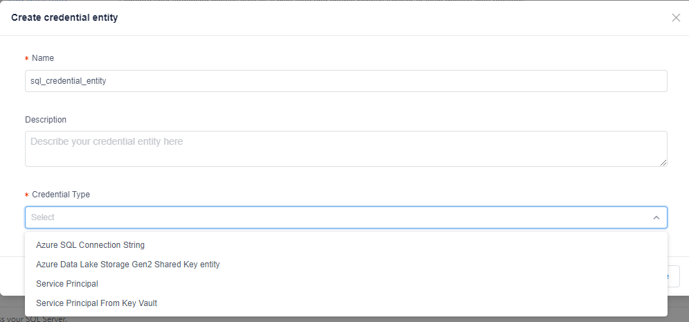
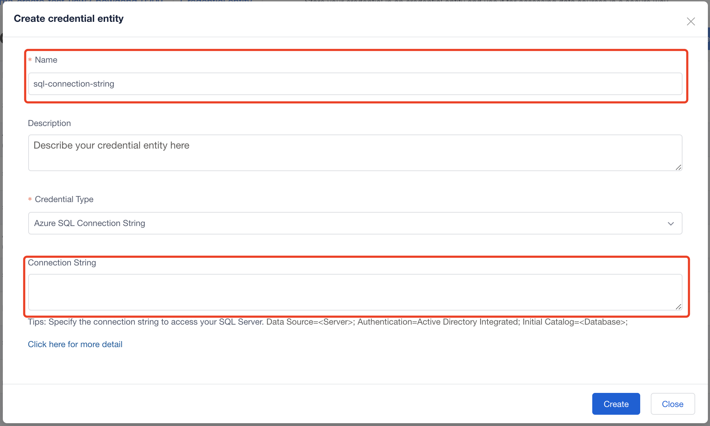
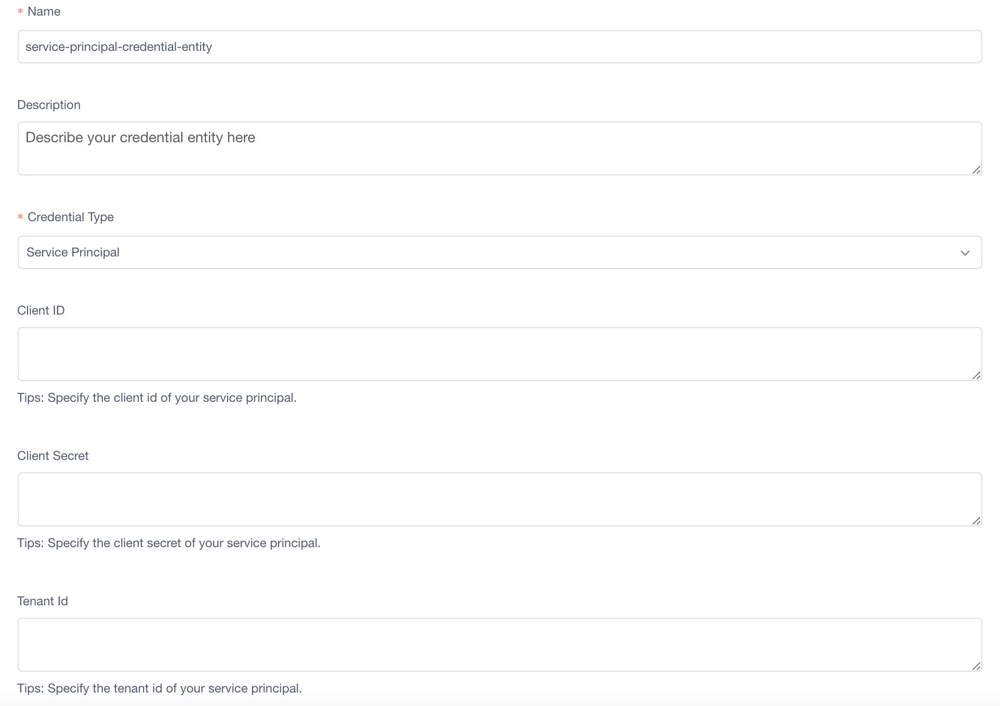
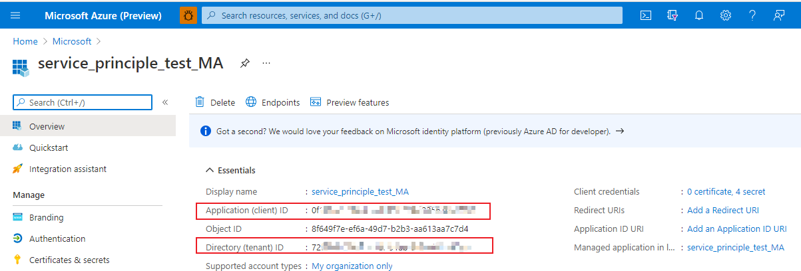
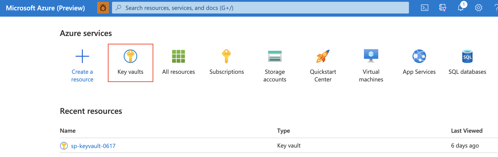
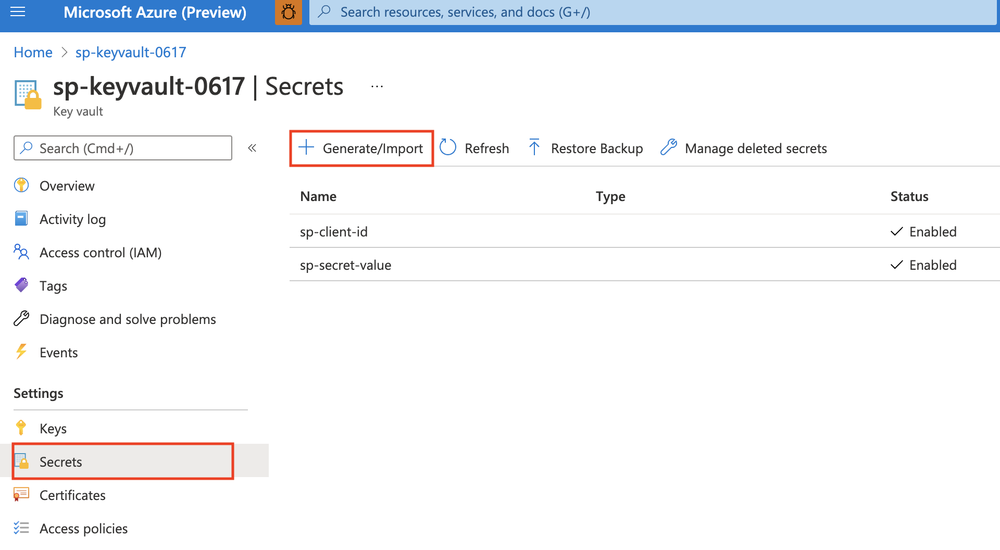
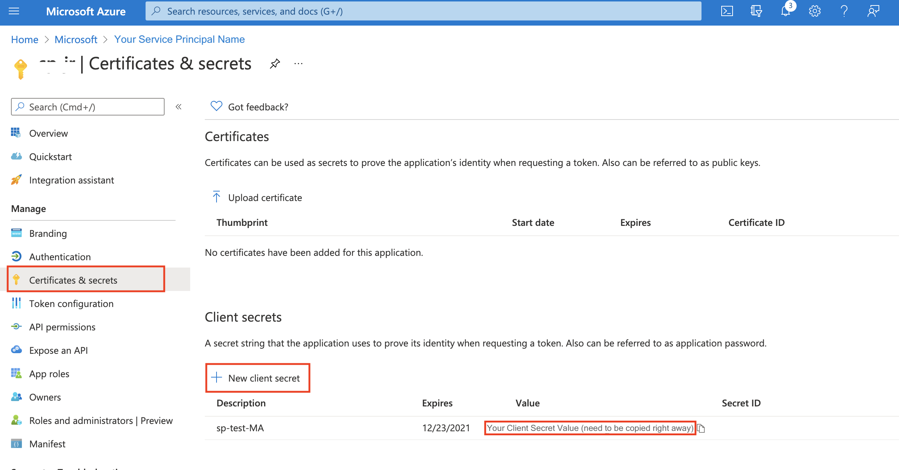

# How-to: Create a credential entity

When onboarding a data feed, you should select an authentication type, some authentication types like *Azure SQL Connection String* and *Service Principal* need a credential entity to store credential-related information, in order to manage your credential in secure. This article will tell how to create a credential entity for different credential types in Metrics Advisor.
    

## Basic procedure: Create a credential entity

You can create a **credential entity** to store credential-related information, and use it for authenticating to your data sources. You can share the credential entity to others and enable them to connect to your data sources without sharing the real credentials. It can be created in 'Adding data feed' tab or 'Credential entity' tab. After creating a credential entity for a specific authentication type, you can just choose one credential entity you created when adding new data feed, this will be helpful when creating multiple data feeds. The general procedure of creating and using a credential entity is shown below:

1. Select '+' to create a new credential entity in 'Adding data feed' tab (you can also create one in 'Credential entity feed' tab).

   
 
2. Set the credential entity name, description (if needed), credential type (equals to *authentication type*) and other settings.

   
 
3. After creating a credential entity, you can choose it when specifying authentication type.

   
 
There are **four credential types** in Metrics Advisor:  Azure SQL Connection String, Azure Data Lake Storage Gen2 Shared Key Entity, Service Principal, Service Principal from Key Vault. For different credential type settings, see following instructions.

## Azure SQL Connection String

You should set the **Name** and **Connection String**, then select 'create'.

## Azure Data Lake Storage Gen2 Shared Key Entity

You should set the **Name** and **Account Key**, then select 'create'. Account key could be found in Azure Storage Account (Azure Data Lake Storage Gen2) resource in **Access keys** setting.

<!-- 增加basic说明，tips是错的；增加一下怎么管理；加一个step1的link
-->

## Service principal

To create service principal for your data source, you can follow detailed instructions in [Connect different data sources](../data-feeds-from-different-sources.md). After creating a service principal, you need to fill in the following configurations in credential entity.

* **Name:** Set a name for your service principal credential entity.
* **Tenant ID & Client ID:** After creating a service principal in Azure portal, you can find `Tenant ID` and `Client ID` in **Overview**.

    

* **Client Secret:** After creating a service principal in Azure portal, you should go to **Certificates & Secrets** to create a new client secret, and the **value** should be used as `Client Secret` in credential entity. (Note: The value only appears once, so it's better to store it somewhere.)

    

## Service principal from Key Vault

There are several steps to create a service principal from key vault.

**Step 1. Create a Service Principal and grant it access to your database.** You can follow detailed instructions in [Connect different data sources](../data-feeds-from-different-sources.md), in creating service principal section for each data source. 

After creating a service principal in Azure portal, you can find `Tenant ID` and `Client ID` in **Overview**. The **Directory (tenant) ID** should be `Tenant ID` in credential entity configurations.

**Step 2. Create a new client secret.** You should go to **Certificates & Secrets** to create a new client secret, and the **value** will be used in next steps. (Note: The value only appears once, so it's better to store it somewhere.)

**Step 3. Create a key vault.** In [Azure portal](https://portal.azure.com/#home), select **Key vaults** to create one.

After creating a key vault, the **Vault URI** is the `Key Vault Endpoint` in MA (Metrics Advisor) credential entity.

**Step 4. Create secrets for Key Vault.** In Azure portal for key vault, generate two secrets in **Settings->Secrets**.
The first is for `Service Principal Client Id`, the other is for `Service Principal Client Secret`, both of their name will be used in credential entity configurations.

* **Service Principal Client ID:** Set a `Name` for this secret, the name will be used in credential entity configuration, and the value should be your Service Principal `Client ID` in **Step 1**.

    

* **Service Principal Client Secret:** Set a `Name` for this secret, the name will be used in credential entity configuration, and the value should be your Service Principal `Client Secret Value` in **Step 2**.

    

Until now, the *client ID* and *client secret* of service principal are finally stored in Key Vault. Next, you need to create another service principal to store the key vault. Therefore, you should **create two service principals**, one to save client ID and client secret, which will be stored in a key vault, the other is to store the key vault.

**Step 5. Create a service principal to store the key vault.** 

1. Go to [Azure portal AAD (Azure Active Directory)](https://portal.azure.com/?trace=diagnostics&feature.customportal=false#blade/Microsoft_AAD_IAM/ActiveDirectoryMenuBlade/Overview) and create a new registration.

    

    After creating the service principal, the **Application (client) ID** in Overview will be the `Key Vault Client ID` in credential entity configuration.

2. In **Manage->Certificates & Secrets**, create a client secret by selecting 'New client secret'. Then you should **copy down the value**, because it appears only once. The value is `Key Vault Client Secret` in credential entity configuration.

    

**Step 6. Grant Service Principal access to Key Vault.**  Go to the key vault resource you created, in **Settings->Access polices**, by selecting 'Add Access Policy' to make connection between key vault and the second service principal in **Step 5**, and 'Save'.

## Configurations conclusion
To conclude, the credential entity configurations in Metrics Advisor for *Service Principal from Key Vault* and the way to get them are shown in table below:

| Configuration | How to get |
|-------------| ---------------------|
| Key Vault Endpoint | **Step 3:** Vault URI of key vault. |
| Tenant ID | **Step 1:** Directory (tenant) ID of your first service principal. |
| Key Vault Client ID | **Step 5:** The Application (client) ID of your second service principal. |
| Key Vault Client Secret | **Step 5:** The client secret value of your second service principal. |
| Service Principal Client ID Name | **Step 4:** The secret name you set for Client ID. |
| Service Principal Client Secret Name | **Step 4:** The secret name you set for Client Secret Value. |

## Next steps

- [Onboard your data](onboard-your-data.md)
- [Connect different data sources](../data-feeds-from-different-sources.md)
