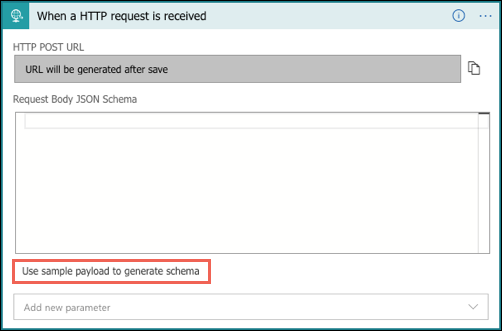
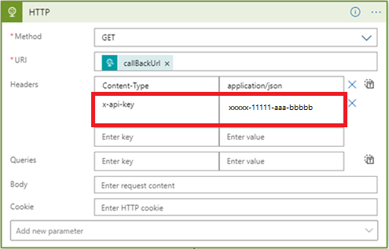
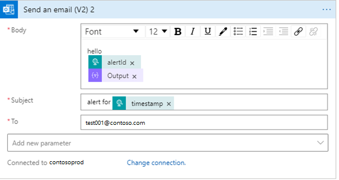
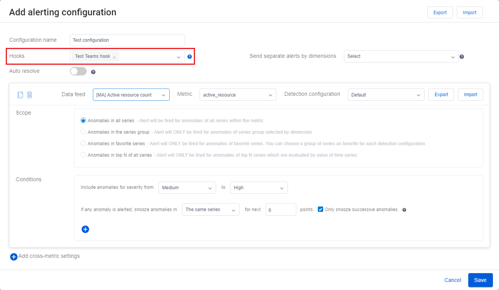
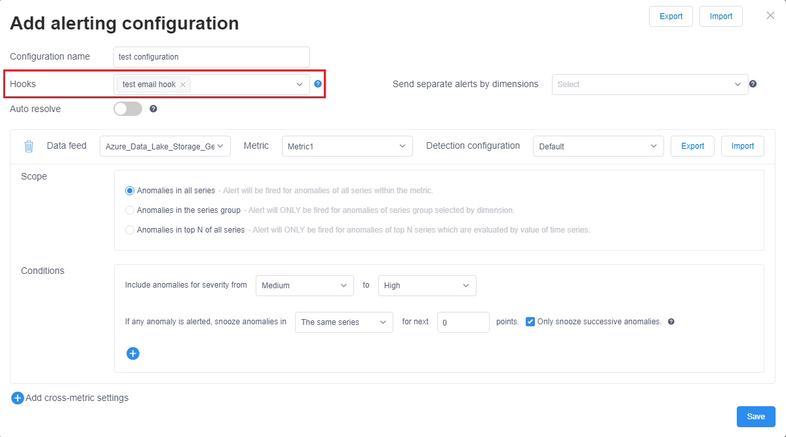

# Tutorial: Enable anomaly notification in Metrics Advisor 

<!-- 2. Introductory paragraph 
Required. Lead with a light intro that describes, in customer-friendly language, 
what the customer will learn, or do, or accomplish. Answer the fundamental “why 
would I want to do this?” question. Keep it short.
-->


<!-- 3. Tutorial outline 
Required. Use the format provided in the list below.
-->

In this tutorial, you learn how to:

> [!div class="checklist"]
> * Create a hook in Metrics Advisor
> * Send Notifications with Azure Logic Apps
> * Send Notifications to Microsoft Teams
> * Send Notifications via SMTP server

<!-- 4. Prerequisites 
Required. First prerequisite is a link to a free trial account if one exists. If there 
are no prerequisites, state that no prerequisites are needed for this tutorial.
-->

## Prerequisites
### Create a Metrics Advisor resource

To explore capabilities of Metrics Advisor, you may need to <a href="https://go.microsoft.com/fwlink/?linkid=2142156"  title="Create a Metrics Advisor resource"  target="_blank">create a Metrics Advisor resource </a> in the Azure portal to deploy your Metrics Advisor instance.

### Create a hook in Metrics Advisor
A hook in Metrics Advisor is a bridge that enables customer to subscribe to metrics anomalies and send notifications through different channels. There are four types of hooks in Metrics Advisor: 
    
- Email hook
- Webhook
- Teams hook
- Azure DevOps hook

Each hook type corresponds to a specific channel that anomaly will be notified through. 

<!-- 5. H2s
Required. Give each H2 a heading that sets expectations for the content that follows. 
Follow the H2 headings with a sentence about how the section contributes to the whole.
-->

## Send notifications with Azure Logic Apps, Teams, and SMTP

#### [Logic Apps](#tab/logic)

### Send email notification by using Azure Logic Apps

<!-- Introduction paragraph -->
There are two common options to send email notifications that are supported in Metrics Advisor. One is to use webhooks and Azure Logic Apps to send email alerts, the other is to set up an SMTP server and use it to send email alerts directly. This section will focus on the first option, which is easier for customers who don't have an available SMTP server.

**Step 1.** Create a webhook in Metrics Advisor

A webhook is the entry point for all the information available from the Metrics Advisor service, and calls a user-provided API when an alert is triggered. All alerts can be sent through a webhook.

Select the **Hooks** tab in your Metrics Advisor workspace, and select the **Create hook** button. Choose a hook type of **web hook**. Fill in the required parameters and select **OK**. For detailed steps, refer to [create a webhook](../how-tos/alerts.md#web-hook).

There's one extra parameter of **Endpoint** that needs to be filled out, this could be done after completing Step 3 below. 


**Step 2.** Create a Consumption logic app resource

In the [Azure portal](https://portal.azure.com), create a Consumption logic app resource with a blank workflow by following the instructions in [Create an example Consumption logic app workflow](../../../logic-apps/quickstart-create-example-consumption-workflow.md). When you see the workflow designer opens, return to this tutorial.


**Step 3.** Add a trigger of **When an HTTP request is received**

- Azure Logic Apps uses various actions to trigger workflows that are defined. For this use case, it uses the trigger named **When an HTTP request is received**. 

- In the dialog for **When an HTTP request is received**, select **Use sample payload to generate schema**.

    

    Copy the following sample JSON into the textbox and select **Done**.

    ```json
    {
    "properties": {
        "value": {
            "items": {
                "properties": {
                    "alertInfo": {
                        "properties": {
                            "alertId": {
                                "type": "string"
                            },
                            "anomalyAlertingConfigurationId": {
                                "type": "string"
                            },
                            "createdTime": {
                                "type": "string"
                            },
                            "modifiedTime": {
                                "type": "string"
                            },
                            "timestamp": {
                                "type": "string"
                            }
                        },
                        "type": "object"
                    },
                    "alertType": {
                        "type": "string"
                    },
                    "callBackUrl": {
                        "type": "string"
                    },
                    "hookId": {
                        "type": "string"
                    }
                },
                "required": [
                    "hookId",
                    "alertType",
                    "alertInfo",
                    "callBackUrl"
                ],
                "type": "object"
            },
            "type": "array"
        }
    },
    "type": "object"
     }
    ```

- Choose the method as 'POST' and select **Save**. You can now see the URL of your HTTP request trigger. Select the copy icon to copy it and fill it back in the **Endpoint** in Step 1. 

    

**Step 4.** Add a next step using 'HTTP' action

Signals that are pushed through the webhook only contain limited information like timestamp, alertID, configurationID, etc. Detailed information needs to be queried using the callback URL provided in the signal. This step is to query detailed alert info.  

- Choose a method of 'GET'
- Select 'callBackURL' from 'Dynamic content' list in 'URI'.
- Enter a key of 'Content-Type' in 'Headers' and input a value of 'application/json'
- Enter a key of 'x-api-key' in 'Headers' and get this by the clicking **'API keys'** tab in your Metrics Advisor workspace. This step is to ensure the workflow has sufficient permissions for API calls.

    

**Step 5.** Add a next step to ‘parse JSON’ 

You need to parse the response of the API for easier formatting of email content. 
 
> [!NOTE] 
> This tutorial only shares a quick example, the final email format needs to be further designed. 

- Select 'Body' from 'Dynamic content' list in 'Content'
- select **Use sample payload to generate schema**. Copy the following sample JSON into the textbox and select **Done**.

```json
{
    "properties": {
        "@@nextLink": {},
        "value": {
            "items": {
                "properties": {
                    "properties": {
                        "properties": {
                            "IncidentSeverity": {
                                "type": "string"
                            },
                            "IncidentStatus": {
                                "type": "string"
                            }
                        },
                        "type": "object"
                    },
                    "rootNode": {
                        "properties": {
                            "createdTime": {
                                "type": "string"
                            },
                            "detectConfigGuid": {
                                "type": "string"
                            },
                            "dimensions": {
                                "properties": {
                                },
                                "type": "object"
                            },
                            "metricGuid": {
                                "type": "string"
                            },
                            "modifiedTime": {
                                "type": "string"
                            },
                            "properties": {
                                "properties": {
                                    "AnomalySeverity": {
                                        "type": "string"
                                    },
                                    "ExpectedValue": {}
                                },
                                "type": "object"
                            },
                            "seriesId": {
                                "type": "string"
                            },
                            "timestamp": {
                                "type": "string"
                            },
                            "value": {
                                "type": "number"
                            }
                        },
                        "type": "object"
                    }
                },
                "required": [
                    "rootNode",
                    "properties"
                ],
                "type": "object"
            },
            "type": "array"
        }
    },
    "type": "object"
}
```

**Step 6.** Add a next step to ‘create HTML table’

A bunch of information has been returned from the API call, however, depending on your scenarios not all of the information may be useful. Choose the items that you care about and would like included in the alert email. 

Below is an example of an HTML table that chooses 'timestamp', 'metricGUID' and 'dimension' to be included in the alert email.


**Step 7.** Add the final step to ‘send an email’

There are several options to send email, both Microsoft hosted and 3rd-party offerings. Customer may need to have a tenant/account for their chosen option. For example, when choosing ‘Office 365 Outlook’ as the server. Sign in process will be pumped for building connection and authorization. An API connection will be established to use email server to send alert. 

Fill in the content that you'd like to include to 'Body', 'Subject' in the email and fill in an email address in 'To'. 



#### [Teams Channel](#tab/teams)

### Send anomaly notification through a Microsoft Teams channel
This section will walk through the practice of sending anomaly notifications through a Microsoft Teams channel. This can help enable scenarios where team members are collaborating on analyzing anomalies that are detected by Metrics Advisor. The workflow is easy to configure and doesn't have a large number of prerequisites. 

**Step 1.** Add a 'Incoming Webhook' connector to your Teams channel

- Navigate to the Teams channel that you'd like to send notification to, select '•••'(More options). 
- In the dropdown list, select 'Connectors'. Within the new dialog, search for 'Incoming Webhook' and click 'Add'.

        

- If you are not able to view the 'Connectors' option, please contact your Teams group owners. Select 'Manage team', then select the 'Settings' tab at the top and check whether the setting of 'Allow members to create, update and remove connectors' is checked.

        

- Input a name for the connector and you can also upload an image to make it as the avatar. Select 'Create', then the Incoming Webhook connector is added successfully to your channel. A URL will be generated at the bottom of the dialog, **be sure to select 'Copy'**, then select 'Done'. 

     

**Step 2.** Create a new 'Teams hook' in Metrics Advisor

- Select 'Hooks' tab in left navigation bar, and select the 'Create hook' button at top right of the page. 
- Choose hook type of 'Teams', then input a name and paste the URL that you copied from the above step. 
- Select 'Save'. 

     

**Step 3.** Apply the Teams hook to an alert configuration

Go and select one of the data feeds that you have onboarded. Select a metric within the feed and open the metrics detail page. You can create an 'alerting configuration' to subscribe to anomalies that are detected and notify through a Teams channel. 

Select the '+' button and choose the hook that you created, fill in other fields and select 'Save'. Then you're set for applying a Teams hook to an alert configuration. Any new anomalies will be notified through the Teams channel.




#### [SMTP E-mail](#tab/smtp)

### Send email notification by configuring an SMTP server

This section will share the practice of using an SMTP server to send email notifications on anomalies that are detected. Make sure you have a usable SMTP server and have sufficient permission to get parameters like account name and password.

**Step 1.** Assign your account as the 'Cognitive Services Metrics Advisor Administrator' role

- A user with the subscription administrator or resource group administrator privileges needs to navigate to the Metrics Advisor resource that was created in the Azure portal, and select the Access control (IAM) tab.
- Select 'Add role assignments'.
- Pick a role of 'Cognitive Services Metrics Advisor Administrator', select your account as in the image below.
- Select 'Save' button, then you've been successfully added as administrator of a Metrics Advisor resource. All the above actions need to be performed by a subscription administrator or resource group administrator. It might take up to one minute for the permissions to propagate. 


**Step 2.** Configure SMTP server in Metrics Advisor workspace

After you've completed the above steps and have been successfully added as an administrator of the Metrics Advisor resource. Wait several minutes for the permissions to propagate. Then sign in to your Metrics Advisor workspace, you should be able to view a new tab named 'Email setting' on the left navigation panel. Select it and to continue configuration. 

Parameters to be filled out: 

- SMTP server name (**required**): Fill in the name of your SMTP server provider, most server names are written in the form “smtp.domain.com” or “mail.domain.com”. Take Office365 as an example, it should be set as 'smtp.office365.com'. 
- SMTP server port (**required**): Port 587 is the default port for SMTP submission on the modern web. While you can use other ports for submission (more on those next), you should always start with port 587 as the default and only use a different port if circumstances dictate (like your host blocking port 587 for some reason).
- Email sender(s)(**required**): This is the real email account that takes responsibility to send emails. You may need to fill in the account name and password of the sender. You can set a quota threshold for the maximum number of alert emails to be sent within one minute for one account. You can set multiple senders if there's possibility of having large volume of alerts to be sent in one minute, but at least one account should be set. 
- Send on behalf of (optional): If you have multiple senders configured, but you'd like alert emails to appear to be sent from one account. You can use this field to align them. But note you may need to grant permission to the senders to allow sending emails on behalf of their account.  
- Default CC (optional): To set a default email address that will be cc'd in all email alerts. 

Below is an example of a configured SMTP server:


**Step 3.** Create an email hook in Metrics Advisor

After successfully configuring an SMTP server, you're set to create an 'email hook' in the 'Hooks' tab in Metrics Advisor. For more about creating an 'email hook', refer to [article on alerts](../how-tos/alerts.md#email-hook) and follow the steps to completion.

**Step 4.** Apply the email hook to an alert configuration

 Go and select one of the data feeds that you on-boarded, select a metric within the feed  and open the metrics detail page. You can create an 'alerting configuration' to subscribe to the anomalies that have been detected and sent through emails. 

Select the '+' button and choose the hook that you created, fill in other fields and select 'Save'. You have now successfully setup an email hook with a custom alert configuration and any new anomalies will be escalated through the hook using the SMTP server. 



---

## Next steps

Advance to the next article to learn how to create.
> [!div class="nextstepaction"]
> [Write a valid query](write-a-valid-query.md)

<!--
Remove all the comments in this template before you sign-off or merge to the 
main branch.
-->
