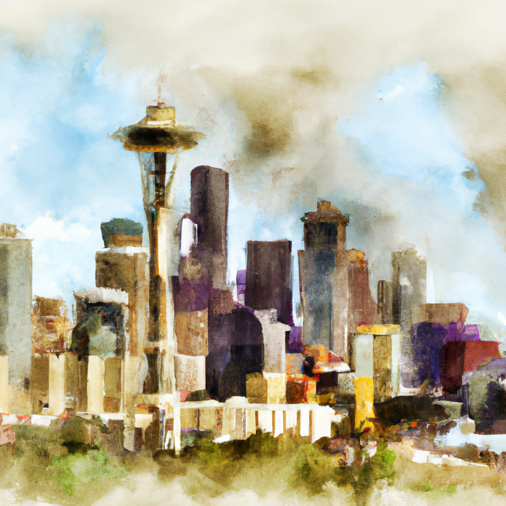
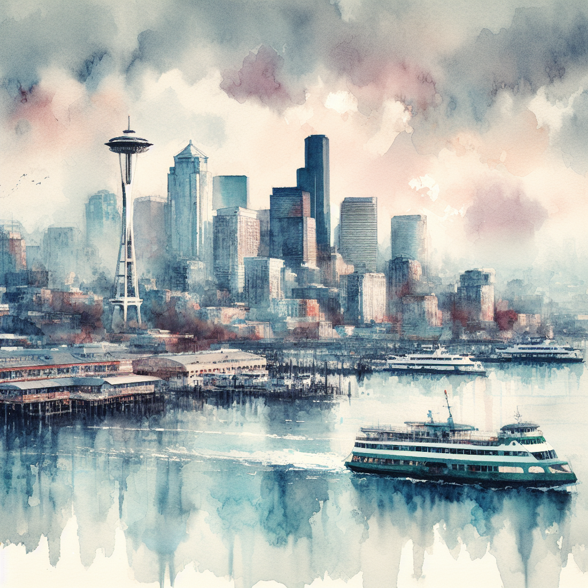

# What is prompt transformation?

Prompt transformation is a process in DALL-E 3 image generation that applies a safety and quality system message to your original prompt using a large language model (LLM) call before being sent to the model for image generation. This system message enriches your original prompt with the goal of generating more diverse and higher-quality images, while maintaining intent. 

After prompt transformation is applied to the original prompt, content filtering is applied as a secondary step before image generation; for more information, see [Content filtering](./content-filter.md).

> [!TIP]
> Learn more about image generation prompting in OpenAI's [DALL·E documentation](https://platform.openai.com/docs/guides/images/language-specific-tips).

## Prompt transformation example


| **Example text prompt** | **Example generated image without prompt transformation** | **Example generated image with prompt transformation** |
|---|---|---|
|"Watercolor painting of the Seattle skyline" |  |  |


## Why is prompt transformation needed?

Prompt transformation is essential for responsible and high-quality generations. Not only does prompt transformation improve the safety of your generated image, but it also enriches your prompt in a more descriptive manner, leading to higher quality and descriptive imagery.

Default prompt transformation in Azure OpenAI DALL-E 3 contains safety enhancements that steer the model away from generating images of Copyright Studio characters and artwork, public figures, and other harmful content such as sexual, hate and unfairness, violence, and self-harm content.

## How do I use prompt transformation?

Prompt transformation is applied by default to all Azure OpenAI DALL-E 3 requests. No extra setup is required to benefit from prompt transformation enhancements.

Like image generation, prompt transformation is non-deterministic due to the nature of large language models. A single original prompt may lead to many image variants.


## View prompt transformations

Your revised or transformed prompt is visible in the API response object as shown here, in the `revised_prompt` field. 


```json
Input Content:
{
    "prompt": "Watercolor painting of the Seattle skyline",
    "n": 1,
    "size": "1024x1024"
}
 
Output Content:
{
  "created": 1720557218,
  "data": [
    {
      "content_filter_results": {
        ...
      },
      "prompt_filter_results": {
        ...
      },
      "revised_prompt": "A soft and vivid watercolor painting capturing the scenic beauty of the Seattle skyline. The painting illustrates a setting sun casting warm hues over the sprawling cityscape, with the Space Needle prominently standing tall against the sky. Imagine the scattered high-rise buildings, a soothing blend of the lush green of the parks with the winding blue water of the Puget Sound, and the snow-covered peak of Mount Rainier in the distance. A play of light and shadow adds depth and dynamism to this multihued urban panorama."
    }
}
```


## Next steps

* [DALL-E quickstart](/azure/ai-services/openai/dall-e-quickstart)