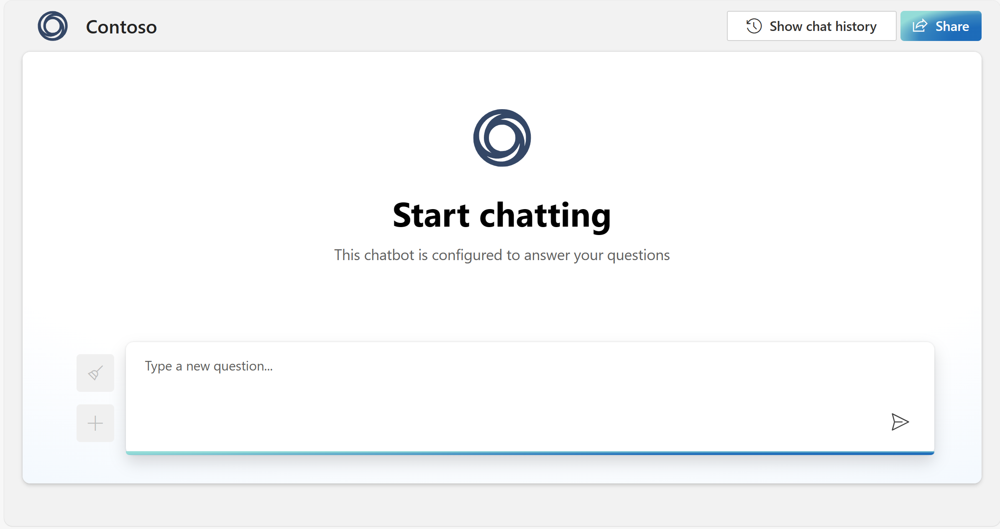

# Azure OpenAI on your data (preview)

Azure OpenAI on your data enables you to run supported chat models such as GPT-35-Turbo and GPT-4 on your data without needing to train or fine-tune models. Running models on your data enables you to chat on top of, and analyze your data with greater accuracy and speed. By doing so, you can unlock valuable insights that can help you make better business decisions, identify trends and patterns, and optimize your operations. One of the key benefits of Azure OpenAI on your data is its ability to tailor the content of conversational AI. 

Because the model has access to, and can reference specific sources to support its responses, answers are not only based on its pretrained knowledge but also on the latest information available in the designated data source. This grounding data also helps the model avoid generating responses based on outdated or incorrect information.

## What is Azure OpenAI on your data

Azure OpenAI on your data works with OpenAI's powerful GPT-35-Turbo and GPT-4 language models, enabling them to provide responses based on your data. You can access Azure OpenAI on your data using a REST API or the web-based interface in the [Azure OpenAI Studio](https://oai.azure.com/) to create a solution that connects to your data to enable an enhanced chat experience. 

One of the key features of Azure OpenAI on your data is its ability to retrieve and utilize data in a way that enhances the model's output.  Azure OpenAI on your data, together with Azure Cognitive Search, determines what data to retrieve from the designated data source based on the user input and provided conversation history. This data is then augmented and resubmitted as a prompt to the OpenAI model, with retrieved  information being appended to the original prompt. Although retrieved data is being appended to the prompt, the resulting input is still processed by the model like any other prompt. Once the data has been retrieved and the prompt has been submitted to the model, the model uses this information to provide a completion. See the [Data, privacy, and security for Azure OpenAI Service](/legal/cognitive-services/openai/data-privacy?context=/azure/ai-services/openai/context/context) article for more information. 

## Get started

To get started, [connect your data source](../use-your-data-quickstart.md) using Azure OpenAI Studio and start asking questions and chatting on your data.

> [!NOTE]
> To get started, you need to already have been approved for [Azure OpenAI access](../overview.md#how-do-i-get-access-to-azure-openai) and have an [Azure OpenAI Service resource](../how-to/create-resource.md) with either the gpt-35-turbo or the gpt-4 models deployed.

## Data source options

Azure OpenAI on your data uses an [Azure Cognitive Search](/azure/search/search-what-is-azure-search) index to determine what data to retrieve based on  user inputs and provided conversation history. We recommend using Azure OpenAI Studio to create your index from a blob storage or local files. See the [quickstart article](../use-your-data-quickstart.md?pivots=programming-language-studio) for more information.

## Data formats and file types

Azure OpenAI on your data supports the following filetypes:

* `.txt`
* `.md`
* `.html` 
* Microsoft Word files
* Microsoft PowerPoint files
* PDF

There is an [upload limit](../quotas-limits.md), and there are some caveats about document structure and how it might affect the quality of responses from the model: 

* The model provides the best citation titles from markdown (`.md`) files. 

* If a document is a PDF file, the text contents are extracted as a preprocessing step (unless you're connecting your own Azure Cognitive Search index). If your document contains images, graphs, or other visual content, the model's response quality depends on the quality of the text that can be extracted from them. 

* If you're converting data from an unsupported format into a supported format, make sure the conversion:

    * Doesn't lead to significant data loss.
    * Doesn't add unexpected noise to your data.  

    This will impact the quality of Azure Cognitive Search and the model response. 


## Ingesting your data into Azure Cognitive Search

> [!TIP]
> For documents and datasets with long text, you should use the available [data preparation script](https://go.microsoft.com/fwlink/?linkid=2244395). The script chunks data so that your response with the service will be more accurate. This script also supports scanned PDF files and images.

There are three different sources of data that you can use with Azure OpenAI on your data. 
* Blobs in an Azure storage container that you provide
* Local files uploaded using the Azure OpenAI Studio

Once data is ingested, an [Azure Cognitive Search](/azure/search/search-what-is-azure-search) index in your search resource gets created to integrate the information with Azure OpenAI models.

**Data ingestion from Azure storage containers**

1. Ingestion assets are created in Azure Cognitive Search resource and Azure storage account. Currently these assets are: indexers, indexes, data sources, a [custom skill](/azure/search/cognitive-search-custom-skill-interface) in the search resource, and a container (later called the chunks container) in the Azure storage account. You can specify the input Azure storage container using the [Azure OpenAI studio](https://oai.azure.com/), or the [ingestion API](../reference.md#start-an-ingestion-job).  

2. Data is read from the input container, contents are opened and chunked into small chunks with a maximum of 1024 tokens each. If vector search is enabled, the service will calculate the vector representing the embeddings on each chunk. The output of this step (called the "preprocessed" or "chunked" data) is stored in the chunks container created in the previous step. 

3. The preprocessed data is loaded from the chunks container, and indexed in the Azure Cognitive Search index. 


**Data ingestion from local files**

Using the Azure OpenAI Studio, you can upload files from your machine. The service then stores the files to an Azure storage container and performs ingestion from the container. 

### Troubleshooting failed ingestion jobs

To troubleshoot a failed job, always look out for errors or warnings specified either in the API response or Azure OpenAI studio. Here are some of the common errors and warnings: 

**Quota Limitations Issues** 

*An index with the name X in service Y could not be created. Index quota has been exceeded for this service. You must either delete unused indexes first, add a delay between index creation requests, or upgrade the service for higher limits.*

*Standard indexer quota of X has been exceeded for this service. You currently have X standard indexers. You must either delete unused indexers first, change the indexer 'executionMode', or upgrade the service for higher limits.* 

Resolution: 

Upgrade to a higher pricing tier or delete unused assets. 

**Preprocessing Timeout Issues** 

*Could not execute skill because the Web Api request failed*

*Could not execute skill because Web Api skill response is invalid* 

Resolution: 

Break down the input documents into smaller documents and try again. 

**Permissions Issues** 

*This request is not authorized to perform this operation*

Resolution: 

This means the storage account is not accessible with the given credentials. In this case, please review the storage account credentials passed to the API and ensure the storage account is not hidden behind a private endpoint (if a private endpoint is not configured for this resource). 
## Custom parameters

You can modify the following additional settings in the **Data parameters** section in Azure OpenAI Studio and [the API](../reference.md#completions-extensions).


|Parameter name  | Description  |
|---------|---------|
|**Retrieved documents**     |  Specifies the number of top-scoring documents from your data index used to generate responses. You might want to increase the value when you have short documents or want to provide more context. The default value is 3.       |
| **Strictness**     | Sets the threshold to categorize documents as relevant to your queries. Raising the value means a higher threshold for relevance and filters out more less-relevant documents for responses. Setting this value too high might cause the model to fail to generate responses due to limited available documents. The default value is 3.         |
| **Chunk size**     | Sets the number of tokens that your data will be chunked into.           |

## Virtual network support & private endpoint support

See the following table for scenarios supported by virtual networks and private endpoints **when you bring your own Azure Cognitive Search index**. 

| Network access to the Azure OpenAI Resource | Network access to the Azure Cognitive search resource | Is vector search enabled? | Azure OpenAI studio | Chat with the model using the API |
|---------------------------------------------|-------------------------------------------------------|---------------------------|---------------------|-----------------------------------|
| Public                                      | Public                                                | Either                    | Supported           | Supported                         |
| Private                                     | Public                                                | Yes                       | Not supported       | Supported                         |
| Private                                     | Public                                                | No                        | Supported           | Supported                         |
| Regardless of resource access allowances    | Private                                               | Either                    | Not supported       | Supported                         |

Additionally, data ingestion has the following configuration support:

| Network access to the Azure OpenAI Resource | Network access to the Azure Cognitive search resource | Azure OpenAI studio support | [Ingestion API](../reference.md#start-an-ingestion-job) support |
|---------------------------------------------|-------------------------------------------------------|-----------------------------|-----------------------------------------------------------------|
| Public                                      | Public                                                | Supported                   | Supported                                                       |
| Private                                     | Regardless of resource access allowances.             | Not supported               | Not supported                                                   |
| Public                                      | Private                                               | Not supported               | Not supported                                                   |


### Azure OpenAI resources

You can protect Azure OpenAI resources in [virtual networks and private endpoints](/azure/ai-services/cognitive-services-virtual-networks) the same way as any Azure AI service.

### Azure Cognitive Search resources

If you have an Azure Cognitive Search resource protected by a private network, and want to allow Azure OpenAI on your data to access your search service, complete [an application form](https://aka.ms/applyacsvpnaoaioyd). The application will be reviewed in ten business days and you will be contacted via email about the results. If you are eligible, we will send a private endpoint request to your search service, and you will need to approve the request.

:::image type="content" source="../media/use-your-data/approve-private-endpoint.png" alt-text="A screenshot showing private endpoint approval screen." lightbox="../media/use-your-data/approve-private-endpoint.png":::

Learn more about the [manual approval workflow](/azure/private-link/private-endpoint-overview#access-to-a-private-link-resource-using-approval-workflow).

After you approve the request in your search service, you can start using the [chat completions extensions API](/azure/ai-services/openai/reference#completions-extensions). Public network access can be disabled for that search service.

### Storage accounts

Storage accounts in virtual networks, firewalls, and private endpoints are supported by Azure OpenAI on your data. To use a storage account in a private network:

1. Ensure you have the system assigned managed identity principal enabled for your Azure OpenAI and Azure Cognitive Search resources.
    1. Using the Azure portal, navigate to your resource, and select **Identity** from the navigation menu on the left side of the screen.
    1. Set **Status** to **On**.
    1. Perform these steps for both of your Azure OpenAI and Azure Cognitive Search resources.

    :::image type="content" source="../media/use-your-data/managed-identity.png" alt-text="A screenshot showing managed identity settings in the Azure portal." lightbox="../media/use-your-data/managed-identity.png":::

1. Navigate back to your storage account. Select **Access Control (IAM)** for your resource. Select **Add**, then **Add role assignment**. In the window that appears, add the **Storage Data Contributor** role to the storage resource for your Azure OpenAI and search resource's managed identity. 
    1. Assign access to **Managed Identity**.
    1. If you have multiple search resources, Perform this step for each search resource.

    :::image type="content" source="../media/use-your-data/add-role-assignment.png" alt-text="A screenshot showing the role assignment option in the Azure portal." lightbox="../media/use-your-data/add-role-assignment.png":::

1. If your storage account hasn't already been network restricted, go to networking tab and select **Enabled from selected virtual networks and IP addresses**.

    :::image type="content" source="../media/use-your-data/enable-virtual-network.png" alt-text="A screenshot showing the option for enabling virtual networks in the Azure portal." lightbox="../media/use-your-data/enable-virtual-network.png":::

## Azure Role-based access controls (Azure RBAC)

To add a new data source to your Azure OpenAI resource, you need the following Azure RBAC roles.


|Azure RBAC role  | Which resource needs this role? | Needed when  |
|---------|---------|---------|
| [Cognitive Services OpenAI Contributor](../how-to/role-based-access-control.md#cognitive-services-openai-contributor) | The Azure Cognitive Search resource, to access Azure OpenAI resource. | You want to use Azure OpenAI on your data.   |
|[Search Index Data Reader](/azure/role-based-access-control/built-in-roles#search-index-data-reader) | The Azure OpenAI resource, to access the Azure Cognitive Search resource.    | You want to use Azure OpenAI on your data.        |
|[Search Service Contributor](/azure/role-based-access-control/built-in-roles#search-service-contributor) | The Azure OpenAI resource, to access the Azure Cognitive Search resource.    | You plan to create a new Azure Cognitive Search index.        |
|[Storage Blob Data Contributor](/azure/role-based-access-control/built-in-roles#storage-blob-data-contributor)     | You have an existing Blob storage container that you want to use, instead of creating a new one.  | The Azure Cognitive Search and Azure OpenAI resources, to access the storage account.       |
| [Cognitive Services OpenAI User](../how-to/role-based-access-control.md#cognitive-services-openai-user) | The web app, to access the Azure OpenAI resource. | You want to deploy a web app.   |
| [Contributor](/azure/role-based-access-control/built-in-roles#contributor) | Your subscription, to access Azure Resource Manager. | You want to deploy a web app. |
| [Cognitive Services Contributor Role](/azure/role-based-access-control/built-in-roles#cognitive-services-contributor) | The Azure Cognitive Search resource, to access Azure OpenAI resource. | You want to deploy a [web app](#using-the-web-app).   |


## Document-level access control

Azure OpenAI on your data lets you restrict the documents that can be used in responses for different users with Azure Cognitive Search [security filters](/azure/search/search-security-trimming-for-azure-search-with-aad). When you enable document level access, the search results returned from Azure Cognitive Search and used to generate a response will be trimmed based on user Microsoft Entra group membership. You can only enable document-level access on existing Azure Cognitive search indexes. To enable document-level access:

1. Follow the steps in the [Azure Cognitive Search documentation](/azure/search/search-security-trimming-for-azure-search-with-aad) to register your application and create users and groups.
1. [Index your documents with their permitted groups](/azure/search/search-security-trimming-for-azure-search-with-aad#index-document-with-their-permitted-groups). Be sure that your new [security fields](/azure/search/search-security-trimming-for-azure-search#create-security-field) have the schema below:
        
    ```json
    {"name": "group_ids", "type": "Collection(Edm.String)", "filterable": true }
    ```

    `group_ids` is the default field name. If you use a different field name like `my_group_ids`, you can map the field in [index field mapping](#index-field-mapping).

1. Make sure each sensitive document in the index has the value set correctly on this security field to indicate the permitted groups of the document.
1. In [Azure OpenAI Studio](https://oai.azure.com/portal), add your data source. in the [index field mapping](#index-field-mapping) section, you can map zero or one value to the **permitted groups** field, as long as the schema is compatible. If the **Permitted groups** field isn't mapped, document level access won't be enabled. 

**Azure OpenAI Studio**

Once the Azure Cognitive Search index is connected, your responses in the studio will have document access based on the Microsoft Entra permissions of the logged in user.

**Web app**

If you are using a published [web app](#using-the-web-app), you need to redeploy it to upgrade to the latest version. The latest version of the web app includes the ability to retrieve the groups of the logged in user's Microsoft Entra account, cache it, and include the group IDs in each API request.

**API**

When using the API, pass the `filter` parameter in each API request. For example:

```json
{
    "messages": [
        {
            "role": "user",
            "content": "who is my manager?"
        }
    ],
    "dataSources": [
        {
            "type": "AzureCognitiveSearch",
            "parameters": {
                "endpoint": "'$SearchEndpoint'",
                "key": "'$SearchKey'",
                "indexName": "'$SearchIndex'",
                "filter": "my_group_ids/any(g:search.in(g, 'group_id1, group_id2'))"
            }
        }
    ]
}
```
* `my_group_ids` is the field name that you selected for **Permitted groups** during [fields mapping](#index-field-mapping).
* `group_id1, group_id2` are groups attributed to the logged in user. The client application can retrieve and cache users' groups.

## Schedule automatic index refreshes

To keep your Azure Cognitive Search index up-to-date with your latest data, you can schedule a refresh for it that runs automatically rather than manually updating it every time your data is updated. Automatic index refresh is only available when you choose **blob storage** as the data source. To enable an automatic index refresh:

1. [Add a data source](../quickstart.md) using Azure OpenAI studio.
1. Under **Select or add data source** select **Indexer schedule** and choose the refresh cadence you would like to apply.

    :::image type="content" source="../media/use-your-data/indexer-schedule.png" alt-text="A screenshot of the indexer schedule in Azure OpenAI Studio." lightbox="../media/use-your-data/indexer-schedule.png":::

After the data ingestion is set to a cadence other than once, Azure Cognitive Search indexers will be created with a schedule equivalent to `0.5 * the cadence specified`. This means that at the specified cadence, the indexers will pull the documents that were added, modified, or deleted from the storage container, reprocess and index them. This ensures that the updated data gets preprocessed and indexed in the final index at the desired cadence automatically. To update your data, you only need to upload the additional documents from the Azure portal. From the portal, select **Storage Account** > **Containers**. Select the name of the original container, then **Upload**. The index will pick up the files automatically after the scheduled refresh period. The intermediate assets created in the Azure Cognitive Search resource will not be cleaned up after ingestion to allow for future runs. These assets are:
   - `{Index Name}-index`
   - `{Index Name}-indexer`
   - `{Index Name}-indexer-chunk`
   - `{Index Name}-datasource`
   - `{Index Name}-skillset`

To modify the schedule, you can use the [Azure portal](https://portal.azure.com/).

1. Open your search resource page in the Azure portal
1. Select **Indexers** from the left pane 
    
    :::image type="content" source="../media/use-your-data/indexers-azure-portal.png" alt-text="A screenshot of the indexers tab in the Azure portal." lightbox="../media/use-your-data/indexers-azure-portal.png":::

1. Perform the following steps on the two indexers that have your index name as a prefix.
    1. Select the indexer to open it. Then select the **settings** tab.
    1. Update the schedule to the desired cadence from "Schedule" or specify a custom cadence from "Interval (minutes)"
        
        :::image type="content" source="../media/use-your-data/indexer-schedule-azure-portal.png" alt-text="A screenshot of the settings page for an individual indexer." lightbox="../media/use-your-data/indexer-schedule-azure-portal.png":::

    1. Select **Save**.

## Recommended settings

Use the following sections to help you configure Azure OpenAI on your data for optimal results.

### System message

Give the model instructions about how it should behave and any context it should reference when generating a response. You can describe the assistant's personality, what it should and shouldn't answer, and how to format responses. There's no token limit for the system message, but will be included with every API call and counted against the overall token limit. The system message will be truncated if it's greater than 400 tokens. 

For example, if you're creating a chatbot where the data consists of transcriptions of quarterly financial earnings calls, you might use the following system message:

*"You are a financial chatbot useful for answering questions from financial reports. You are given excerpts from the earnings call. Please answer the questions by parsing through all dialogue."*

This system message can help improve the quality of the response by specifying the domain (in this case finance) and mentioning that the data consists of call transcriptions. It helps set the necessary context for the model to respond appropriately. 

> [!NOTE]
> The system message is used to modify how GPT assistant responds to a user question based on retrieved documentation. It does not affect the retrieval process. If you'd like to provide instructions for the retrieval process, it is better to include them in the questions.
> The system message is only guidance. The model might not adhere to every instruction specified because it has been primed with certain behaviors such as objectivity, and avoiding controversial statements. Unexpected behavior might occur if the system message contradicts with these behaviors. 

### Maximum response 

Set a limit on the number of tokens per model response. The upper limit for Azure OpenAI on Your Data is 1500. This is equivalent to setting the `max_tokens` parameter in the API. 

### Limit responses to your data 

This option encourages the model to respond using your data only, and is selected by default. If you unselect this option, the model might more readily apply its internal knowledge to respond. Determine the correct selection based on your use case and scenario. 

### Search options

Azure OpenAI on your data provides several search options you can use when you add your data source, leveraging the following types of search.

* [Keyword search](/azure/search/search-lucene-query-architecture)

* [Semantic search](/azure/search/semantic-search-overview)
* [Vector search](/azure/search/vector-search-overview) using Ada [embedding](./understand-embeddings.md) models, available in [select regions](models.md#embeddings-models-1). 

    To enable vector search, you will need a `text-embedding-ada-002` deployment in your Azure OpenAI resource. Select your embedding deployment when connecting your data, then select one of the vector search types under **Data management**.  

> [!IMPORTANT]
> * [Semantic search](/azure/search/semantic-search-overview#availability-and-pricing) and [vector search](https://azure.microsoft.com/pricing/details/cognitive-services/openai-service/) are subject to additional pricing. You need to choose **Basic or higher SKU** to enable semantic search or vector search. See [pricing tier difference](/azure/search/search-sku-tier) and [service limits](/azure/search/search-limits-quotas-capacity) for more information.
> * To help improve the quality of the information retrieval and model response, we recommend enabling [semantic search](/azure/search/semantic-search-overview) for the following languages: English, French, Spanish, Portuguese, Italian, Germany, Chinese(Zh), Japanese, Korean, Russian, Arabic
> * If you enable vector search, you need to enable public network access for your Azure OpenAI resources.

| Search option       | Retrieval type | Additional pricing? |Benefits|
|---------------------|------------------------|---------------------| -------- |
| *keyword*            | Keyword search                       | No additional pricing.                    |Performs fast and flexible query parsing and matching over searchable fields, using terms or phrases in any supported language, with or without operators.|
| *semantic*          |  Semantic search  |  Additional pricing for [semantic search](/azure/search/semantic-search-overview#availability-and-pricing) usage.                  |Improves the precision and relevance of search results by using a reranker (with AI models) to understand the semantic meaning of query terms and documents returned by the initial search ranker|
| *vector*            | Vector search       | [Additional pricing](https://azure.microsoft.com/pricing/details/cognitive-services/openai-service/) on your Azure OpenAI account from calling the embedding model.                    |Enables you to find documents that are similar to a given query input based on the vector embeddings of the content. |
| *hybrid (vector + keyword)*   | A hybrid of vector search and keyword search | [Additional pricing](https://azure.microsoft.com/pricing/details/cognitive-services/openai-service/) on your Azure OpenAI account from calling the embedding model.            |Performs similarity search over vector fields using vector embeddings, while also supporting flexible query parsing and full text search over alphanumeric fields using term queries.|
| *hybrid (vector + keyword) + semantic* | A hybrid of vector search, semantic and keyword search for retrieval.     | [Additional pricing](https://azure.microsoft.com/pricing/details/cognitive-services/openai-service/) on your Azure OpenAI account from calling the embedding model, and additional pricing for [semantic search](/azure/search/semantic-search-overview#availability-and-pricing) usage.                    |Leverages vector embeddings, language understanding and flexible query parsing to create rich search experiences and generative AI apps that can handle complex and diverse information retrieval scenarios. |

The optimal search option can vary depending on your dataset and use-case. You might need to experiment with multiple options to determine which works best for your use-case.

### Index field mapping 

If you're using your own index, you will be prompted in the Azure OpenAI Studio to define which fields you want to map for answering questions when you add your data source. You can provide multiple fields for *Content data*, and should include all fields that have text pertaining to your use case. 

:::image type="content" source="../media/use-your-data/index-data-mapping.png" alt-text="A screenshot showing the index field mapping options in Azure OpenAI Studio." lightbox="../media/use-your-data/index-data-mapping.png":::

In this example, the fields mapped to **Content data** and **Title** provide information to the model to answer questions. **Title** is also used to title citation text. The field mapped to **File name** generates the citation names in the response. 

Mapping these fields correctly helps ensure the model has better response and citation quality. 

### Interacting with the model

Use the following practices for best results when chatting with the model. 

**Conversation history** 

* Before starting a new conversation (or asking a question that is not related to the previous ones), clear the chat history. 
* Getting different responses for the same question between the first conversational turn and subsequent turns can be expected because the conversation history changes the current state of the model. If you receive incorrect answers, report it as a quality bug. 

**Model response**

* If you are not satisfied with the model response for a specific question, try either making the question more specific or more generic to see how the model responds, and reframe your question accordingly. 

* [Chain-of-thought prompting](advanced-prompt-engineering.md?pivots=programming-language-chat-completions#chain-of-thought-prompting) has been shown to be effective in getting the model to produce desired outputs for complex questions/tasks.

**Question length**

Avoid asking long questions and break them down into multiple questions if possible. The GPT models have limits on the number of tokens they can accept. Token limits are counted toward: the user question, the system message, the retrieved search documents (chunks), internal prompts, the conversation history (if any), and the response. If the question exceeds the token limit, it will be truncated.

**Multi-lingual support**  

* Currently, keyword search and semantic search in Azure OpenAI on your data supports queries are in the same language as the data in the index. For example, if your data is in Japanese, then input queries also need to be in Japanese. For cross-lingual document retrieval, we recommend building the index with [Vector search](/azure/search/vector-search-overview) enabled.  

* To help improve the quality of the information retrieval and model response, we recommend enabling [semantic search](/azure/search/semantic-search-overview) for the following languages: English, French, Spanish, Portuguese, Italian, Germany, Chinese(Zh), Japanese, Korean, Russian, Arabic   

* We recommend using a system message to inform the model that your data is in another language. For example:

*   *"**You are an AI assistant designed to help users extract information from retrieved Japanese documents. Please scrutinize the Japanese documents carefully before formulating a response. The user's query will be in Japanese, and you must response also in Japanese."*


* If you have documents in multiple languages, we recommend building a new index for each language and connecting them separately to Azure OpenAI.  

### Deploying the model

After you connect Azure OpenAI to your data, you can deploy it using the **Deploy to** button in Azure OpenAI studio.

:::image type="content" source="../media/use-your-data/deploy-model.png" alt-text="A screenshot showing the model deployment button in Azure OpenAI Studio." lightbox="../media/use-your-data/deploy-model.png":::

#### Using Power Virtual Agents

You can deploy your model to [Power Virtual Agents](/power-virtual-agents/fundamentals-what-is-power-virtual-agents) directly from Azure OpenAI studio, enabling you to bring conversational experiences to various Microsoft Teams, Websites, Power Platform solutions, Dynamics 365, and other [Azure Bot Service channels](/power-virtual-agents/publication-connect-bot-to-azure-bot-service-channels). Power Virtual Agents acts as a conversational and generative AI platform, making the process of creating, publishing and deploying a bot to any number of channels simple and accessible.

While Power Virtual Agents has features that leverage Azure OpenAI such as [generative answers](/power-virtual-agents/nlu-boost-conversations), deploying a model grounded on your data lets you create a chatbot that will respond using your data, and connect it to the Power Platform. The tenant used in the Azure OpenAI service and Power Platform should be the same. For more information, see [Use a connection to Azure OpenAI on your data](/power-virtual-agents/nlu-generative-answers-azure-openai).

> [!VIDEO https://www.microsoft.com/videoplayer/embed/RW18YwQ]

> [!NOTE]
> Deploying to Power Virtual Agents from Azure OpenAI is only available to US regions.
> Power Virtual Agents supports Azure Cognitive Search indexes with keyword or semantic search only. Other data sources and advanced features might not be supported.

#### Using the web app

You can also use the available standalone web app to interact with your model using a graphical user interface, which you can deploy using either Azure OpenAI studio or a [manual deployment](https://github.com/microsoft/sample-app-aoai-chatGPT). 



##### Web app customization

You can also customize the app's frontend and backend logic. For example, you could change the icon that appears in the center of the app by updating `/frontend/src/assets/Azure.svg` and then redeploying the app [using the Azure CLI](https://github.com/microsoft/sample-app-aoai-chatGPT#deploy-with-the-azure-cli).  See the source code for the web app, and more information [on GitHub](https://github.com/microsoft/sample-app-aoai-chatGPT).

When customizing the app, we recommend:

- Resetting the chat session (clear chat) if the user changes any settings. Notify the user that their chat history will be lost.

- Clearly communicating the impact on the user experience that each setting you implement will have.

- When you rotate API keys for your Azure OpenAI or Azure Cognitive Search resource, be sure to update the app settings for each of your deployed apps to use the new keys.

- Pulling changes from the `main` branch for the web app's source code frequently to ensure you have the latest bug fixes and improvements.

##### Important considerations

- Publishing creates an Azure App Service in your subscription. It might incur costs depending on the [pricing plan](https://azure.microsoft.com/pricing/details/app-service/windows/) you select. When you're done with your app, you can delete it from the Azure portal.
- By default, the app will only be accessible to you. To add authentication (for example, restrict access to the app to members of your Azure tenant):

    1. Go to the [Azure portal](https://portal.azure.com/#home) and search for the app name you specified during publishing. Select the web app, and go to the **Authentication** tab on the left navigation menu. Then select **Add an identity provider**. 
    
        :::image type="content" source="../media/quickstarts/web-app-authentication.png" alt-text="Screenshot of the authentication page in the Azure portal." lightbox="../media/quickstarts/web-app-authentication.png":::

    1. Select Microsoft as the identity provider. The default settings on this page will restrict the app to your tenant only, so you don't need to change anything else here. Then select **Add**
    
    Now users will be asked to sign in with their Microsoft Entra account to be able to access your app. You can follow a similar process to add another identity provider if you prefer. The app doesn't use the user's login information in any other way other than verifying they are a member of your tenant.

### Chat history

You can enable chat history for your users of the web app. By enabling the feature, your users will have access to their individual previous queries and responses. 

To enable chat history, deploy or redeploy your model as a web app using [Azure OpenAI Studio](https://oai.azure.com/portal)

:::image type="content" source="../media/use-your-data/enable-chat-history.png" alt-text="A screenshot of the chat history enablement button on Azure OpenAI studio." lightbox="../media/use-your-data/enable-chat-history.png":::

> [!IMPORTANT]
> Enabling chat history will create a [Cosmos DB](/azure/cosmos-db/introduction) instance in your resource group, and incur [additional charges](https://azure.microsoft.com/pricing/details/cosmos-db/autoscale-provisioned/) for the storage used. 

Once you've enabled chat history, your users will be able to show and hide it in the top right corner of the app. When the history is shown, they can rename, or delete conversations. As they're logged into the app, conversations will be automatically ordered from newest to oldest, and named based on the first query in the conversation. 

:::image type="content" source="../media/use-your-data/web-app-chat-history.jpg" alt-text="A screenshot of the chat history in the web app." lightbox="../media/use-your-data/web-app-chat-history.jpg":::

#### Deleting your Cosmos DB instance

Deleting your web app does not delete your Cosmos DB instance automatically. To delete your Cosmos DB instance, along with all stored chats, you need to navigate to the associated resource in the [Azure portal](https://portal.azure.com) and delete it. If you delete the Cosmos DB resource but keep the chat history option enabled on the studio, your users will be notified of a connection error, but can continue to use the web app without access to the chat history.

### Using the API

After you upload your data through Azure OpenAI studio, you can make a call against Azure OpenAI models through APIs. Consider setting the following parameters even if they are optional for using the API.


|Parameter  |Recommendation  |
|---------|---------|
|`fieldsMapping`    | Explicitly set the title and content fields of your index. This impacts the search retrieval quality of Azure Cognitive Search, which impacts the overall response and citation quality.         |
|`roleInformation`     | Corresponds to the "System Message" in the Azure OpenAI Studio. See the [System message](#system-message) section above for recommendations. |

#### Streaming data

You can send a streaming request using the `stream` parameter, allowing data to be sent and received incrementally, without waiting for the entire API response. This can improve performance and user experience, especially for large or dynamic data.

```json
{
    "stream": true,
    "dataSources": [
        {
            "type": "AzureCognitiveSearch",
            "parameters": {
                "endpoint": "'$SearchEndpoint'",
                "key": "'$SearchKey'",
                "indexName": "'$SearchIndex'"
            }
        }
    ],
    "messages": [
        {
            "role": "user",
            "content": "What are the differences between Azure Machine Learning and Azure AI services?"
        }
    ]
}
```

#### Conversation history for better results

When you chat with a model, providing a history of the chat will help the model return higher quality results. 

```json
{
    "dataSources": [
        {
            "type": "AzureCognitiveSearch",
            "parameters": {
                "endpoint": "'$SearchEndpoint'",
                "key": "'$SearchKey'",
                "indexName": "'$SearchIndex'"
            }
        }
    ],
    "messages": [
        {
            "role": "user",
            "content": "What are the differences between Azure Machine Learning and Azure AI services?"
        },
        {
            "role": "tool",
            "content": "{\"citations\": [{\"content\": \"title: Azure AI services and Machine Learning\\ntitleSuffix: Azure AI services\\ndescription: Learn where Azure AI services fits in with other Azure offerings for machine learning.\\nAzure AI services and machine learning\\nAzure AI services provides machine learning capabilities to solve general problems such as...\\n \"articles\\\\cognitive-services\\\\cognitive-services-and-machine-learning.md\", \"url\": null, \"metadata\": {\"chunking\": \"orignal document size=1018. Scores=0.32200050354003906 and 1.2880020141601562.Org Highlight count=115.\"}, \"chunk_id\": \"0\"}], \"intent\": \"[\\\"What are the differences between Azure Machine Learning and Azure AI services?\\\"]\"}"
        },
        {
            "role": "assistant",
            "content": " \nAzure Machine Learning is a product and service tailored for data scientists to build, train, and deploy machine learning models [doc1]..."
        },
        {
            "role": "user",
            "content": "How do I use Azure machine learning?"
        }
    ]
}
```


## Next steps
* [Get started using your data with Azure OpenAI](../use-your-data-quickstart.md)

* [Introduction to prompt engineering](./prompt-engineering.md)
