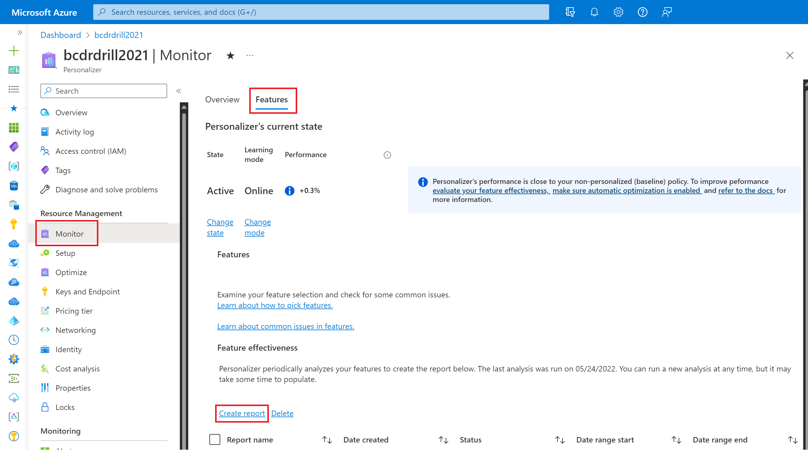

# Evaluate feature importances

You can assess how important each feature was to Personalizer's machine learning model by conducting a _feature evaluation_ on your historical log data. Feature evaluations are useful to:

* Understand which features are most or least important to the model.
* Brainstorm extra features that may be beneficial to learning, by deriving inspiration from what features are currently important in the model.
* Identify potentially unimportant or non-useful features that should be considered for further analysis or removal. 
* Troubleshoot common problems and errors that may occur when designing features and sending them to Personalizer. For example, using GUIDs, timestamps, or other features that are generally _sparse_ may be problematic. Learn more about [improving features](concepts-features.md).

## What is a feature evaluation?

Feature evaluations are conducted by training and running a copy of your current model configuration on historically collected log data in a specified time period. Features are ignored one at a time to measure the difference in model performance with and without each feature. Because the feature evaluations are performed on historical data, there's no guarantee that these patterns will be observed in future data. However, these insights may still be relevant to future data if your logged data has captured sufficient variability or non-stationary properties of your data. Your current model's performance isn't  affected by running a feature evaluation.

A _feature importance_ score is a measure of the relative impact of the feature on the reward over the evaluation period. Feature importance scores are a number between 0 (least important) and 100 (most important) and are shown in the feature evaluation. Since the evaluation is run over a specific time period, the feature importances can change as additional data is sent to Personalizer and as your users, scenarios, and data change over time. 

## Creating a feature evaluation

To obtain feature importance scores, you must create a feature evaluation over a period of logged data to generate a report containing the feature importance scores. This report is viewable in the Azure portal. To create a feature evaluation:

1. Go to the [Azure portal](https://portal.azure.com) website
1. Select your Personalizer resource
1. Select the _Monitor_ section from the side navigation pane
1. Select the _Features_ tab
1. Select "Create report" and a new screen should appear
1. Choose a name for your report
1. Choose _start_ and _end_ times for your evaluation period
1. Select "Create report"

Next, your report name should appear in the reports table below. Creating a feature evaluation is a long running process, where the time to completion depends on the volume of data sent to Personalizer during the evaluation period. While the report is being generated, the _Status_ column will indicate "Running" for your evaluation, and will update to "Succeeded" once completed. Check back periodically to see if your evaluation has finished.

You can run multiple feature evaluations over various periods of time that your Personalizer resource has log data. Make sure that your [data retention period](how-to-settings.md#data-retention) is set sufficiently long to enable you to perform evaluations over older data.

## Interpreting feature importance scores

### Features with a high importance score

Features with higher importance scores were more influential to the model during the evaluation period as compared to the other features. Important features can provide inspiration for designing additional features to be included in the model. For example, if you see the context features "IsWeekend" or "IsWeekday" have high importance for grocery shopping, it may be the case that holidays or long-weekends may also be important factors, so you may want to consider adding features that capture this information.

### Features with a low importance score

Features with low importance scores are good candidates for further analysis. Not all low scoring features necessarily _bad_ or not useful as low scores can occur for one or more several reasons. The list below can help you get started with analyzing why your features may have low scores:

* The feature was rarely observed in the data during the evaluation period. 
    <!-- * Check The _Feature occurrences_ in your feature evaluation. If it's low in comparison to other features, this may indicate that feature was not present often enough for the model to determine if it's valuable or not. -->
    * If the number of occurrences of this feature is low in comparison to other features, this may indicate that feature wasn't present often enough for the model to determine if it's valuable or not.
* The feature values didn't have a lot of diversity or variation.
    <!-- * Check The _Number of unique values_ in your feature evaluation. If it's lower than you would expect, this may indicate that the feature did not vary much during the evaluation period and won't provide significant insight. -->
    * If the number of unique values for this feature lower than you would expect, this may indicate that the feature didn't vary much during the evaluation period and won't provide significant insight.
  
* The feature values were too noisy (random), or too distinct, and provided little value.
    <!-- * Check the _Number of unique values_ in your feature evaluation. If it's higher than you expected, or high in comparison to other features, this may indicate that the feature was too noisy during the evaluation period. -->
    * Check the _Number of unique values_ in your feature evaluation. If the number of unique values for this feature is higher than you expected, or high in comparison to other features, this may indicate that the feature was too noisy during the evaluation period.
* There's a data or formatting issue.
    * Check to make sure the features are formatted and sent to Personalizer in the way you expect.
* The feature may not be valuable to model learning and performance if the feature score is low and the reasons above do not apply.
    * Consider removing the feature as it's not helping your model maximize the average reward. 
    
Removing features with low importance scores can help speed up model training by reducing the amount of data needed to learn. It can also potentially improve the performance of the model. However, this isn't guaranteed and further analysis may be needed.  [Learn more about designing context and action features.](concepts-features.md)

### Common issues and steps to improve features

- **Sending features with high cardinality.** Features with high cardinality are those that have many distinct values that are not likely to repeat over many events. For example, personal information specific to one individual (such as name, phone number, credit card number, IP address) shouldn't be used with Personalizer.
  
- **Sending user IDs** With large numbers of users, it's unlikely that this information is relevant to Personalizer learning to maximize the average reward score. Sending user IDs (even if not personal information) will likely add more noise to the model and isn't recommended.
  
- **Features are too sparse. Values are distinct and rarely occur more than a few times**. Precise timestamps down to the second can be very sparse. It can be made more dense (and therefore, effective) by grouping times into "morning", "midday" or "afternoon", for example. 

Location information also typically benefits from creating broader classifications. For example, a latitude-longitude coordinates such as Lat: 47.67402° N, Long: 122.12154° W is too precise and forces the model to learn latitude and longitude as distinct dimensions. When you're trying to personalize based on location information, it helps to group location information in larger sectors. An easy way to do that is to choose an appropriate rounding precision for the lat-long numbers, and combine latitude and longitude into "areas" by making them one string. For example, a good way to represent Lat: 47.67402° N, Long: 122.12154° W in regions approximately a few kilometers wide would be "location":"34.3 , 12.1".

- **Expand feature sets with extrapolated information**
You can also get more features by thinking of unexplored attributes that can be derived from information you already have. For example, in a fictitious movie list personalization, is it possible that a weekend vs weekday elicits different behavior from users? Time could be expanded to have a "weekend" or "weekday" attribute. Do national/regional cultural holidays drive attention to certain movie types? For example, a "Halloween" attribute is useful in places where it's relevant. Is it possible that rainy weather has significant impact on the choice of a movie for many people? With time and place, a weather service could provide that information and you can add it as an extra feature.

## Next steps

[Analyze policy performances with an offline evaluation](how-to-offline-evaluation.md) with Personalizer.

