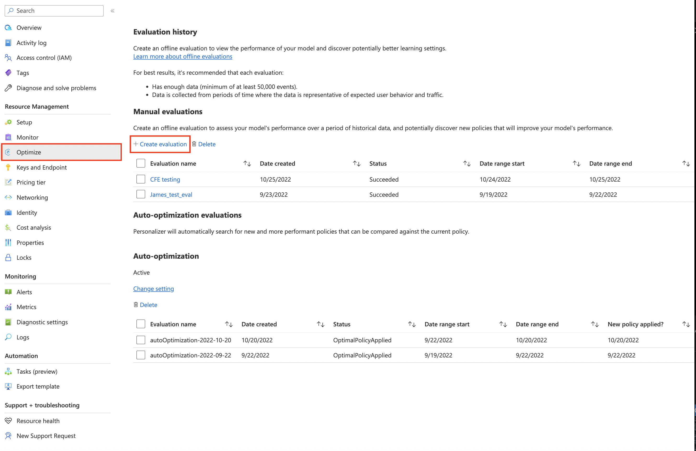
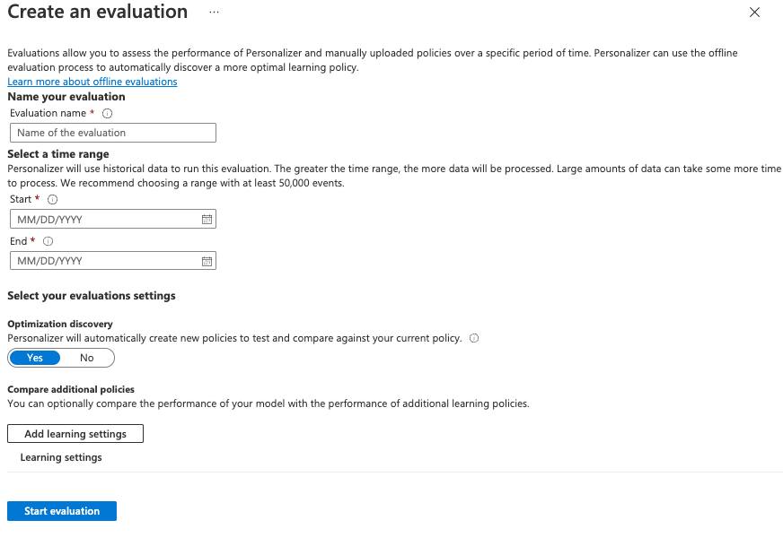

# Analyze your learning loop with an offline evaluation

Learn how to create an offline evaluation and interpret the results.

Offline Evaluations allow you to measure how effective Personalizer is compared to your application's default behavior over a period of logged (historical) data, and assess how well other model configuration settings may perform for your model.

When you create an offline evaluation, the _Optimization discovery_ option will run offline evaluations over a variety of learning policy values to find one that may improve the performance of your model. You can also provide additional policies to assess in the offline evaluation.

Read about [Offline Evaluations](concepts-offline-evaluation.md) to learn more.

## Prerequisites

* A configured Personalizer resource
* The Personalizer resource must have a representative amount of logged data - as a ballpark figure, we recommend at least 50,000 events in its logs for meaningful evaluation results. Optionally, you may also have previously exported _learning policy_ files that you wish to test and compare in this evaluation.

## Run an offline evaluation

1. In the [Azure portal](https://azure.microsoft.com/free/cognitive-services), locate your Personalizer resource.
1. In the Azure portal, go to the **Evaluations** section and select **Create Evaluation**.
    
1. Fill out the options in the _Create an evaluation_ window:

    * An evaluation name.
    * Start and end date - these are dates that specify the range of data to use in the evaluation. This data must be present in the logs, as specified in the [Data Retention](how-to-settings.md) value.
    * Set _Optimization discovery_ to **yes**, if you wish Personalizer to attempt to find more optimal learning policies.
    * Add learning settings - upload a learning policy file if you wish to evaluate a custom or previously exported policy.l

    > [!div class="mx-imgBorder"]
    > 

1. Start the Evaluation by selecting **Start evaluation**.

## Review the evaluation results

Evaluations can take a long time to run, depending on the amount of data to process, number of learning policies to compare, and whether an optimization was requested.

1. Once completed, you can select the evaluation from the list of evaluations, then select **Compare the score of your application with other potential learning settings**. Select this feature when you want to see how your current learning policy performs compared to a new policy.

1. Next, Review the performance of the [learning policies](concepts-offline-evaluation.md#discovering-the-optimized-learning-policy).

    > [!div class="mx-imgBorder"]
    > 

You'll see various learning policies on the chart, along with their estimated average reward, confidence intervals, and options to download or apply a specific policy.
- "Online" - Personalizer's current policy
- "Baseline1" - Your application's baseline policy
- "BaselineRand" - A policy of taking actions at random
- "Inter-len#" or "Hyper#"  - Policies created by Optimization discovery.

Select **Apply** to apply the policy that improves the model best for your data.

## Next steps

* Learn more about [how offline evaluations work](concepts-offline-evaluation.md).
