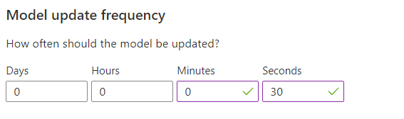

### Change the model update frequency

In the Azure portal, go to your Personalizer resource's **Configuration** page, and change the **Model update frequency** to 30 seconds. This short duration will train the model rapidly, allowing you to see how the recommended action changes for each iteration.

