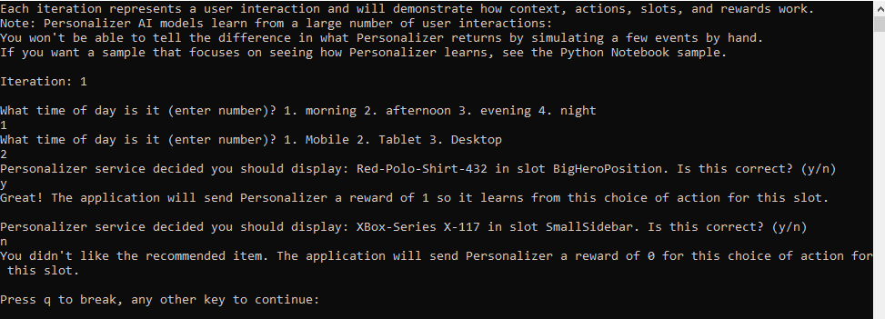

[Reference documentation](/javascript/api/@azure/cognitiveservices-personalizer/) | [Multi-slot conceptual](..\concept-multi-slot-personalization.md) | [Samples](https://aka.ms/personalizer/ms-nodejs)

## Prerequisites

* Azure subscription - [Create one for free](https://azure.microsoft.com/free/cognitive-services)
* Install [Node.js](https://nodejs.org) and NPM (verified with Node.js v14.16.0 and NPM 6.14.11).
* Once you have your Azure subscription, <a href="https://portal.azure.com/#create/Microsoft.CognitiveServicesPersonalizer"  title="Create a Personalizer resource"  target="_blank">create a Personalizer resource </a> in the Azure portal to get your key and endpoint. After it deploys, select **Go to resource**.
    * You will need the key and endpoint from the resource you create to connect your application to the Personalizer API. Paste your key and endpoint into the code below later in the quickstart.
    * You can use the free pricing tier (`F0`) to try the service, and upgrade later to a paid tier for production.

## Setting up

[!INCLUDE [Upgrade Personalizer instance to Multi-Slot](upgrade-personalizer-multi-slot.md)]

[!INCLUDE [Change model frequency](change-model-frequency.md)]

[!INCLUDE [Change reward wait time](change-reward-wait-time.md)]

### Create a new Node.js application

In a console window (such as cmd, PowerShell, or Bash), create a new directory for your app, and navigate to it.

```console
mkdir myapp && cd myapp
```

Run the `npm init -y` command to create a `package.json` file.

```console
npm init -y
```

Create a new Node.js application in your preferred editor or IDE named `sample.js` and create variables for your resource's endpoint and subscription key. 

[!INCLUDE [Personalizer find resource info](find-azure-resource-info.md)]

```javascript
const axios = require('axios');
const { v4: uuidv4 } = require('uuid');
const readline = require('readline-sync');
// The endpoint specific to your personalization service instance; 
// e.g. https://<your-resource-name>.cognitiveservices.azure.com
const PersonalizationBaseUrl = '<REPLACE-WITH-YOUR-PERSONALIZER-ENDPOINT>';
// The key specific to your personalization service instance; e.g. "0123456789abcdef0123456789ABCDEF"
const ResourceKey = '<REPLACE-WITH-YOUR-PERSONALIZER-KEY>';
```

### Install the NPM packages for quickstart

```console
npm install readline-sync uuid axios --save
```

## Object model

To ask for the single best item of the content for each slot, create a **rankRequest**, then send a post request to [multislot/rank](https://westus2.dev.cognitive.microsoft.com/docs/services/personalizer-api-v1-1-preview-1/operations/MultiSlot_Rank). The response is then parsed into a **rankResponse**.

To send a reward score to Personalizer, create a **rewards**, then send a post request to [multislot/events/{eventId}/reward](https://westus2.dev.cognitive.microsoft.com/docs/services/personalizer-api-v1-1-preview-1/operations/MultiSlot_Events_Reward).

Determining the reward score, in this quickstart is trivial. In a production system, the determination of what impacts the [reward score](../concept-rewards.md) and by how much can be a complex process, that you may decide to change over time. This design decision should be one of the primary decisions in your Personalizer architecture.

## Code examples

These code snippets show you how to do the following tasks by sending HTTP requests for NodeJS:

* [Create base URLs](#create-base-urls)
* [Rank API](#request-the-best-action)
* [Reward API](#send-a-reward)


## Create base URLs

In this section you'll construct the Rank / Reward URLs using the base url and the request headers using the resource key.

```javascript
const MultiSlotRankUrl = PersonalizationBaseUrl.concat('personalizer/v1.1-preview.1/multislot/rank');
const MultiSlotRewardUrlBase = PersonalizationBaseUrl.concat('personalizer/v1.1-preview.1/multislot/events/');
const Headers = {
    'ocp-apim-subscription-key': ResourceKey,
    'Content-Type': 'application/json'
};
```

## Get content choices represented as actions

Actions represent the content choices from which you want Personalizer to select the best content item. Add the following methods to the script to represent the set of actions and their features. 

```javascript
function getActions() {
    return [
        {
            'id': 'Red-Polo-Shirt-432',
            'features': [
                {
                    'onSale': 'true',
                    'price': 20,
                    'category': 'Clothing'
                }
            ]
        },
        {
            'id': 'Tennis-Racket-133',
            'features': [
                {
                    'onSale': 'false',
                    'price': 70,
                    'category': 'Sports'
                }
            ]
        },
        {
            'id': '31-Inch-Monitor-771',
            'features': [
                {
                    'onSale': 'true',
                    'price': 200,
                    'category': 'Electronics'
                }
            ]
        },
        {
            'id': 'XBox-Series X-117',
            'features': [
                {
                    'onSale': 'false',
                    'price': 499,
                    'category': 'Electronics'
                }
            ]
        }
    ];
}
```

## Get user preferences for context

Add the following methods to the script to get a user's input from the command line for the time of day and the type of device the user is on. These will be used as context features.

```javascript
function getContextFeatures() {
    const timeOfDayFeatures = ['morning', 'afternoon', 'evening', 'night'];
    const deviceFeatures = ['mobile', 'tablet', 'desktop'];

    let answer = readline.question('\nWhat time of day is it (enter number)? 1. morning 2. afternoon 3. evening 4. night\n');
    let selection = parseInt(answer);
    const timeOfDay = selection >= 1 && selection <= 4 ? timeOfDayFeatures[selection - 1] : timeOfDayFeatures[0];

    answer = readline.question('\nWhat type of device is the user on (enter number)? 1. mobile 2. tablet 3. desktop\n');
    selection = parseInt(answer);
    const device = selection >= 1 && selection <= 3 ? deviceFeatures[selection - 1] : deviceFeatures[0];

    console.log('Selected features:\n');
    console.log('Time of day: ' + timeOfDay + '\n');
    console.log('Device: ' + device + '\n');

    return [
        {
            'time': timeOfDay
        },
        {
            'device': device
        }
    ];
}
```

## Get slots

Slots make up the page that the user will interact with. Personalizer will decide which action to display in each one of the defined slots. Actions can be excluded from specific slots, shown as `ExcludeActions`. `BaselineAction` is the default action for the slot which would have been displayed without the use of Personalizer.


This quickstart has simple slot features. In production systems, determining and [evaluating](../how-to-feature-evaluation.md) [features](../concepts-features.md) can be a non-trivial matter.

```javascript
function getSlots() {
    return [
        {
            'id': 'BigHeroPosition',
            'features': [
                {
                    'size': 'large',
                    'position': 'left',
                }
            ],
            'excludedActions': ['31-Inch-Monitor-771'],
            'baselineAction': 'Red-Polo-Shirt-432'
        },
        {
            'id': 'SmallSidebar',
            'features': [
                {
                    'size': 'small',
                    'position': 'right',
                }
            ],
            'excludedActions': ['Tennis-Racket-133'],
            'baselineAction': 'XBox-Series X-117'
        }
    ];
}
```

## Make HTTP requests

Add these functions to send post requests to the Personalizer endpoint for multi-slot rank and reward calls.

```javascript
async function sendMultiSlotRank(rankRequest) {
    try {
        let response = await axios.post(MultiSlotRankUrl, rankRequest, { headers: Headers })
        return response.data;
    }
    catch (err) {
        if(err.response)
        {
            throw err.response.data
        }
        console.log(err)
        throw err;
    }
}
```

```javascript
async function sendMultiSlotReward(rewardRequest, eventId) {
    try {
        let rewardUrl = MultiSlotRewardUrlBase.concat(eventId, '/reward');
        let response = await axios.post(rewardUrl, rewardRequest, { headers: Headers })
    }
    catch (err) {
        console.log(err);
        throw err;
    }
}
```

## Get feedback for Personalizer decisions


Add the following method to the script. You will signal if Personalizer made a good decision for each slot through command-line prompt.

```javascript
function getRewardForSlot() {
    let answer = readline.question('\nIs this correct? (y/n)\n').toUpperCase();
    if (answer === 'Y') {
        console.log('\nGreat! The application will send Personalizer a reward of 1 so it learns from this choice of action for this slot.\n');
        return 1;
    }
    else if (answer === 'N') {
        console.log('\nYou didn\'t like the recommended item.The application will send Personalizer a reward of 0 for this choice of action for this slot.\n');
        return 0;
    }
    console.log('\nEntered choice is invalid. Service assumes that you didn\'t like the recommended item.\n');
    return 0;
}
```

## Create the learning loop

The Personalizer learning loop is a cycle of [Rank](#request-the-best-action) and [Reward](#send-a-reward) calls. In this quickstart, each Rank call, to personalize the content, is followed by a Reward call to tell Personalizer how well the service performed.

The following code loops through a cycle of asking the user their preferences through the command line, sending that information to Personalizer to select the best action for each slot, presenting the selection to the customer to choose from among the list, then sending a reward score to Personalizer signaling how well the service did in its selection.

```javascript
let runLoop = true;

(async () => {
    do {

        let multiSlotRankRequest = {};

        // Generate an ID to associate with the request.
        multiSlotRankRequest.eventId = uuidv4();

        // Get context information from the user.
        multiSlotRankRequest.contextFeatures = getContextFeatures();

        // Get the actions list to choose from personalization with their features.
        multiSlotRankRequest.actions = getActions();

        // Get the list of slots for which Personalizer will pick the best action.
        multiSlotRankRequest.slots = getSlots();

        multiSlotRankRequest.deferActivation = false;

        try {
            //Rank the actions for each slot
            let multiSlotRankResponse = await sendMultiSlotRank(multiSlotRankRequest);
            let multiSlotrewards = {};
            multiSlotrewards.reward = [];
    
            for (let i = 0; i < multiSlotRankResponse.slots.length; i++) {
                console.log('\nPersonalizer service decided you should display: '.concat(multiSlotRankResponse.slots[i].rewardActionId, ' in slot ', multiSlotRankResponse.slots[i].id, '\n'));
    
                let slotReward = {};
                slotReward.slotId = multiSlotRankResponse.slots[i].id;
                // User agrees or disagrees with Personalizer decision for slot
                slotReward.value = getRewardForSlot();
                multiSlotrewards.reward.push(slotReward);
            }
    
            // Send the rewards for the event
            await sendMultiSlotReward(multiSlotrewards, multiSlotRankResponse.eventId);
    
            let answer = readline.question('\nPress q to break, any other key to continue:\n').toUpperCase();
            if (answer === 'Q') {
                runLoop = false;
            }
        }
        catch (err) {
            console.log(err);
            throw err;
        }


    } while (runLoop);
})()
```

Take a closer look at the rank and reward calls in the following sections.

Add the following methods, which [get the content choices](#get-content-choices-represented-as-actions), [get user preferences for context](#get-user-preferences-for-context), [get the slots](#get-slots), [Make HTTP requests](#make-http-requests), [Get reward for each slot](#get-feedback-for-personalizer-decisions) before running the code file:

* getActions
* getContextFeatures
* getSlots
* sendRank
* sendReward
* getRewardForSlot

## Request the best action

To complete the Rank request, the program asks the user's preferences to create content choices. The request body contains the context, actions and slots with their respective features. The `sendMultiSlotRank` method takes in a rankRequest and executes the multi-slot rank request.

This quickstart has simple context features of time of day and user device. In production systems, determining and [evaluating](../how-to-feature-evaluation.md) [actions and features](../concepts-features.md) can be a non-trivial matter.

```javascript
let multiSlotRankRequest = {};

// Generate an ID to associate with the request.
multiSlotRankRequest.eventId = uuidv4();

// Get context information from the user.
multiSlotRankRequest.contextFeatures = getContextFeatures();

// Get the actions list to choose from personalization with their features.
multiSlotRankRequest.actions = getActions();

// Get the list of slots for which Personalizer will pick the best action.
multiSlotRankRequest.slots = getSlots();

multiSlotRankRequest.deferActivation = false;

//Rank the actions for each slot
try {
    let multiSlotRankResponse = await sendMultiSlotRank(multiSlotRankRequest);
}
catch (err) {
    console.log(err);
    throw err;
}
```

## Send a reward

To get the reward score for the Reward request, the program gets the user's selection for each slot through the command line, assigns a numeric value (reward score) to the selection, then sends the unique event ID, slot ID, and the reward score for each slot to the `sendMultiSlotReward` method. A reward does not need to be defined for each slot.

This quickstart assigns a simple number as a reward score, either a zero or a 1. In production systems, determining when and what to send to the [Reward](../concept-rewards.md) call can be a non-trivial matter, depending on your specific needs.

```javascript
let multiSlotrewards = {};
multiSlotrewards.reward = [];

for (i = 0; i < multiSlotRankResponse.slots.length; i++) {
    console.log('\nPersonalizer service decided you should display: '.concat(multiSlotRankResponse.slots[i].rewardActionId, ' in slot ', multiSlotRankResponse.slots[i].id, '\n'));

    let slotReward = {};
    slotReward.slotId = multiSlotRankResponse.slots[i].id;
    // User agrees or disagrees with Personalizer decision for slot
    slotReward.value = getRewardForSlot();
    multiSlotrewards.reward.push(slotReward);
}

// Send the rewards for the event
await sendMultiSlotReward(multiSlotrewards, multiSlotRankResponse.eventId);
```

## Run the program

Run the application with the Node.js from your application directory.

```console
node sample.js
```




The [source code for this quickstart](https://github.com/Azure-Samples/cognitive-services-quickstart-code/tree/master/javascript/Personalizer/multislot-quickstart) is available.
