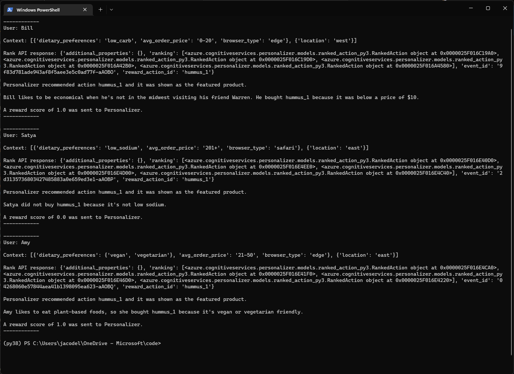

[Reference documentation](/python/api/azure-cognitiveservices-personalizer/azure.cognitiveservices.personalizer) | [Library source code](https://github.com/Azure/azure-sdk-for-python/tree/master/sdk/cognitiveservices/azure-cognitiveservices-personalizer) | [Package (pypi)](https://pypi.org/project/azure-cognitiveservices-personalizer/) | [Quickstart code sample](https://github.com/Azure-Samples/cognitive-services-quickstart-code/tree/master/python/Personalizer)

## Prerequisites

* Azure subscription - [Create one for free](https://azure.microsoft.com/free/cognitive-services)
* [Python 3.x](https://www.python.org/)
* Once your Azure subscription is set up, <a href="https://portal.azure.com/#create/Microsoft.CognitiveServicesPersonalizer"  title="Create a Personalizer resource"  target="_blank">create a Personalizer resource </a> in the Azure portal and obtain your key and endpoint. After it deploys, select **Go to resource**.
    * You'll need the key and endpoint from the created resource to connect your application to the Personalizer API, which you'll paste into the quick-start code below.
    * You can use the free pricing tier (`F0`) to try the service, then upgrade to a paid tier for production at a later time.

## Model configuration

[!INCLUDE [Change model frequency](change-model-frequency.md)]

[!INCLUDE [Change reward wait time](change-reward-wait-time.md)]

## Create a new Python application

Create a new Python file named _personalizer-quickstart.py_.

### Install the client library

Install the Personalizer client library with [pip](https://pypi.org/project/pip/):

```console
pip install azure-cognitiveservices-personalizer
```

## Code block 1: Generate sample data

Personalizer is meant to run on applications that receive and interpret real-time data. For the purpose of this quickstart, you'll use sample code to generate imaginary customer actions on a grocery website. The following code block defines three key functions: **get_actions**, **get_context** and **get_reward_score**.


- **get_actions** returns a list of the choices that the grocery website needs to rank. In this example, the actions are meal products. Each action choice has details (features) that may affect user behavior later on. Actions are used as input for the Rank API

- **get_context** returns a simulated customer visit. It selects randomized details (context features) like which customer is present and what time of day the visit is taking place. In general, a context represents the current state of your application, system, environment, or user. The context object is used as input for the Rank API.

   The context features in this quickstart are simplistic. However, in a real production system, designing your [features](../concepts-features.md) and [evaluating their effectiveness](../how-to-feature-evaluation.md) is very important. Refer to the linked documentation for guidance.

- **get_reward_score** returns a score between zero and one that represents the success of a customer interaction. It uses simple logic to determine how different contexts will respond to different action choices. For example, a certain user will always give a 1.0 for vegetarian and vegan products, and a 0.0 for other products. In a real scenario, Personalizer will learn user preferences from the data sent in Rank and Reward API calls. You won't define these explicitly as in the example code.

    In a real production system, the [reward score](../concept-rewards.md) should be designed to align with your business objectives and KPIs. Determining how to calculate the reward metric may require some experimentation.

    In the code below, the users' preferences and responses to the actions is hard-coded as a series of conditional statements, and explanatory text is included in the code for demonstrative purposes.

Follow these steps to set up the Personalizer script.

1. Find your key and endpoint.

    [!INCLUDE [Personalizer find resource info](find-azure-resource-info.md)]

1. Open _personalizer-quickstart.py_ in a text editor or IDE and paste in the code below.

1. Paste your key and endpoint into the code where indicated. Your endpoint has the form `https://<your_resource_name>.cognitiveservices.azure.com/`.

    > [!IMPORTANT]
    > Remember to remove the key from your code when you're done, and never post it publicly. For production, use a secure method to store and access your credentials like [Azure Key Vault](../../../key-vault/general/overview.md). For more information, see the Azure AI services [security](../../security-features.md).

[!code-python[](~/cognitive-services-quickstart-code/python/Personalizer/quickstart-sdk/personalizer-quickstart.py?name=snippet_1)]


## Code block 2: Iterate the learning loop

The next block of code defines the **run_personalizer_cycle** function and calls it in a simple user feedback loop. It runs a learning loop iteration, in which it generates a context (including a customer), requests a ranking of actions in that context using the Rank API, calculates the reward score, and passes that score back to the Personalizer service using the Reward API. It prints relevant information to the console at each step.

In this example, each Rank call is made to determine which product should be displayed in the "Featured Product" section. Then the Reward call indicates whether or not the featured product was purchased by the user. Rewards are associated with their decisions through a common `EventId` value. 

[!code-python[](~/cognitive-services-quickstart-code/python/Personalizer/quickstart-sdk/personalizer-quickstart.py?name=snippet_2)]


## Run the program

Once all the above code is included in your Python file, you can run it from your application directory.

```console
python personalizer-quickstart.py
```

On the first iteration, Personalizer will recommend a random action, because it hasn't done any training yet. You can optionally run more iterations. After about 10 minutes, the service will start to show improvements in its recommendations.




## Generate many events for analysis (optional)

You can easily generate, say, 5,000 events from this quickstart scenario, which is sufficient to get experience using Apprentice mode, Online mode, running offline evaluations, and creating feature evaluations. Replace the `while` loop in the above code block with the following code.

[!code-python[](~/cognitive-services-quickstart-code/python/Personalizer/quickstart-sdk/personalizer-quickstart.py?name=snippet_multi)]

The source code for this quickstart is available on [GitHub](https://github.com/Azure-Samples/cognitive-services-quickstart-code/tree/master/python/Personalizer).

