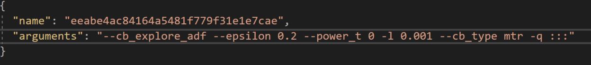
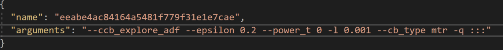

### Upgrade Personalizer instance to Multi-Slot

> [!NOTE]
> Multi-slot personalization (Preview) impacts other functionality of the Personalizer service. This change cannot be undone. Before you enable multi-slot personalization, see [Multi-slot personalization (Preview)](../concept-multi-slot-personalization.md). 

1. Disable Automatic-Optimization
In the Azure portal, in the Personalizer resource, under **Resource Management**, on the **Model and learning settings** page, turn Automatic Optimization off and save.

> [!NOTE]
> Multi-slot personalization will not work unless you disable Automatic Optimization. Automatic Optimization for multi-slot personalization will be supported in the future. 

2. Update Personalizer to multi-slot
In the Azure portal, in the Personalizer resource, under **Resource Management**, on the **Model and learning settings** page, select **Export learning settings**. The **arguments** field in the downloaded json file will start with **--cb_explore_adf**. Change this to **--ccb_explore_adf** and save the file. CB (contextual bandits) and CCB (conditional contextual bandits) are the algorithms Personalizer uses for single-slot and multi-slot personalization, respectively. ADF (action dependent features) means that the actions are expressed / identified with features.

In the same tab in the portal, under **import learning settings** browse to find your recently modified json file and upload it. This will update your Personalizer instance to be a "Multi Slot" Personalizer and will now support multi-slot Rank and Reward calls.

