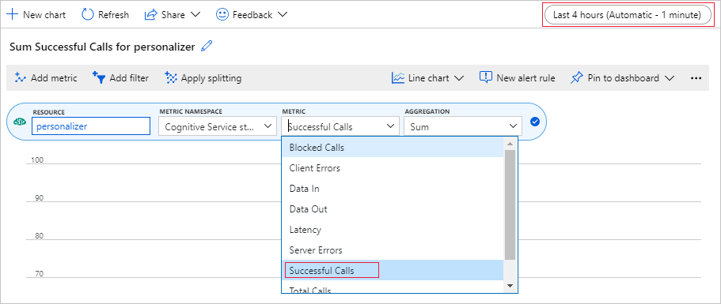
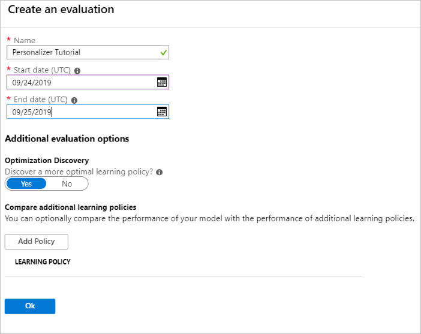

# Tutorial: Use Personalizer in Azure Notebook

This tutorial runs a Personalizer loop in an Azure Notebook, demonstrating the end to end life cycle of a Personalizer loop.

The loop suggests which type of coffee a customer should order. The users and their preferences are stored in a user dataset. Information about the coffee is stored in a coffee dataset.

## Users and coffee

The notebook, simulating user interaction with a website, selects a random user, time of day, and type of weather from the dataset. A summary of the user information is:

|Customers - context features|Times of Day|Types of weather|
|--|--|--|
|Alice<br>Bob<br>Cathy<br>Dave|Morning<br>Afternoon<br>Evening|Sunny<br>Rainy<br>Snowy|

To help Personalizer learn, over time, the _system_ also knows details about the coffee selection for each person.

|Coffee - action features|Types of temperature|Places of origin|Types of roast|Organic|
|--|--|--|--|--|
|Cappacino|Hot|Kenya|Dark|Organic|
|Cold brew|Cold|Brazil|Light|Organic|
|Iced mocha|Cold|Ethiopia|Light|Not organic|
|Latte|Hot|Brazil|Dark|Not organic|

The **purpose** of the Personalizer loop is to find the best match between the users and the coffee as much of the time as possible.

The code for this tutorial is available in the [Personalizer Samples GitHub repository](https://github.com/Azure-Samples/cognitive-services-personalizer-samples/tree/master/samples/azurenotebook).

## How the simulation works

At the beginning of the running system, the suggestions from Personalizer are only successful between 20% to 30%. This success is indicated by the reward sent back to the Personalizer Reward API, with a score of 1. After some Rank and Reward calls, the system improves.

After the initial requests, run an offline evaluation. This allows Personalizer to review the data and suggest a better learning policy. Apply the new learning policy and run the notebook again with 20% of the previous request count. The loop will perform better with the new learning policy.

## Rank and reward calls

For each of the few thousand calls to the Personalizer service, the Azure Notebook sends the **Rank** request to the REST API:

* A unique ID for the Rank/Request event
* Context features - A random choice of the user, weather, and time of day - simulating a user on a website or mobile device
* Actions with Features - _All_ the coffee data - from which Personalizer makes a suggestion

The system receives the request, then compares that prediction with the user's known choice for the same time of day and weather. If the known choice is the same as the predicted choice, the **Reward** of 1 is sent back to Personalizer. Otherwise the reward sent back is 0.

> [!Note]
> This is a simulation so the algorithm for the reward is simple. In a real-world scenario, the algorithm should use business logic, possibly with weights for various aspects of the customer's experience, to determine the reward score.


## Prerequisites

* An [Azure Notebook](https://notebooks.azure.com/) account.
* An [Azure AI Personalizer resource](https://portal.azure.com/#create/Microsoft.CognitiveServicesPersonalizer).
    * If you have already used the Personalizer resource, make sure to [clear the data](how-to-settings.md#clear-data-for-your-learning-loop) in the Azure portal for the resource.
* Upload all the files for [this sample](https://github.com/Azure-Samples/cognitive-services-personalizer-samples/tree/master/samples/azurenotebook) into an Azure Notebook project.

File descriptions:

* [Personalizer.ipynb](https://github.com/Azure-Samples/cognitive-services-personalizer-samples/blob/master/samples/azurenotebook/Personalizer.ipynb) is the Jupyter notebook for this tutorial.
* [User dataset](https://github.com/Azure-Samples/cognitive-services-personalizer-samples/blob/master/samples/azurenotebook/users.json) is stored in a JSON object.
* [Coffee dataset](https://github.com/Azure-Samples/cognitive-services-personalizer-samples/blob/master/samples/azurenotebook/coffee.json) is stored in a JSON object.
* [Example Request JSON](https://github.com/Azure-Samples/cognitive-services-personalizer-samples/blob/master/samples/azurenotebook/example-rankrequest.json) is the expected format for a POST request to the Rank API.

## Configure Personalizer resource

In the Azure portal, configure your [Personalizer resource](https://portal.azure.com/#create/Microsoft.CognitiveServicesPersonalizer) with the **update model frequency** set to 15 seconds and a **reward wait time** of 10 minutes. These values are found on the **[Configuration](how-to-settings.md#configure-service-settings-in-the-azure-portal)** page.

|Setting|Value|
|--|--|
|update model frequency|15 seconds|
|reward wait time|10 minutes|

These values have a very short duration in order to show changes in this tutorial. These values shouldn't be used in a production scenario without validating they achieve your goal with your Personalizer loop.

## Set up the Azure Notebook

1. Change the Kernel to `Python 3.6`.
1. Open the `Personalizer.ipynb` file.

## Run Notebook cells

Run each executable cell and wait for it to return. You know it is done when the brackets next to the cell display a number instead of a `*`. The following sections explain what each cell does programmatically and what to expect for the output.

### Include the Python modules

Include the required Python modules. The cell has no output.

```python
import json
import matplotlib.pyplot as plt
import random
import requests
import time
import uuid
```

### Set Personalizer resource key and name

From the Azure portal, find your key and endpoint on the **Quickstart** page of your Personalizer resource. Change the value of `<your-resource-name>` to your Personalizer resource's name. Change the value of `<your-resource-key>` to your Personalizer key.

```python
# Replace 'personalization_base_url' and 'resource_key' with your valid endpoint values.
personalization_base_url = "https://<your-resource-name>.cognitiveservices.azure.com/"
resource_key = "<your-resource-key>"
```

### Print current date and time
Use this function to note the start and end times of the iterative function, iterations.

These cells have no output. The function does output the current date and time when called.

```python
# Print out current datetime
def currentDateTime():
    currentDT = datetime.datetime.now()
    print (str(currentDT))
```

### Get the last model update time

When the function, `get_last_updated`, is called, the function prints out the last modified date and time that the model was updated.

These cells have no output. The function does output the last model training date when called.

The function uses a GET REST API to [get model properties](https://westus2.dev.cognitive.microsoft.com/docs/services/personalizer-api/operations/GetModelProperties).

```python
# ititialize variable for model's last modified date
modelLastModified = ""
```

```python
def get_last_updated(currentModifiedDate):

    print('-----checking model')

    # get model properties
    response = requests.get(personalization_model_properties_url, headers = headers, params = None)

    print(response)
    print(response.json())

    # get lastModifiedTime
    lastModifiedTime = json.dumps(response.json()["lastModifiedTime"])

    if (currentModifiedDate != lastModifiedTime):
        currentModifiedDate = lastModifiedTime
        print(f'-----model updated: {lastModifiedTime}')
```

### Get policy and service configuration

Validate the state of the service with these two REST calls.

These cells have no output. The function does output the service values when called.

```python
def get_service_settings():

    print('-----checking service settings')

    # get learning policy
    response = requests.get(personalization_model_policy_url, headers = headers, params = None)

    print(response)
    print(response.json())

    # get service settings
    response = requests.get(personalization_service_configuration_url, headers = headers, params = None)

    print(response)
    print(response.json())
```

### Construct URLs and read JSON data files

This cell

* builds the URLs used in REST calls
* sets the security header using your Personalizer resource key
* sets the random seed for the Rank event ID
* reads in the JSON data files
* calls `get_last_updated` method - learning policy has been removed in example output
* calls `get_service_settings` method

The cell has output from the call to `get_last_updated` and `get_service_settings` functions.

```python
# build URLs
personalization_rank_url = personalization_base_url + "personalizer/v1.0/rank"
personalization_reward_url = personalization_base_url + "personalizer/v1.0/events/" #add "{eventId}/reward"
personalization_model_properties_url = personalization_base_url + "personalizer/v1.0/model/properties"
personalization_model_policy_url = personalization_base_url + "personalizer/v1.0/configurations/policy"
personalization_service_configuration_url = personalization_base_url + "personalizer/v1.0/configurations/service"

headers = {'Ocp-Apim-Subscription-Key' : resource_key, 'Content-Type': 'application/json'}

# context
users = "users.json"

# action features
coffee = "coffee.json"

# empty JSON for Rank request
requestpath = "example-rankrequest.json"

# initialize random
random.seed(time.time())

userpref = None
rankactionsjsonobj = None
actionfeaturesobj = None

with open(users) as handle:
    userpref = json.loads(handle.read())

with open(coffee) as handle:
    actionfeaturesobj = json.loads(handle.read())

with open(requestpath) as handle:
    rankactionsjsonobj = json.loads(handle.read())

get_last_updated(modelLastModified)
get_service_settings()

print(f'User count {len(userpref)}')
print(f'Coffee count {len(actionfeaturesobj)}')
```

Verify that the output's `rewardWaitTime` is set to 10 minutes and `modelExportFrequency` is set to 15 seconds.

```console
-----checking model
<Response [200]>
{'creationTime': '0001-01-01T00:00:00+00:00', 'lastModifiedTime': '0001-01-01T00:00:00+00:00'}
-----model updated: "0001-01-01T00:00:00+00:00"
-----checking service settings
<Response [200]>
{...learning policy...}
<Response [200]>
{'rewardWaitTime': '00:10:00', 'defaultReward': 0.0, 'rewardAggregation': 'earliest', 'explorationPercentage': 0.2, 'modelExportFrequency': '00:00:15', 'logRetentionDays': -1}
User count 4
Coffee count 4
```

### Troubleshooting the first REST call

This previous cell is the first cell that calls out to Personalizer. Make sure the REST status code in the output is `<Response [200]>`. If you get an error, such as 404, but you are sure your resource key and name are correct, reload the notebook.

Make sure the count of coffee and users is both 4. If you get an error, check that you uploaded all 3 JSON files.

### Set up metric chart in Azure portal

Later in this tutorial, the long running process of 10,000 requests is visible from the browser with an updating text box. It may be easier to see in a chart or as a total sum, when the long running process ends. To view this information, use the metrics provided with the resource. You can create the chart now that you have completed a request to the service, then refresh the chart periodically while the long running process is going.

1. In the Azure portal, select your Personalizer resource.
1. In the resource navigation, select **Metrics** underneath Monitoring.
1. In the chart, select **Add metric**.
1. The resource and metric namespace are already set. You only need to select the metric of **successful calls** and the aggregation of **sum**.
1. Change the time filter to the last 4 hours.

    

    You should see three successful calls in the chart.

### Generate a unique event ID

This function generates a unique ID for each rank call. The ID is used to identify the rank and reward call information. This value could come from a business process such as a web view ID or transaction ID.

The cell has no output. The function does output the unique ID when called.

```python
def add_event_id(rankjsonobj):
    eventid = uuid.uuid4().hex
    rankjsonobj["eventId"] = eventid
    return eventid
```

### Get random user, weather, and time of day

This function selects a unique user, weather, and time of day, then adds those items to the JSON object to send to the Rank request.

The cell has no output. When the function is called, it returns the random user's name, random weather, and random time of day.

The list of 4 users and their preferences - only some preferences are shown for brevity:

```json
{
  "Alice": {
    "Sunny": {
      "Morning": "Cold brew",
      "Afternoon": "Iced mocha",
      "Evening": "Cold brew"
    }...
  },
  "Bob": {
    "Sunny": {
      "Morning": "Cappucino",
      "Afternoon": "Iced mocha",
      "Evening": "Cold brew"
    }...
  },
  "Cathy": {
    "Sunny": {
      "Morning": "Latte",
      "Afternoon": "Cold brew",
      "Evening": "Cappucino"
    }...
  },
  "Dave": {
    "Sunny": {
      "Morning": "Iced mocha",
      "Afternoon": "Iced mocha",
      "Evening": "Iced mocha"
    }...
  }
}
```

```python
def add_random_user_and_contextfeatures(namesoption, weatheropt, timeofdayopt, rankjsonobj):
    name = namesoption[random.randint(0,3)]
    weather = weatheropt[random.randint(0,2)]
    timeofday = timeofdayopt[random.randint(0,2)]
    rankjsonobj['contextFeatures'] = [{'timeofday': timeofday, 'weather': weather, 'name': name}]
    return [name, weather, timeofday]
```


### Add all coffee data

This function adds the entire list of coffee to the JSON object to send to the Rank request.

The cell has no output. The function does change the `rankjsonobj` when called.


The example of a single coffee's features is:

```json
{
    "id": "Cappucino",
    "features": [
    {
        "type": "hot",
        "origin": "kenya",
        "organic": "yes",
        "roast": "dark"

    }
}
```

```python
def add_action_features(rankjsonobj):
    rankjsonobj["actions"] = actionfeaturesobj
```

### Compare prediction with known user preference

This function is called after the Rank API is called, for each iteration.

This function compares the user's preference for coffee, based on weather and time of day, with the Personalizer's suggestion for the user for those filters. If the suggestion matches, a score of 1 is returned, otherwise the score is 0. The cell has no output. The function does output the score when called.

```python
def get_reward_from_simulated_data(name, weather, timeofday, prediction):
    if(userpref[name][weather][timeofday] == str(prediction)):
        return 1
    return 0
```

### Loop through calls to Rank and Reward

The next cell is the _main_ work of the Notebook, getting a random user, getting the coffee list, sending both to the Rank API. Comparing the prediction with the user's known preferences, then sending the reward back to the Personalizer service.

The loop runs for `num_requests` times. Personalizer needs a few thousand calls to Rank and Reward to create a model.

An example of the JSON sent to the Rank API follows. The list of coffee is not complete, for brevity. You can see the entire JSON for coffee in `coffee.json`.

JSON sent to the Rank API:

```json
{
   'contextFeatures':[
      {
         'timeofday':'Evening',
         'weather':'Snowy',
         'name':'Alice'
      }
   ],
   'actions':[
      {
         'id':'Cappucino',
         'features':[
            {
               'type':'hot',
               'origin':'kenya',
               'organic':'yes',
               'roast':'dark'
            }
         ]
      }
        ...rest of coffee list
   ],
   'excludedActions':[

   ],
   'eventId':'b5c4ef3e8c434f358382b04be8963f62',
   'deferActivation':False
}
```

JSON response from the Rank API:

```json
{
    'ranking': [
        {'id': 'Latte', 'probability': 0.85 },
        {'id': 'Iced mocha', 'probability': 0.05 },
        {'id': 'Cappucino', 'probability': 0.05 },
        {'id': 'Cold brew', 'probability': 0.05 }
    ],
    'eventId': '5001bcfe3bb542a1a238e6d18d57f2d2',
    'rewardActionId': 'Latte'
}
```

Finally, each loop shows the random selection of user, weather, time of day, and determined reward. The reward of 1 indicates the Personalizer resource selected the correct coffee type for the given user, weather, and time of day.

```console
1 Alice Rainy Morning Latte 1
```

The function uses:

* Rank: a POST REST API to [get rank](https://westus2.dev.cognitive.microsoft.com/docs/services/personalizer-api/operations/Rank).
* Reward: a POST REST API to [report reward](https://westus2.dev.cognitive.microsoft.com/docs/services/personalizer-api/operations/Reward).

```python
def iterations(n, modelCheck, jsonFormat):

    i = 1

    # default reward value - assumes failed prediction
    reward = 0

    # Print out dateTime
    currentDateTime()

    # collect results to aggregate in graph
    total = 0
    rewards = []
    count = []

    # default list of user, weather, time of day
    namesopt = ['Alice', 'Bob', 'Cathy', 'Dave']
    weatheropt = ['Sunny', 'Rainy', 'Snowy']
    timeofdayopt = ['Morning', 'Afternoon', 'Evening']


    while(i <= n):

        # create unique id to associate with an event
        eventid = add_event_id(jsonFormat)

        # generate a random sample
        [name, weather, timeofday] = add_random_user_and_contextfeatures(namesopt, weatheropt, timeofdayopt, jsonFormat)

        # add action features to rank
        add_action_features(jsonFormat)

        # show JSON to send to Rank
        print('To: ', jsonFormat)

        # choose an action - get prediction from Personalizer
        response = requests.post(personalization_rank_url, headers = headers, params = None, json = jsonFormat)

        # show Rank prediction
        print ('From: ',response.json())

        # compare personalization service recommendation with the simulated data to generate a reward value
        prediction = json.dumps(response.json()["rewardActionId"]).replace('"','')
        reward = get_reward_from_simulated_data(name, weather, timeofday, prediction)

        # show result for iteration
        print(f'   {i} {currentDateTime()} {name} {weather} {timeofday} {prediction} {reward}')

        # send the reward to the service
        response = requests.post(personalization_reward_url + eventid + "/reward", headers = headers, params= None, json = { "value" : reward })

        # for every N rank requests, compute total correct  total
         total =  total + reward

        # every N iteration, get last updated model date and time
        if(i % modelCheck == 0):

            print("**** 10% of loop found")

            get_last_updated(modelLastModified)

        # aggregate so chart is easier to read
        if(i % 10 == 0):
            rewards.append( total)
            count.append(i)
             total = 0

        i = i + 1

    # Print out dateTime
    currentDateTime()

    return [count, rewards]
```

## Run for 10,000 iterations
Run the Personalizer loop for 10,000 iterations. This is a long running event. Do not close the browser running the notebook. Refresh the metrics chart in the Azure portal periodically to see the total calls to the service. When you have around 20,000 calls, a rank and reward call for each iteration of the loop, the iterations are done.

```python
# max iterations
num_requests = 200

# check last mod date N% of time - currently 10%
lastModCheck = int(num_requests * .10)

jsonTemplate = rankactionsjsonobj

# main iterations
[count, rewards] = iterations(num_requests, lastModCheck, jsonTemplate)
```


## Chart results to see improvement

Create a chart from the `count` and `rewards`.

```python
def createChart(x, y):
    plt.plot(x, y)
    plt.xlabel("Batch of rank events")
    plt.ylabel("Correct recommendations per batch")
    plt.show()
```

## Run chart for 10,000 rank requests

Run the `createChart` function.

```python
createChart(count,rewards)
```

## Reading the chart

This chart shows the success of the model for the current default learning policy.


The ideal target that by the end of the test, the loop is averaging a success rate that is close to 100 percent minus the exploration. The default value of exploration is 20%.

`100-20=80`

This exploration value is found in the Azure portal, for the Personalizer resource, on the **Configuration** page.

In order to find a better learning policy, based on your data to the Rank API, run an [offline evaluation](how-to-offline-evaluation.md) in the portal for your Personalizer loop.

## Run an offline evaluation

1. In the Azure portal, open the Personalizer resource's **Evaluations** page.
1. Select **Create Evaluation**.
1. Enter the required data of evaluation name, and date range for the loop evaluation. The date range should include only the days you are focusing on for your evaluation.
    

    The purpose of running this offline evaluation is to determine if there is a better learning policy for the features and actions used in this loop. To find that better learning policy, make sure **Optimization Discovery** is turned on.

1. Select **OK** to begin the evaluation.
1. This **Evaluations** page lists the new evaluation and its current status. Depending on how much data you have, this evaluation can take some time. You can come back to this page after a few minutes to see the results.
1. When the evaluation is completed, select the evaluation then select **Comparison of different learning policies**. This shows the available learning policies and how they would behave with the data.
1. Select the top-most learning policy in the table and select **Apply**. This applies the _best_ learning policy to your model and retrains.

## Change update model frequency to 5 minutes

1. In the Azure portal, still on the Personalizer resource, select the **Configuration** page.
1. Change the **model update frequency** and **reward wait time** to 5 minutes and select **Save**.

Learn more about the [reward wait time](concept-rewards.md#reward-wait-time) and [model update frequency](how-to-settings.md#model-update-frequency).

```python
#Verify new learning policy and times
get_service_settings()
```

Verify that the output's `rewardWaitTime` and `modelExportFrequency` are both set to 5 minutes.
```console
-----checking model
<Response [200]>
{'creationTime': '0001-01-01T00:00:00+00:00', 'lastModifiedTime': '0001-01-01T00:00:00+00:00'}
-----model updated: "0001-01-01T00:00:00+00:00"
-----checking service settings
<Response [200]>
{...learning policy...}
<Response [200]>
{'rewardWaitTime': '00:05:00', 'defaultReward': 0.0, 'rewardAggregation': 'earliest', 'explorationPercentage': 0.2, 'modelExportFrequency': '00:05:00', 'logRetentionDays': -1}
User count 4
Coffee count 4
```

## Validate new learning policy

Return to the Azure Notebooks file and continue by running the same loop, but for only 2,000 iterations. Refresh the metrics chart in the Azure portal periodically to see the total calls to the service. When you have around 4,000 calls, a rank and reward call for each iteration of the loop, the iterations are done.

```python
# max iterations
num_requests = 2000

# check last mod date N% of time - currently 10%
lastModCheck2 = int(num_requests * .10)

jsonTemplate2 = rankactionsjsonobj

# main iterations
[count2, rewards2] = iterations(num_requests, lastModCheck2, jsonTemplate)
```

## Run chart for 2,000 rank requests

Run the `createChart` function.

```python
createChart(count2,rewards2)
```

## Review the second chart

The second chart should show a visible increase in Rank predictions aligning with user preferences.


## Clean up resources

If you do not intend to continue the tutorial series, clean up the following resources:

* Delete your Azure Notebook project.
* Delete your Personalizer resource.

## Next steps

The [Jupyter notebook and data files](https://github.com/Azure-Samples/cognitive-services-personalizer-samples/tree/master/samples/azurenotebook) used in this sample are available on the GitHub repo for Personalizer.
