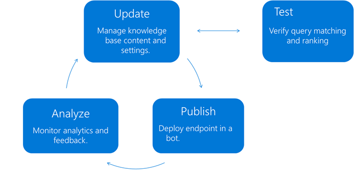

# Knowledge base lifecycle in QnA Maker
QnA Maker learns best in an iterative cycle of model changes, utterance examples, publishing, and gathering data from endpoint queries.



[!INCLUDE [Custom question answering](../includes/new-version.md)]

## Creating a QnA Maker knowledge base
QnA Maker knowledge base (KB) endpoint provides a best-match answer to a user query based on the content of the KB. Creating a knowledge base is a one-time action to setting up a content repository of questions, answers, and associated metadata. A KB can be created by crawling pre-existing content such the following sources:

- FAQ pages
- Product manuals
- Q-A pairs

Learn how to [create a knowledge base](../quickstarts/create-publish-knowledge-base.md).

## Testing and updating the knowledge base

The knowledge base is ready for testing once it is populated with content, either editorially or through automatic extraction. Interactive testing can be done in the QnA Maker portal, through the **Test** panel. You enter common user queries. Then you verify that the responses returned with both the correct response and a sufficient confidence score.


* **To fix low confidence scores**: add alternate questions.
* **When a query incorrectly returns the [default response](../How-to/change-default-answer.md)**: add new answers to the correct question.

This tight loop of test-update continues until you are satisfied with the results. Learn how to [test your knowledge base](../how-to/test-knowledge-base.md).

For large KBs, use automated testing with the [generateAnswer API](../how-to/metadata-generateanswer-usage.md#get-answer-predictions-with-the-generateanswer-api) and the `isTest` body property, which queries the `test` knowledge base instead of the published knowledge base.

```json
{
  "question": "example question",
  "top": 3,
  "userId": "Default",
  "isTest": true
}
```

## Publish the knowledge base
Once you are done testing the knowledge base, you can publish it. Publish pushes the latest version of the tested knowledge base  to a dedicated Azure Cognitive Search index representing the **published** knowledge base. It also creates an endpoint that can be called in your application or chat bot.

Due to the publish action, any further changes made to the test version of the knowledge base leave the published version unaffected. The published version might be live in a production application.

Each of these knowledge bases can be targeted for testing separately. Using the APIs, you can target the test version of the knowledge base with `isTest` body property in the generateAnswer call.

Learn how to [publish your knowledge base](../quickstarts/create-publish-knowledge-base.md#publish-the-knowledge-base).

## Monitor usage
To be able to log the chat logs of your service, you would need to enable Application Insights when you [create your QnA Maker service](../how-to/set-up-qnamaker-service-azure.md).

You can get various analytics of your service usage. Learn more about how to use application insights to get [analytics for your QnA Maker service](../how-to/get-analytics-knowledge-base.md).

Based on what you learn from your analytics, make appropriate [updates to your knowledge base](../how-to/edit-knowledge-base.md).

## Version control for data in your knowledge base

Version control for data is provided through the import/export features on the **Settings** page in the QnA Maker portal.

You can back up a knowledge base by exporting the knowledge base, in either `.tsv` or `.xls` format. Once exported, include this file as part of your regular source control check.

When you need to go back to a specific version, you need to import that file from your local system. An exported knowledge base **must** only be used via import on the **Settings** page. It can't be used as a file or URL document data source. This will replace questions and answers currently in the knowledge base with the contents of the imported file.

## Test and production knowledge base
A knowledge base is the repository of questions and answer sets created, maintained, and used through QnA Maker. Each QnA Maker resource can hold multiple knowledge bases.

A knowledge base has two states: *test* and *published*.

### Test knowledge base

The *test knowledge base* is the version currently edited and saved. The test version has been tested for accuracy, and for completeness of responses. Changes made to the test knowledge base don't affect the end user of your application or chat bot. The test knowledge base is known as `test` in the HTTP request. The `test` knowledge is available with the QnA Maker's portal interactive **Test** pane.

### Production knowledge base

The *published knowledge base* is the version that's used in your chat bot or application. Publishing a knowledge base puts the content of its test version into its published version. The published knowledge base is the version that the application uses through the endpoint. Make sure that the content is correct and well tested. The published knowledge base is known as `prod` in the HTTP request.


## Next steps

> [!div class="nextstepaction"]
> [Active learning suggestions](../index.yml)
