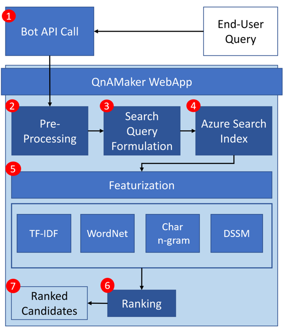

# Query the knowledge base for answers

A knowledge base must be published. Once published, the knowledge base is queried at the runtime prediction endpoint using the generateAnswer API. The query includes the question text, and other settings, to help QnA Maker select the best possible match to an answer.

[!INCLUDE [Custom question answering](../includes/new-version.md)]

## How QnA Maker processes a user query to select the best answer

The trained and [published](../quickstarts/create-publish-knowledge-base.md#publish-the-knowledge-base) QnA Maker knowledge base receives a user query, from a bot or other client application, at the [GenerateAnswer API](../how-to/metadata-generateanswer-usage.md). The following diagram illustrates the process when the user query is received.



### Ranker process

The process is explained in the following table.

|Step|Purpose|
|--|--|
|1|The client application sends the user query to the [GenerateAnswer API](../how-to/metadata-generateanswer-usage.md).|
|2|QnA Maker preprocesses the user query with language detection, spellers, and word breakers.|
|3|This preprocessing is taken to alter the user query for the best search results.|
|4|This altered query is sent to an Azure Cognitive Search Index, which receives the `top` number of results. If the correct answer isn't in these results, increase the value of `top` slightly. Generally, a value of 10 for `top` works in 90% of queries. Azure search filters [stop words](https://github.com/Azure-Samples/azure-search-sample-data/blob/master/STOPWORDS.md) in this step.|
|5|QnA Maker uses syntactic and semantic based featurization to determine the similarity between the user query and the fetched QnA results.|
|6|The machine-learned ranker model uses the different features, from step 5, to determine the confidence scores and the new ranking order.|
|7|The new results are returned to the client application in ranked order.|
|||

Features used include but aren't limited to word-level semantics, term-level importance in a corpus, and deep learned semantic models to determine similarity and relevance between two text strings.

## HTTP request and response with endpoint

When you publish your knowledge base, the service creates a REST-based HTTP endpoint that can be integrated into your application, commonly a chat bot.

### The user query request to generate an answer

A user query is the question that the end user asks of the knowledge base, such as `How do I add a collaborator to my app?`. The query is often in a natural language format or a few keywords that represent the question, such as `help with collaborators`. The query is sent to your knowledge base from an HTTP request in your client application.

```json
{
    "question": "How do I add a collaborator to my app?",
    "top": 6,
    "isTest": true,
    "scoreThreshold": 20,
    "strictFilters": [
    {
        "name": "QuestionType",
        "value": "Support"
    }],
    "userId": "sd53lsY="
}
```

You control the response by setting properties such as [scoreThreshold](./confidence-score.md#choose-a-score-threshold), [top](../how-to/improve-knowledge-base.md#use-the-top-property-in-the-generateanswer-request-to-get-several-matching-answers), and [strictFilters](../how-to/query-knowledge-base-with-metadata.md).

Use [conversation context](../how-to/query-knowledge-base-with-metadata.md) with [multi-turn functionality](../how-to/multi-turn.md) to keep the conversation going to refine the questions and answers, to find the correct and final answer.

### The response from a call to generate an answer

The HTTP response is the answer retrieved from the knowledge base, based on the best match for a given user query. The response includes the answer and the prediction score. If you asked for more than one top answer with the `top` property, you get more than one top answer, each with a score.

```json
{
    "answers": [
        {
            "questions": [
                "How do I add a collaborator to my app?",
                "What access control is provided for the app?",
                "How do I find user management and security?"
            ],
            "answer": "Use the Azure portal to add a collaborator using Access Control (IAM)",
            "score": 100,
            "id": 1,
            "source": "Editorial",
            "metadata": [
                {
                    "name": "QuestionType",
                    "value": "Support"
                },
                {
                    "name": "ToolDependency",
                    "value": "Azure Portal"
                }
            ]
        }
    ]
}
```

## Next steps

> [!div class="nextstepaction"]
> [Confidence score](./confidence-score.md)
