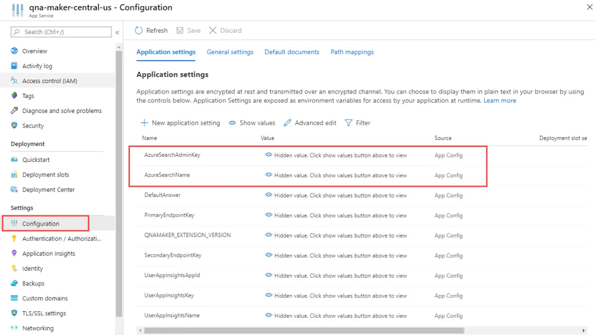
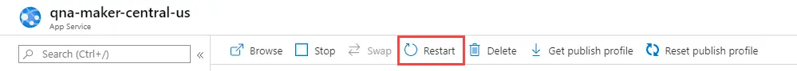
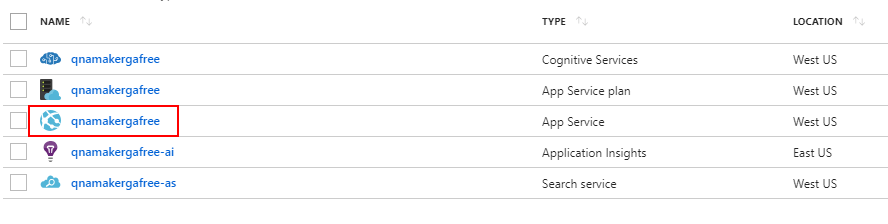
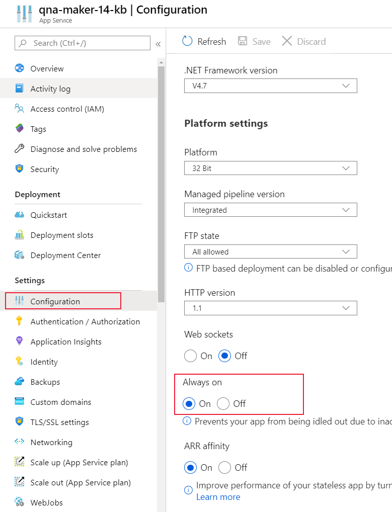

# Configure QnA Maker resources

The user can configure QnA Maker to use a different Cognitive search resource. They can also configure App service settings if they are using QnA Maker GA.

[!INCLUDE [Custom question answering](../includes/new-version.md)]

## Configure QnA Maker to use different Cognitive Search resource

> [!NOTE]
> If you change the Azure Search service associated with QnA Maker, you will lose access to all the knowledge bases already present in it. Make sure you export the existing knowledge bases before you change the Azure Search service.

If you create a QnA service and its dependencies (such as Search) through the portal, a Search service is created for you and linked to the QnA Maker service. After these resources are created, you can update the App Service setting to use a previously existing Search service and remove the one you just created.

QnA Maker's **App Service** resource uses the Cognitive Search resource. In order to change the Cognitive Search resource used by QnA Maker, you need to change the setting in the Azure portal.

1. Get the **Admin key** and **Name** of the Cognitive Search resource you want QnA Maker to use.

1. Sign in to the [Azure portal](https://portal.azure.com) and find the **App Service** associated with your QnA Maker resource. Both with have the same name.

1. Select **Settings**, then **Configuration**. This will display all existing settings for the QnA Maker's App Service.

    > [!div class="mx-imgBorder"]
    > 

1. Change the values for the following keys:

    * **AzureSearchAdminKey**
    * **AzureSearchName**

1. To use the new settings, you need to restart the App service. Select **Overview**, then select **Restart**.

    > [!div class="mx-imgBorder"]
    > 

If you create a QnA service through Azure Resource Manager templates, you can create all resources and control the App Service creation to use an existing Search service.

Learn more about how to configure the App Service [Application settings](../../../app-service/configure-common.md#configure-app-settings).

## Get the latest runtime updates

The QnAMaker runtime is part of the Azure App Service instance that's deployed when you [create a QnAMaker service](./set-up-qnamaker-service-azure.md) in the Azure portal. Updates are made periodically to the runtime. The QnA Maker App Service instance is in auto-update mode after the April 2019 site extension release (version 5+). This update is designed to take care of ZERO downtime during upgrades.

You can check your current version at https://www.qnamaker.ai/UserSettings. If your version is older than version 5.x, you must restart App Service to apply the latest updates:

1. Go to your QnAMaker service (resource group) in the [Azure portal](https://portal.azure.com).

    > [!div class="mx-imgBorder"]
    > 

1. Select the App Service instance and open the **Overview** section.

    > [!div class="mx-imgBorder"]
    > 

1. Restart App Service. The update process should finish in a couple of seconds. Any dependent applications or bots that use this QnAMaker service will be unavailable to end users during this restart period.

    

## Configure App service idle setting to avoid timeout

The app service, which serves the QnA Maker prediction runtime for a published knowledge base, has an idle timeout configuration, which defaults to automatically time out if the service is idle. For QnA Maker, this means your prediction runtime generateAnswer API occasionally times out after periods of no traffic.

In order to keep the prediction endpoint app loaded even when there is no traffic, set the idle to always on.

1. Sign in to the [Azure portal](https://portal.azure.com).
1. Search for and select your QnA Maker resource's app service. It will have the same name as the QnA Maker resource but it will have a different **type** of App Service.
1. Find **Settings** then select **Configuration**.
1. On the Configuration pane, select **General settings**, then find **Always on**, and select **On** as the value.

    > [!div class="mx-imgBorder"]
    > 

1. Select **Save** to save the configuration.
1. You are asked if you want to restart the app to use the new setting. Select **Continue**.

Learn more about how to configure the App Service [General settings](../../../app-service/configure-common.md#configure-general-settings).

## Business continuity with traffic manager

The primary objective of the business continuity plan is to create a resilient knowledge base endpoint, which would ensure no down time for the Bot or the application consuming it.

> [!div class="mx-imgBorder"]
> 

The high-level idea as represented above is as follows:

1. Set up two parallel [QnA Maker services](set-up-qnamaker-service-azure.md) in [Azure paired regions](../../../availability-zones/cross-region-replication-azure.md).

1. [Backup](../../../app-service/manage-backup.md) your primary QnA Maker App service and [restore](../../../app-service/manage-backup.md) it in the secondary setup. This will ensure that both setups work with the same hostname and keys.

1. Keep the primary and secondary Azure search indexes in sync. Use the GitHub sample [here](https://github.com/pchoudhari/QnAMakerBackupRestore) to see how to backup-restore Azure indexes.

1. Back up the Application Insights using [continuous export](/previous-versions/azure/azure-monitor/app/export-telemetry).

1. Once the primary and secondary stacks have been set up, use [traffic manager](../../../traffic-manager/traffic-manager-overview.md) to configure the two endpoints and set up a routing method.

1. You would need to create a Transport Layer Security (TLS), previously known as Secure Sockets Layer (SSL), certificate for your traffic manager endpoint. [Bind the TLS/SSL certificate](../../../app-service/configure-ssl-bindings.md) in your App services.

1. Finally, use the traffic manager endpoint in your Bot or App.
