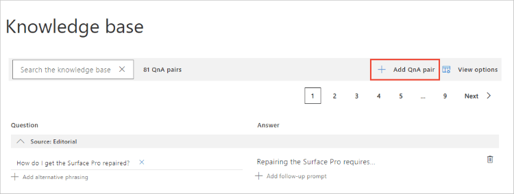
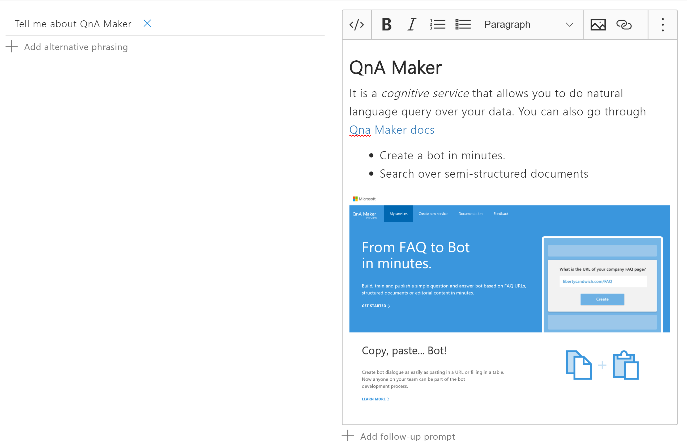
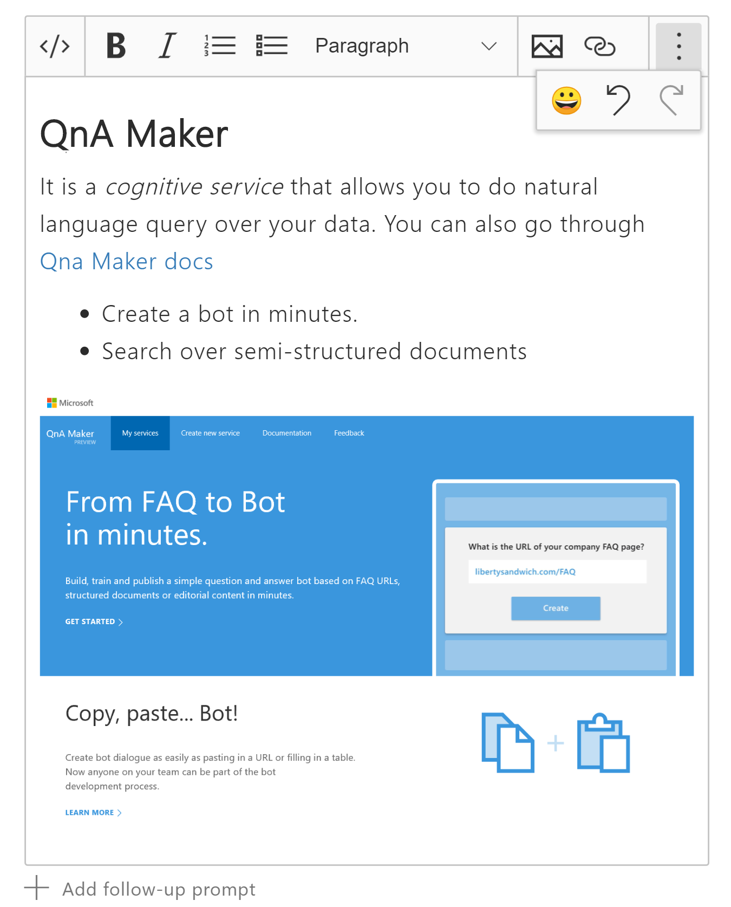
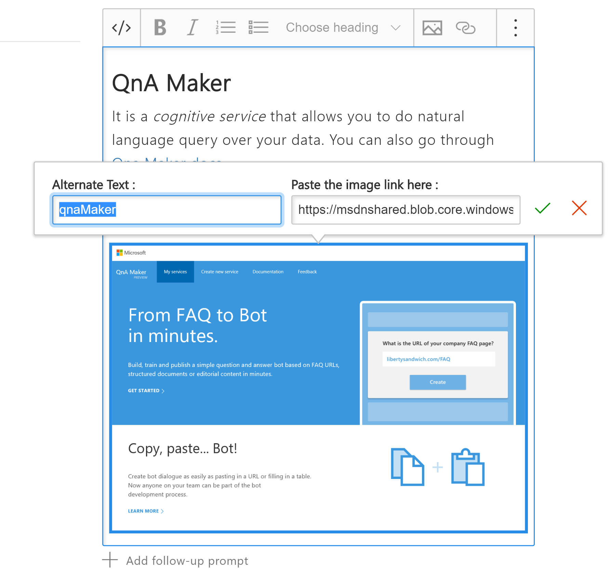
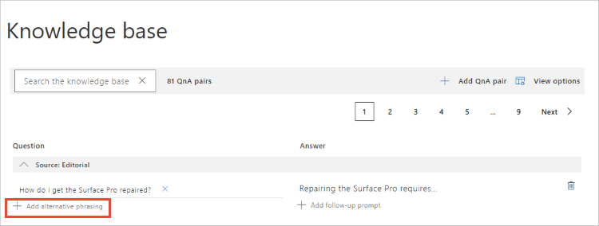

# Edit QnA pairs in your knowledge base

QnA Maker allows you to manage the content of your knowledge base by providing an easy-to-use editing experience.

QnA pairs are added from a datasource, such as a file or URL, or added as an editorial source. An editorial source indicates the QnA pair was added in the QnA portal manually. All QnA pairs are available for editing.

[!INCLUDE [Custom question answering](../includes/new-version.md)]

## Question and answer pairs

A knowledge base consists of question and answer (QnA) pairs.  Each pair has one answer and a pair contains all the information associated with that _answer_. An answer can loosely resemble a database row or a data structure instance. The **required** settings in a question-and-answer (QnA) pair are:

* a **question** - text of user query, used to QnA Maker's machine-learning, to align with text of user's question with different wording but the same answer
* the **answer** - the pair's answer is the response that's returned when a user query is matched with the associated question

Each pair is represented by an **ID**.

The **optional** settings for a pair include:

* **Alternate forms of the question** - this helps QnA Maker return the correct answer for a wider variety of question phrasings
* **Metadata**: Metadata are tags associated with a QnA pair and are represented as key-value pairs. Metadata tags are used to filter QnA pairs and limit the set over which query matching is performed.
* **Multi-turn prompts**, used to continue a multi-turn conversation

## Add an editorial QnA pair

If you do not have pre-existing content to populate the knowledge base, you can add QnA pairs editorially in the QnA Maker portal.

1. Sign in to the [QnA portal](https://www.qnamaker.ai/), then select the knowledge base to add the QnA pair to.
1. On the **EDIT** page of the knowledge base, select **Add QnA pair** to add a new QnA pair.

    > [!div class="mx-imgBorder"]
    > 

1. In the new QnA pair row, add the required question and answer fields. The other fields are optional. All fields can be changed at any time.

1. Optionally, add **[alternate phrasing](../quickstarts/add-question-metadata-portal.md#add-additional-alternatively-phrased-questions)**. Alternate phrasing is any form of the question that is significantly different from the original question but should provide the same answer.

    When your knowledge base is published, and you have [active learning](use-active-learning.md) turned on, QnA Maker collects alternate phrasing choices for you to accept. These choices are selected in order to increase the prediction accuracy.

1. Optionally, add **[metadata](../quickstarts/add-question-metadata-portal.md#add-metadata-to-filter-the-answers)**. To view metadata, select **View options** in the context menu. Metadata provides filters to the answers that the client application, such as a chat bot, provides.

1. Optionally, add **[follow-up prompts](multi-turn.md)**. Follow-up prompts provide additional conversation paths to the client application to present to the user.

1. Select **Save and train** to see predictions including the new QnA pair.

## Rich-text editing for answer

Rich-text editing of your answer text gives you markdown styling from a simple toolbar.

1. Select the text area for an answer, the rich-text editor toolbar displays on the QnA pair row.

    > [!div class="mx-imgBorder"]
    > 

    Any text already in the answer displays correctly as your user will see it from a bot.

1. Edit the text. Select formatting features from the rich-text editing toolbar or use the toggle feature to switch to markdown syntax.

    > [!div class="mx-imgBorder"]
    > 

    |Rich-text editor features|Keyboard shortcut|
    |--|--|
    |Toggle between rich-text editor and markdown. `</>`|CTRL+M|
    |Bold. **B**|CTR+LB|
    |Italics, indicated with an italicized **_I_**|CTRL+I|
    |Unordered list||
    |Ordered list||
    |Paragraph style||
    |Image - add an image available from a public URL.|CTRL+G|
    |Add link to publicly available URL.|CTRL+K|
    |Emoticon - add from a selection of emoticons.|CTRL+E|
    |Advanced menu - undo|CTRL+Z|
    |Advanced menu - redo|CTRL+Y|

1. Add an image to the answer using the Image icon in the rich-text toolbar. The in-place editor needs the publicly accessible image URL and the alternate text for the image.

    > [!div class="mx-imgBorder"]
    > 

1. Add a link to a URL by either selecting the text in the answer, then selecting the Link icon in the toolbar or by selecting the Link icon in the toolbar then entering new text and the URL.

    > [!div class="mx-imgBorder"]
    > 

## Edit a QnA pair

Any field in any QnA pair can be edited, regardless of the original data source. Some fields may not be visible due to your current **View Options** settings, found in the context tool bar.

## Delete a QnA pair

To delete a QnA, click the **delete** icon on the far right of the QnA row. This is a permanent operation. It can't be undone. Consider exporting your KB from the **Publish** page before deleting pairs.

## Find the QnA pair ID

If you need to find the QnA pair ID, you can find it in two places:

* Hover on the delete icon on the QnA pair row you are interested in. The hover text includes the QnA pair ID.
* Export the knowledge base. Each QnA pair in the knowledge base includes the QnA pair ID.

## Add alternate questions

Add alternate questions to an existing QnA pair to improve the likelihood of a match to a user query.

## Linking QnA pairs

Linking QnA pairs is provided with [follow-up prompts](multi-turn.md). This is a logical connection between QnA pairs, managed at the knowledge base level. You can edit follow-up prompts in the QnA Maker portal.

You can't link QnA pairs in the answer's metadata.

## Add metadata

Add metadata pairs by first selecting **View options**, then selecting **Show metadata**. This displays the metadata column. Next, select the **+** sign to add a metadata pair. This pair consists of one key and one value.

Learn more about metadata in the QnA Maker portal quickstart for metadata:
* [Authoring - add metadata to QnA pair](../quickstarts/add-question-metadata-portal.md#add-metadata-to-filter-the-answers)
* [Query prediction - filter answers by metadata](../quickstarts/get-answer-from-knowledge-base-using-url-tool.md)

## Save changes to the QnA pairs

Periodically select **Save and train** after making edits to avoid losing changes.

## When to use rich-text editing versus markdown

[Rich-text editing](#add-an-editorial-qna-set) of answers allows you, as the author, to use a formatting toolbar to quickly select and format text.

[Markdown](../reference-markdown-format.md) is a better tool when you need to autogenerate content to create knowledge bases to be imported as part of a CI/CD pipeline or for [batch testing](../index.yml).

## Editing your knowledge base locally

Once a knowledge base is created, it is recommended that you make edits to the knowledge base text in the [QnA Maker portal](https://qnamaker.ai), rather than exporting and reimporting through local files. However, there may be times that you need to edit a knowledge base locally.

Export the knowledge base from the **Settings** page, then edit the knowledge base with Microsoft Excel. If you choose to use another application to edit your exported file, the application may introduce syntax errors because it is not fully TSV compliant. Microsoft Excel's TSV files generally don't introduce any formatting errors.

Once you are done with your edits, reimport the TSV file from the **Settings** page. This will completely replace the current knowledge base with the imported knowledge base.

## Next steps

> [!div class="nextstepaction"]
> [Collaborate on a knowledge base](../index.yml)

* [Manage Azure resources used by QnA Maker](set-up-qnamaker-service-azure.md)
