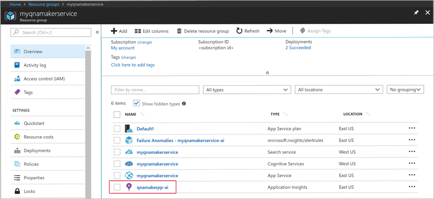

# Get analytics on your knowledge base

QnA Maker stores all chat logs and other telemetry, if you have enabled Application Insights during the [creation of your QnA Maker service](./set-up-qnamaker-service-azure.md). Run the sample queries to get your chat logs from Application Insights.

[!INCLUDE [Custom question answering](../includes/new-version.md)]

1. Go to your Application Insights resource.

    

2. Select **Log (Analytics)**. A new window opens where you can query QnA Maker telemetry.

3. Paste in the following query and run it.

    ```kusto
    requests
    | where url endswith "generateAnswer"
    | project timestamp, id, url, resultCode, duration, performanceBucket
    | parse kind = regex url with *"(?i)knowledgebases/"KbId"/generateAnswer"
    | join kind= inner (
    traces | extend id = operation_ParentId
    ) on id
    | where message == "QnAMaker GenerateAnswer"
    | extend question = tostring(customDimensions['Question'])
    | extend answer = tostring(customDimensions['Answer'])
    | extend score = tostring(customDimensions['Score'])
    | project timestamp, resultCode, duration, id, question, answer, score, performanceBucket,KbId
    ```

    Select **Run** to run the query.

    [](../media/qnamaker-how-to-analytics-kb/run-query.png#lightbox)

## Run queries for other analytics on your QnA Maker knowledge base

### Total 90-day traffic

```kusto
//Total Traffic
requests
| where url endswith "generateAnswer" and name startswith "POST"
| parse kind = regex url with *"(?i)knowledgebases/"KbId"/generateAnswer"
| summarize ChatCount=count() by bin(timestamp, 1d), KbId
```

### Total question traffic in a given time period

```kusto
//Total Question Traffic in a given time period
let startDate = todatetime('2019-01-01');
let endDate = todatetime('2020-12-31');
requests
| where timestamp <= endDate and timestamp >=startDate
| where url endswith "generateAnswer" and name startswith "POST"
| parse kind = regex url with *"(?i)knowledgebases/"KbId"/generateAnswer"
| summarize ChatCount=count() by KbId
```

### User traffic

```kusto
//User Traffic
requests
| where url endswith "generateAnswer"
| project timestamp, id, url, resultCode, duration
| parse kind = regex url with *"(?i)knowledgebases/"KbId"/generateAnswer"
| join kind= inner (
traces | extend id = operation_ParentId
) on id
| extend UserId = tostring(customDimensions['UserId'])
| summarize ChatCount=count() by bin(timestamp, 1d), UserId, KbId
```

### Latency distribution of questions

```kusto
//Latency distribution of questions
requests
| where url endswith "generateAnswer" and name startswith "POST"
| parse kind = regex url with *"(?i)knowledgebases/"KbId"/generateAnswer"
| project timestamp, id, name, resultCode, performanceBucket, KbId
| summarize count() by performanceBucket, KbId
```

### Unanswered questions

```kusto
// Unanswered questions
requests
| where url endswith "generateAnswer"
| project timestamp, id, url
| parse kind = regex url with *"(?i)knowledgebases/"KbId"/generateAnswer"
| join kind= inner (
traces | extend id = operation_ParentId
) on id
| extend question = tostring(customDimensions['Question'])
| extend answer = tostring(customDimensions['Answer'])
| extend score = tostring(customDimensions['Score'])
| where  score  == "0" and message == "QnAMaker GenerateAnswer"
| project timestamp, KbId, question, answer, score
| order  by timestamp  desc
```

> **NOTE**   
> If you cannot get properly the log by using Application Insight, please confirm the Application Insights settings on the App Service resource.
> Open App Service resource and go to Application Insights. And then please check whether it is Enabled or Disabled. If it is disabled, please enable it and then apply there.

## Next steps

> [!div class="nextstepaction"]
> [Choose capactiy](./improve-knowledge-base.md)
