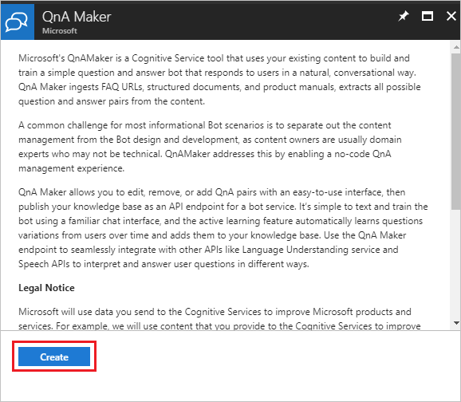
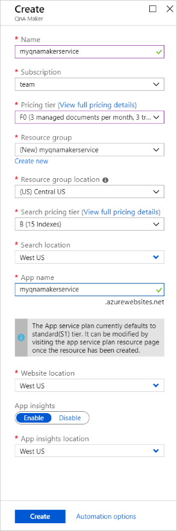
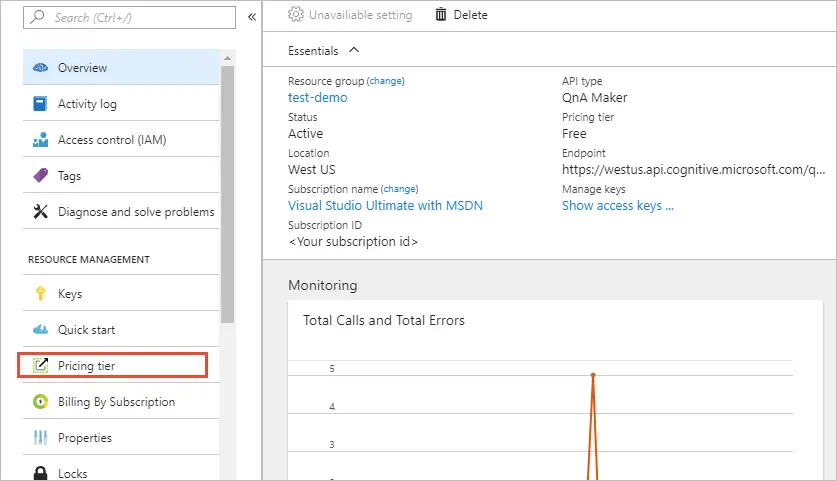
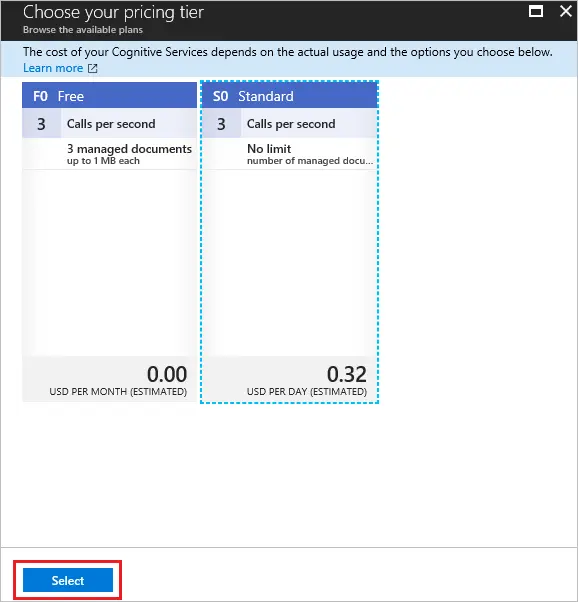
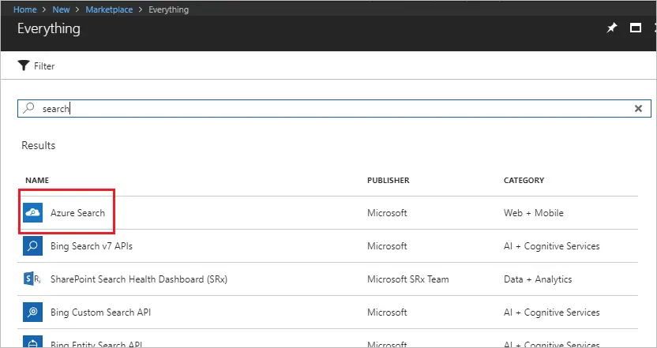
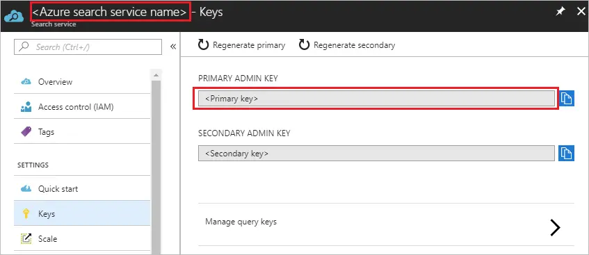
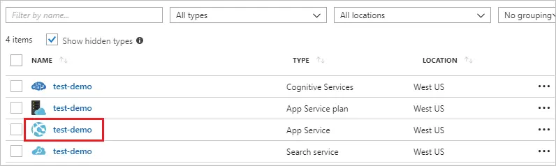
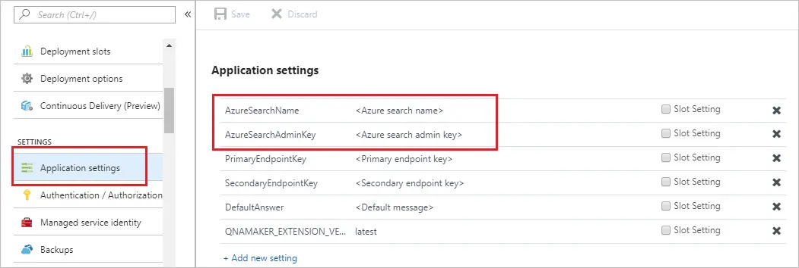

# Manage QnA Maker resources

Before you can create any QnA Maker knowledge bases, you must first set up a QnA Maker service in Azure. Anyone with authorization to create new resources in a subscription can set up a QnA Maker service. If you are trying the Custom question answering feature, you would need to create the Language resource and add the Custom question answering feature.

[!INCLUDE [Custom question answering](../includes/new-version.md)]

A solid understanding of the following concepts is helpful before creating your resource:

* [QnA Maker resources](../concepts/azure-resources.md)
* [Authoring and publishing keys](../concepts/azure-resources.md#keys-in-qna-maker)

## Create a new QnA Maker service

This procedure creates the Azure resources needed to manage the knowledge base content. After you complete these steps, you'll find the _subscription_ keys on the **Keys** page for the resource in the Azure portal.

1. Sign in to the Azure portal and [create a QnA Maker](https://portal.azure.com/#create/Microsoft.CognitiveServicesQnAMaker) resource.

1. Select **Create** after you read the terms and conditions:

    

1. In **QnA Maker**, select the appropriate tiers and regions:

    

    * In the **Name** field, enter a unique name to identify this QnA Maker service. This name also identifies the QnA Maker endpoint that your knowledge bases will be associated with.
    * Choose the **Subscription** under which the QnA Maker resource will be deployed.
    * Select the **Pricing tier** for the QnA Maker management services (portal and management APIs). See [more details about SKU pricing](https://aka.ms/qnamaker-pricing).
    * Create a new **Resource group** (recommended) or use an existing one in which to deploy this QnA Maker resource. QnA Maker creates several Azure resources. When you create a resource group to hold these resources, you can easily find, manage, and delete these resources by the resource group name.
    * Select a **Resource group location**.
    * Choose the **Search pricing tier** of the Azure Cognitive Search service. If the Free tier option is unavailable (appears dimmed), it means you already have a free service deployed through your subscription. In that case, you'll need to start with the Basic tier. See [Azure Cognitive Search pricing details](https://azure.microsoft.com/pricing/details/search/).
    * Choose the **Search location** where you want Azure Cognitive Search indexes to be deployed. Restrictions on where customer data must be stored will help determine the location you choose for Azure Cognitive Search.
    * In the **App name** field, enter a name for your Azure App Service instance.
    * By default, App Service defaults to the standard (S1) tier. You can change the plan after creation. Learn more about [App Service pricing](https://azure.microsoft.com/pricing/details/app-service/).
    * Choose the **Website location** where App Service will be deployed.

        > [!NOTE]
        > The **Search Location** can differ from the **Website Location**.

    * Choose whether or not you want to enable **Application Insights**. If **Application Insights** is enabled, QnA Maker collects telemetry on traffic, chat logs, and errors.
    * Choose the **App insights location** where the Application Insights resource will be deployed.
    * For cost savings measures, you can [share](configure-QnA-Maker-resources.md#configure-qna-maker-to-use-different-cognitive-search-resource) some but not all Azure resources created for QnA Maker.

1. After all the fields are validated, select **Create**. The process can take a few minutes to complete.

1. After deployment is completed, you'll see the following resources created in your subscription:

   

    The resource with the _Azure AI services_ type has your _subscription_ keys.

## Upgrade Azure resources

### Upgrade QnA Maker SKU

When you want to have more questions and answers in your knowledge base, beyond your current tier, upgrade your QnA Maker service pricing tier.

To upgrade the QnA Maker management SKU:

1. Go to your QnA Maker resource in the Azure portal, and select **Pricing tier**.

    

1. Choose the appropriate SKU and press **Select**.

    
    
### Upgrade App Service

When your knowledge base needs to serve more requests from your client app, upgrade your App Service pricing tier.

You can [scale up](../../../app-service/manage-scale-up.md) or scale out App Service.

Go to the App Service resource in the Azure portal, and select the **Scale up** or **Scale out** option as required.

### Upgrade the Azure Cognitive Search service

If you plan to have many knowledge bases, upgrade your Azure Cognitive Search service pricing tier.

Currently, you can't perform an in-place upgrade of the Azure search SKU. However, you can create a new Azure search resource with the desired SKU, restore the data to the new resource, and then link it to the QnA Maker stack. To do this, follow these steps:

1. Create a new Azure search resource in the Azure portal, and select the desired SKU.

    

1. Restore the indexes from your original Azure search resource to the new one. See the [backup restore sample code](https://github.com/pchoudhari/QnAMakerBackupRestore).

1. After the data is restored, go to your new Azure search resource, select **Keys**, and write down the **Name** and the **Admin key**:

    

1. To link the new Azure search resource to the QnA Maker stack, go to the QnA Maker App Service instance.

    

1. Select **Application settings** and modify the settings in the **AzureSearchName** and **AzureSearchAdminKey** fields from step 3.

    

1. Restart the App Service instance.

    
    
### Inactivity policy for free Search resources

If you are not using a QnA maker resource, you should remove all the resources. If you don't remove unused resources, your Knowledge base will stop working if you created a free Search resource.

Free Search resources are deleted after 90 days without receiving an API call.

## Delete Azure resources

If you delete any of the Azure resources used for your knowledge bases, the knowledge bases will no longer function. Before deleting any resources, make sure you export your knowledge bases from the **Settings** page.

## Next steps

Learn more about the [App service](../../../app-service/index.yml) and [Search service](../../../search/index.yml).

> [!div class="nextstepaction"]
> [Learn how to author with others](../index.yml)
