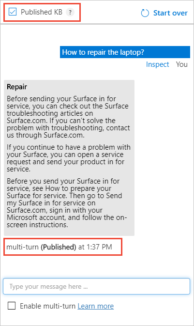
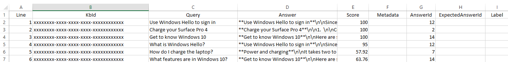
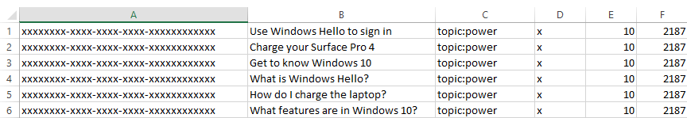
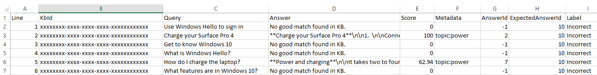

# Test your knowledge base in QnA Maker

Testing your QnA Maker knowledge base is an important part of an iterative process to improve the accuracy of the responses being returned. You can test the knowledge base through an enhanced chat interface that also allows you make edits.

[!INCLUDE [Custom question answering](../includes/new-version.md)]

## Interactively test in QnA Maker portal

1. Access your knowledge base by selecting its name on the **My knowledge bases** page.
1. To access the Test slide-out panel, select **Test** in your application's top panel.
1. Enter a query in the text box and select Enter.
1. The best-matched answer from the knowledge base is returned as the response.

### Clear test panel

To clear all the entered test queries and their results from the test console, select **Start over** at the upper-left corner of the Test panel.

### Close test panel

To close the Test panel, select the **Test** button again. While the Test panel is open, you cannot edit the Knowledge Base contents.

### Inspect score

You inspect details of the test result in the Inspect panel.

1.  With the Test slide-out panel open, select **Inspect** for more details on that response.

    

2.  The Inspection panel appears. The panel includes the top scoring intent as well as any identified entities. The panel shows the result of the selected utterance.

### Correct the top scoring answer

If the top scoring answer is incorrect, select the correct answer from the list and select **Save and Train**.


### Add alternate questions

You can add alternate forms of a question to a given answer. Type the alternate answers in the text box and select enter to add them. Select **Save and Train** to store the updates.


### Add a new answer

You can add a new answer if any of the existing answers that were matched are incorrect or the answer does not exist in the knowledge base (no good match found in the KB).

At the bottom of the answers list, use the text box to enter a new answer and press enter to add it.

Select **Save and Train** to persist this answer. A new question-answer pair has now been added to your knowledge base.

> [!NOTE]
> All edits to your knowledge base only get saved when you press the **Save and Train** button.

### Test the published knowledge base

You can test the published version of knowledge base in the test pane. Once you have published the KB, select the **Published KB** box and send a query to get results from the published KB.



## Batch test with tool

Use the batch testing tool when you want to:

* determine top answer and score for a set of questions
* validate expected answer for set of questions

### Prerequisites

* Azure subscription - [create one for free](https://azure.microsoft.com/free/cognitive-services/)
* Either [create a QnA Maker service](../quickstarts/create-publish-knowledge-base.md) or use an existing service, which uses the English language.
* Download the [multi-turn sample `.docx` file](https://github.com/Azure-Samples/cognitive-services-sample-data-files/blob/master/qna-maker/data-source-formats/multi-turn.docx)
* Download the [batch testing tool](https://aka.ms/qnamakerbatchtestingtool), extract the executable file from the `.zip` file.

### Sign into QnA Maker portal

[Sign in](https://www.qnamaker.ai/) to the QnA Maker portal.

### Create a new knowledge base from the multi-turn sample.docx file

1. Select **Create a knowledge base** from the tool bar.
1. Skip **Step 1** because you should already have a QnA Maker resource, moving on to **Step 2** to select your existing resource information:
    * Microsoft Entra ID
    * Azure Subscription Name
    * Azure QnA Service Name
    * Language - the English language
1. Enter the name `Multi-turn batch test quickstart` as the name of your knowledge base.

1. In **Step 4**, configure the settings with the following table:

    |Setting|Value|
    |--|--|
    |**Enable multi-turn extraction from URLs, .pdf or .docx files.**|Checked|
    |**Default answer text**| `Batch test - default answer not found.`|
    |**+ Add File**|Select the downloaded `.docx` file listing in the prerequisites.|
    |**Chit-chat**|Select **Professional**|

1. In **Step 5**, select **Create your KB**.

    When the creation process finishes, the portal displays the editable knowledge base.

### Save, train, and publish knowledge base

1. Select **Save and train** from the toolbar to save the knowledge base.
1. Select **Publish** from the toolbar then select **Publish** again to publish the knowledge base. Publishing makes the knowledge base available for queries from a public URL endpoint. When publishing is complete, save the host URL and endpoint key information shown on the **Publish** page.

    |Required data| Example|
    |--|--|
    |Published Host|`https://YOUR-RESOURCE-NAME.azurewebsites.net`|
    |Published Key|`XXXXXXXXXXXXXXXXXXXXXXXXXXXXXXXX` (32 character string shown after `Endpoint` )|
    |App ID|`xxxxxxxx-xxxx-xxxx-xxxx-xxxxxxxxxxxx` (36 character string shown as part of `POST`) |

### Create batch test file with question IDs

In order to use the batch test tool, create a file named `batch-test-data-1.tsv` with a text editor. The file should be in UTF-8 format and it needs to have the following columns separated by a tab.

|TSV input file fields|Notes|Example|
|--|--|--|
|Knowledge base ID|Your knowledge base ID found on the Publish page. Test several knowledge bases in the same service at one time in a single file by using different knowledge base IDs in a single file.|`xxxxxxxx-xxxx-xxxx-xxxx-xxxxxxxxxxxx` (36 character string shown as part of `POST`) |
|Question|The question text a user would enter. 1,000 character max.|`How do I sign out?`|
|Metadata tags|optional|`topic:power` uses the `key:value` format|
|Top parameter|optional|`25`|
|Expected answer ID|optional|`13`|

For this knowledge base, add three rows of just the two required columns to the file. The first column is your knowledge base ID and the second column should be the following list of questions:

|Column 2 - questions|
|--|
|`Use Windows Hello to sign in`|
|`Charge your Surface Pro 4`|
|`Get to know Windows 10`|

These questions are the exact wording from the knowledge base and should return 100 as the confidence score.

Next, add a few questions, similar to these questions but not exactly the same on three more rows, using the same knowledge base ID:

|Column 2 - questions|
|--|
|`What is Windows Hello?`|
|`How do I charge the laptop?`|
|`What features are in Windows 10?`|

> [!CAUTION]
> Make sure that each column is separated by a tab delimiter only. Leading or trailing spaces are added to the column data and will cause the program to throw exceptions when the type or size is incorrect.

The batch test file, when opened in Excel, looks like the following image. The knowledge base ID has been replaced with `xxxxxxxx-xxxx-xxxx-xxxx-xxxxxxxxxxxx` for security. For your own batch test, make sure the column displays your knowledge base ID.

> [!div class="mx-imgBorder"]
> 

### Test the batch file

Run the batch testing program using the following CLI format at the command line.

Replace `YOUR-RESOURCE-NAME` and `ENDPOINT-KEY` with your own values for service name and endpoint key. These values are found on the **Settings** page in the QnA Maker portal.

```console
batchtesting.exe batch-test-data-1.tsv https://YOUR-RESOURCE-NAME.azurewebsites.net ENDPOINT-KEY out.tsv
```
The test completes and generates the `out.tsv` file:

> [!div class="mx-imgBorder"]
> 

The knowledge base ID has been replaced with `xxxxxxxx-xxxx-xxxx-xxxx-xxxxxxxxxxxx` for security. For your own batch test, the column displays your knowledge base ID.

The test output of confidence score, in the fourth column, shows the top three questions returned a score of 100 as expected because each question is exactly the same as it appears in the knowledge base. The last three questions, with new wording of the question, do not return 100 as the confidence score. In order to increase the score both for the test, and your users, you need to add more alternate questions to the knowledge base.

### Testing with the optional fields

Once you understand the format and process, you can generate a test file, to run against your knowledge base from a source of data such as from chats logs.

Because the data source and process are automated, the test file can be run many times with different settings to determine the correct values.

For example, if you have a chat log and you want to determine which chat log text applies to which metadata fields, create a test file and set the metadata fields for every row. Run the test, then review the rows that match the metadata. Generally, the matches should be positive, but you should review the results for false positives. A false positive is a row that matches the metadata but based on the text, it shouldn't match.

### Using optional fields in the input batch test file

Use the following chart to understand how to find the field values for optional data.

|Column number|Optional column|Data location|
|--|--|--|
|3|metadata|Export existing knowledge base for existing `key:value` pairs.|
|4|top|Default value of `25` is recommended.|
|5|Question and answer set ID|Export existing knowledge base for ID values. Also notice the IDs were returned in the output file.|

### Add metadata to the knowledge base

1. In the QnA portal, on the **Edit** page, add metadata of `topic:power` to the following questions:

    |Questions|
    |--|
    |Charge your Surface Pro 4|
    |Check the battery level|

    Two QnA pairs have the metadata set.

    > [!TIP]
    > To see the metadata and QnA IDs of each set, export the knowledge base. Select the **Settings** page, then select **Export** as a `.xls` file. Find this downloaded file and open with Excel reviewing for metadata and ID.

1. Select **Save and train**, then select the **Publish** page, then select the **Publish** button. These actions make the change available to the batch test. Download the knowledge base from the **Settings** page.

    The downloaded file has the correct format for the metadata and the correct question and answer set ID. Use these fields in the next section

    > [!div class="mx-imgBorder"]
    > 

### Create a second batch test

There are two main scenarios for batch testing:
* **Process chat log files** - Determine the top answer for a previously unseen question - the most common situation is when you need to process are log file of queries, such as a chat bot's user questions. Create a batch file test, with only the required columns. The test returns the top answer for each question. That doesn't mean it the top answer is the correct answer. Once you complete this test, move on to the validation test.
* **Validation test** - Validate the expected answer. This test requires that all the questions and matching expected answers in the batch test have been validated. This may require some manual process.

The following procedure assumes the scenario is to process chat logs with

1. Create a new batch test file to include optional data, `batch-test-data-2.tsv`. Add the six rows from the original batch test input file, then add the metadata, top, and QnA pair ID for each row.

    To simulate the automated process of checking new text from chat logs against the knowledge base, set the metadata for each column to the same value: `topic:power`.

    > [!div class="mx-imgBorder"]
    > 

1. Run the test again, changing the input and output file names to indicate it is the second test.

    > [!div class="mx-imgBorder"]
    > 

### Test results and an automated test system

This test output file can be parsed as part of an automated continuous test pipeline.

This specific test output should be read as: each row was filtered with metadata, and because each row didn't match the metadata in the knowledge base, the default answer for those non-matching rows returned ("no good match found in kb"). Of those rows that did match, the QnA ID and score was returned.

All rows returned the label of incorrect because no row matched the answer ID expected.

You should be able to see with these results that you can take a chat log and use the text as the query of each row. Without knowing anything about the data, the results tell you a lot about the data that you can then use moving forward:

* meta-data
* QnA ID
* score

Was filtering with meta-data a good idea for the test? Yes and no. The test system should create test files for each meta-data pair as well as a test with no meta-data pairs.

### Clean up resources

If you aren't going to continue testing the knowledge base, delete the batch file tool and the test files.

If you're not going to continue to use this knowledge base, delete the knowledge base with the following steps:

1. In the QnA Maker portal, select **My Knowledge bases** from the top menu.
1. In the list of knowledge bases, select the **Delete** icon on the row of the knowledge base of this quickstart.

[Reference documentation about the tool](../reference-tsv-format-batch-testing.md) includes:

* the command-line example of the tool
* the format for TSV input and outfile files

## Next steps

> [!div class="nextstepaction"]
> [Publish a knowledge base](../quickstarts/create-publish-knowledge-base.md)
