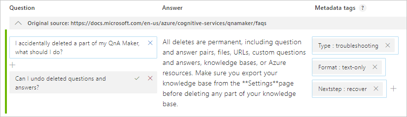
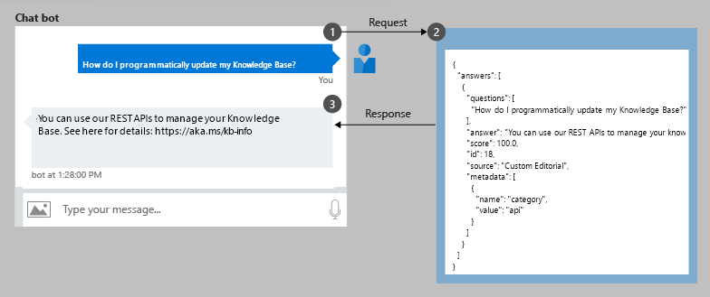

# What is QnA Maker?

[!INCLUDE [Custom question answering](../includes/new-version.md)]

[!INCLUDE [Azure AI services rebrand](../../includes/rebrand-note.md)]

QnA Maker is a cloud-based Natural Language Processing (NLP) service that allows you to create a natural conversational layer over your data. It is  used to find the most appropriate answer for any input from your custom knowledge base (KB) of information.

QnA Maker is commonly used to build conversational client applications, which include social media applications, chat bots, and speech-enabled desktop applications.

QnA Maker doesn't store customer data. All customer data (question answers and chat logs) is stored in the region the customer deploys the dependent service instances in. For more details on dependent services see [here](../concepts/plan.md?tabs=v1).

This documentation contains the following article types:

* The [quickstarts](../quickstarts/create-publish-knowledge-base.md) are step-by-step instructions that let you make calls to the service and get results in a short period of time. 
* The [how-to guides](../how-to/set-up-qnamaker-service-azure.md) contain instructions for using the service in more specific or customized ways.
* The [conceptual articles](../concepts/plan.md) provide in-depth explanations of the service's functionality and features.
* [**Tutorials**](../tutorials/create-faq-bot-with-azure-bot-service.md) are longer guides that show you how to use the service as a component in broader business solutions.

## When to use QnA Maker

* **When you have static information** - Use QnA Maker when you have static information in your knowledge base of answers. This knowledge base is custom to your needs, which you've built with documents such as [PDFs and URLs](../concepts/data-sources-and-content.md).
* **When you want to provide the same answer to a request, question, or command** - when different users submit the same question, the same answer is returned.
* **When you want to filter static information based on meta-information** - add [metadata](../how-to/metadata-generateanswer-usage.md) tags to provide additional filtering options relevant to your client application's users and the information. Common metadata information includes [chit-chat](../how-to/chit-chat-knowledge-base.md), content type or format, content purpose, and content freshness.
* **When you want to manage a bot conversation that includes static information** - your knowledge base takes a user's conversational text or command and answers it. If the answer is part of a pre-determined conversation flow, represented in your knowledge base with [multi-turn context](../how-to/multi-turn.md), the bot can easily provide this flow.

## What is a knowledge base?

QnA Maker [imports your content](../concepts/plan.md) into a knowledge base of question and answer pairs. The import process extracts information about the relationship between the parts of your structured and semi-structured content to imply relationships between the question and answer pairs. You can edit these question and answer pairs or add new pairs.

The content of the question and answer pair includes:
* All the alternate forms of the question
* Metadata tags used to filter answer choices during the search
* Follow-up prompts to continue the search refinement

After you publish your knowledge base, a client application sends a user's question to your endpoint. Your QnA Maker service processes the question and responds with the best answer.

## Create a chat bot programmatically

Once a QnA Maker knowledge base is published, a client application sends a question to your knowledge base endpoint and receives the results as a JSON response. A common client application for QnA Maker is a chat bot.

|Step|Action|
|:--|:--|
|1|The client application sends the user's _question_ (text in their own words), "How do I programmatically update my Knowledge Base?" to your knowledge base endpoint.|
|2|QnA Maker uses the trained knowledge base to provide the correct answer and any follow-up prompts that can be used to refine the search for the best answer. QnA Maker returns a JSON-formatted response.|
|3|The client application uses the JSON response to make decisions about how to continue the conversation. These decisions can include showing the top answer and presenting more choices to refine the search for the best answer. |
|||

## Build low code chat bots

The QnA Maker portal provides the complete knowledge base authoring experience. You can import documents, in their current form, to your knowledge base. These documents (such as an FAQ, product manual, spreadsheet, or web page) are converted into question and answer pairs. Each pair is analyzed for follow-up prompts and connected to other pairs. The final _markdown_ format supports rich presentation including images and links.

## High quality responses with layered ranking

QnA Maker's system is a layered ranking approach. The data is stored in Azure search, which also serves as the first ranking layer. The top results from Azure search are then passed through QnA Maker's NLP re-ranking model to produce the final results and confidence score.

## Multi-turn conversations

QnA Maker provides multi-turn prompts and active learning to help you improve your basic question and answer pairs.

**Multi-turn prompts** give you the opportunity to connect question and answer pairs. This connection allows the client application to provide a top answer and provides more questions to refine the search for a final answer.

After the knowledge base receives questions from users at the published endpoint, QnA Maker applies **active learning** to these real-world questions to suggest changes to your knowledge base to improve the quality.

## Development lifecycle

QnA Maker provides authoring, training, and publishing along with collaboration permissions to integrate into the full development life cycle.

> [!div class="mx-imgBorder"]
> 

## Complete a quickstart

We offer quickstarts in most popular programming languages, each designed to teach you basic design patterns, and have you running code in less than 10 minutes. See the following list for the quickstart for each feature.

* [Get started with QnA Maker client library](../quickstarts/quickstart-sdk.md)
* [Get started with QnA Maker portal](../quickstarts/create-publish-knowledge-base.md)

## Next steps
QnA Maker provides everything you need to build, manage, and deploy your custom knowledge base.

> [!div class="nextstepaction"]
> [Review the latest changes](../whats-new.md)
