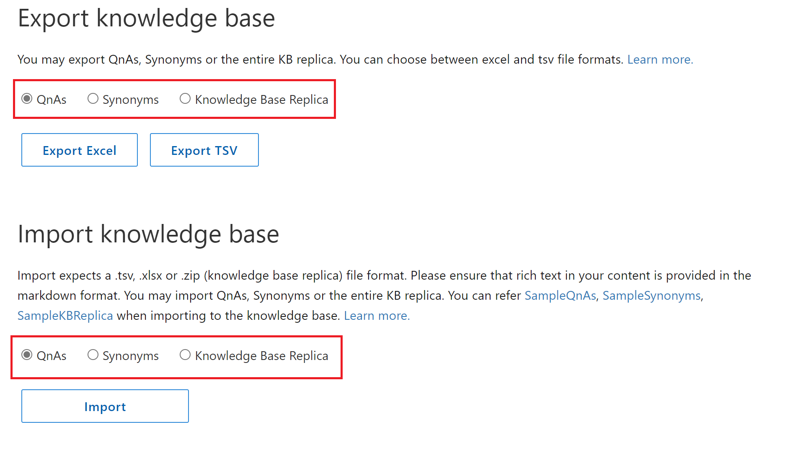

# Move a knowledge base using export-import

You may want to create a copy of your knowledge base for several reasons:

* Copy a knowledge base from QnA Maker GA to Custom question answering 
* To implement a backup and restore process 
* Integrate with your CI/CD pipeline 
* When you wish to move your data to different regions

[!INCLUDE [Custom question answering](../includes/new-version.md)]

## Prerequisites

> * If you don't have an Azure subscription, [create a free account](https://azure.microsoft.com/free/cognitive-services/) before you begin.
> * A [QnA Maker resource](https://portal.azure.com/#create/Microsoft.CognitiveServicesQnAMaker) created in the Azure portal. Remember your Azure Active Directory ID, Subscription, QnA resource name you selected when you created the resource.
> * Set up a new [QnA Maker service](../how-to/set-up-qnamaker-service-azure.md)

## Export a knowledge base
1. Sign in to [QnA Maker portal](https://qnamaker.ai).
1. Select the knowledge base you want to move.

1. On the **Settings** page, you have the options to export **QnAs**, **Synonyms**, or **Knowledge Base Replica**. You can choose to download the data in .tsv/.xlsx.

   1. **QnAs**: When exporting QnAs, all QnA pairs (with questions, answers, metadata, follow-up prompts, and the data source names) are downloaded. The QnA IDs that are exported with the questions and answers may be used to update a specific QnA pair using the [update API](/rest/api/cognitiveservices/qnamaker/knowledgebase/update). The QnA ID for a specific QnA pair remains unchanged across multiple export operations.
   2. **Synonyms**: You can export Synonyms that have been added to the knowledge base.
   4. **Knowledge Base Replica**: If you want to download the entire knowledge base with synonyms and other settings, you can choose this option.

## Import a knowledge base
1. Select **Create a knowledge base** from the top menu of the qnamaker.ai portal and then create an _empty_ knowledge base by not adding any URLs or files. Set the name of your choice for the new knowledge base and then Click **Create your KB**. 

1. In this new knowledge base, open the **Settings** tab and and under _Import knowledge base_ select one of the following options: **QnAs**, **Synonyms**, or **Knowledge Base Replica**. 

   1. **QnAs**: This option imports all QnA pairs. **The QnA pairs created in the new knowledge base shall have the same QnA ID as present in the exported file**. You can refer [SampleQnAs.xlsx](https://aka.ms/qnamaker-sampleqnas), [SampleQnAs.tsv](https://aka.ms/qnamaker-sampleqnastsv) to import QnAs.
   2. **Synonyms**: This option can be used to import synonyms to the knowledge base. You can refer [SampleSynonyms.xlsx](https://aka.ms/qnamaker-samplesynonyms), [SampleSynonyms.tsv](https://aka.ms/qnamaker-samplesynonymstsv) to import synonyms.
   3. **Knowledge Base Replica**: This option can be used to import KB replica with QnAs, Synonyms and Settings. You can refer [KBReplicaSampleExcel](https://aka.ms/qnamaker-samplereplica), [KBReplicaSampleTSV](https://aka.ms/qnamaker-samplereplicatsv) for more details. If you also want to add unstructured content to the replica, refer [CustomQnAKBReplicaSample](https://aka.ms/qnamaker-samplev2replica).

      Either QnAs or Unstructured content is required when importing replica. Unstructured documents are only valid for Custom question answering.
      Synonyms file is not mandatory when importing replica.
      Settings file is mandatory when importing replica.

         |Settings|Update permitted when importing to QnA Maker KB?|Update permitted when importing to Custom question answering KB?|
         |:--|--|--|
         |DefaultAnswerForKB|No|Yes|
         |EnableActiveLearning (True/False)|Yes|No|
         |EnableMultiTurnExtraction (True/False)|Yes|Yes|
         |DefaultAnswerforMultiturn|Yes|Yes|
         |Language|No|No|

1. **Test** the new knowledge base using the Test panel. Learn how to [test your knowledge base](../how-to/test-knowledge-base.md).

1. **Publish** the knowledge base and create a chat bot. Learn how to [publish your knowledge base](../quickstarts/create-publish-knowledge-base.md#publish-the-knowledge-base).

   > [!div class="mx-imgBorder"]
   > 

## Programmatically export a knowledge base from QnA Maker

The export/import process is programmatically available using the following REST APIs:

**Export**

* [Download knowledge base API](/rest/api/cognitiveservices/qnamaker4.0/knowledgebase/download)

**Import**

* [Replace API (reload with same knowledge base ID)](/rest/api/cognitiveservices/qnamaker4.0/knowledgebase/replace)
* [Create API (load with new knowledge base ID)](/rest/api/cognitiveservices/qnamaker4.0/knowledgebase/create)

## Chat logs

There is no way to export chat logs, since the new knowledge base uses Application Insights for storing chat logs.

## Next steps

> [!div class="nextstepaction"]
> [Edit a knowledge base](../how-to/edit-knowledge-base.md)
