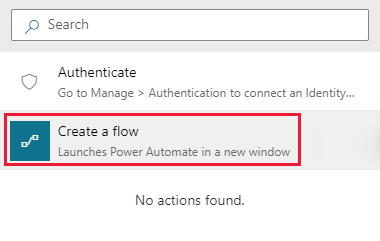

# Tutorial: Add your knowledge base to Power Virtual Agents

Create and extend a [Power Virtual Agents](https://powervirtualagents.microsoft.com/) bot to provide answers from your knowledge base.

> [!NOTE]
> The integration demonstrated in this tutorial is in preview and is not intended for deployment to production environments.

In this tutorial, you learn how to:

> [!div class="checklist"]
>
> * Create a Power Virtual Agents bot
> * Create a system fallback topic
> * Add QnA Maker as an action to a topic as a Power Automate flow
> * Create a Power Automate solution
> * Add a Power Automate flow to your solution
> * Publish Power Virtual Agents
> * Test Power Virtual Agents, and recieve an answer from your QnA Maker knowledge base

[!INCLUDE [Custom question answering](../includes/new-version.md)]

## Create and publish a knowledge base

1. Follow the [quickstart](../quickstarts/create-publish-knowledge-base.md) to create a knowledge base. Don't complete the last section, about creating a bot. Instead, use this tutorial to create a bot with Power Virtual Agents.

    > [!div class="mx-imgBorder"]
    > 

    Enter your published knowledge base settings found on the **Settings** page in the [QnA Maker](https://www.qnamaker.ai/) portal. You will need this information for the [Power Automate step](#create-a-power-automate-flow-to-connect-to-your-knowledge-base) to configure your QnA Maker `GenerateAnswer` connection.

1. In the QnA Maker portal, on the **Settings** page, find the endpoint key, endpoint host, and knowledge base ID.

## Create bot in Power Virtual Agents

[Power Virtual Agents](https://powervirtualagents.microsoft.com/) allows teams to create powerful bots by using a guided, no-code graphical interface. You don't need data scientists or developers.

Create a bot by following the steps in [Create and delete Power Virtual Agents bots](/power-virtual-agents/authoring-first-bot).

## Create the system fallback topic

In Power Virtual Agents, you create a bot with a series of topics (subject areas), in order to answer user questions by performing actions.

Although the bot can connect to your knowledge base from any topic, this tutorial uses the *system fallback* topic. The fallback topic is used when the bot can't find an answer. The bot passes the user's text to QnA Maker's `GenerateAnswer` API, receives the answer from your knowledge base, and displays it to the user as a message.

Create a fallback topic by following the steps in [Configure the system fallback topic in Power Virtual Agents](/power-virtual-agents/authoring-system-fallback-topic).

## Use the authoring canvas to add an action

Use the Power Virtual Agents authoring canvas to connect the fallback topic to your knowledge base. The topic starts with the unrecognized user text. Add an action that passes that text to QnA Maker, and then shows the answer as a message. The last step of displaying an answer is handled as a [separate step](#add-your-solutions-flow-to-power-virtual-agents), later in this tutorial.

This section creates the fallback topic conversation flow.

1. The new fallback action might already have conversation flow elements. Delete the **Escalate** item by selecting the **Options** menu.

    :::image type="content" source="../media/how-to-integrate-power-virtual-agent/delete-escalate-action-using-option-menu.png" alt-text="Partial screenshot of conversation flow, with delete option highlighted.":::

1. Above the **Message** node, select the plus (**+**) icon, and then select **Call an action**.

    :::image type="content" source="../media/how-to-integrate-power-virtual-agent/create-new-item-call-an-action.png" alt-text="Partial Screenshot of Call an action.":::

1. Select **Create a flow**. The process takes you to the Power Automate portal.

    > [!div class="mx-imgBorder"]
    > 

    Power Automate opens to a new template. You won't use this new template.

    :::image type="content" source="../media/how-to-integrate-power-virtual-agent/power-automate-flow-initial-template.png" alt-text="Partial Screenshot of Power Automate with new flow template.":::

## Create a Power Automate flow to connect to your knowledge base

> [!NOTE]
> Currently the Power Automate template does not support QnA Maker managed (Preview) endpoints. To add a QnA Maker managed (Preview) knowledge base to Power Automate skip this step and manually add the endpoints to it.

The following procedure creates a Power Automate flow that:

* Takes the incoming user text, and sends it to QnA Maker.
* Returns the top response back to your bot.

1. In **Power Automate**, select **Templates** from the left navigation. If you are asked if you want to leave the browser page, accept Leave.

1. On the templates page, search for the template **Generate answer using QnA Maker** then select the template. This template has all the steps to call QnA Maker with your knowledge base settings and return the top answer.

1. On the new screen for the QnA Maker flow, select **Continue**.

    :::image type="content" source="../media/how-to-integrate-power-virtual-agent/power-automate-qna-flow-template-continue.png" alt-text="Partial Screenshot of QnA Maker template flow with Continue button highlighted.":::

1. Select the **Generate Answer** action box, and fill in your QnA Maker settings from a previous section titled [Create and publish a knowledge base](#create-and-publish-a-knowledge-base). Your **Service Host** in the following image refers to your knowledge base host **Host** and is in the format of `https://YOUR-RESOURCE-NAME.azurewebsites.net/qnamaker`.

    :::image type="content" source="../media/how-to-integrate-power-virtual-agent/power-virtual-agent-fill-in-generate-answer-settings.png" alt-text="Partial Screenshot of QnA Maker template flow with Generate answer (Preview) highlighted.":::

1. Select **Save** to save the flow.

## Create a solution and add the flow

For the bot to find and connect to the flow, the flow must be included in a Power Automate solution.

1. While still in the Power Automate portal, select **Solutions** from the left-side navigation.

1. Select **+ New solution**.

1. Enter a display name. The list of solutions includes every solution in your organization or school. Choose a naming convention that helps you filter to just your solutions. For example, you might prefix your email to your solution name: `jondoe-power-virtual-agent-qnamaker-fallback`.

1. Select your publisher from the list of choices.

1. Accept the default values for the name and version.

1. Select **Create** to finish the process.

## Add your flow to the solution

1. In the list of solutions, select the solution you just created. It should be at the top of the list. If it isn't, search by your email name, which is part of the solution name.

1. In the solution, select **+ Add existing**, and then select **Flow** from the list.

1. Find your flow from the **Outside solutions** list, and then select **Add** to finish the process. If there are many flows, look at the **Modified** column to find the most recent flow.

## Add your solution's flow to Power Virtual Agents

1. Return to the browser tab with your bot in Power Virtual Agents. The authoring canvas should still be open.

1. To insert a new step in the flow, above the **Message** action box, select the plus (**+**) icon. Then select **Call an action**.

1. From the **Flow** pop-up window, select the new flow named **Generate answers using QnA Maker knowledge base...**. The new action appears in the flow.

    :::image type="content" source="../media/how-to-integrate-power-virtual-agent/power-virtual-agent-flow-after-adding-action.png" alt-text="Partial Screenshot of Power Virtual Agent topic conversation canvas after adding QnA Maker flow.":::

1. To correctly set the input variable to the QnA Maker action, select **Select a variable**, then select **bot.UnrecognizedTriggerPhrase**.

    :::image type="content" source="../media/how-to-integrate-power-virtual-agent/power-virtual-agent-selection-action-input.png" alt-text="Partial Screenshot of Power Virtual Agent topic conversation canvas selecting input variable.":::

1. To correctly set the output variable to the QnA Maker action, in the **Message** action, select **UnrecognizedTriggerPhrase**, then select the icon to insert a variable, `{x}`, then select **FinalAnswer**.

1. From the context toolbar, select **Save**, to save the authoring canvas details for the topic.

Here's what the final bot canvas looks like.

> [!div class="mx-imgBorder"]
> 

## Test the bot
As you design your bot in Power Virtual Agents, you can use [the Test bot pane](/power-virtual-agents/authoring-test-bot) to see how the bot leads a customer through the bot conversation.

1. In the test pane, toggle **Track between topics**. This allows you to watch the progression between topics, as well as within a single topic.

1. Test the bot by entering the user text in the following order. The authoring canvas reports the successful steps with a green check mark.

    |Question order|Test questions|Purpose|
    |--|--|--|
    |1|Hello|Begin conversation|
    |2|Store hours|Sample topic. This is configured for you without any additional work on your part.|
    |3|Yes|In reply to `Did that answer your question?`|
    |4|Excellent|In reply to `Please rate your experience.`|
    |5|Yes|In reply to `Can I help with anything else?`|
    |6|How can I improve the throughput performance for query predictions?|This question triggers the fallback action, which sends the text to your knowledge base to answer. Then the answer is shown. the green check marks for the individual actions indicate success for each action.|

    :::image type="content" source="../media/how-to-integrate-power-virtual-agent/power-virtual-agent-test-tracked.png" alt-text="Screenshot of chat bot with canvas indicating green checkmarks for successful actions.":::

## Publish your bot

To make the bot available to all members of your school or organization, you need to *publish* it.

Publish your bot by following the steps in [Publish your bot](/power-virtual-agents/publication-fundamentals-publish-channels).

## Share your bot

To make your bot available to others, you first need to publish it to a channel. For this tutorial we'll use the demo website.

Configure the demo website by following the steps in [Configure a chatbot for a live or demo website](/power-virtual-agents/publication-connect-bot-to-web-channels).

Then you can share your website URL with your school or organization members.

## Clean up resources

When you are done with the knowledge base, remove the QnA Maker resources in the Azure portal.

## Next step

[Get analytics on your knowledge base](../how-to/get-analytics-knowledge-base.md)

Learn more about:

* [Power Virtual Agents](/power-virtual-agents/)
* [Power Automate](/power-automate/)
* [QnA Maker connector](https://us.flow.microsoft.com/connectors/shared_cognitiveservicesqnamaker/qna-maker/) and the [settings for the connector](/connectors/cognitiveservicesqnamaker/)
