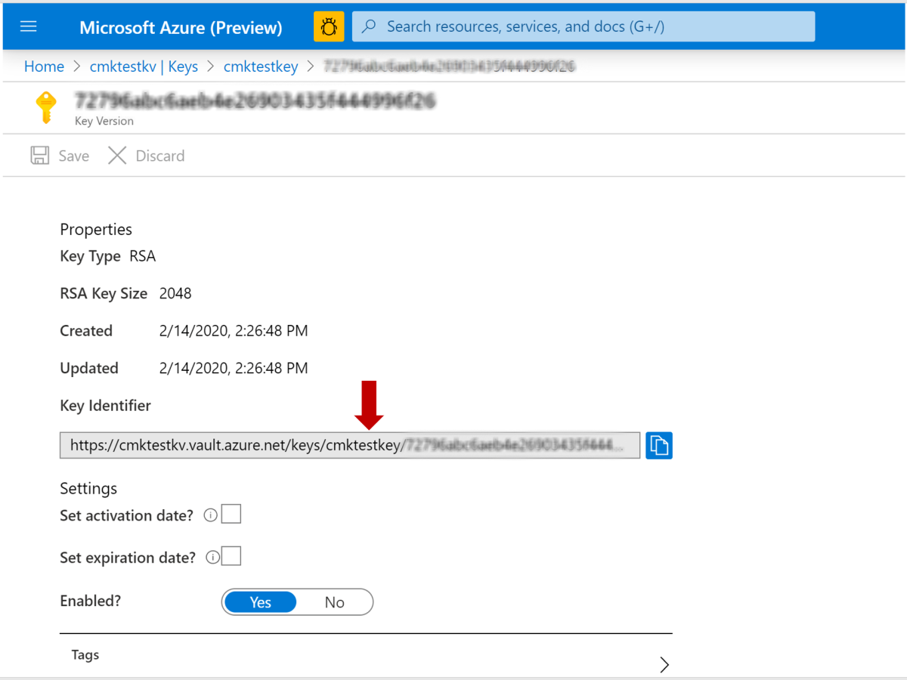

# QnA Maker encryption of data at rest

QnA Maker automatically encrypts your data when it is persisted to the cloud, helping to meet your organizational security and compliance goals.

[!INCLUDE [Custom question answering](includes/new-version.md)]

## About encryption key management

By default, your subscription uses Microsoft-managed encryption keys. There is also the option to manage your subscription with your own keys called customer-managed keys (CMK). CMK offers greater flexibility to create, rotate, disable, and revoke access controls. You can also audit the encryption keys used to protect your data. If CMK is configured for your subscription, double encryption is provided, which offers a second layer of protection, while allowing you to control the encryption key through your Azure Key Vault.

QnA Maker uses CMK support from Azure search. Configure [CMK in Azure Search using Azure Key Vault](../../search/search-security-manage-encryption-keys.md). This Azure instance should be associated with QnA Maker service to make it CMK enabled.

> [!IMPORTANT]
> Your Azure Search service resource must have been created after January 2019 and cannot be in the free (shared) tier. There is no support to configure customer-managed keys in the Azure portal.

## Enable customer-managed keys

The QnA Maker service uses CMK from the Azure Search service. Follow these steps to enable CMKs:

1. Create a new Azure Search instance and enable the prerequisites mentioned in the [customer-managed key prerequisites for Azure Cognitive Search](../../search/search-security-manage-encryption-keys.md#prerequisites).

   

2. When you create a QnA Maker resource, it's automatically associated with an Azure Search instance. This instance cannot be used with CMK. To use CMK, you'll need to associate your newly created instance of Azure Search that was created in step 1. Specifically, you'll need to update the `AzureSearchAdminKey` and `AzureSearchName` in your QnA Maker resource.

   

3. Next, create a new application setting:
   * **Name**: Set to `CustomerManagedEncryptionKeyUrl`
   * **Value**: Use the value that you got in Step 1 when creating your Azure Search instance.

   

4. When finished, restart the runtime. Now your QnA Maker service is CMK-enabled.

## Regional availability

Customer-managed keys are available in all Azure Search regions.

## Encryption of data in transit

QnA Maker portal runs in the user's browser. Every action triggers a direct call to the respective Azure AI services API. Hence, QnA Maker is compliant for data in transit.
However, as the QnA Maker portal service is hosted in West-US, it is still not ideal for non-US customers. 

## Next steps

* [Encryption in Azure Search using CMKs in Azure Key Vault](../../search/search-security-manage-encryption-keys.md)
* [Data encryption at rest](../../security/fundamentals/encryption-atrest.md)
* [Learn more about Azure Key Vault](../../key-vault/general/overview.md)
