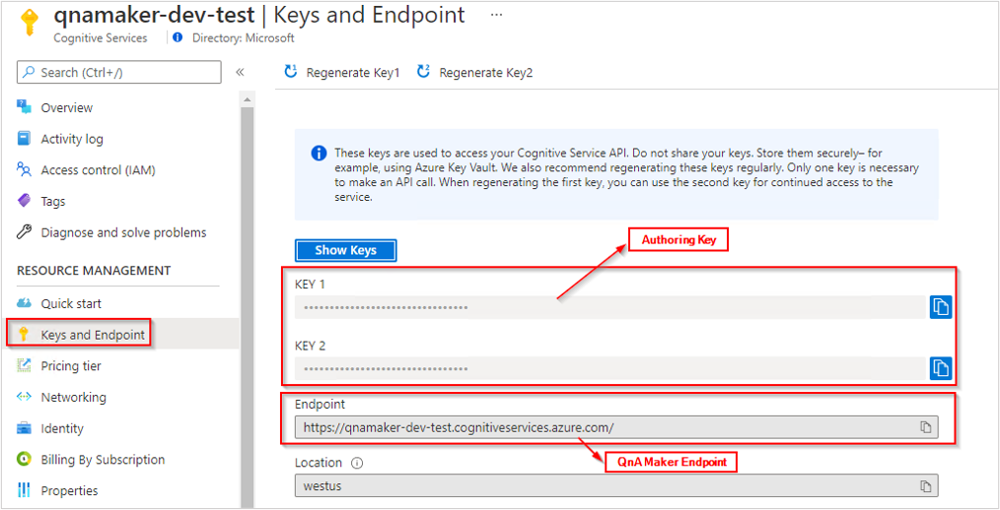

Use the QnA Maker client library for Java to:

* Create a knowledgebase
* Update a knowledgebase
* Publish a knowledgebase
* Get prediction runtime endpoint key
* Wait for long-running task
* Download a knowledgebase
* Get an answer from a knowledgebase
* Delete knowledge base

[Library source code](https://github.com/Azure/azure-sdk-for-java/tree/master/sdk/cognitiveservices/ms-azure-cs-qnamaker/src/main/java/com/microsoft/azure/cognitiveservices/knowledge/qnamaker) | [Package](https://mvnrepository.com/artifact/com.microsoft.azure.cognitiveservices/azure-cognitiveservices-qnamaker/1.0.0-beta.1) | [Samples](https://github.com/Azure-Samples/cognitive-services-quickstart-code/tree/master/java/qnamaker/sdk/quickstart.java)

[!INCLUDE [Custom subdomains notice](../../../../includes/cognitive-services-custom-subdomains-note.md)]

## Prerequisites

* Azure subscription - [Create one for free](https://azure.microsoft.com/free/cognitive-services)
* [JDK](https://www.oracle.com/java/technologies/javase-downloads.html)
* Once you have your Azure subscription, create a [QnA Maker resource](https://portal.azure.com/#create/Microsoft.CognitiveServicesQnAMaker) in the Azure portal to get your authoring key and endpoint. After it deploys, select **Go to resource**.
    * You will need the key and endpoint from the resource you create to connect your application to the QnA Maker API. Paste your key and endpoint into the code below later in the quickstart.
    * You can use the free pricing tier (`F0`) to try the service, and upgrade later to a paid tier for production.

## Setting up

### Install the client libraries

After installing Java, you can install the client libraries using [Maven](https://maven.apache.org/) from [MVN Repository](https://mvnrepository.com/artifact/com.microsoft.azure.cognitiveservices/azure-cognitiveservices-qnamaker).

### Create a new Java application

Create a new file named `quickstart.java` and import the following libraries.

[!code-java[Dependencies](~/cognitive-services-quickstart-code/java/qnamaker/sdk/quickstart.java?name=dependencies)]

Create variables for your resource's Azure endpoint and key.

- We use subscription key and authoring key interchangeably. For more details on authoring key, follow [Keys in QnA Maker](../concepts/azure-resources.md?tabs=v1#keys-in-qna-maker).

- The value of QNA_MAKER_ENDPOINT has the format `https://YOUR-RESOURCE-NAME.cognitiveservices.azure.com`. Go to the Azure portal and find the QnA Maker resource you created in the prerequisites. Select **Keys and Endpoint** page, under **resource management** to locate Authoring (Subscription) key and QnA Maker Endpoint.

 

- The value of QNA_MAKER_RUNTIME_ENDPOINT has the format `https://YOUR-RESOURCE-NAME.azurewebsites.net`. Go to the Azure portal and find the QnA Maker resource you created in the prerequisites. Select **Export Template** page, under **Automation** to locate the Runtime Endpoint.

 
   
> [!IMPORTANT]
> Remember to remove the key from your code when you're done, and never post it publicly. For production, use a secure way of storing and accessing your credentials like [Azure Key Vault](../../../key-vault/general/overview.md). See the Azure AI services [security](../../security-features.md) article for more information.

[!code-java[Resource variables](~/cognitive-services-quickstart-code/java/qnamaker/sdk/quickstart.java?name=resourceKeys)]

## Object models

QnA Maker uses two different object models:
* **[QnAMakerClient](#qnamakerclient-object-model)** is the object to create, manage, publish, and download the knowledgebase.
* **[QnAMakerRuntime](#qnamakerruntimeclient-object-model)** is the object to query the knowledge base with the GenerateAnswer API and send new suggested questions using the Train API (as part of [active learning](../how-to/use-active-learning.md)).

[!INCLUDE [Get KBinformation](./quickstart-sdk-cognitive-model.md)]

### QnAMakerClient object model

The authoring QnA Maker client is a [QnAMakerClient](https://github.com/Azure/azure-sdk-for-java/blob/master/sdk/cognitiveservices/ms-azure-cs-qnamaker/src/main/java/com/microsoft/azure/cognitiveservices/knowledge/qnamaker/QnAMakerClient.java) object that authenticates to Azure using MsRest::ServiceClientCredentials, which contains your key.

Once the client is created, use the methods of the client's [Knowledgebases](https://github.com/Azure/azure-sdk-for-java/blob/master/sdk/cognitiveservices/ms-azure-cs-qnamaker/src/main/java/com/microsoft/azure/cognitiveservices/knowledge/qnamaker/Knowledgebases.java) property to create, manage, and publish your knowledge base.

For immediate operations, a method usually returns the result, if any. For long-running operations, the response is an [Operation](https://github.com/Azure/azure-sdk-for-java/blob/master/sdk/cognitiveservices/ms-azure-cs-qnamaker/src/main/java/com/microsoft/azure/cognitiveservices/knowledge/qnamaker/models/Operation.java) object. Call the [getDetails](https://github.com/Azure/azure-sdk-for-java/blob/b455a61f4c6daece13590a0f4136bab3c4f30546/sdk/cognitiveservices/ms-azure-cs-qnamaker/src/main/java/com/microsoft/azure/cognitiveservices/knowledge/qnamaker/Operations.java#L32) method with the `operation.operationId` value to determine the [status of the request](https://github.com/Azure/azure-sdk-for-java/blob/master/sdk/cognitiveservices/ms-azure-cs-qnamaker/src/main/java/com/microsoft/azure/cognitiveservices/knowledge/qnamaker/models/OperationStateType.java).

### QnAMakerRuntimeClient object model

The runtime QnA Maker client is a [QnAMakerRuntimeClient](https://github.com/Azure/azure-sdk-for-java/blob/master/sdk/cognitiveservices/ms-azure-cs-qnamaker/src/main/java/com/microsoft/azure/cognitiveservices/knowledge/qnamaker/QnAMakerClient.java) object.

After you publish your knowledge base using the authoring client, use the runtime client's [generateAnswer](https://github.com/Azure/azure-sdk-for-java/blob/b455a61f4c6daece13590a0f4136bab3c4f30546/sdk/cognitiveservices/ms-azure-cs-qnamaker/src/main/java/com/microsoft/azure/cognitiveservices/knowledge/qnamaker/Runtimes.java#L36) method to get an answer from the knowledge base.

You create a runtime client by calling [QnAMakerRuntimeManager.authenticate](https://github.com/Azure/azure-sdk-for-java/blob/b455a61f4c6daece13590a0f4136bab3c4f30546/sdk/cognitiveservices/ms-azure-cs-qnamaker/src/main/java/com/microsoft/azure/cognitiveservices/knowledge/qnamaker/QnAMakerRuntimeManager.java#L29) and passing a runtime endpoint key. To obtain the runtime endpoint key, use the authoring client to call [getKeys](https://github.com/Azure/azure-sdk-for-java/blob/b455a61f4c6daece13590a0f4136bab3c4f30546/sdk/cognitiveservices/ms-azure-cs-qnamaker/src/main/java/com/microsoft/azure/cognitiveservices/knowledge/qnamaker/EndpointKeys.java#L30).

## Authenticate the client for authoring the knowledge base

Instantiate a client with your authoring endpoint and subscription key.

[!code-java[Authenticate](~/cognitive-services-quickstart-code/java/qnamaker/sdk/quickstart.java?name=authenticate)]

## Create a knowledge base

A knowledge base stores question and answer pairs for the [CreateKbDTO](https://github.com/Azure/azure-sdk-for-java/blob/master/sdk/cognitiveservices/ms-azure-cs-qnamaker/src/main/java/com/microsoft/azure/cognitiveservices/knowledge/qnamaker/models/CreateKbDTO.java) object from three sources:

* For **editorial content**, use the [QnADTO](https://github.com/Azure/azure-sdk-for-java/blob/master/sdk/cognitiveservices/ms-azure-cs-qnamaker/src/main/java/com/microsoft/azure/cognitiveservices/knowledge/qnamaker/models/QnADTO.java) object.
    * To use metadata and follow-up prompts, use the editorial context, because this data is added at the individual QnA pair level.
* For **files**, use the [FileDTO](https://github.com/Azure/azure-sdk-for-java/blob/master/sdk/cognitiveservices/ms-azure-cs-qnamaker/src/main/java/com/microsoft/azure/cognitiveservices/knowledge/qnamaker/models/FileDTO.java) object. The FileDTO includes the filename and the public URL to reach the file.
* For **URLs**, use a list of strings to represent publicly available URLs.

Call the [create](https://github.com/Azure/azure-sdk-for-java/blob/b455a61f4c6daece13590a0f4136bab3c4f30546/sdk/cognitiveservices/ms-azure-cs-qnamaker/src/main/java/com/microsoft/azure/cognitiveservices/knowledge/qnamaker/Knowledgebases.java#L173) method then pass the `operationId` property of the returned operation to the [getDetails](#get-status-of-an-operation) method to poll for status.

The final line of the following code returns the knowledge base ID.

[!code-java[Create knowledgebase](~/cognitive-services-quickstart-code/java/qnamaker/sdk/quickstart.java?name=createKb)]

## Update a knowledge base

You can update a knowledge base by calling [update](https://github.com/Azure/azure-sdk-for-java/blob/b455a61f4c6daece13590a0f4136bab3c4f30546/sdk/cognitiveservices/ms-azure-cs-qnamaker/src/main/java/com/microsoft/azure/cognitiveservices/knowledge/qnamaker/Knowledgebases.java#L150) and passing in the knowledge base ID and an [UpdateKbOperationDTO](https://github.com/Azure/azure-sdk-for-java/blob/master/sdk/cognitiveservices/ms-azure-cs-qnamaker/src/main/java/com/microsoft/azure/cognitiveservices/knowledge/qnamaker/models/UpdateKbOperationDTO.java) object. That object in turn can contain:
- [add](https://github.com/Azure/azure-sdk-for-java/blob/master/sdk/cognitiveservices/ms-azure-cs-qnamaker/src/main/java/com/microsoft/azure/cognitiveservices/knowledge/qnamaker/models/UpdateKbOperationDTOAdd.java)
- [update](https://github.com/Azure/azure-sdk-for-java/blob/master/sdk/cognitiveservices/ms-azure-cs-qnamaker/src/main/java/com/microsoft/azure/cognitiveservices/knowledge/qnamaker/models/UpdateKbOperationDTOUpdate.java)
- [delete](https://github.com/Azure/azure-sdk-for-java/blob/master/sdk/cognitiveservices/ms-azure-cs-qnamaker/src/main/java/com/microsoft/azure/cognitiveservices/knowledge/qnamaker/models/UpdateKbOperationDTODelete.java)

Pass the `operationId` property of the returned operation to the [getDetails](#get-status-of-an-operation) method to poll for status.

[!code-java[Update knowledgebase](~/cognitive-services-quickstart-code/java/qnamaker/sdk/quickstart.java?name=updateKb)]

## Download a knowledge base

Use the [download](https://github.com/Azure/azure-sdk-for-java/blob/b455a61f4c6daece13590a0f4136bab3c4f30546/sdk/cognitiveservices/ms-azure-cs-qnamaker/src/main/java/com/microsoft/azure/cognitiveservices/knowledge/qnamaker/Knowledgebases.java#L196) method to download the database as a list of [QnADocumentsDTO](https://github.com/Azure/azure-sdk-for-java/blob/master/sdk/cognitiveservices/ms-azure-cs-qnamaker/src/main/java/com/microsoft/azure/cognitiveservices/knowledge/qnamaker/models/QnADocumentsDTO.java). This is _not_ equivalent to the QnA Maker portal's export from the **Settings** page because the result of this method is not a TSV file.

[!code-java[Download knowledgebase](~/cognitive-services-quickstart-code/java/qnamaker/sdk/quickstart.java?name=downloadKb)]

## Publish a knowledge base

Publish the knowledge base using the [publish](https://github.com/Azure/azure-sdk-for-java/blob/b455a61f4c6daece13590a0f4136bab3c4f30546/sdk/cognitiveservices/ms-azure-cs-qnamaker/src/main/java/com/microsoft/azure/cognitiveservices/knowledge/qnamaker/Knowledgebases.java#L196) method. This takes the current saved and trained model, referenced by the knowledge base ID, and publishes that at an endpoint.

[!code-java[Publish knowledgebase](~/cognitive-services-quickstart-code/java/qnamaker/sdk/quickstart.java?name=publishKb)]

## Generate an answer from the knowledge base

Once a knowledge base is published, you need the runtime endpoint key to query the knowledge base. This is not the same as the subscription key used to create the authoring client.

Use the [getKeys](https://github.com/Azure/azure-sdk-for-java/blob/b637366e32edefb0fe63962983715a02c1ad2631/sdk/cognitiveservices/ms-azure-cs-qnamaker/src/main/java/com/microsoft/azure/cognitiveservices/knowledge/qnamaker/EndpointKeys.java#L30) method to get an [EndpointKeysDTO](https://github.com/Azure/azure-sdk-for-java/blob/master/sdk/cognitiveservices/ms-azure-cs-qnamaker/src/main/java/com/microsoft/azure/cognitiveservices/knowledge/qnamaker/models/EndpointKeysDTO.java) object.

Create a runtime client by calling [QnAMakerRuntimeManager.authenticate](https://github.com/Azure/azure-sdk-for-java/blob/b455a61f4c6daece13590a0f4136bab3c4f30546/sdk/cognitiveservices/ms-azure-cs-qnamaker/src/main/java/com/microsoft/azure/cognitiveservices/knowledge/qnamaker/QnAMakerRuntimeManager.java#L29) and passing a runtime endpoint key from the EndpointKeysDTO object.

Generate an answer from a published knowledge base using the [generateAnswer](https://github.com/Azure/azure-sdk-for-java/blob/b455a61f4c6daece13590a0f4136bab3c4f30546/sdk/cognitiveservices/ms-azure-cs-qnamaker/src/main/java/com/microsoft/azure/cognitiveservices/knowledge/qnamaker/Runtimes.java#L36) method. This method accepts the knowledge base ID and a [QueryDTO](https://github.com/Azure/azure-sdk-for-java/blob/master/sdk/cognitiveservices/ms-azure-cs-qnamaker/src/main/java/com/microsoft/azure/cognitiveservices/knowledge/qnamaker/models/QueryDTO.java) object.

[!code-java[Query knowledgebase](~/cognitive-services-quickstart-code/java/qnamaker/sdk/quickstart.java?name=queryKb)]

This is a simple example of querying a knowledge base. To understand advanced querying scenarios, review [other query examples](../quickstarts/get-answer-from-knowledge-base-using-url-tool.md?pivots=url-test-tool-curl#use-curl-to-query-for-a-chit-chat-answer).

## Delete a knowledge base

Delete the knowledge base using the [delete](https://github.com/Azure/azure-sdk-for-java/blob/b455a61f4c6daece13590a0f4136bab3c4f30546/sdk/cognitiveservices/ms-azure-cs-qnamaker/src/main/java/com/microsoft/azure/cognitiveservices/knowledge/qnamaker/Knowledgebases.java#L81) method with a parameter of the knowledge base ID.

[!code-java[Delete knowledgebase](~/cognitive-services-quickstart-code/java/qnamaker/sdk/quickstart.java?name=deleteKb)]

## Get status of an operation

Some methods, such as create and update, can take enough time that instead of waiting for the process to finish, an [operation](https://github.com/Azure/azure-sdk-for-java/blob/master/sdk/cognitiveservices/ms-azure-cs-qnamaker/src/main/java/com/microsoft/azure/cognitiveservices/knowledge/qnamaker/models/Operation.java) is returned. Use the operation ID from the operation to poll (with retry logic) to determine the status of the original method.

[!code-java[Wait for operation](~/cognitive-services-quickstart-code/java/qnamaker/sdk/quickstart.java?name=waitForOperation)]

## Run the application

Here is the main method for the application.

[!code-java[Main method](~/cognitive-services-quickstart-code/java/qnamaker/sdk/quickstart.java?name=main)]

Run the application as follows. This presumes your class name is `Quickstart` and your dependencies are in a subfolder named `lib` below the current folder.

```console
javac Quickstart.java -cp .;lib\*
java -cp .;lib\* Quickstart
```

The source code for this sample can be found on [GitHub](https://github.com/Azure-Samples/cognitive-services-quickstart-code/blob/master/java/qnamaker/sdk/quickstart.java).
