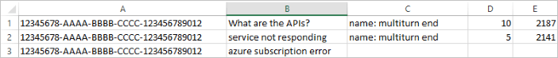

# Batch testing TSV format

Batch testing is available from [source code](https://github.com/Azure-Samples/cognitive-services-qnamaker-csharp/tree/master/documentation-samples/batchtesting) or as a [downloadable executable zipped](https://aka.ms/qna_btzip). The format of the command to run the batch test is:

```console
batchtesting.exe input.tsv https://YOUR-HOST.azurewebsites.net ENDPOINT-KEY out.tsv
```

|Param|Expected Value|
|--|--|
|1|name of tsv file formatted with [TSV input fields](#tsv-input-fields)|
|2|URI for endpoint, with YOUR-HOST from the Publish page of the QnA Maker portal.|
|3|ENDPOINT-KEY, found on Publish page of the QnA Maker portal.|
|4|name of tsv file created by batch test for results.|

Use the following information to understand and implement the TSV format for batch testing. 

## TSV input fields

|TSV input file fields|Notes|
|--|--|
|KBID|Your KB ID found on the Publish page.|
|Question|The question a user would enter.|
|Metadata tags|optional|
|Top parameter|optional| 
|Expected answer ID|optional|



## TSV output fields 

|TSV Output file parameters|Notes|
|--|--|
|KBID|Your KB ID found on the Publish page.|
|Question|The question as entered from the input file.|
|Answer|Top answer from your knowledge base.|
|Answer ID|Answer ID|
|Score|Prediction score for answer. |
|Metadata tags|associated with returned answer|
|Expected answer ID|optional (only when expected answer ID is given)|
|Judgment label|optional, values could be: correct or incorrect (only when expected answer is given)|
