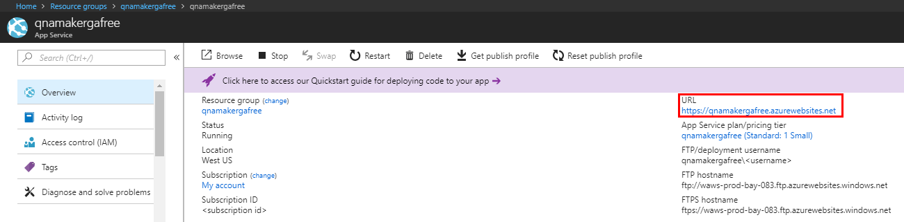
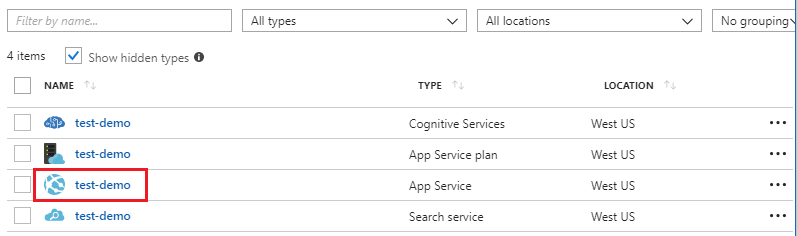

# Troubleshooting for QnA Maker

The curated list of the most frequently asked questions regarding the QnA Maker service will help you adopt the service faster and with better results.

[!INCLUDE [Custom question answering](./includes/new-version.md)]

## Manage predictions

<b>How can I improve the throughput performance for query predictions?</b>

**Answer**:
Throughput performance issues indicate you need to scale up for both your App service and your Cognitive Search. Consider adding a replica to your Cognitive Search to improve performance.

Learn more about [pricing tiers](Concepts/azure-resources.md).

<b>How to get the QnAMaker service endpoint</b>

**Answer**:
QnAMaker service endpoint is useful for debugging purposes when you contact QnAMaker Support or UserVoice. The endpoint is a URL in this form: `https://your-resource-name.azurewebsites.net`.

1. Go to your QnAMaker service (resource group) in the [Azure portal](https://portal.azure.com)

    

1. Select the App Service associated with the QnA Maker resource. Typically, the names are the same.

     

1. The endpoint URL is available in the Overview section

    

## Manage the knowledge base

<b>I accidentally deleted a part of my QnA Maker, what should I do?</b>

**Answer**:
Do not delete any of the Azure services created along with the QnA Maker resource such as Search or Web App. These are necessary for QnA Maker to work, if you delete one, QnA Maker will stop working correctly.

All deletes are permanent, including question and answer pairs, files, URLs, custom questions and answers, knowledge bases, or Azure resources. Make sure you export your knowledge base from the **Settings** page before deleting any part of your knowledge base.

<b>Why is my URL(s)/file(s) not extracting question-answer pairs?</b>

**Answer**:
It's possible that QnA Maker can't auto-extract some question-and-answer (QnA) content from valid FAQ URLs. In such cases, you can paste the QnA content in a .txt file and see if the tool can ingest it. Alternately, you can editorially add content to your knowledge base through the [QnA Maker portal](https://qnamaker.ai).

<b>How large a knowledge base can I create?</b>

**Answer**:
The size of the knowledge base depends on the SKU of Azure search you choose when creating the QnA Maker service. Read [here](./concepts/azure-resources.md) for more details.

<b>Why can't I see anything in the drop-down when I try to create a new knowledge base?</b>

**Answer**:
You haven't created any QnA Maker services in Azure yet. Read [here](./how-to/set-up-qnamaker-service-azure.md) to learn how to do that.

<b>How do I share a knowledge base with others?</b>

**Answer**:
Sharing works at the level of a QnA Maker service, that is, all knowledge bases in the service will be shared. Read [here](./index.yml) how to collaborate on a knowledge base.

<b>Can you share a knowledge base with a contributor that is not in the same AAD tenant, to modify a knowledge base?</b>

**Answer**:
Sharing is based on Azure role-based access control. If you can share _any_ resource in Azure with another user, you can also share QnA Maker.

<b>If you have an App Service Plan with 5 QnAMaker knowledge bases. Can you assign read/write rights to 5 different users so each of them can access only 1 QnAMaker knowledge base?</b>

**Answer**:
You can share an entire QnAMaker service, not individual knowledge bases.

<b>How can I change the default message when no good match is found?</b>

**Answer**:
The default message is part of the settings in your App service.
- Go to your App service resource in the Azure portal

- Select the **Settings** option

- Change the value of the **DefaultAnswer** setting
- Restart your App service

<b>Why is my SharePoint link not getting extracted?</b>

**Answer**:
See [Data source locations](./concepts/data-sources-and-content.md#data-source-locations) for more information.

<b>The updates that I made to my knowledge base are not reflected on publish. Why not?</b>

**Answer**:
Every edit operation, whether in a table update, test, or setting, needs to be saved before it can be published. Be sure to select **Save and train** button after every edit operation.

<b>Does the knowledge base support rich data or multimedia?</b>

**Answer**:

#### Multimedia auto-extraction for files and URLs

* URLS - limited HTML-to-Markdown conversion capability.
* Files - not supported

#### Answer text in markdown
Once QnA pairs are in the knowledge base, you can edit an answer's markdown text to include links to media available from public URLs.

<b>Does QnA Maker support non-English languages?</b>

**Answer**:
See more details about [supported languages](./overview/language-support.md).

If you have content from multiple languages, be sure to create a separate service for each language.

## Manage service

<b>When should I restart my app service?</b>

**Answer**:
Refresh your app service when the caution icon is next to the version value for the knowledge base in the **Endpoint keys** table on the **User Settings** [page](https://www.qnamaker.ai/UserSettings).

<b>I deleted my existing Search service. How can I fix this?</b>

**Answer**:
If you delete an Azure AI Search index, the operation is final and the index cannot be recovered.

<b>I deleted my `testkb` index in my Search service. How can I fix this?</b>

**Answer**:
In case you deleted the `testkb` index in your Search service, you can restore the data from the last published KB. Please use the recovery tool [RestoreTestKBIndex](https://github.com/pchoudhari/QnAMakerBackupRestore/tree/master/RestoreTestKBFromProd) available on GitHub. 

<b>I am receiving the following error: Please check if QnA Maker App service's CORS settings allow https://www.qnamaker.ai or if there are any organization specific network restrictions. How can I resolve this?</b>

**Answer**:
In the API section of the App service pane, update the CORS setting to * or "https://www.qnamaker.ai". If this doesn't resolve the issue, check for any organization-specific restrictions.

<b>When should I refresh my endpoint keys?</b>

**Answer**:
Refresh your endpoint keys if you suspect that they have been compromised.

<b>Can I use the same Azure AI Search resource for knowledge bases using multiple languages?</b>

**Answer**:
To use multiple language and multiple knowledge bases, the user has to create a QnA Maker resource for each language. This will create a separate Azure search service per language. Mixing different language knowledge bases in a single Azure search service will result in degraded relevance of results.

<b>How can I change the name of the Azure AI Search resource used by QnA Maker?</b>

**Answer**:
The name of the Azure AI Search resource is the QnA Maker resource name with some random letters appended at the end. This makes it hard to distinguish between multiple Search resources for QnA Maker. Create a separate search service (naming it the way you would like to) and connect it to your QnA Service. The steps are similar to the steps you need to do to [upgrade an Azure search](How-To/set-up-qnamaker-service-azure.md#upgrade-the-azure-ai-search-service).

<b>When QnA Maker returns `Runtime core is not initialized,` how do I fix it?</b>

**Answer**:
The disk space for your app service might be full. Steps to fix your disk space:

1. In the [Azure portal](https://portal.azure.com), select your QnA Maker's App service, then stop the service.
1. While still on the App service, select **Development Tools**, then **Advanced Tools**, then **Go**. This opens a new browser window.
1. Select **Debug console**, then **CMD** to open a command-line tool.
1. Navigate to the _site/wwwroot/Data/QnAMaker/_ directory.
1. Remove all the folders whose name begins with `rd`.

    **Do not delete** the following:

    * KbIdToRankerMappings.txt file
    * EndpointSettings.json file
    * EndpointKeys folder

1. Start the App service.
1. Access your knowledge base to verify it works now.

<b>Why is my Application Insights not working?</b>

**Answer**:
Please cross check and update below steps to fix the issue:

1. In App Service -> Settings group -> Configuration section -> Application Settings -> Name "UserAppInsightsKey" parameters is configured properly and set to the respective application insights Overview tab ("Instrumentation Key") Guid. 

1. In App Service -> Settings group -> "Application Insights" section -> Make sure app insights is enabled and connected to respective application insights resource.

<b>My Application Insights is enabled but why is it not working properly?</b>

**Answer**:
Please follow the below given steps: 

1.  Copy the value of '“APPINSIGHTS_INSTRUMENTATIONKEY” name' into 'UserAppInsightsKey' name by overriding if there is some value already present there. 

1.  If the 'UserAppInsightsKey' key does not exist in app settings, please add a new key with that name and copy the value.

1.  Save it and this will automatically restart the app service. This should resolve the issue. 

## Integrate with other services including Bots

<b>Do I need to use Bot Framework in order to use QnA Maker?</b>

**Answer**:
No, you do not need to use the [Bot Framework](https://github.com/Microsoft/botbuilder-dotnet) with QnA Maker. However, QnA Maker is offered as one of several templates in [Azure AI Bot Service](/azure/bot-service/). Bot Service enables rapid intelligent bot development through Microsoft Bot Framework, and it runs in a server-less environment.

<b>How can I create a new bot with QnA Maker?</b>

**Answer**:
Follow the instructions in [this](./quickstarts/create-publish-knowledge-base.md) documentation to create your Bot with Azure AI Bot Service.

<b>How do I use a different knowledge base with an existing Azure AI Bot Service?</b>

**Answer**:
You need to have the following information about your knowledge base:

* Knowledge base ID.
* Knowledge base's published endpoint custom subdomain name, known as `host`, found on **Settings** page after you publish.
* Knowledge base's published endpoint key - found on **Settings** page after you publish.

With this information, go to your bot's app service in the Azure portal. Under **Settings -> Configuration -> Application settings**, change those values.

The knowledge base's endpoint key is labeled `QnAAuthkey` in the ABS service.

<b>Can two or more client applications share a knowledge base?</b>

**Answer**:
Yes, the knowledge base can be queried from any number of clients. If the response from the knowledge base appears to be slow, or timed out, consider upgrading the service tier for the app service associated with the knowledge base.

<b>How do I embed the QnA Maker service in my website?</b>

**Answer**:
Follow these steps to embed the QnA Maker service as a web-chat control in your website:

1. Create your FAQ bot by following the instructions [here](./quickstarts/create-publish-knowledge-base.md).
2. Enable the web chat by following the steps [here](/azure/bot-service/bot-service-channel-connect-webchat)

## Data storage

<b>What data is stored and where is it stored?</b>

**Answer**:

When you create your QnA Maker service, you selected an Azure region. Your knowledge bases and log files are stored in this region.

