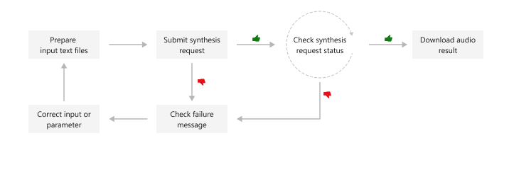

# Batch synthesis API (Preview) for text to speech

The Batch synthesis API (Preview) can synthesize a large volume of text input (long and short) asynchronously. Publishers and audio content platforms can create long audio content in a batch. For example: audio books, news articles, and documents. The batch synthesis API can create synthesized audio longer than 10 minutes.

> [!IMPORTANT]
> The Batch synthesis API is currently in public preview. Once it's generally available, the Long Audio API will be deprecated. For more information, see [Migrate to batch synthesis API](migrate-to-batch-synthesis.md).

The batch synthesis API is asynchronous and doesn't return synthesized audio in real-time. You submit text files to be synthesized, poll for the status, and download the audio output when the status indicates success. The text inputs must be plain text or [Speech Synthesis Markup Language (SSML)](speech-synthesis-markup.md) text.

This diagram provides a high-level overview of the workflow.



> [!TIP]
> You can also use the [Speech SDK](speech-sdk.md) to create synthesized audio longer than 10 minutes by iterating over the text and synthesizing it in chunks. For a C# example, see [GitHub](https://github.com/Azure-Samples/cognitive-services-speech-sdk/blob/master/samples/csharp/sharedcontent/console/speech_synthesis_samples.cs).

You can use the following REST API operations for batch synthesis:

| Operation              | Method   | REST API call                                 |
| ---------------------- | -------- | --------------------------------------------- |
| [Create batch synthesis](#create-batch-synthesis) | `POST`   | texttospeech/3.1-preview1/batchsynthesis      |
| [Get batch synthesis](#get-batch-synthesis)    | `GET`    | texttospeech/3.1-preview1/batchsynthesis/{id} |
| [List batch synthesis](#list-batch-synthesis)   | `GET`    | texttospeech/3.1-preview1/batchsynthesis      |
| [Delete batch synthesis](#delete-batch-synthesis) | `DELETE` | texttospeech/3.1-preview1/batchsynthesis/{id} |

For code samples, see [GitHub](https://github.com/Azure-Samples/cognitive-services-speech-sdk/tree/master/samples/batch-synthesis).

## Create batch synthesis

To submit a batch synthesis request, construct the HTTP POST request body according to the following instructions:

- Set the required `textType` property. 
- If the `textType` property is set to "PlainText", then you must also set the `voice` property in the `synthesisConfig`. In the example below, the `textType` is set to "SSML", so the `speechSynthesis` isn't set.
- Set the required `displayName` property. Choose a name that you can refer to later. The display name doesn't have to be unique.
- Optionally you can set the `description`, `timeToLive`, and other properties. For more information, see [batch synthesis properties](batch-synthesis-properties.md).

> [!NOTE]
> The maximum JSON payload size that will be accepted is 500 kilobytes. Each Speech resource can have up to 200 batch synthesis jobs that are running concurrently.

Make an HTTP POST request using the URI as shown in the following example. Replace `YourSpeechKey` with your Speech resource key, replace `YourSpeechRegion` with your Speech resource region, and set the request body properties as previously described.

```azurecli-interactive
curl -v -X POST -H "Ocp-Apim-Subscription-Key: YourSpeechKey" -H "Content-Type: application/json" -d '{
    "displayName": "batch synthesis sample",
    "description": "my ssml test",
    "textType": "SSML",
    "inputs": [
        {
            "text": "<speak version='\''1.0'\'' xml:lang='\''en-US'\''>
				<voice name='\''en-US-JennyNeural'\''>
					The rainbow has seven colors.
				</voice>
			</speak>",
        },
    ],
    "properties": {
        "outputFormat": "riff-24khz-16bit-mono-pcm",
        "wordBoundaryEnabled": false,
        "sentenceBoundaryEnabled": false,
        "concatenateResult": false,
        "decompressOutputFiles": false
    },
}'  "https://YourSpeechRegion.customvoice.api.speech.microsoft.com/api/texttospeech/3.1-preview1/batchsynthesis"
```

You should receive a response body in the following format:

```json
{
  "textType": "SSML",
  "synthesisConfig": {},
  "customVoices": {},
  "properties": {
    "timeToLive": "P31D",
    "outputFormat": "riff-24khz-16bit-mono-pcm",
    "concatenateResult": false,
    "decompressOutputFiles": false,
    "wordBoundaryEnabled": false,
    "sentenceBoundaryEnabled": false
  },
  "lastActionDateTime": "2022-11-16T15:07:04.121Z",
  "status": "NotStarted",
  "id": "1e2e0fe8-e403-417c-a382-b55eb2ea943d",
  "createdDateTime": "2022-11-16T15:07:04.121Z",
  "displayName": "batch synthesis sample",
  "description": "my ssml test"
}
```

The `status` property should progress from `NotStarted` status, to `Running`, and finally to `Succeeded` or `Failed`. You can call the [GET batch synthesis API](#get-batch-synthesis) periodically until the returned status is `Succeeded` or `Failed`.

## Get batch synthesis

To get the status of the batch synthesis job, make an HTTP GET request using the URI as shown in the following example. Replace `YourSynthesisId` with your batch synthesis ID, replace `YourSpeechKey` with your Speech resource key, and replace `YourSpeechRegion` with your Speech resource region.

```azurecli-interactive
curl -v -X GET "https://YourSpeechRegion.customvoice.api.speech.microsoft.com/api/texttospeech/3.1-preview1/batchsynthesis/YourSynthesisId" -H "Ocp-Apim-Subscription-Key: YourSpeechKey"
```

You should receive a response body in the following format:

```json
{
    "textType": "SSML",
    "synthesisConfig": {},
    "customVoices": {},
    "properties": {
      "audioSize": 100000,
      "durationInTicks": 31250000,
      "succeededAudioCount": 1,
      "failedAudioCount": 0,
      "duration": "PT3.125S",
      "billingDetails": {
        "customNeural": 0,
        "neural": 33
      },
      "timeToLive": "P31D",
      "outputFormat": "riff-24khz-16bit-mono-pcm",
      "concatenateResult": false,
      "decompressOutputFiles": false,
      "wordBoundaryEnabled": false,
      "sentenceBoundaryEnabled": false
    },
    "outputs": {
      "result": "https://cvoiceprodeus.blob.core.windows.net/batch-synthesis-output/41b83de2-380d-45dc-91af-722b68cfdc8e/results.zip?SAS_Token"
    },
    "lastActionDateTime": "2022-11-05T14:00:32.523Z",
    "status": "Succeeded",
    "id": "41b83de2-380d-45dc-91af-722b68cfdc8e",
    "createdDateTime": "2022-11-05T14:00:31.523Z",
    "displayName": "batch synthesis sample",
    "description": "my test"
  }
```

From `outputs.result`, you can download a ZIP file that contains the audio (such as `0001.wav`), summary, and debug details. For more information, see [batch synthesis results](#batch-synthesis-results).

## List batch synthesis

To list all batch synthesis jobs for the Speech resource, make an HTTP GET request using the URI as shown in the following example. Replace `YourSpeechKey` with your Speech resource key and replace `YourSpeechRegion` with your Speech resource region. Optionally, you can set the `skip` and `top` (page size) query parameters in URL. The default value for `skip` is 0 and the default value for `top` is 100.

```azurecli-interactive
curl -v -X GET "https://YourSpeechRegion.customvoice.api.speech.microsoft.com/api/texttospeech/3.1-preview1/batchsynthesis?skip=0&top=2" -H "Ocp-Apim-Subscription-Key: YourSpeechKey"
```

You should receive a response body in the following format:

```json
{
  "values": [
    {
      "textType": "SSML",
      "synthesisConfig": {},
      "customVoices": {},
      "properties": {
        "audioSize": 100000,
        "durationInTicks": 31250000,
        "succeededAudioCount": 1,
        "failedAudioCount": 0,
        "duration": "PT3.125S",
        "billingDetails": {
          "customNeural": 0,
          "neural": 33
        },
        "timeToLive": "P31D",
        "outputFormat": "riff-24khz-16bit-mono-pcm",
        "concatenateResult": false,
        "decompressOutputFiles": false,
        "wordBoundaryEnabled": false,
        "sentenceBoundaryEnabled": false
      },
      "outputs": {
        "result": "https://cvoiceprodeus.blob.core.windows.net/batch-synthesis-output/41b83de2-380d-45dc-91af-722b68cfdc8e/results.zip?SAS_Token"
      },
      "lastActionDateTime": "2022-11-05T14:00:32.523Z",
      "status": "Succeeded",
      "id": "41b83de2-380d-45dc-91af-722b68cfdc8e",
      "createdDateTime": "2022-11-05T14:00:31.523Z",
      "displayName": "batch synthesis sample",
      "description": "my test"
    }
    {
      "textType": "PlainText",
      "synthesisConfig": {
        "voice": "en-US-JennyNeural",
        "style": "chat",
        "rate": "+30.00%",
        "pitch": "x-high",
        "volume": "80"
      },
      "customVoices": {},
      "properties": {
        "audioSize": 79384,
        "durationInTicks": 24800000,
        "succeededAudioCount": 1,
        "failedAudioCount": 0,
        "duration": "PT2.48S",
        "billingDetails": {
          "customNeural": 0,
          "neural": 33
        },
        "timeToLive": "P31D",
        "outputFormat": "riff-24khz-16bit-mono-pcm",
        "concatenateResult": false,
        "decompressOutputFiles": false,
        "wordBoundaryEnabled": false,
        "sentenceBoundaryEnabled": false
      },
      "outputs": {
        "result": "https://cvoiceprodeus.blob.core.windows.net/batch-synthesis-output/38e249bf-2607-4236-930b-82f6724048d8/results.zip?SAS_Token"
      },
      "lastActionDateTime": "2022-11-05T18:52:23.210Z",
      "status": "Succeeded",
      "id": "38e249bf-2607-4236-930b-82f6724048d8",
      "createdDateTime": "2022-11-05T18:52:22.807Z",
      "displayName": "batch synthesis sample",
      "description": "my test"
    },
  ],
  // The next page link of the list of batch synthesis.
  "@nextLink": "https://{region}.customvoice.api.speech.microsoft.com/api/texttospeech/3.1-preview1/batchsynthesis?skip=0&top=2"
} 
```

From `outputs.result`, you can download a ZIP file that contains the audio (such as `0001.wav`), summary, and debug details. For more information, see [batch synthesis results](#batch-synthesis-results).

The `values` property in the json response lists your synthesis requests. The list is paginated, with a maximum page size of 100. The `"@nextLink"` property is provided as needed to get the next page of the paginated list. 

## Delete batch synthesis

Delete the batch synthesis job history after you retrieved the audio output results. The Speech service will keep each synthesis history for up to 31 days, or the duration of the request `timeToLive` property, whichever comes sooner. The date and time of automatic deletion (for synthesis jobs with a status of "Succeeded" or "Failed") is equal to the `lastActionDateTime` + `timeToLive` properties.

To delete a batch synthesis job, make an HTTP DELETE request using the URI as shown in the following example. Replace `YourSynthesisId` with your batch synthesis ID, replace `YourSpeechKey` with your Speech resource key, and replace `YourSpeechRegion` with your Speech resource region.

```azurecli-interactive
curl -v -X DELETE "https://YourSpeechRegion.customvoice.api.speech.microsoft.com/api/texttospeech/3.1-preview1/batchsynthesis/YourSynthesisId" -H "Ocp-Apim-Subscription-Key: YourSpeechKey"
```

The response headers include `HTTP/1.1 204 No Content` if the delete request was successful.

## Batch synthesis results

After you [get a batch synthesis job](#get-batch-synthesis) with `status` of "Succeeded", you can download the audio output results. Use the URL from the `outputs.result` property of the [get batch synthesis](#get-batch-synthesis) response. 

To get the batch synthesis results file, make an HTTP GET request using the URI as shown in the following example. Replace `YourOutputsResultUrl` with the URL from the `outputs.result` property of the [get batch synthesis](#get-batch-synthesis) response. Replace `YourSpeechKey` with your Speech resource key.

```azurecli-interactive
curl -v -X GET "YourOutputsResultUrl" -H "Ocp-Apim-Subscription-Key: YourSpeechKey" > results.zip
```

The results are in a ZIP file that contains the audio (such as `0001.wav`), summary, and debug details. The numbered prefix of each filename (shown below as `[nnnn]`) is in the same order as the text inputs used when you created the batch synthesis.

> [!NOTE]
> The `[nnnn].debug.json` file contains the synthesis result ID and other information that might help with troubleshooting. The properties that it contains might change, so you shouldn't take any dependencies on the JSON format.

The summary file contains the synthesis results for each text input. Here's an example `summary.json` file:

```json
{
  "jobID":  "41b83de2-380d-45dc-91af-722b68cfdc8e",
  "status":  "Succeeded",
  "results":  [
    {
      "texts":  [
        "<speak version='1.0' xml:lang='en-US'>\n\t\t\t\t<voice name='en-US-JennyNeural'>\n\t\t\t\t\tThe rainbow has seven colors.\n\t\t\t\t</voice>\n\t\t\t</speak>"
      ],
      "status":  "Succeeded",
      "billingDetails":  {
        "CustomNeural":  "0",
        "Neural":  "33"
      },
      "audioFileName":  "0001.wav",
      "properties":  {
        "audioSize":  "100000",
        "duration":  "PT3.1S",
        "durationInTicks":  "31250000"
      }
    }
  ]
}
```

If sentence boundary data was requested (`"sentenceBoundaryEnabled": true`), then a corresponding `[nnnn].sentence.json` file will be included in the results. Likewise, if word boundary data was requested (`"wordBoundaryEnabled": true`), then a corresponding `[nnnn].word.json` file will be included in the results. 

Here's an example word data file with both audio offset and duration in milliseconds:

```json
[
  {
    "Text": "the",
    "AudioOffset": 38,
    "Duration": 153
  },
  {
    "Text": "rainbow",
    "AudioOffset": 201,
    "Duration": 326
  },
  {
    "Text": "has",
    "AudioOffset": 567,
    "Duration": 96
  },
  {
    "Text": "seven",
    "AudioOffset": 673,
    "Duration": 96
  },
  {
    "Text": "colors",
    "AudioOffset": 778,
    "Duration": 451
  },
]
```

## Batch synthesis latency and best practices

When using batch synthesis for generating synthesized speech, it's important to consider the latency involved and follow best practices for achieving optimal results.

### Latency in batch synthesis

The latency in batch synthesis depends on various factors, including the complexity of the input text, the number of inputs in the batch, and the processing capabilities of the underlying hardware.

The latency for batch synthesis is as follows (approximately):

- The latency of 50% of the synthesized speech outputs is within 10-20 seconds.

- The latency of 95% of the synthesized speech outputs is within 120 seconds.

### Best practices

When considering batch synthesis for your application, it's recommended to assess whether the latency meets your requirements. If the latency aligns with your desired performance, batch synthesis can be a suitable choice. However, if the latency does not meet your needs, you might consider using real-time API.

## HTTP status codes

The section details the HTTP response codes and messages from the batch synthesis API.

### HTTP 200 OK

HTTP 200 OK indicates that the request was successful.

### HTTP 201 Created

HTTP 201 Created indicates that the create batch synthesis request (via HTTP POST) was successful.

### HTTP 204 error

An HTTP 204 error indicates that the request was successful, but the resource doesn't exist. For example:
- You tried to get or delete a synthesis job that doesn't exist. 
- You successfully deleted a synthesis job. 

### HTTP 400 error 

Here are examples that can result in the 400 error:
- The `outputFormat` is unsupported or invalid. Provide a valid format value, or leave `outputFormat` empty to use the default setting.
- The number of requested text inputs exceeded the limit of 1,000.
- The `top` query parameter exceeded the limit of 100.
- You tried to use an invalid deployment ID or a custom voice that isn't successfully deployed. Make sure the Speech resource has access to the custom voice, and the custom voice is successfully deployed. You must also ensure that the mapping of `{"your-custom-voice-name": "your-deployment-ID"}` is correct in your batch synthesis request.
- You tried to delete a batch synthesis job that hasn't started or hasn't completed running. You can only delete batch synthesis jobs that have a status of "Succeeded" or "Failed".
- You tried to use a *F0* Speech resource, but the region only supports the *Standard* Speech resource pricing tier. 
- You tried to create a new batch synthesis job that would exceed the limit of 200 active jobs. Each Speech resource can have up to 200 batch synthesis jobs that don't have a status of "Succeeded" or "Failed".

### HTTP 404 error

The specified entity can't be found. Make sure the synthesis ID is correct.

### HTTP 429 error
 
There are too many recent requests. Each client application can submit up to 50 requests per 5 seconds for each Speech resource. Reduce the number of requests per second.

You can check the rate limit and quota remaining via the HTTP headers as shown in the following example:

```http
X-RateLimit-Limit: 50
X-RateLimit-Remaining: 49
X-RateLimit-Reset: 2022-11-11T01:49:43Z
```

### HTTP 500 error

HTTP 500 Internal Server Error indicates that the request failed. The response body contains the error message.

### HTTP error example

Here's an example request that results in an HTTP 400 error, because the `top` query parameter is set to a value greater than 100.

```console
curl -v -X GET "https://YourSpeechRegion.customvoice.api.speech.microsoft.com/api/texttospeech/3.1-preview1/batchsynthesis?skip=0&top=200" -H "Ocp-Apim-Subscription-Key: YourSpeechKey"
```

In this case, the response headers will include `HTTP/1.1 400 Bad Request`.

The response body will resemble the following JSON example:

```json
{
  "code": "InvalidRequest",
  "message": "The top parameter should not be greater than 100.",
  "innerError": {
    "code": "InvalidParameter",
    "message": "The top parameter should not be greater than 100."
  }
}
```

## Next steps

- [Speech Synthesis Markup Language (SSML)](speech-synthesis-markup.md)
- [Batch synthesis properties](batch-synthesis-properties.md)
- [Migrate to batch synthesis](migrate-to-batch-synthesis.md)
