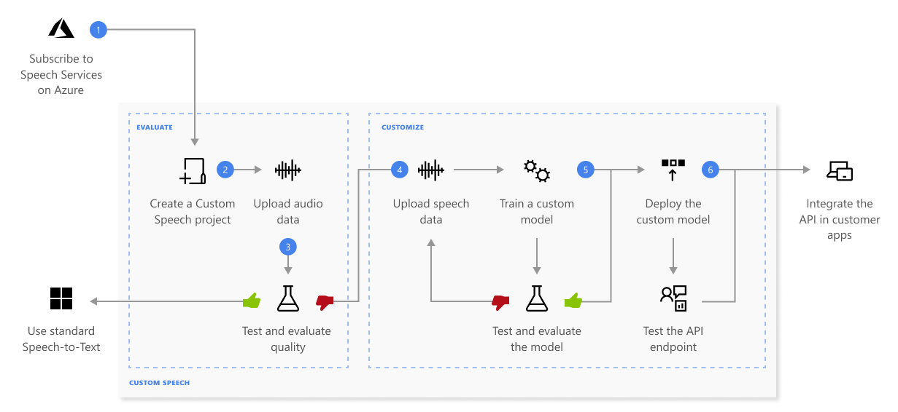

# What is Custom Speech?

With Custom Speech, you can evaluate and improve the accuracy of speech recognition for your applications and products. A custom speech model can be used for [real-time speech to text](speech-to-text.md), [speech translation](speech-translation.md), and [batch transcription](batch-transcription.md).

Out of the box, speech recognition utilizes a Universal Language Model as a base model that is trained with Microsoft-owned data and reflects commonly used spoken language. The base model is pre-trained with dialects and phonetics representing various common domains. When you make a speech recognition request, the most recent base model for each [supported language](language-support.md?tabs=stt) is used by default. The base model works well in most speech recognition scenarios.

A custom model can be used to augment the base model to improve recognition of domain-specific vocabulary specific to the application by providing text data to train the model. It can also be used to improve recognition based for the specific audio conditions of the application by providing audio data with reference transcriptions.  

## How does it work?

With Custom Speech, you can upload your own data, test and train a custom model, compare accuracy between models, and deploy a model to a custom endpoint.

Here's more information about the sequence of steps shown in the previous diagram:

1. [Create a project](how-to-custom-speech-create-project.md) and choose a model. Use a <a href="https://portal.azure.com/#create/Microsoft.CognitiveServicesSpeechServices" title="Create a Speech resource" target="_blank">Speech resource</a> that you create in the Azure portal. If you'll train a custom model with audio data, choose a Speech resource region with dedicated hardware for training audio data. See footnotes in the [regions](regions.md#speech-service) table for more information.
1. [Upload test data](./how-to-custom-speech-upload-data.md). Upload test data to evaluate the speech to text offering for your applications, tools, and products.
1. [Test recognition quality](how-to-custom-speech-inspect-data.md). Use the [Speech Studio](https://aka.ms/speechstudio/customspeech) to play back uploaded audio and inspect the speech recognition quality of your test data. 
1. [Test model quantitatively](how-to-custom-speech-evaluate-data.md). Evaluate and improve the accuracy of the speech to text model. The Speech service provides a quantitative word error rate (WER), which you can use to determine if more training is required. 
1. [Train a model](how-to-custom-speech-train-model.md). Provide written transcripts and related text, along with the corresponding audio data. Testing a model before and after training is optional but recommended.
    > [!NOTE]
    > You pay for Custom Speech model usage and endpoint hosting, but you are not charged for training a model.
1. [Deploy a model](how-to-custom-speech-deploy-model.md). Once you're satisfied with the test results, deploy the model to a custom endpoint. Except for [batch transcription](batch-transcription.md), you must deploy a custom endpoint to use a Custom Speech model.
    > [!TIP]
    > A hosted deployment endpoint isn't required to use Custom Speech with the [Batch transcription API](batch-transcription.md). You can conserve resources if the custom speech model is only used for batch transcription. For more information, see [Speech service pricing](https://azure.microsoft.com/pricing/details/cognitive-services/speech-services/).

## Responsible AI 

An AI system includes not only the technology, but also the people who use it, the people who will be affected by it, and the environment in which it's deployed. Read the transparency notes to learn about responsible AI use and deployment in your systems. 

* [Transparency note and use cases](/legal/cognitive-services/speech-service/speech-to-text/transparency-note?context=/azure/ai-services/speech-service/context/context)
* [Characteristics and limitations](/legal/cognitive-services/speech-service/speech-to-text/characteristics-and-limitations?context=/azure/ai-services/speech-service/context/context)
* [Integration and responsible use](/legal/cognitive-services/speech-service/speech-to-text/guidance-integration-responsible-use?context=/azure/ai-services/speech-service/context/context)
* [Data, privacy, and security](/legal/cognitive-services/speech-service/speech-to-text/data-privacy-security?context=/azure/ai-services/speech-service/context/context)

## Next steps

* [Create a project](how-to-custom-speech-create-project.md) 
* [Upload test data](./how-to-custom-speech-upload-data.md)
* [Train a model](how-to-custom-speech-train-model.md)
