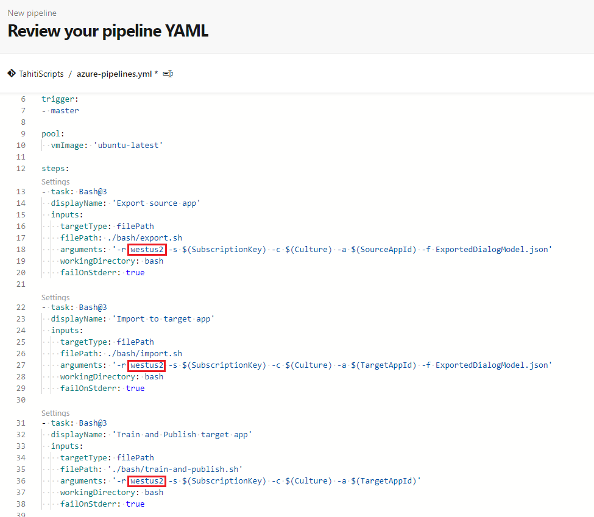

# Continuous Deployment with Azure DevOps

[!INCLUDE [deprecation notice](./includes/custom-commands-retire.md)]

In this article, you learn how to set up continuous deployment for your Custom Commands applications. The scripts to support the CI/CD workflow are provided to you.

## Prerequisite
> [!div class = "checklist"]
> * A Custom Commands application for development (DEV)
> * A Custom Commands application for production (PROD)
> * Sign up for [Azure Pipelines](/azure/devops/pipelines/get-started/pipelines-sign-up)

## Export/Import/Publish

The scripts are hosted at [Voice Assistant - Custom Commands](https://github.com/Azure-Samples/Cognitive-Services-Voice-Assistant/tree/master/custom-commands). Clone the scripts in the bash directory to your repository. Make sure you maintain the same path.

### Set up a pipeline 

1. Go to **Azure DevOps - Pipelines** and click "New Pipeline"
1. In **Connect** section, select the location of your repository where these scripts are located
1. In **Select** section, select your repository
1. In **Configure** section, select "Starter pipeline"
1. Next you'll get an editor with a YAML file, replace the "steps" section with this script.

    ```yaml
    steps:
    - task: Bash@3
      displayName: 'Export source app'
      inputs:
        targetType: filePath
        filePath: ./bash/export.sh
        arguments: '-r westus2 -s $(SubscriptionKey) -c $(Culture) -a $(SourceAppId) -f ExportedDialogModel.json'
        workingDirectory: bash
        failOnStderr: true
    
    - task: Bash@3
      displayName: 'Import to target app'
      inputs:
        targetType: filePath
        filePath: ./bash/import.sh
        arguments: '-r westus2 -s $(SubscriptionKey) -c $(Culture) -a $(TargetAppId) -f ExportedDialogModel.json'
        workingDirectory: bash
        failOnStderr: true
    
    - task: Bash@3
      displayName: 'Train and Publish target app'
      inputs:
        targetType: filePath
        filePath: './bash/train-and-publish.sh'
        arguments: '-r westus2 -s $(SubscriptionKey) -c $(Culture) -a $(TargetAppId)'
        workingDirectory: bash
        failOnStderr: true
    ```
    
1. Note that these scripts assume that you are using the region `westus2`, if that's not the case update the arguments of the tasks accordingly

    > [!div class="mx-imgBorder"]
    > 

1. In the "Save and run" button, open the dropdown and click "Save"

### Hook up the pipeline with your application

1. Navigate to the main page of the pipeline.
1. In the top-right corner dropdown, select **Edit pipeline**. It gets you to a YAML editor. 
1. In the top-right corner next to "Run" button, select **Variables**. Select **New variable**.
1. Add these variables:
    
    | Variable | Description |
    | ------- | --------------- | ----------- |
    | SourceAppId | ID of the DEV application |
    | TargetAppId | ID of the PROD application |
    | SubscriptionKey | The key used for both applications |
    | Culture | Culture of the applications (en-us) |

    > [!div class="mx-imgBorder"]
    > 

1. Select "Run" and then select the "Job" running. 

    You should see a list of tasks running that contains: "Export source app", "Import to target app" & "Train and Publish target app"

## Deploy from source code

In case you want to keep the definition of your application in a repository, we provide the scripts for deployments from source code. Since the scripts are in bash, If you are using Windows you'll need to install the [Linux subsystem](/windows/wsl/install-win10).

The scripts are hosted at [Voice Assistant - Custom Commands](https://github.com/Azure-Samples/Cognitive-Services-Voice-Assistant/tree/master/custom-commands). Clone the scripts in the bash directory to your repository. Make sure you maintain the same path.

### Prepare your repository

1. Create a directory for your application, in our example create one called "apps".
1. Update the arguments of the bash script below, and run. It will import the dialog model of your application to the file myapp.json
    ```BASH
    bash/export.sh -r <region> -s <subscriptionkey> -c en-us -a <appid> -f apps/myapp.json
    ```
    | Arguments | Description |
    | ------- | --------------- | ----------- |
    | region | Your Speech resource region. For example: `westus2` |
    | subscriptionkey | Your Speech resource key. |
    | appid | the Custom Commands' application ID you want to export. |

1. Push these changes to your repository.

### Set up a pipeline 

1. Go to **Azure DevOps - Pipelines** and click "New Pipeline"
1. In **Connect** section, select the location of your repository where these scripts are located
1. In **Select** section, select your repository
1. In **Configure** section, select "Starter pipeline"
1. Next you'll get an editor with a YAML file, replace the "steps" section with this script.

    ```yaml
    steps:
    - task: Bash@3
      displayName: 'Import app'
      inputs:
        targetType: filePath
        filePath: ./bash/import.sh
        arguments: '-r westus2 -s $(SubscriptionKey) -c $(Culture) -a $(TargetAppId) -f ../apps/myapp.json'
        workingDirectory: bash
        failOnStderr: true
    
    - task: Bash@3
      displayName: 'Train and Publish app'
      inputs:
        targetType: filePath
        filePath: './bash/train-and-publish.sh'
        arguments: '-r westus2 -s $(SubscriptionKey) -c $(Culture) -a $(TargetAppId)'
        workingDirectory: bash
        failOnStderr: true
    ```

    > [!NOTE]
    > these scripts assume that you are using the region westus2, if that's not the case update the arguments of the tasks accordingly

1. In the "Save and run" button, open the dropdown and click "Save"

### Hook up the pipeline with your target applications

1. Navigate to the main page of the pipeline.
1. In the top-right corner dropdown, select **Edit pipeline**. It gets you to a YAML editor. 
1. In the top-right corner next to "Run" button, select **Variables**. Select **New variable**.
1. Add these variables:

    | Variable | Description |
    | ------- | --------------- | ----------- |
    | TargetAppId | ID of the PROD application |
    | SubscriptionKey | The key used for both applications |
    | Culture | Culture of the applications (en-us) |

1. Select "Run" and then select the "Job" running.
    You should see a list of tasks running that contains: "Import app" & "Train and Publish app"

## Next steps

> [!div class="nextstepaction"]
> [See samples on GitHub](https://aka.ms/speech/cc-samples)
