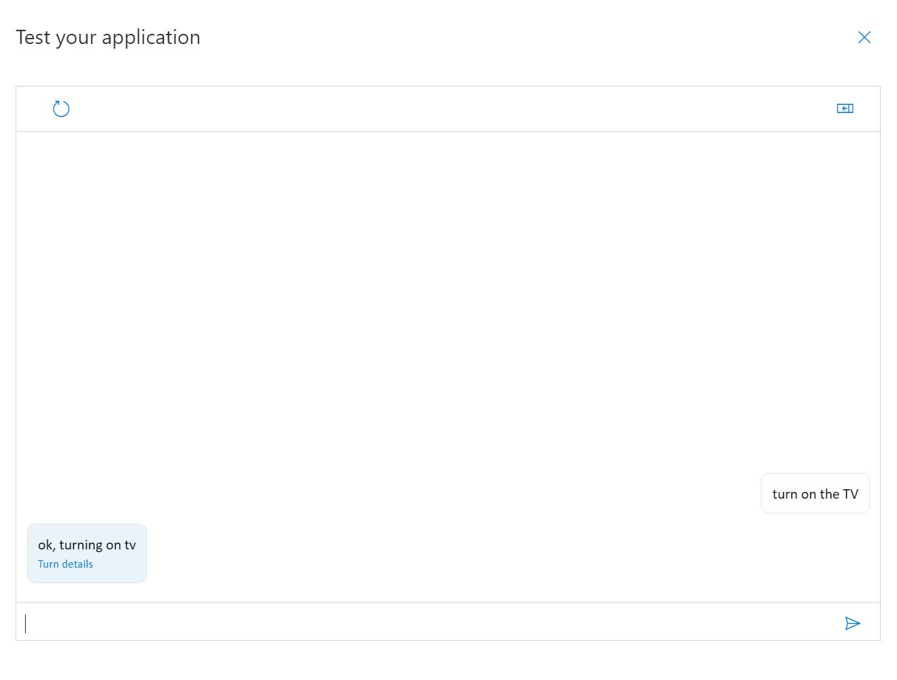

# Test your Custom Commands Application

[!INCLUDE [deprecation notice](./includes/custom-commands-retire.md)]

In this article, you learn different approaches to testing a custom commands application.

## Test in the portal

Test in the portal is the simplest and quickest way to check if your custom command application work as expected. After the app is successfully trained, click `Test` button to start testing.

> [!div class="mx-imgBorder"]
> 

## Test with Windows Voice Assistant Client

The Windows Voice Assistant Client is a Windows Presentation Foundation (WPF) application in C# that makes it easy to test interactions with your bot before creating a custom client application.

The tool can accept a custom command application ID. It allows you to test your task completion or command-and-control scenario hosted on the Custom Commands service.

To set up the client, checkout [Windows Voice Assistant Client](https://github.com/Azure-Samples/Cognitive-Services-Voice-Assistant/tree/master/clients/csharp-wpf).

> [!div class="mx-imgBorder"]
> 

## Test programatically with the Voice Assistant Test Tool

The Voice Assistant Test Tool is a configurable .NET Core C# console application for end-to-end functional regression tests for your Microsoft Voice Assistant. 

The tool can run manually as a console command or automated as part of an Azure DevOps CI/CD pipeline to prevent regressions in your bot.

To learn how to set up the tool, see [Voice Assistant Test Tool](https://github.com/Azure-Samples/Cognitive-Services-Voice-Assistant/tree/main/clients/csharp-dotnet-core/voice-assistant-test).

## Test with Speech SDK-enabled client applications

The Speech software development kit (SDK) exposes many of the Speech service capabilities, which allows you to develop speech-enabled applications. It's available in many programming languages on most platforms.

To set up a Universal Windows Platform (UWP) client application with Speech SDK, and integrate it with your custom command application:  
- [How to: Integrate with a client application using Speech SDK](./how-to-custom-commands-setup-speech-sdk.md)
- [How to: Send activity to client application](./how-to-custom-commands-send-activity-to-client.md)
- [How to: Set up web endpoints](./how-to-custom-commands-setup-web-endpoints.md)

For other programming languages and platforms:
- [Speech SDK programming languages, platforms, scenario capacities](./speech-sdk.md)
- [Voice assistant sample codes](https://github.com/Azure-Samples/Cognitive-Services-Voice-Assistant)

## Next steps

> [!div class="nextstepaction"]
> [See samples on GitHub](https://aka.ms/speech/cc-samples)
