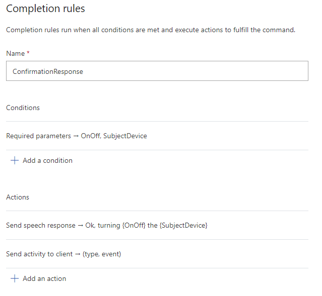
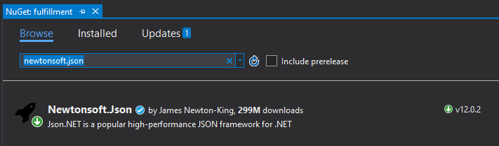
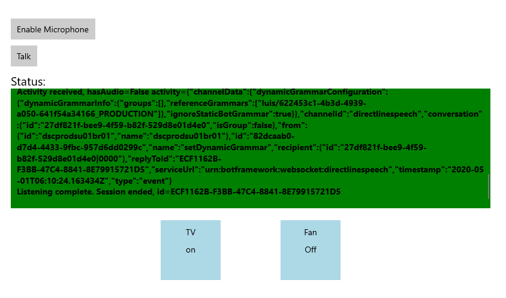

# Send Custom Commands activity to client application

[!INCLUDE [deprecation notice](./includes/custom-commands-retire.md)]

In this article, you learn how to send activity from a Custom Commands application to a client application running the Speech SDK.

You complete the following tasks:

- Define and send a custom JSON payload from your Custom Commands application
- Receive and visualize the custom JSON payload contents from a C# UWP Speech SDK client application

## Prerequisites
> [!div class = "checklist"]
> * [Visual Studio 2019](https://visualstudio.microsoft.com/downloads/) or higher. This guide uses Visual Studio 2019
> * An Azure AI Speech resource key and region: Create a Speech resource on the [Azure portal](https://portal.azure.com). For more information, see [Create a multi-service resource](../multi-service-resource.md?pivots=azportal).
> * A previously [created Custom Commands app](quickstart-custom-commands-application.md)
> * A Speech SDK enabled client app:
[How-to: Integrate with a client application using Speech SDK](./how-to-custom-commands-setup-speech-sdk.md)

## Setup Send activity to client 
1. Open the Custom Commands application you previously created
1. Select **TurnOnOff** command, select **ConfirmationResponse** under completion rule, then select **Add an action**
1. Under **New Action-Type**, select **Send activity to client**
1. Copy the JSON below to **Activity content**
   ```json
   {
      "type": "event",
      "name": "UpdateDeviceState",
      "value": {
        "state": "{OnOff}",
        "device": "{SubjectDevice}"
      }
    }
   ```
1. Select **Save** to create a new rule with a Send Activity action, **Train** and **Publish** the change

   > [!div class="mx-imgBorder"]
   > 

## Integrate with client application

In [How-to: Setup client application with Speech SDK (Preview)](./how-to-custom-commands-setup-speech-sdk.md), you created a UWP client application with Speech SDK that handled commands such as `turn on the tv`, `turn off the fan`. With some visuals added, you can see the result of those commands.

To Add labeled boxes with text indicating **on** or **off**, add the following XML block of StackPanel to `MainPage.xaml`.

```xml
<StackPanel Orientation="Vertical" H......>
......
</StackPanel>
<StackPanel Orientation="Horizontal" HorizontalAlignment="Center" Margin="20">
    <Grid x:Name="Grid_TV" Margin="50, 0" Width="100" Height="100" Background="LightBlue">
        <StackPanel>
            <TextBlock Text="TV" Margin="0, 10" TextAlignment="Center"/>
            <TextBlock x:Name="State_TV" Text="off" TextAlignment="Center"/>
        </StackPanel>
    </Grid>
    <Grid x:Name="Grid_Fan" Margin="50, 0" Width="100" Height="100" Background="LightBlue">
        <StackPanel>
            <TextBlock Text="Fan" Margin="0, 10" TextAlignment="Center"/>
            <TextBlock x:Name="State_Fan" Text="off" TextAlignment="Center"/>
        </StackPanel>
    </Grid>
</StackPanel>
<MediaElement ....../>
```

### Add reference libraries

Since you've created a JSON payload, you need to add a reference to the [JSON.NET](https://www.newtonsoft.com/json) library to handle deserialization.

1. Right-client your solution.
1. Choose **Manage NuGet Packages for Solution**, Select **Browse** 
1. If you already installed **Newtonsoft.json**, make sure its version is at least 12.0.3. If not, go to **Manage NuGet Packages for Solution - Updates**, search for **Newtonsoft.json** to update it. This guide is using version 12.0.3.

    > [!div class="mx-imgBorder"]
    > 

1. Also, make sure NuGet package **Microsoft.NETCore.UniversalWindowsPlatform** is at least 6.2.10. This guide is using version 6.2.10.

In `MainPage.xaml.cs', add

```C#
using Newtonsoft.Json; 
using Windows.ApplicationModel.Core;
using Windows.UI.Core;
```

### Handle the received payload

In `InitializeDialogServiceConnector`, replace the `ActivityReceived` event handler with following code. The modified `ActivityReceived` event handler will extract the payload from the activity and change the visual state of the tv or fan respectively.

```C#
connector.ActivityReceived += async (sender, activityReceivedEventArgs) =>
{
    NotifyUser($"Activity received, hasAudio={activityReceivedEventArgs.HasAudio} activity={activityReceivedEventArgs.Activity}");

    dynamic activity = JsonConvert.DeserializeObject(activityReceivedEventArgs.Activity);
    var name = activity?.name != null ? activity.name.ToString() : string.Empty;

    if (name.Equals("UpdateDeviceState"))
    {
        Debug.WriteLine("Here");
        var state = activity?.value?.state != null ? activity.value.state.ToString() : string.Empty;
        var device = activity?.value?.device != null ? activity.value.device.ToString() : string.Empty;

        if (state.Equals("on") || state.Equals("off"))
        {
            switch (device)
            {
                case "tv":
                    await CoreApplication.MainView.CoreWindow.Dispatcher.RunAsync(
                        CoreDispatcherPriority.Normal, () => { State_TV.Text = state; });
                    break;
                case "fan":
                    await CoreApplication.MainView.CoreWindow.Dispatcher.RunAsync(
                        CoreDispatcherPriority.Normal, () => { State_Fan.Text = state; });
                    break;
                default:
                    NotifyUser($"Received request to set unsupported device {device} to {state}");
                    break;
            }
        }
        else { 
            NotifyUser($"Received request to set unsupported state {state}");
        }
    }

    if (activityReceivedEventArgs.HasAudio)
    {
        SynchronouslyPlayActivityAudio(activityReceivedEventArgs.Audio);
    }
};
```

## Try it out

1. Start the application
1. Select Enable microphone
1. Select the Talk button
1. Say `turn on the tv`
1. The visual state of the tv should change to "on"
   > [!div class="mx-imgBorder"]
   > 

## Next steps

> [!div class="nextstepaction"]
> [How to: set up web endpoints](./how-to-custom-commands-setup-web-endpoints.md)
