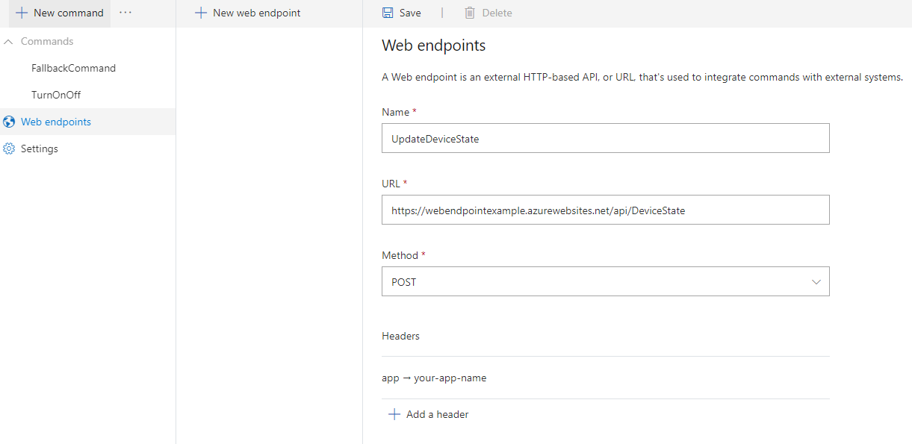
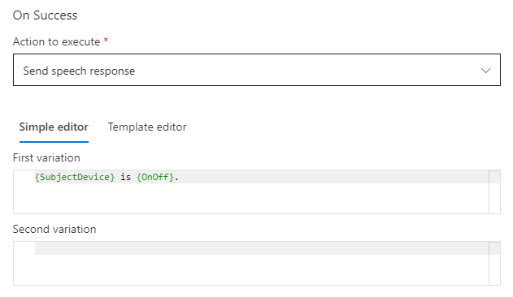
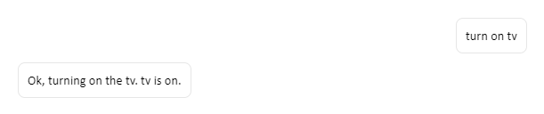
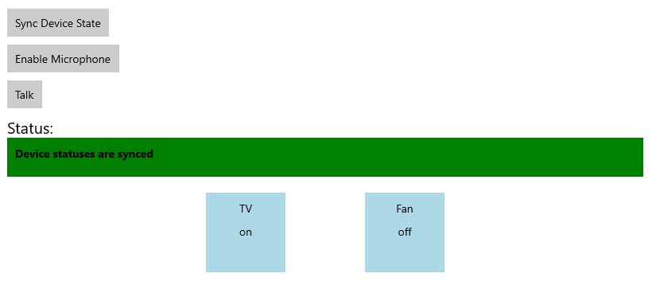

# Set up web endpoints

[!INCLUDE [deprecation notice](./includes/custom-commands-retire.md)]

In this article, you'll learn how to set up web endpoints in a Custom Commands application that allow you to make HTTP requests from a client application. You'll complete the following tasks:

- Set up web endpoints in Custom Commands application
- Call web endpoints in Custom Commands application
- Receive the web endpoints response
- Integrate the web endpoints response into a custom JSON payload, send, and visualize it from a C# UWP Speech SDK client application

## Prerequisites

> [!div class = "checklist"]
> * [Visual Studio 2019](https://visualstudio.microsoft.com/downloads/)
> * An Azure Cognitive Services Speech resource key and region: Create a Speech resource on the [Azure portal](https://portal.azure.com). For more information, see [Create a new Azure Cognitive Services resource](~/articles/cognitive-services/cognitive-services-apis-create-account.md?tabs=speech#create-a-new-azure-cognitive-services-resource).
> * A Custom Commands app (see [Create a voice assistant using Custom Commands](quickstart-custom-commands-application.md))
> * A Speech SDK enabled client app (see [Integrate with a client application using Speech SDK](how-to-custom-commands-setup-speech-sdk.md))

## Deploy an external web endpoint using Azure Function app

For this tutorial, you need an HTTP endpoint that maintains states for all the devices you set up in the **TurnOnOff** command of your Custom Commands application.

If you already have a web endpoint you want to call, skip to the [next section](#setup-web-endpoints-in-custom-commands). 
Alternatively, the next section provides details about a default hosted web endpoint you can use if you want to skip this section.

### Input format of Azure function

Next, you'll deploy an endpoint using [Azure Functions](../../azure-functions/index.yml).
The following is the format of a Custom Commands event that is passed to your Azure function. Use this information when you're writing your Azure Function app.

```json
{
  "conversationId": "string",
  "currentCommand": {
    "name": "string",
    "parameters": {
      "SomeParameterName": "string",
      "SomeOtherParameterName": "string"
    }
  },
  "currentGlobalParameters": {
      "SomeGlobalParameterName": "string",
      "SomeOtherGlobalParameterName": "string"
  }
}
```

    
The following table describes the key attributes of this input:
        
| Attribute | Explanation |
| ---------------- | --------------------------------------------------------------------------------------------------------------------------- |
| **conversationId** | The unique identifier of the conversation. Note this ID can be generated by the client app. |
| **currentCommand** | The command that's currently active in the conversation. |
| **name** | The name of the command. The `parameters` attribute is a map with the current values of the parameters. |
| **currentGlobalParameters** | A map like `parameters`, but used for global parameters. |


For the **DeviceState** Azure Function, an example Custom Commands event will look like following. This will act as an **input** to the function app.
    
```json
{
  "conversationId": "someConversationId",
  "currentCommand": {
    "name": "TurnOnOff",
    "parameters": {
      "item": "tv",
      "value": "on"
    }
  }
}
```

### Azure Function output for a Custom Command app

If output from your Azure Function is consumed by a Custom Commands app, it should appear in the following format. See [Update a command from a web endpoint](./how-to-custom-commands-update-command-from-web-endpoint.md) for details.

```json
{
  "updatedCommand": {
    "name": "SomeCommandName",
    "updatedParameters": {
      "SomeParameterName": "SomeParameterValue"
    },
    "cancel": false
  },
  "updatedGlobalParameters": {
    "SomeGlobalParameterName": "SomeGlobalParameterValue"
  }
}
```

### Azure Function output for a client application

If output from your Azure Function is consumed by a client application, the output can take whatever form the client application requires.

For our **DeviceState** endpoint, output of your Azure function is consumed by a client application instead of the Custom Commands application. Example output of the Azure function should look like the following:
    
```json
{
  "TV": "on",
  "Fan": "off"
}
``` 

This output should be written to an external storage, so that you can maintain the state of devices. The external storage state will be used in the [Integrate with client application](#integrate-with-client-application) section below.


### Deploy Azure function

We provide a sample you can configure and deploy as an Azure Functions app. To create a storage account for our sample, follow these steps.
 
1. Create table storage to save device state. In the Azure portal, create a new resource of type **Storage account** by name **devicestate**.
1. Copy the **Connection string** value from **devicestate -> Access keys**. You'll need to add this string secret to the downloaded sample Function App code.
1. Download sample [Function App code](https://github.com/Azure-Samples/Cognitive-Services-Voice-Assistant/tree/main/custom-commands/quick-start).
1. Open the downloaded solution in Visual Studio 2019. In **Connections.json**, replace **STORAGE_ACCOUNT_SECRET_CONNECTION_STRING** with the secret from Step 2.
1.  Download the **DeviceStateAzureFunction** code.

To deploy the sample app to Azure Functions, follow these steps.

1. [Deploy](../../azure-functions/index.yml) the Azure Functions app.
1. Wait for deployment to succeed and go the deployed resource on the Azure portal. 
1. Select **Functions** in the left pane, and then select **DeviceState**.
1.  In the new window, select **Code + Test** and then select **Get function URL**.
 
## Setup web endpoints in Custom Commands

Let's hook up the Azure function with the existing Custom Commands application.
In this section, you'll use an existing default **DeviceState** endpoint. If you created your own web endpoint using Azure Function or otherwise, use that instead of the default	`https://webendpointexample.azurewebsites.net/api/DeviceState`.

1. Open the Custom Commands application you previously created.
1. Go to **Web endpoints**, select **New web endpoint**.

   > [!div class="mx-imgBorder"]
   > 

   | Setting | Suggested value | Description |
   | ------- | --------------- | ----------- |
   | Name | UpdateDeviceState | Name for the web endpoint. |
   | URL | https://webendpointexample.azurewebsites.net/api/DeviceState | The URL of the endpoint you wish your custom command app to talk to. |
   | Method | POST | The allowed interactions (such as GET, POST) with your endpoint.|
   | Headers | Key: app, Value: take the first 8 digits of your applicationId | The header parameters to include in the request header.|

    > [!NOTE]
    > - The example web endpoint created using [Azure Functions](../../azure-functions/index.yml), which hooks up with the database that saves the device state of the tv and fan.
    > - The suggested header is only needed for the example endpoint.
    > - To make sure the value of the header is unique in our example endpoint, take the first 8 digits of your **applicationId**.
    > - In real world, the web endpoint can be the endpoint to the [IOT hub](../../iot-hub/about-iot-hub.md) that manages your devices.

1. Click **Save**.

## Call web endpoints

1. Go to **TurnOnOff** command, select **ConfirmationResponse** under completion rule, then select **Add an action**.
1. Under **New Action-Type**, select **Call web endpoint**
1. In **Edit Action - Endpoints**, select **UpdateDeviceState**, which is the web endpoint we created.  
1. In **Configuration**, put the following values:
   > [!div class="mx-imgBorder"]
   > 

   | Setting | Suggested value | Description |
   | ------- | --------------- | ----------- |
   | Endpoints | UpdateDeviceState | The web endpoint you wish to call in this action. |
   | Query parameters | item={SubjectDevice}&&value={OnOff} | The query parameters to append to the web endpoint URL.  |
   | Body content | N/A | The body content of the request. |

    > [!NOTE]
    > - The suggested query parameters are only needed for the example endpoint

1. In **On Success - Action to execute**, select **Send speech response**.

    In **Simple editor**, enter `{SubjectDevice} is {OnOff}`.

   > [!div class="mx-imgBorder"]
   > 

   | Setting | Suggested value | Description |
   | ------- | --------------- | ----------- |
   | Action to execute | Send speech response | Action to execute if the request to web endpoint succeeds |

   > [!NOTE]
   > - You can also directly access the fields in the http response by using `{YourWebEndpointName.FieldName}`. For example: `{UpdateDeviceState.TV}`

1. In **On Failure - Action to execute**, select **Send speech response**

    In **Simple editor**, enter `Sorry, {WebEndpointErrorMessage}`.

   > [!div class="mx-imgBorder"]
   > 

   | Setting | Suggested value | Description |
   | ------- | --------------- | ----------- |
   | Action to execute | Send speech response | Action to execute if the request to web endpoint fails |

   > [!NOTE]
   > - `{WebEndpointErrorMessage}` is optional. You are free to remove it if you don't want to expose any error message.
   > - Within our example endpoint, we send back http response with detailed error messages for common errors such as missing header parameters.

### Try it out in test portal
- On Success response, save, train and test.
   > [!div class="mx-imgBorder"]
   > 
- On Fail response, remove one of the query parameters, save, retrain, and test.
   > [!div class="mx-imgBorder"]
   > 

## Integrate with client application

In [Send Custom Commands activity to client application](./how-to-custom-commands-send-activity-to-client.md), you added a **Send activity to client** action. The activity is sent to the client application whether or not **Call web endpoint** action is successful or not.
However, typically you only want to send activity to the client application when the call to the web endpoint is successful. In this example, this is when the device's state is successfully updated.

1. Delete the **Send activity to client** action you previously added.
1. Edit call web endpoint:
    1. In **Configuration**, make sure **Query Parameters** is `item={SubjectDevice}&&value={OnOff}`
    1. In **On Success**, change **Action to execute** to **Send activity to client**
    1. Copy the JSON below to the **Activity Content**
   ```json
   {
      "type": "event",
      "name": "UpdateDeviceState",
      "value": {
        "state": "{OnOff}",
        "device": "{SubjectDevice}"
      }
    }
   ```
Now you only send activity to the client when the request to the web endpoint is successful.

### Create visuals for syncing device state

Add the following XML to `MainPage.xaml` above the **EnableMicrophoneButton** block.

```xml
<Button x:Name="SyncDeviceStateButton" Content="Sync Device State"
        Margin="0,10,10,0" Click="SyncDeviceState_ButtonClicked"
        Height="35"/>
<Button x:Name="EnableMicrophoneButton" ......
        .........../>
```

### Sync device state

In `MainPage.xaml.cs`, add the reference `using Windows.Web.Http;`. Add the following code to the `MainPage` class. This method sends a GET request to the example endpoint, and extract the current device state for your app. Make sure to change `<your_app_name>` to what you used in the **header** in Custom Command web endpoint.

```C#
private async void SyncDeviceState_ButtonClicked(object sender, RoutedEventArgs e)
{
    //Create an HTTP client object
    var httpClient = new HttpClient();

    //Add a user-agent header to the GET request.
    var your_app_name = "<your-app-name>";

    Uri endpoint = new Uri("https://webendpointexample.azurewebsites.net/api/DeviceState");
    var requestMessage = new HttpRequestMessage(HttpMethod.Get, endpoint);
    requestMessage.Headers.Add("app", $"{your_app_name}");

    try
    {
        //Send the GET request
        var httpResponse = await httpClient.SendRequestAsync(requestMessage);
        httpResponse.EnsureSuccessStatusCode();
        var httpResponseBody = await httpResponse.Content.ReadAsStringAsync();
        dynamic deviceState = JsonConvert.DeserializeObject(httpResponseBody);
        var TVState = deviceState.TV.ToString();
        var FanState = deviceState.Fan.ToString();
        await CoreApplication.MainView.CoreWindow.Dispatcher.RunAsync(
            CoreDispatcherPriority.Normal,
            () =>
            {
                State_TV.Text = TVState;
                State_Fan.Text = FanState;
            });
    }
    catch (Exception ex)
    {
        NotifyUser(
            $"Unable to sync device status: {ex.Message}");
    }
}
```

## Try it out

1. Start the application.
1. Select Sync Device State.\
If you tested out the app with `turn on tv` in previous section, you would see the TV shows as **on**.
    > [!div class="mx-imgBorder"]
    > 
1. Select **Enable microphone**.
1. Select the **Talk** button.
1. Say `turn on the fan`. The visual state of the fan should change to **on**.
    > [!div class="mx-imgBorder"]
    > 

## Next steps

> [!div class="nextstepaction"]
> [Export Custom Commands application as a remote skill](./how-to-custom-commands-integrate-remote-skills.md)
