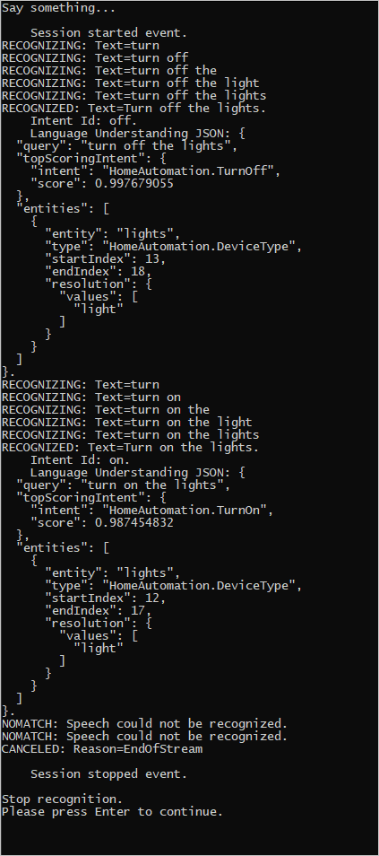

# How to recognize intents from speech using the Speech SDK for C#

The Azure AI services [Speech SDK](speech-sdk.md) integrates with the [Language Understanding service (LUIS)](https://www.luis.ai/home) to provide **intent recognition**. An intent is something the user wants to do: book a flight, check the weather, or make a call. The user can use whatever terms feel natural. Using machine learning, LUIS maps user requests to the intents you've defined.

> [!NOTE]
> A LUIS application defines the intents and entities you want to recognize. It's separate from the C# application that uses the Speech service. In this article, "app" means the LUIS app, while "application" means the C# code.

In this guide, you use the Speech SDK to develop a C# console application that derives intents from user utterances through your device's microphone. You'll learn how to:

> [!div class="checklist"]
>
> - Create a Visual Studio project referencing the Speech SDK NuGet package
> - Create a speech configuration and get an intent recognizer
> - Get the model for your LUIS app and add the intents you need
> - Specify the language for speech recognition
> - Recognize speech from a file
> - Use asynchronous, event-driven continuous recognition

## Prerequisites

Be sure you have the following items before you begin this guide:

- A LUIS account. You can get one for free through the [LUIS portal](https://www.luis.ai/home).
- [Visual Studio 2019](https://visualstudio.microsoft.com/downloads/) (any edition).

## LUIS and speech

LUIS integrates with the Speech service to recognize intents from speech. You don't need a Speech service subscription, just LUIS.

LUIS uses two kinds of keys:

| Key type  | Purpose                                               |
| --------- | ----------------------------------------------------- |
| Authoring | Lets you create and modify LUIS apps programmatically |
| Prediction | Used to access the LUIS application in runtime       |

For this guide, you need the prediction key type. This guide uses the example Home Automation LUIS app, which you can create by following the [Use prebuilt Home automation app](../luis/luis-get-started-create-app.md) quickstart. If you've created a LUIS app of your own, you can use it instead.

When you create a LUIS app, LUIS automatically generates an authoring key so you can test the app using text queries. This key doesn't enable the Speech service integration and won't work with this guide. Create a LUIS resource in the Azure dashboard and assign it to the LUIS app. You can use the free subscription tier for this guide.

After you create the LUIS resource in the Azure dashboard, log into the [LUIS portal](https://www.luis.ai/home), choose your application on the **My Apps** page, then switch to the app's **Manage** page. Finally, select **Azure Resources** in the sidebar.

:::image type="content" source="media/sdk/luis-keys-endpoints-page.png" alt-text="Shows a screenshot of the LUIS portal keys and endpoint settings." lightbox="media/sdk/luis-keys-endpoints-page.png":::

On the **Azure Resources** page:

Select the icon next to a key to copy it to the clipboard. (You may use either key.)

## Create the project and add the workload

To create a Visual Studio project for Windows development, you need to create the project, set up Visual Studio for .NET desktop development, install the Speech SDK, and choose the target architecture.

To start, create the project in Visual Studio, and make sure that Visual Studio is set up for .NET desktop development:

1. Open Visual Studio 2019.

1. In the Start window, select **Create a new project**. 

1. In the **Create a new project** window, choose **Console App (.NET Framework)**, and then select **Next**.

1. In the **Configure your new project** window, enter *helloworld* in **Project name**, choose or create the directory path in **Location**, and then select **Create**.

1. From the Visual Studio menu bar, select **Tools** > **Get Tools and Features**, which opens Visual Studio Installer and displays the **Modifying** dialog box.

1. Check whether the **.NET desktop development** workload is available. If the workload hasn't been installed, select the check box next to it, and then select **Modify** to start the installation. It may take a few minutes to download and install.

   If the check box next to **.NET desktop development** is already selected, select **Close** to exit the dialog box.

   

1. Close Visual Studio Installer.

### Install the Speech SDK

The next step is to install the [Speech SDK NuGet package](https://aka.ms/csspeech/nuget), so you can reference it in the code.

1. In the Solution Explorer, right-click the **helloworld** project, and then select **Manage NuGet Packages** to show the NuGet Package Manager.

   

1. In the upper-right corner, find the **Package Source** drop-down box, and make sure that **nuget.org** is selected.

1. In the upper-left corner, select **Browse**.

1. In the search box, type *Microsoft.CognitiveServices.Speech* and select **Enter**.

1. From the search results, select the **Microsoft.CognitiveServices.Speech** package, and then select **Install** to install the latest stable version.

   

1. Accept all agreements and licenses to start the installation.

   After the package is installed, a confirmation appears in the **Package Manager Console** window.

### Choose the target architecture

Now, to build and run the console application, create a platform configuration matching your computer's architecture.

1. From the menu bar, select **Build** > **Configuration Manager**. The **Configuration Manager** dialog box appears.

   

1. In the **Active solution platform** drop-down box, select **New**. The **New Solution Platform** dialog box appears.

1. In the **Type or select the new platform** drop-down box:
   - If you're running 64-bit Windows, select **x64**.
   - If you're running 32-bit Windows, select **x86**.

1. Select **OK** and then **Close**.

## Add the code

Next, you add code to the project.

1. From **Solution Explorer**, open the file **Program.cs**.

1. Replace the block of `using` statements at the beginning of the file with the following declarations:

   [!code-csharp[Top-level declarations](~/samples-cognitive-services-speech-sdk/samples/csharp/sharedcontent/console/intent_recognition_samples.cs#toplevel)]

1. Replace the provided `Main()` method, with the following asynchronous equivalent:

   ```csharp
   public static async Task Main()
   {
       await RecognizeIntentAsync();
       Console.WriteLine("Please press Enter to continue.");
       Console.ReadLine();
   }
   ```

1. Create an empty asynchronous method `RecognizeIntentAsync()`, as shown here:

   ```csharp
   static async Task RecognizeIntentAsync()
   {
   }
   ```

1. In the body of this new method, add this code:

   [!code-csharp[Intent recognition by using a microphone](~/samples-cognitive-services-speech-sdk/samples/csharp/sharedcontent/console/intent_recognition_samples.cs#intentRecognitionWithMicrophone)]

1. Replace the placeholders in this method with your LUIS resource key, region, and app ID as follows.

   | Placeholder | Replace with |
   | ----------- | ------------ |
   | `YourLanguageUnderstandingSubscriptionKey` | Your LUIS resource key. Again, you must get this item from your Azure dashboard. You can find it on your app's **Azure Resources** page (under **Manage**) in the [LUIS portal](https://www.luis.ai/home). |
   | `YourLanguageUnderstandingServiceRegion` | The short identifier for the region your LUIS resource is in, such as `westus` for West US. See [Regions](regions.md). |
   | `YourLanguageUnderstandingAppId` | The LUIS app ID. You can find it on your app's **Settings** page in the [LUIS portal](https://www.luis.ai/home). |

With these changes made, you can build (**Control+Shift+B**) and run (**F5**) the application. When you're prompted, try saying "Turn off the lights" into your PC's microphone. The application displays the result in the console window.

The following sections include a discussion of the code.

## Create an intent recognizer

First, you need to create a speech configuration from your LUIS prediction key and region. You can use speech configurations to create recognizers for the various capabilities of the Speech SDK. The speech configuration has multiple ways to specify the resource you want to use; here, we use `FromSubscription`, which takes the resource key and region.

> [!NOTE]
> Use the key and region of your LUIS resource, not a Speech resource.

Next, create an intent recognizer using `new IntentRecognizer(config)`. Since the configuration already knows which resource to use, you don't need to specify the key again when creating the recognizer.

## Import a LUIS model and add intents

Now import the model from the LUIS app using `LanguageUnderstandingModel.FromAppId()` and add the LUIS intents that you wish to recognize via the recognizer's `AddIntent()` method. These two steps improve the accuracy of speech recognition by indicating words that the user is likely to use in their requests. You don't have to add all the app's intents if you don't need to recognize them all in your application.

To add intents, you must provide three arguments: the LUIS model (which has been created and is named `model`), the intent name, and an intent ID. The difference between the ID and the name is as follows.

| `AddIntent()`&nbsp;argument | Purpose |
| --------------------------- | ------- |
| `intentName` | The name of the intent as defined in the LUIS app. This value must match the LUIS intent name exactly. |
| `intentID` | An ID assigned to a recognized intent by the Speech SDK. This value can be whatever you like; it doesn't need to correspond to the intent name as defined in the LUIS app. If multiple intents are handled by the same code, for instance, you could use the same ID for them. |

The Home Automation LUIS app has two intents: one for turning on a device, and another for turning off a device. The lines below add these intents to the recognizer; replace the three `AddIntent` lines in the `RecognizeIntentAsync()` method with this code.

```csharp
recognizer.AddIntent(model, "HomeAutomation.TurnOff", "off");
recognizer.AddIntent(model, "HomeAutomation.TurnOn", "on");
```

Instead of adding individual intents, you can also use the `AddAllIntents` method to add all the intents in a model to the recognizer.

## Start recognition

With the recognizer created and the intents added, recognition can begin. The Speech SDK supports both single-shot and continuous recognition.

| Recognition mode | Methods to call | Result |
| ---------------- | --------------- | ------ |
| Single-shot | `RecognizeOnceAsync()` | Returns the recognized intent, if any, after one utterance. |
| Continuous | `StartContinuousRecognitionAsync()`<br>`StopContinuousRecognitionAsync()` | Recognizes multiple utterances; emits events (for example, `IntermediateResultReceived`) when results are available. |

The application uses single-shot mode and so calls `RecognizeOnceAsync()` to begin recognition. The result is an `IntentRecognitionResult` object containing information about the intent recognized. You extract the LUIS JSON response by using the following expression:

```csharp
result.Properties.GetProperty(PropertyId.LanguageUnderstandingServiceResponse_JsonResult)
```

The application doesn't parse the JSON result. It only displays the JSON text in the console window.


## Specify recognition language

By default, LUIS recognizes intents in US English (`en-us`). By assigning a locale code to the `SpeechRecognitionLanguage` property of the speech configuration, you can recognize intents in other languages. For example, add `config.SpeechRecognitionLanguage = "de-de";` in our application before creating the recognizer to recognize intents in German. For more information, see [LUIS language support](../LUIS/luis-language-support.md).

## Continuous recognition from a file

The following code illustrates two additional capabilities of intent recognition using the Speech SDK. The first, previously mentioned, is continuous recognition, where the recognizer emits events when results are available. These events can then be processed by event handlers that you provide. With continuous recognition, you call the recognizer's `StartContinuousRecognitionAsync()` method to start recognition instead of `RecognizeOnceAsync()`.

The other capability is reading the audio containing the speech to be processed from a WAV file. Implementation involves creating an audio configuration that can be used when creating the intent recognizer. The file must be single-channel (mono) with a sampling rate of 16 kHz.

To try out these features, delete or comment out the body of the `RecognizeIntentAsync()` method, and add the following code in its place.

[!code-csharp[Intent recognition by using events from a file](~/samples-cognitive-services-speech-sdk/samples/csharp/sharedcontent/console/intent_recognition_samples.cs#intentContinuousRecognitionWithFile)]

Revise the code to include your LUIS prediction key, region, and app ID and to add the Home Automation intents, as before. Change `whatstheweatherlike.wav` to the name of your recorded audio file. Then build, copy the audio file to the build directory, and run the application.

For example, if you say "Turn off the lights", pause, and then say "Turn on the lights" in your recorded audio file, console output similar to the following may appear:



The Speech SDK team actively maintains a large set of examples in an open-source repository. For the sample source code repository, see the [Azure AI Speech SDK on GitHub](https://aka.ms/csspeech/samples). There are samples for C#, C++, Java, Python, Objective-C, Swift, JavaScript, UWP, Unity, and Xamarin. Look for the code from this article in the **samples/csharp/sharedcontent/console** folder.

## Next steps

> [Quickstart: Recognize speech from a microphone](./get-started-speech-to-text.md?pivots=programming-language-csharp&tabs=dotnetcore)
