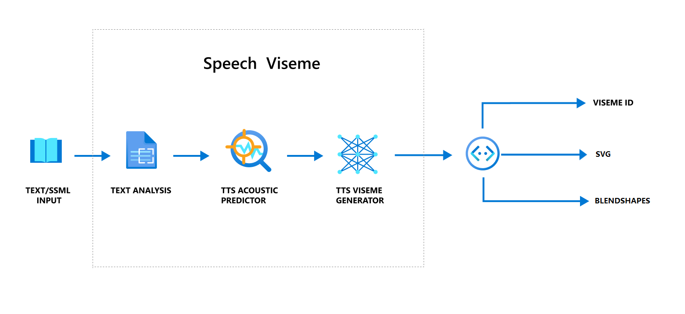
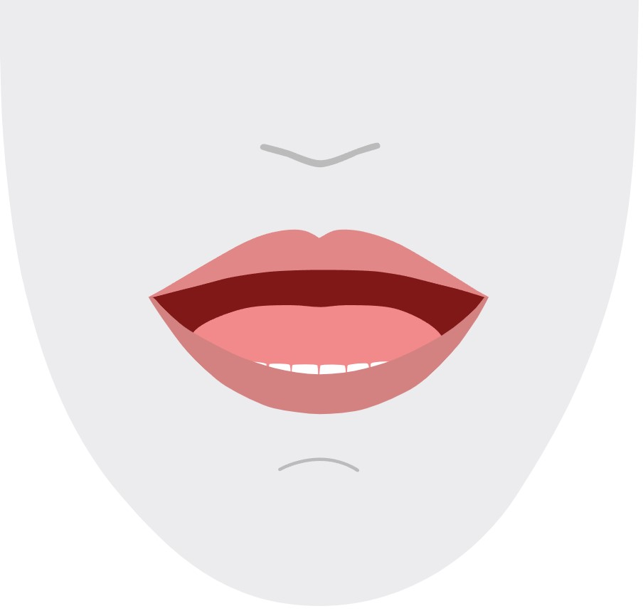
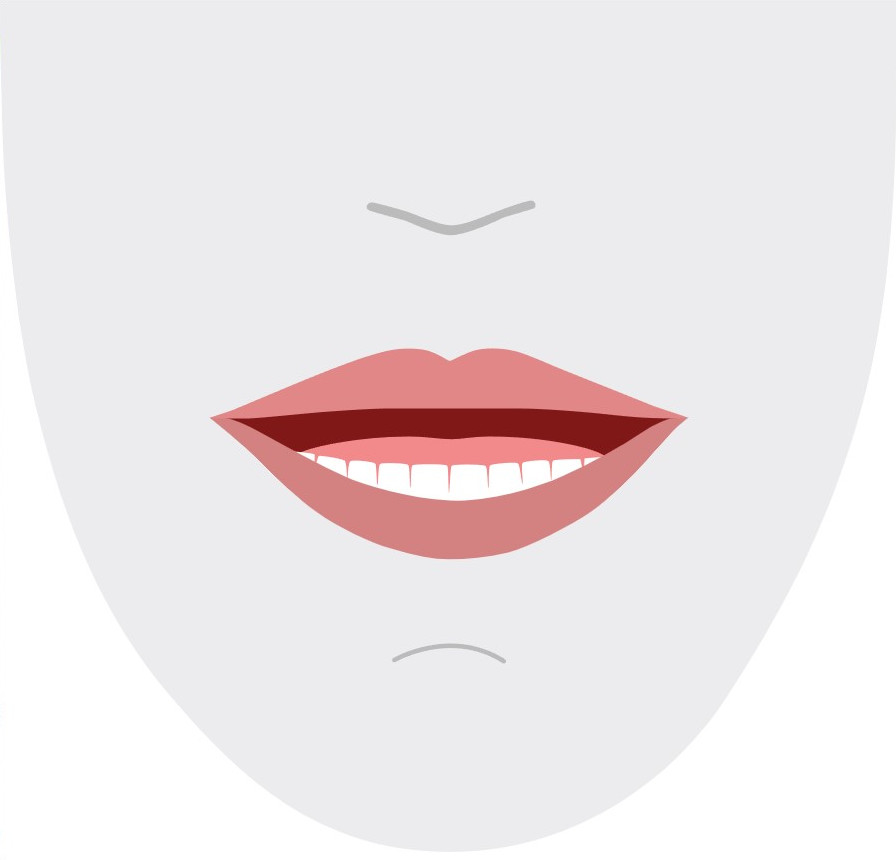
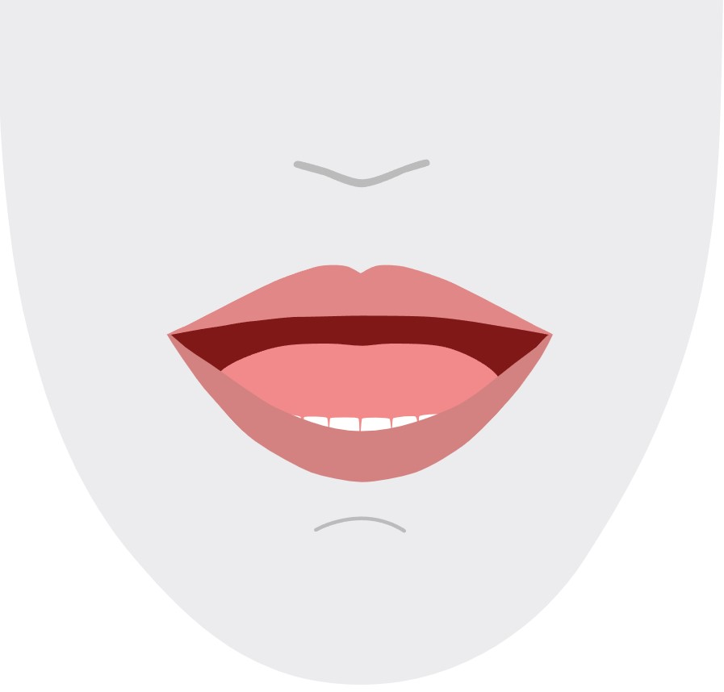
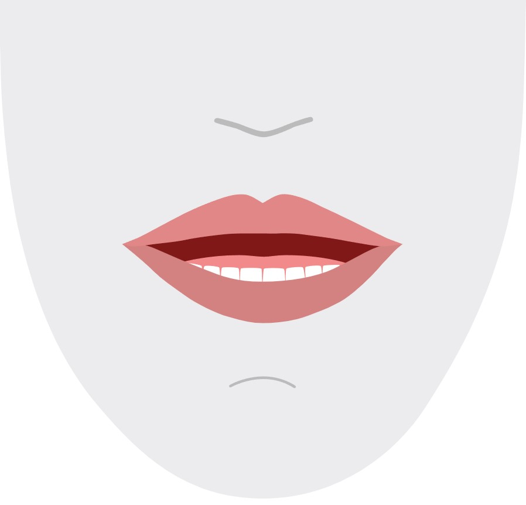
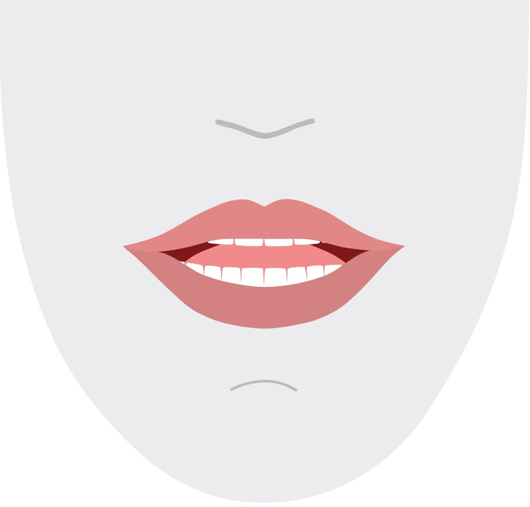
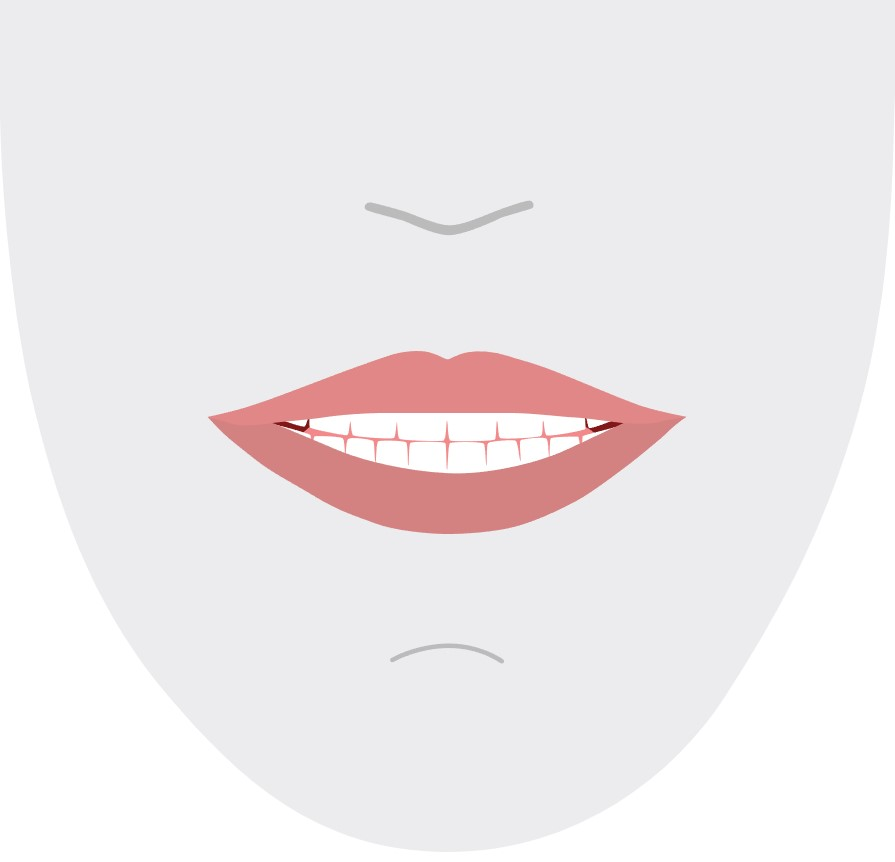
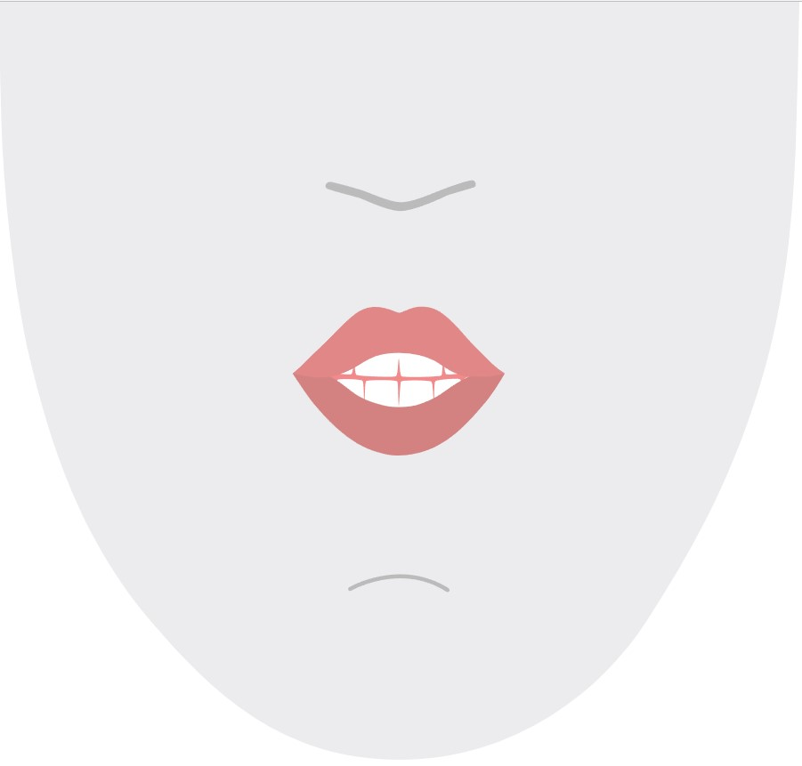
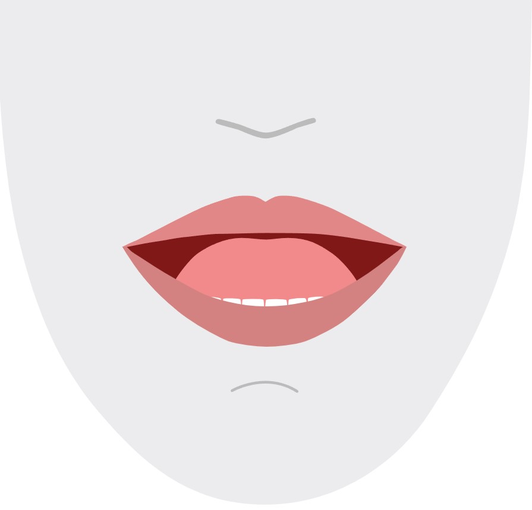
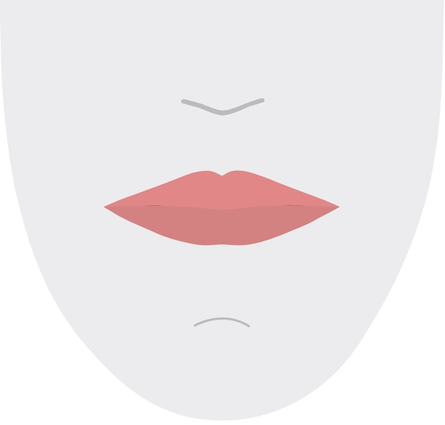

# Get facial position with viseme

> [!NOTE]
> To explore the locales supported for Viseme ID and blend shapes, refer to [the list of all supported locales](language-support.md?tabs=tts#viseme). Scalable Vector Graphics (SVG) is only supported for the `en-US` locale.

A *viseme* is the visual description of a phoneme in spoken language. It defines the position of the face and mouth while a person is speaking. Each viseme depicts the key facial poses for a specific set of phonemes.

You can use visemes to control the movement of 2D and 3D avatar models, so that the facial positions are best aligned with synthetic speech. For example, you can:

 * Create an animated virtual voice assistant for intelligent kiosks, building multi-mode integrated services for your customers.
 * Build immersive news broadcasts and improve audience experiences with natural face and mouth movements.
 * Generate more interactive gaming avatars and cartoon characters that can speak with dynamic content.
 * Make more effective language teaching videos that help language learners understand the mouth behavior of each word and phoneme.
 * People with hearing impairment can also pick up sounds visually and "lip-read" speech content that shows visemes on an animated face.

For more information about visemes, view this [introductory video](https://youtu.be/ui9XT47uwxs).
> [!VIDEO https://www.youtube.com/embed/ui9XT47uwxs]

## Overall workflow of producing viseme with speech

Neural Text to speech (Neural TTS) turns input text or SSML (Speech Synthesis Markup Language) into lifelike synthesized speech. Speech audio output can be accompanied by viseme ID, Scalable Vector Graphics (SVG), or blend shapes. Using a 2D or 3D rendering engine, you can use these viseme events to animate your avatar.

The overall workflow of viseme is depicted in the following flowchart:



## Viseme ID

Viseme ID refers to an integer number that specifies a viseme. We offer 22 different visemes, each depicting the mouth position for a specific set of phonemes. There's no one-to-one correspondence between visemes and phonemes. Often, several phonemes correspond to a single viseme, because they look the same on the speaker's face when they're produced, such as `s` and `z`. For more specific information, see the table for [mapping phonemes to viseme IDs](#map-phonemes-to-visemes).

Speech audio output can be accompanied by viseme IDs and `Audio offset`. The `Audio offset` indicates the offset timestamp that represents the start time of each viseme, in ticks (100 nanoseconds).

### Map phonemes to visemes

Visemes vary by language and locale. Each locale has a set of visemes that correspond to its specific phonemes. The [SSML phonetic alphabets](speech-ssml-phonetic-sets.md) documentation maps viseme IDs to the corresponding International Phonetic Alphabet (IPA) phonemes. The table below shows a mapping relationship between viseme IDs and mouth positions, listing typical IPA phonemes for each viseme ID.

| Viseme ID | IPA | Mouth position|
|---------------|---------------|---------------|
|0|Silence||
|1|`æ`, `ə`, `ʌ`| |
|2|`ɑ`||
|3|`ɔ`||
|4|`ɛ`, `ʊ`||
|5|`ɝ`||
|6|`j`, `i`, `ɪ` ||
|7|`w`, `u`||
|8|`o`||
|9|`aʊ`||
|10|`ɔɪ`||
|11|`aɪ`||
|12|`h`||
|13|`ɹ`||
|14|`l`||
|15|`s`, `z`||
|16|`ʃ`, `tʃ`, `dʒ`, `ʒ`||
|17|`ð`||
|18|`f`, `v`||
|19|`d`, `t`, `n`, `θ`||
|20|`k`, `g`, `ŋ`||
|21|`p`, `b`, `m`||

## 2D SVG animation

For 2D characters, you can design a character that suits your scenario and use Scalable Vector Graphics (SVG) for each viseme ID to get a time-based face position.

With temporal tags that are provided in a viseme event, these well-designed SVGs will be processed with smoothing modifications, and provide robust animation to the users. For example, the following illustration shows a red-lipped character that's designed for language learning.


## 3D blend shapes animation

You can use blend shapes to drive the facial movements of a 3D character that you designed.

The blend shapes JSON string is represented as a 2-dimensional matrix. Each row represents a frame. Each frame (in 60 FPS) contains an array of 55 facial positions.

## Get viseme events with the Speech SDK

To get viseme with your synthesized speech, subscribe to the `VisemeReceived` event in the Speech SDK.

> [!NOTE]
> To request SVG or blend shapes output, you should use the `mstts:viseme` element in SSML. For details, see [how to use viseme element in SSML](speech-synthesis-markup-structure.md#viseme-element).

The following snippet shows how to subscribe to the viseme event:

::: zone pivot="programming-language-csharp"

```csharp
using (var synthesizer = new SpeechSynthesizer(speechConfig, audioConfig))
{
    // Subscribes to viseme received event
    synthesizer.VisemeReceived += (s, e) =>
    {
        Console.WriteLine($"Viseme event received. Audio offset: " +
            $"{e.AudioOffset / 10000}ms, viseme id: {e.VisemeId}.");

        // `Animation` is an xml string for SVG or a json string for blend shapes
        var animation = e.Animation;
    };

    // If VisemeID is the only thing you want, you can also use `SpeakTextAsync()`
    var result = await synthesizer.SpeakSsmlAsync(ssml);
}

```

::: zone-end

::: zone pivot="programming-language-cpp"

```cpp
auto synthesizer = SpeechSynthesizer::FromConfig(speechConfig, audioConfig);

// Subscribes to viseme received event
synthesizer->VisemeReceived += [](const SpeechSynthesisVisemeEventArgs& e)
{
    cout << "viseme event received. "
        // The unit of e.AudioOffset is tick (1 tick = 100 nanoseconds), divide by 10,000 to convert to milliseconds.
        << "Audio offset: " << e.AudioOffset / 10000 << "ms, "
        << "viseme id: " << e.VisemeId << "." << endl;

    // `Animation` is an xml string for SVG or a json string for blend shapes
    auto animation = e.Animation;
};

// If VisemeID is the only thing you want, you can also use `SpeakTextAsync()`
auto result = synthesizer->SpeakSsmlAsync(ssml).get();
```

::: zone-end

::: zone pivot="programming-language-java"

```java
SpeechSynthesizer synthesizer = new SpeechSynthesizer(speechConfig, audioConfig);

// Subscribes to viseme received event
synthesizer.VisemeReceived.addEventListener((o, e) -> {
    // The unit of e.AudioOffset is tick (1 tick = 100 nanoseconds), divide by 10,000 to convert to milliseconds.
    System.out.print("Viseme event received. Audio offset: " + e.getAudioOffset() / 10000 + "ms, ");
    System.out.println("viseme id: " + e.getVisemeId() + ".");

    // `Animation` is an xml string for SVG or a json string for blend shapes
    String animation = e.getAnimation();
});

// If VisemeID is the only thing you want, you can also use `SpeakTextAsync()`
SpeechSynthesisResult result = synthesizer.SpeakSsmlAsync(ssml).get();
```

::: zone-end

::: zone pivot="programming-language-python"

```Python
speech_synthesizer = speechsdk.SpeechSynthesizer(speech_config=speech_config, audio_config=audio_config)

def viseme_cb(evt):
    print("Viseme event received: audio offset: {}ms, viseme id: {}.".format(
        evt.audio_offset / 10000, evt.viseme_id))

    # `Animation` is an xml string for SVG or a json string for blend shapes
    animation = evt.animation

# Subscribes to viseme received event
speech_synthesizer.viseme_received.connect(viseme_cb)

# If VisemeID is the only thing you want, you can also use `speak_text_async()`
result = speech_synthesizer.speak_ssml_async(ssml).get()
```

::: zone-end

::: zone pivot="programming-language-javascript"

```Javascript
var synthesizer = new SpeechSDK.SpeechSynthesizer(speechConfig, audioConfig);

// Subscribes to viseme received event
synthesizer.visemeReceived = function (s, e) {
    window.console.log("(Viseme), Audio offset: " + e.audioOffset / 10000 + "ms. Viseme ID: " + e.visemeId);

    // `Animation` is an xml string for SVG or a json string for blend shapes
    var animation = e.Animation;
}

// If VisemeID is the only thing you want, you can also use `speakTextAsync()`
synthesizer.speakSsmlAsync(ssml);
```

::: zone-end

::: zone pivot="programming-language-objectivec"

```Objective-C
SPXSpeechSynthesizer *synthesizer =
    [[SPXSpeechSynthesizer alloc] initWithSpeechConfiguration:speechConfig
                                           audioConfiguration:audioConfig];

// Subscribes to viseme received event
[synthesizer addVisemeReceivedEventHandler: ^ (SPXSpeechSynthesizer *synthesizer, SPXSpeechSynthesisVisemeEventArgs *eventArgs) {
    NSLog(@"Viseme event received. Audio offset: %fms, viseme id: %lu.", eventArgs.audioOffset/10000., eventArgs.visemeId);

    // `Animation` is an xml string for SVG or a json string for blend shapes
    NSString *animation = eventArgs.Animation;
}];

// If VisemeID is the only thing you want, you can also use `SpeakText`
[synthesizer speakSsml:ssml];
```

::: zone-end

Here's an example of the viseme output.

# [Viseme ID](#tab/visemeid)

```text
(Viseme), Viseme ID: 1, Audio offset: 200ms.

(Viseme), Viseme ID: 5, Audio offset: 850ms.

……

(Viseme), Viseme ID: 13, Audio offset: 2350ms.
```

# [2D SVG](#tab/2dsvg)

The SVG output is an xml string that contains the animation.
Render the SVG animation along with the synthesized speech to see the mouth movement.

```xml
<svg width= "1200px" height= "1200px" ..>
  <g id= "front_start" stroke= "none" stroke-width= "1" fill= "none" fill-rule= "evenodd">
    <animate attributeName= "d" begin= "d_dh_front_background_1_0.end" dur= "0.27500
    ...
```

# [3D blend shapes](#tab/3dblendshapes)


Each viseme event includes a series of frames in the `Animation` SDK property. These are grouped to best align the facial positions with the audio. Your 3D engine should render each group of `BlendShapes` frames immediately before the corresponding audio chunk. The `FrameIndex` value indicates how many frames preceded the current list of frames.

The output json looks like the following sample. Each frame within `BlendShapes` contains an array of 55 facial positions represented as decimal values between 0 to 1. The decimal values are in the same order as described in the facial positions table below.

```json
{
    "FrameIndex":0,
    "BlendShapes":[
        [0.021,0.321,...,0.258],
        [0.045,0.234,...,0.288],
        ...
    ]
}
```

The order of `BlendShapes` is as follows.

| Order | Facial position in `BlendShapes`|
| --------- | ----------- | 
| 1 | eyeBlinkLeft|
| 2 | eyeLookDownLeft|
| 3 | eyeLookInLeft|
| 4 | eyeLookOutLeft|
| 5 | eyeLookUpLeft|
| 6 | eyeSquintLeft|
| 7 | eyeWideLeft|
| 8 | eyeBlinkRight|
| 9 | eyeLookDownRight|
| 10 | eyeLookInRight|
| 11 | eyeLookOutRight|
| 12 | eyeLookUpRight|
| 13 | eyeSquintRight|
| 14 | eyeWideRight|
| 15 | jawForward|
| 16 | jawLeft|
| 17 | jawRight|
| 18 | jawOpen|
| 19 | mouthClose|
| 20 | mouthFunnel|
| 21 | mouthPucker|
| 22 | mouthLeft|
| 23 | mouthRight|
| 24 | mouthSmileLeft|
| 25 | mouthSmileRight|
| 26 | mouthFrownLeft|
| 27 | mouthFrownRight|
| 28 | mouthDimpleLeft|
| 29 | mouthDimpleRight|
| 30 | mouthStretchLeft|
| 31 | mouthStretchRight|
| 32 | mouthRollLower|
| 33 | mouthRollUpper|
| 34 | mouthShrugLower|
| 35 | mouthShrugUpper|
| 36 | mouthPressLeft|
| 37 | mouthPressRight|
| 38 | mouthLowerDownLeft|
| 39 | mouthLowerDownRight|
| 40 | mouthUpperUpLeft|
| 41 | mouthUpperUpRight|
| 42 | browDownLeft|
| 43 | browDownRight|
| 44 | browInnerUp|
| 45 | browOuterUpLeft|
| 46 | browOuterUpRight|
| 47 | cheekPuff|
| 48 | cheekSquintLeft|
| 49 | cheekSquintRight|
| 50 | noseSneerLeft|
| 51 | noseSneerRight|
| 52 | tongueOut|
| 53 | headRoll|
| 54 | leftEyeRoll|
| 55 | rightEyeRoll|

---

After you obtain the viseme output, you can use these events to drive character animation. You can build your own characters and automatically animate them.

## Next steps

- [SSML phonetic alphabets](speech-ssml-phonetic-sets.md)
- [How to improve synthesis with SSML](speech-synthesis-markup.md)
