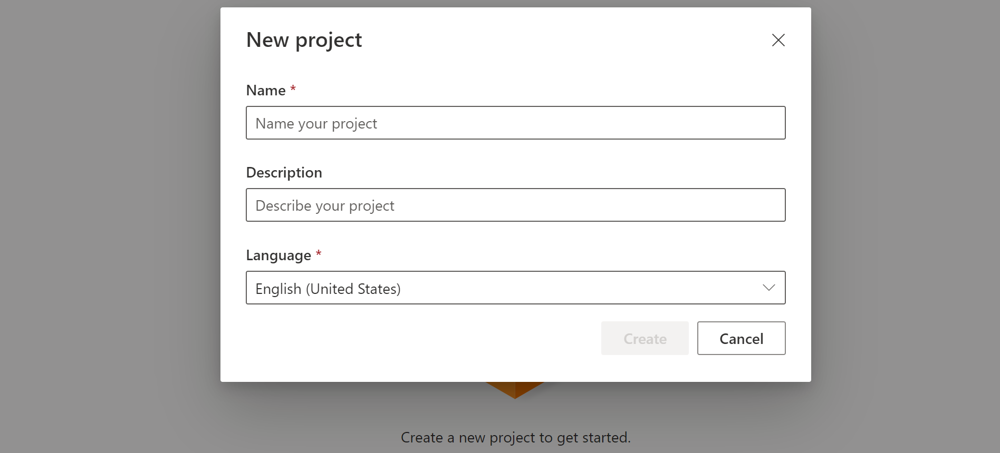
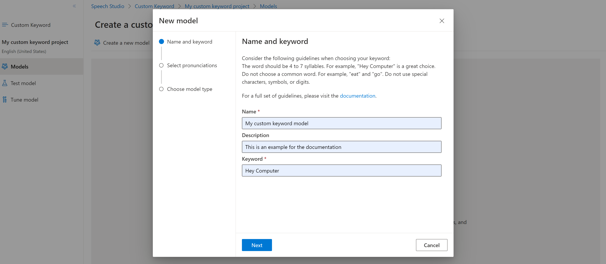

Before you can use a custom keyword, you need to create a keyword using the [Custom Keyword](https://aka.ms/sdsdk-wakewordportal) page on [Speech Studio](https://aka.ms/sdsdk-speechportal). After you provide a keyword, it produces a `.table` file that you can use with the Speech SDK.

> [!IMPORTANT]
> Custom keyword models, and the resulting `.table` files, can **only** be created in Speech Studio.
> You cannot create custom keywords from the SDK or with REST calls.

1. Go to the [Speech Studio](https://aka.ms/sdsdk-speechportal) and **Sign in**. If you don't have a speech subscription, go to [**Create Speech Services**](https://portal.azure.com/#create/Microsoft.CognitiveServicesSpeechServices).

1. On the [Custom Keyword](https://aka.ms/sdsdk-wakewordportal) page, select **Create a new project**. 

1. Enter a **Name**, **Description**, and **Language** for your custom keyword project. You can only choose one language per project, and support is currently limited to English (United States) and Chinese (Mandarin, Simplified). 

    

1. Select your project's name from the list. 

    :::image type="content" source="../../../media/custom-keyword/custom-kw-portal-project-list.png" alt-text="Select your keyword project.":::

1. To create a custom keyword for your virtual assistant, select **Create a new model**.

1. Enter a **Name** for the model, **Description**, and **Keyword** of your choice, then select **Next**. See the [guidelines](../../../keyword-recognition-guidelines.md#choosing-an-effective-keyword) on choosing an effective keyword.

    

1. The portal creates candidate pronunciations for your keyword. Listen to each candidate by selecting the play buttons and remove the checks next to any pronunciations that are incorrect.Select all pronunciations that correspond to how you expect your users to say the keyword and then select **Next** to begin generating the keyword model. 

    :::image type="content" source="../../../media/custom-keyword/custom-kw-portal-choose-prons.png" alt-text="Screenshot that shows where you choose the correct pronunciations.":::

1. Select a model type, then select **Create**. You can view a list of regions that support the **Advanced** model type in the [Keyword recognition region support](../../../regions.md#speech-service) documentation. 

1. It may take up to 30 minutes for the model to be generated. The keyword list will change from **Processing** to **Succeeded** when the model is complete. 

    :::image type="content" source="../../../media/custom-keyword/custom-kw-portal-review-keyword.png" alt-text="Review your keyword.":::

1. From the collapsible menu on the left, select **Tune** for options to tune and download your model. The downloaded file is a `.zip` archive. Extract the archive, and you see a file with the `.table` extension. You use the `.table` file with the SDK, so make sure to note its path.

    :::image type="content" source="../../../media/custom-keyword/custom-kw-portal-download-model.png" alt-text="Download your model table.":::

