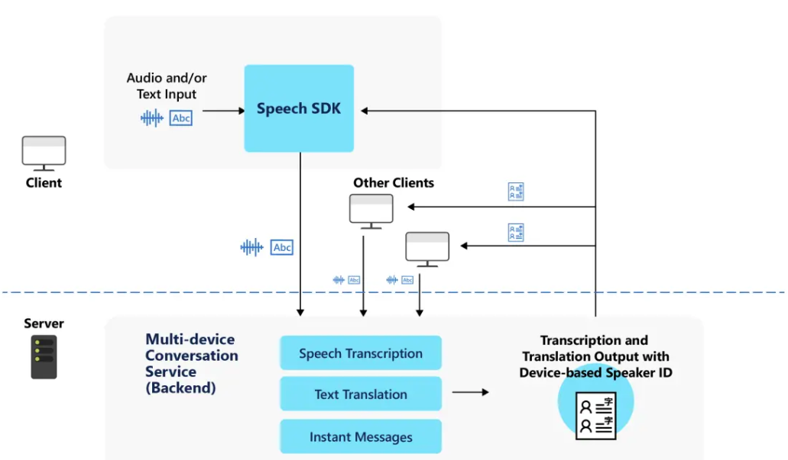

# What is Multi-device Conversation?

Multi-device conversation makes it easy to create a speech or text conversation between multiple clients and coordinate the messages sent between them.

> [!NOTE]
> Multi-device conversation access is a preview feature.

With multi-device conversation, you can:

- Connect multiple clients into the same conversation and manage the sending and receiving of messages between them.
- Easily transcribe audio from each client and send the transcription to the others, with optional translation.
- Easily send text messages between clients, with optional translation.

You can build a feature or solution that works across an array of devices. Each device can independently send messages (either transcriptions of audio or instant messages) to all other devices.

Whereas [Meeting Transcription](meeting-transcription.md) works on a single device with a multichannel microphone array, Multi-device Conversation is suited for scenarios with multiple devices, each with a single microphone.

>[!IMPORTANT]
> Multi-device conversation does not support sending audio files between clients: only the transcription and/or translation.

## Key features

- **Real-time transcription:** Everyone will receive a transcript of the conversation, so they can follow along the text in real-time or save it for later.
- **Real-time translation:** With more than 70 [supported languages](language-support.md) for text translation, users can translate the conversation to their preferred languages.
- **Readable transcripts:** The transcription and translation are easy to follow, with punctuation and sentence breaks.
- **Voice or text input:** Each user can speak or type on their own device, depending on the language support capabilities enabled for the participant's chosen language. Please refer to [Language support](language-support.md).
- **Message relay:** The multi-device conversation service will distribute messages sent by one client to all the others, in the languages of their choice.
- **Message identification:** Every message that users receive in the conversation will be tagged with the nickname of the user who sent it.

## Use cases

### Lightweight conversations

Creating and joining a conversation is easy. One user will act as the 'host' and create a conversation, which generates a random five letter conversation code and a QR code. All other users can join the conversation by typing in the conversation code or scanning the QR code. 

Since users join via the conversation code and aren't required to share contact information, it is easy to create quick, on-the-spot conversations.

### Inclusive meetings

Real-time transcription and translation can help make conversations accessible for people who speak different languages and/or are deaf or hard of hearing. Each person can also actively participate in the conversation, by speaking their preferred language or sending instant messages.

### Presentations

You can also provide captions for presentations and lectures both on-screen and on the audience members' own devices. After the audience joins with the conversation code, they can see the transcript in their preferred language, on their own device.

## How it works

All clients will use the Speech SDK to create or join a conversation. The Speech SDK interacts with the multi-device conversation service, which manages the lifetime of a conversation, including the list of participants, each client's chosen language(s), and messages sent.  

Each client can send audio or instant messages. The service will use speech recognition to convert audio into text, and send instant messages as-is. If clients choose different languages, then the service will translate all messages to the specified language(s) of each client.

## Overview of Conversation, Host, and Participant

A conversation is a session that one user starts for the other participating users to join. All clients connect to the conversation using the five-letter conversation code.

Each conversation creates metadata that includes:
- Timestamps of when the conversation started and ended
- List of all participants in the conversation, which includes each user's chosen nickname and primary language for speech or text input.

There are two types of users in a conversation:  host and participant.

The host is the user who starts a conversation, and who acts as the administrator of that conversation.
- Each conversation can only have one host
- The host must be connected to the conversation for the duration of the conversation. If the host leaves the conversation, the conversation will end for all other participants.
- The host has a few extra controls to manage the conversation: 
    - Lock the conversation - prevent additional participants from joining
    - Mute all participants - prevent other participants from sending any messages to the conversation, whether transcribed from speech or instant messages
    - Mute individual participants
    - Unmute all participants
    - Unmute individual participants

A participant is a user who joins a conversation.
- A participant can leave and rejoin the same conversation at any time, without ending the conversation for other participants.
- Participants cannot lock the conversation or mute/unmute others

> [!NOTE]
> Each conversation can have up to 100 participants, of which 10 can be simultaneously speaking at any given time.

## Language support

When creating or joining a conversation, each user must choose a primary language: the language that they will speak and send instant messages in, and also the language they will see other users' messages.

There are two kinds of languages: speech to text and text-only:
- If the user chooses a speech to text language as their primary language, then they will be able to use both speech and text input in the conversation.

- If the user chooses a text-only language, then they will only be able to use text input and send instant messages in the conversation. Text-only languages are the languages that are supported for text translation, but not speech to text. You can see available languages on the [language support](./language-support.md) page.

Apart from their primary language, each participant can also specify additional languages for translating the conversation.

Below is a summary of what the user will be able to do in a multi-device conversation, based to their chosen primary language.

| What the user can do in the conversation | Speech to text | Text-only |
|-----------------------------------|----------------|------|
| Use speech input | ✔️ | ❌ |
| Send instant messages | ✔️ | ✔️ |
| Translate the conversation | ✔️ | ✔️ |

> [!NOTE]
> For lists of available speech to text and text translation languages, see [supported languages](./language-support.md).

## Next steps

* [Translate conversations in real-time](quickstarts/multi-device-conversation.md)
