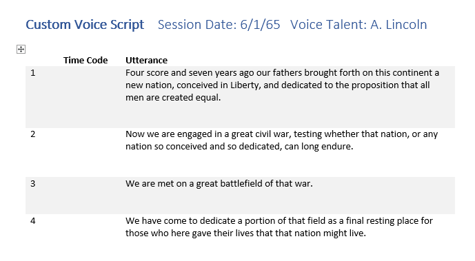
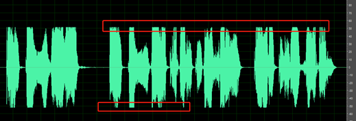
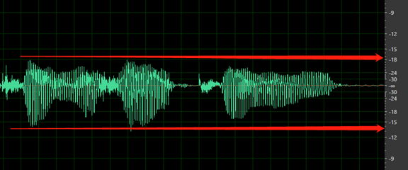

# Recording voice samples for Custom Neural Voice

This article provides you instructions on preparing high-quality voice samples for creating a professional voice model using the Custom Neural Voice Pro project.

Creating a high-quality production custom neural voice from scratch isn't a casual undertaking. The central component of a custom neural voice is a large collection of audio samples of human speech. It's vital that these audio recordings be of high quality. Choose a voice talent who has experience making these kinds of recordings, and have them recorded by a recording engineer using professional equipment.

Before you can make these recordings, though, you need a script: the words that will be spoken by your voice talent to create the audio samples.

Many small but important details go into creating a professional voice recording. This guide is a roadmap for a process that will help you get good, consistent results. 

## Tips for preparing data for a high-quality voice

A highly-natural custom neural voice depends on several factors, like the quality and size of your training data. 

The quality of your training data is a primary factor. For example, in the same training set, consistent volume, speaking rate, speaking pitch, and speaking style are essential to create a high-quality custom neural voice. You should also avoid background noise in the recording and make sure the script and recording match. To ensure the quality of your data, you need to follow [script selection criteria](#script-selection-criteria) and [recording requirements](#recording-your-script). 

Regarding the size of the training data, in most cases you can build a reasonable custom neural voice with 500 utterances. According to our tests, adding more training data in most languages does not necessarily improve naturalness of the voice itself (tested using the MOS score), however, with more training data that covers more word instances, you have higher possibility to reduce the ratio of dissatisfactory parts of speech for the voice, such as the glitches. To hear what dissatisfactory parts of speech sound like, refer to [the GitHub examples](https://github.com/Azure-Samples/Cognitive-Speech-TTS/blob/master/CustomVoice/DSAT-examples.md).

In some cases, you may want a voice persona with unique characteristics. For example, a cartoon persona needs a voice with a special speaking style, or a voice that is very dynamic in intonation. For such cases, we recommend that you prepare at least 1000 (preferably 2000) utterances, and record them at a professional recording studio. To learn more about how to improve the quality of your voice model, see [characteristics and limitations for using Custom Neural Voice](/legal/cognitive-services/speech-service/custom-neural-voice/characteristics-and-limitations-custom-neural-voice?context=/azure/ai-services/speech-service/context/context).

## Voice recording roles

There are four basic roles in a custom neural voice recording project:

Role|Purpose
-|-
Voice talent        |This person's voice will form the basis of the custom neural voice.
Recording engineer  |Oversees the technical aspects of the recording and operates the recording equipment.
Director            |Prepares the script and coaches the voice talent's performance.
Editor              |Finalizes the audio files and prepares them for upload to Speech Studio

An individual may fill more than one role. This guide assumes that you'll be filling the director role and hiring both a voice talent and a recording engineer. If you want to make the recordings yourself, this article includes some information about the recording engineer role. The editor role isn't needed until after the recording session, and can be performed by the director or the recording engineer.

## Choose your voice talent

Actors with experience in voiceover, voice character work, announcing or newsreading make good voice talent. Choose voice talent whose natural voice you like. It's possible to create unique "character" voices, but it's much harder for most talent to perform them consistently, and the effort can cause voice strain. The single most important factor for choosing voice talent is consistency. Your recordings for the same voice style should all sound like they were made on the same day in the same room. You can approach this ideal through good recording practices and engineering.

Your voice talent must be able to speak with consistent rate, volume level, pitch, and tone with clear dictation. They also need to be able to control their pitch variation, emotional affect, and speech mannerisms. Recording voice samples can be more fatiguing than other kinds of voice work, so most voice talent can usually only record for two or three hours a day. Limit sessions to three or four days a week, with a day off in-between if possible.

Work with your voice talent to develop a persona that defines the overall sound and emotional tone of the custom neural voice, making sure to pinpoint what "neutral" sounds like for that persona. Using the Custom Neural Voice capability, you can train a model that speaks with emotion, so define the speaking styles of your persona and ask your voice talent to read the script in a way that resonates with the styles you want.  

For example, a persona with a naturally upbeat personality would carry a note of optimism even when they speak neutrally. However, this personality trait should be subtle and consistent. Listen to readings by existing voices to get an idea of what you're aiming for.

> [!TIP]
> Usually, you'll want to own the voice recordings you make. Your voice talent should be amenable to a work-for-hire contract for the project.

## Create a script

The starting point of any custom neural voice recording session is the script, which contains the utterances to be spoken by your voice talent. The term "utterances" encompasses both full sentences and shorter phrases. Building a custom neural voice requires at least 300 recorded utterances as training data.

The utterances in your script can come from anywhere: fiction, non-fiction, transcripts of speeches, news reports, and anything else available in printed form. For a brief discussion of potential legal issues, see the ["Legalities"](#legalities) section. You can also write your own text.

Your utterances don't need to come from the same source, the same kind of source, or have anything to do with each other. However, if you use set phrases (for example, "You have successfully logged in") in your speech application, make sure to include them in your script. It will give your custom neural voice a better chance of pronouncing those phrases well.

We recommend the recording scripts include both general sentences and domain-specific sentences. For example, if you plan to record 2,000 sentences, 1,000 of them could be general sentences, another 1,000 of them could be sentences from your target domain or the use case of your application.  

We provide [sample scripts in the 'General', 'Chat' and 'Customer Service' domains for each language](https://github.com/Azure-Samples/Cognitive-Speech-TTS/tree/master/CustomVoice/script) to help you prepare your recording scripts. You can use these Microsoft shared scripts for your recordings directly or use them as a reference to create your own.

### Script selection criteria

Below are some general guidelines that you can follow to create a good corpus (recorded audio samples) for custom neural voice training.

-  Balance your script to cover different sentence types in your domain including statements, questions, exclamations, long sentences, and short sentences.

   Each sentence should contain 4 words to 30 words, and no duplicate sentences should be included in your script. 
   For how to balance the different sentence types, refer to the following table:
   
   | Sentence types | Coverage |
   | :--------- | :--------------------------- |
   | Statement sentences | Statement sentences should be 70-80% of the script.|
   | Question sentences | Question sentences should be about 10%-20% of your domain script, including 5%-10% of rising and 5%-10% of falling tones. |
   | Exclamation sentences| Exclamation sentences should be about 10%-20% of your script.|
   | Short word/phrase| Short word/phrase scripts should be about 10% of total utterances, with 5 to 7 words per case. |

   > [!NOTE]
   > Short words/phrases should be separated with a commas. They help remind your voice talent to pause briefly when reading them.

   Best practices include:
    - Balanced coverage for Parts of Speech, like verbs, nouns, adjectives, and so on.  
    - Balanced coverage for pronunciations. Include all letters from A to Z so the Text to speech engine learns how to pronounce each letter in your style.
    - Readable, understandable, common-sense scripts for the speaker to read.
    - Avoid too many similar patterns for words/phrases, like "easy" and "easier".
    - Include different formats of numbers: address, unit, phone, quantity, date, and so on, in all sentence types.  
    - Include spelling sentences if it's something your custom neural voice will be used to read. For example, "The spelling of Apple is A P P L E".

- Don't put multiple sentences into one line/one utterance. Separate each line by utterance.

- Make sure the sentence is clean. Generally, don't include too many non-standard words like numbers or abbreviations as they're usually hard to read. Some applications may require the reading of many numbers or acronyms. In these cases, you can include these words, but normalize them in their spoken form.

   Below are some best practices for example:
    - For lines with abbreviations, instead of "BTW", write "by the way".
    - For lines with digits, instead of "911", write "nine one one".
    - For lines with acronyms, instead of "ABC",  write "A B C".
   
   With that, make sure your voice talent pronounces these words in an expected way. Keep your script and recordings matched during the training process.  

- Your script should include many different words and sentences with different kinds of sentence lengths, structures, and moods.  

- Check the script carefully for errors. If possible, have someone else check it too. When you run through the script with your voice talent, you may catch more mistakes.

### Difference between voice talent script and training script

The training script can differ from the voice talent script, especially for scripts that contain digits, symbols, abbreviations, date, and time. Scripts prepared for the voice talent must follow native reading conventions, such as 50% and $45. The scripts used for training must be normalized to match the audio recording, such as *fifty percent* and *forty-five dollars*. 

> [!NOTE] 
> We provide some example scripts for the voice talent on [GitHub](https://github.com/Azure-Samples/Cognitive-Speech-TTS/tree/master/CustomVoice/script). To use the example scripts for training, you must normalize them according to the recordings of your voice talent before uploading the file.

The following table shows the difference between scripts for voice talent and the normalized script for training.

| Category |Voice talent script example | Training script example (normalized) |
| --------- | --------- | --------------------------- |
| Digits |123| one hundred and twenty-three|
| Symbols |50%| fifty percent|
| Abbreviation |ASAP| as soon as possible|
| Date and time |March 3rd at 5:00 PM| March third at five PM|

### Typical defects of a script

The script's poor quality can adversely affect the training results. To achieve high-quality training results, it's crucial to avoid defects.

Script defects generally fall into the following categories:

| Category | Example |
| :--------- | :--------------------------- |
| Meaningless content. | "Colorless green ideas sleep furiously."|
| Incomplete sentences. |- "This was my last eve" (no subject, no specific meaning)  - "He's obviously already funny (no quote mark in the end, it's not a complete sentence) |
| Typo in the sentences. | - Start with a lower case - No ending punctuation if needed  - Misspelling  - Lack of punctuation: no period in the end (except news title) - End with symbols, except comma, question, exclamation  - Wrong format, such as:     &emsp;- 45$ (should be $45)     	&emsp;- No space or excess space between word/punctuation |
|Duplication in similar format, one per each pattern is enough. |- "Now is 1pm in New York" - "Now is 2pm in New York" - "Now is 3pm in New York" - "Now is 1pm in Seattle" - "Now is 1pm in Washington D.C." |
|Uncommon foreign words: only commonly used foreign words are acceptable in the script. | In English one might use the French word "faux" in common speech, but a French expression such as "coincer la bulle" would be uncommon.  |
|Emoji or any other uncommon symbols |  |

### Script format

The script is for use during recording sessions, so you can set it up any way you find easy to work with. Create the text file that's required by Speech Studio separately.

A basic script format contains three columns:

- The number of the utterance, starting at 1. Numbering makes it easy for everyone in the studio to refer to a particular utterance ("let's try number 356 again"). You can use the Microsoft Word paragraph numbering feature to number the rows of the table automatically.
- A blank column where you'll write the take number or time code of each utterance to help you find it in the finished recording.
- The text of the utterance itself.

 

> [!NOTE]
> Most studios record in short segments known as "takes". Each take typically contains 10 to 24 utterances. Just noting the take number is sufficient to find an utterance later. If you're recording in a studio that prefers to make longer recordings, you'll want to note the time code instead. The studio will have a prominent time display.

Leave enough space after each row to write notes. Be sure that no utterance is split between pages. Number the pages, and print your script on one side of the paper.

Print three copies of the script: one for the voice talent, one for the recording engineer, and one for the director (you). Use a paper clip instead of staples: an experienced voice artist will separate the pages to avoid making noise as the pages are turned.

### Voice talent statement

To train a neural voice, you must [create a voice talent profile](how-to-custom-voice-talent.md) with an audio file recorded by the voice talent consenting to the usage of their speech data to train a custom voice model. When preparing your recording script, make sure you include the statement sentence. 

### Legalities

Under copyright law, an actor's reading of copyrighted text might be a performance for which the author of the work should be compensated. This performance won't be recognizable in the final product, the custom neural voice. Even so, the legality of using a copyrighted work for this purpose isn't well established. Microsoft can't provide legal advice on this issue; consult your own legal counsel.

Fortunately, it's possible to avoid these issues entirely. There are many sources of text you can use without permission or license.

|Text source|Description|
|-|-|
|[CMU Arctic corpus](https://pyroomacoustics.readthedocs.io/en/pypi-release/pyroomacoustics.datasets.cmu_arctic.html)|About 1100 sentences selected from out-of-copyright works specifically for use in speech synthesis projects. An excellent starting point.|
|Works no longer under copyright|Typically works published prior to 1923. For English, [Project Gutenberg](https://www.gutenberg.org/) offers tens of thousands of such works. You may want to focus on newer works, as the language will be closer to modern English.|
|Government&nbsp;works|Works created by the United States government are not copyrighted in the United States, though the government may claim copyright in other countries/regions.|
|Public domain|Works for which copyright has been explicitly disclaimed or that have been dedicated to the public domain. It may not be possible to waive copyright entirely in some jurisdictions.|
|Permissively licensed works|Works distributed under a license like Creative Commons or the GNU Free Documentation License (GFDL). Wikipedia uses the GFDL. Some licenses, however, may impose restrictions on performance of the licensed content that may impact the creation of a custom neural voice model, so read the license carefully.|

## Recording your script

Record your script at a professional recording studio that specializes in voice work. They'll have a recording booth, the right equipment, and the right people to operate it. It's recommended not to skimp on recording.

Discuss your project with the studio's recording engineer and listen to their advice. The recording should have little or no dynamic range compression (maximum of 4:1). It's critical that the audio has consistent volume and a high signal-to-noise ratio, while being free of unwanted sounds.

### Recording requirements

To achieve high-quality training results, follow the following requirements during recording or data preparation:

- Clear and well pronounced

- Natural speed: not too slow or too fast between audio files.

- Appropriate volume, prosody and break: stable within the same sentence or between sentences, correct break for punctuation.

- No noise during recording

- Fit your persona design

- No wrong accent: fit to the target design

- No wrong pronunciation

You can refer to below specification to prepare for the audio samples as best practice.

| Property | Value |
| :--------- | :--------------------------- |
| File format | *.wav, Mono |
| Sampling rate |  24 KHz |
| Sample format | 16 bit, PCM |
| Peak volume levels | -3 dB to -6 dB |
| SNR |  > 35 dB |
| Silence |  - There should have some silence (recommend 100 ms) at the beginning and ending, but no longer than 200 ms - Silence between words or phrases < -30 dB - Silence in the wave after last word is spoken <-60 dB |
| Environment noise, echo |   - The level of noise at start of the wave before speaking < -70 dB |

> [!Note]
> You can record at higher sampling rate and bit depth, for example in the format of 48 KHz 24 bit PCM. During the custom neural voice training, we'll down sample it to 24 KHz 16 bit PCM automatically.

A higher signal-to-noise ratio (SNR) indicates lower noise in your audio. You can typically reach a 35+ SNR by recording at professional studios. Audio with an SNR below 20 can result in obvious noise in your generated voice.

Consider re-recording any utterances with low pronunciation scores or poor signal-to-noise ratios. If you can't re-record, consider excluding those utterances from your data.

### Typical audio errors

For high-quality training results, avoiding audio errors is highly recommended. Audio errors can are usually within following categories:

- Audio file name doesn't match the script ID.
- WAR file has an invalid format and can't be read.
- Audio sampling rate is lower than 16 KHz. It's recommended that the .wav file sampling rate be equal or higher than 24 KHz for high-quality neural voice.
- Volume peak isn't within the range of -3 dB (70% of max volume) to -6 dB (50%).  
- Waveform overflow: the waveform is cut at its peak value and is thus not complete.

   

- The silent parts of the recording aren't clean; you can hear sounds such as ambient noise, mouth noise and echo.

  For example, below audio contains the environment noise between speeches.

   

   Below sample contains signs of DC offset or echo.

   

- The overall volume is too low. Your data will be tagged as an issue if the volume is lower than -18 dB (10% of max volume). Make sure all audio files should be consistent at the same level of volume.

  

- No silence before the first word or after the last word. Also, the start or end silence shouldn't be longer than 200 ms or shorter than 100 ms.

  

### Do it yourself

If you want to make the recording yourself, instead of  going into a recording studio, here's a short primer. Thanks to the rise of home recording and podcasting, it's easier than ever to find good recording advice and resources online.

Your "recording booth" should be a small room with no noticeable echo or "room tone." It should be as quiet and soundproof as possible. Drapes on the walls can be used to reduce echo and neutralize or "deaden" the sound of the room.

Use a high-quality studio condenser microphone ("mic" for short) intended for recording voice. Sennheiser, AKG, and even newer Zoom mics can yield good results. You can buy a mic, or rent one from a local audio-visual rental firm. Look for one with a USB interface. This type of mic conveniently combines the microphone element, preamp, and analog-to-digital converter into one package, simplifying hookup.

You may also use an analog microphone. Many rental houses offer "vintage" microphones known for their voice character. Note that professional analog gear uses balanced XLR connectors, rather than the 1/4-inch plug that's used in consumer equipment. If you go analog, you'll also need a preamp and a computer audio interface with these connectors.

Install the microphone on a stand or boom, and install a pop filter in front of the microphone to eliminate noise from "plosive" consonants like "p" and "b." Some microphones come with a suspension mount that isolates them from vibrations in the stand, which is helpful.

The voice talent must stay at a consistent distance from the microphone. Use tape on the floor to mark where they should stand. If the talent prefers to sit, take special care to monitor mic distance and avoid chair noise.

Use a stand to hold the script. Avoid angling the stand so that it can reflect sound toward the microphone.

The person operating the recording equipment — the recording engineer — should be in a separate room from the talent, with some way to talk to the talent in the recording booth (a *talkback circuit*).

The recording should contain as little noise as possible, with a goal of -80 dB.

Listen closely to a recording of silence in your "booth," figure out where any noise is coming from, and eliminate the cause. Common sources of noise are air vents, fluorescent light ballasts, traffic on nearby roads, and equipment fans (even notebook PCs might have fans). Microphones and cables can pick up electrical noise from nearby AC wiring, usually a hum or buzz. A buzz can also be caused by a *ground loop*, which is caused by having equipment plugged into more than one electrical circuit.

> [!TIP]
> In some cases, you might be able to use an equalizer or a noise reduction software plug-in to help remove noise from your recordings, although it is always best to stop it at its source.

Set levels so that most of the available dynamic range of digital recording is used without overdriving. That means set the audio loud, but not so loud that it becomes distorted. An example of the waveform of a good recording is shown in the following image:

Here, most of the range (height) is used, but the highest peaks of the signal don't reach the top or bottom of the window. You can also see that the silence in the recording approximates a thin horizontal line, indicating a low noise floor. This recording has acceptable dynamic range and signal-to-noise ratio.

Record directly into the computer via a high-quality audio interface or a USB port, depending on the mic you're using. For analog, keep the audio chain simple: mic, preamp, audio interface, computer. You can license both [Avid Pro Tools](https://www.avid.com/en/pro-tools) and [Adobe Audition](https://www.adobe.com/products/audition.html) monthly at a reasonable cost. If your budget is extremely tight, try the free [Audacity](https://www.audacityteam.org/).

Record at 44.1 KHz 16 bit monophonic (CD quality) or better. Current state-of-the-art is 48 KHz 24 bit, if your equipment supports it. You'll down-sample your audio to 24 KHz 16-bit before you submit it to Speech Studio. Still, it pays to have a high-quality original recording in the event that edits are needed.

Ideally, have different people serve in the roles of director, engineer, and talent. Don't try to do it all yourself. In a pinch, one person can be both the director and the engineer.

### Before the session

To avoid wasting studio time, run through the script with your voice talent before the recording session. While the voice talent becomes familiar with the text, they can clarify the pronunciation of any unfamiliar words.

> [!NOTE]
> Most recording studios offer electronic display of scripts in the recording booth. In this case, type your run-through notes directly into the script's document. You'll still want a paper copy to take notes on during the session, though. Most engineers will want a hard copy, too. And you'll still want a third printed copy as a backup for the talent in case the computer is down.

Your voice talent might ask which word you want emphasized in an utterance (the "operative word"). Tell them that you want a natural reading with no particular emphasis. Emphasis can be added when speech is synthesized; it shouldn't be a part of the original recording.

Direct the talent to pronounce words distinctly. Every word of the script should be pronounced as written. Sounds shouldn't be omitted or slurred together, as is common in casual speech, *unless they have been written that way in the script*.

|Written text|Unwanted casual pronunciation|
|-|-|
|never going to give you up|never gonna give you up|
|there are four lights|there're four lights|
|how's the weather today|how's th' weather today|
|say hello to my little friend|say hello to my lil' friend|

The talent should *not* add distinct pauses between words. The sentence should still flow naturally, even while sounding a little formal. This fine distinction might take practice to get right.

### The recording session

Create a reference recording, or *match file,* of a typical utterance at the beginning of the session. Ask the talent to repeat this line every page or so. Each time, compare the new recording to the reference. This practice helps the talent remain consistent in volume, tempo, pitch, and intonation. Meanwhile, the engineer can use the match file as a reference for levels and overall consistency of sound.

The match file is especially important when you resume recording after a break or on another day. Play it a few times for the talent and have them repeat it each time until they're matching well.

Coach your talent to take a deep breath and pause for a moment before each utterance. Record a couple of seconds of silence between utterances. Words should be pronounced the same way each time they appear, considering context. For example, "record" as a verb is pronounced differently from "record" as a noun.

Record approximately five seconds of silence before the first recording to capture the "room tone". This practice helps Speech Studio compensate for noise in the recordings.

> [!TIP]
> All you need to capture is the voice talent, so you can make a monophonic (single-channel) recording of just their lines. However, if you record in stereo, you can use the second channel to record the chatter in the control room to capture discussion of particular lines or takes. Remove this track from the version that's uploaded to Speech Studio.

Listen closely, using headphones, to the voice talent's performance. You're looking for good but natural diction, correct pronunciation, and a lack of unwanted sounds. Don't hesitate to ask your talent to re-record an utterance that doesn't meet these standards.

> [!TIP]
> If you are using a large number of utterances, a single utterance might not have a noticeable effect on the resultant custom neural voice. It might be more expedient to simply note any utterances with issues, exclude them from your dataset, and see how your custom neural voice turns out. You can always go back to the studio and record the missed samples later.

Note the take number or time code on your script for each utterance. Ask the engineer to mark each utterance in the recording's metadata or cue sheet as well.

Take regular breaks and provide a beverage to help your voice talent keep their voice in good shape.

### After the session

Modern recording studios run on computers. At the end of the session, you receive one or more audio files, not a tape. These files will probably be WAV or AIFF format in CD quality (44.1 KHz 16-bit) or better. 24 KHz 16-bit is common and desirable. The default sampling rate for a custom neural voice is 24 KHz.  It's recommended that you should use a sample rate of 24 KHz for your training data. Higher sampling rates, such as 96 KHz, are generally not needed.

Speech Studio requires each provided utterance to be in its own file. Each audio file delivered by the studio contains multiple utterances. So the primary post-production task is to split up the recordings and prepare them for submission. The recording engineer might have placed markers in the file (or provided a separate cue sheet) to indicate where each utterance starts.

Use your notes to find the exact takes you want, and then use a sound editing utility, such as [Avid Pro Tools](https://www.avid.com/en/pro-tools), [Adobe Audition](https://www.adobe.com/products/audition.html), or the free [Audacity](https://www.audacityteam.org/), to copy each utterance into a new file.

Listen to each file carefully. At this stage, you can edit out small unwanted sounds that you missed during recording, like a slight lip smack before a line, but be careful not to remove any actual speech. If you can't fix a file, remove it from your dataset and note that you've done so.

Convert each file to 16 bits and a sample rate of 24 KHz before saving and if you recorded the studio chatter, remove the second channel. Save each file in WAV format, naming the files with the utterance number from your script.

Finally, create the transcript that associates each WAV file with a text version of the corresponding utterance. [Train your voice model](./how-to-custom-voice-create-voice.md) includes details of the required format. You can copy the text directly from your script. Then create a Zip file of the WAV files and the text transcript.

Archive the original recordings in a safe place in case you need them later. Preserve your script and notes, too.

## Next steps

You're ready to upload your recordings and create your custom neural voice.

> [!div class="nextstepaction"]
> [Train your voice model](./how-to-custom-voice-create-voice.md)
