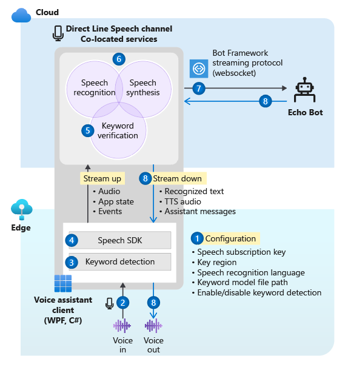
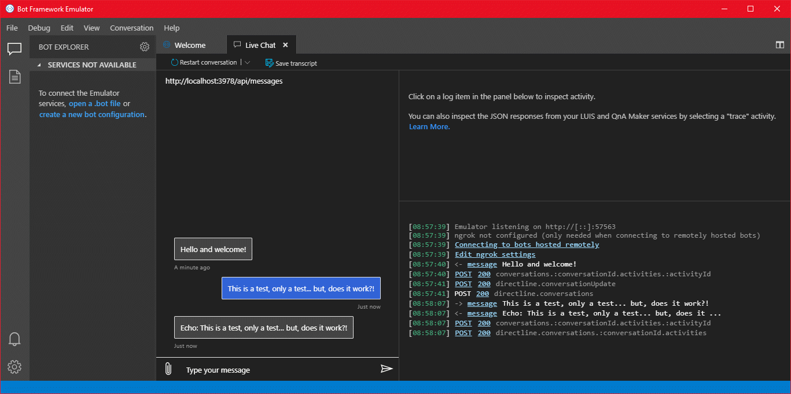

# Tutorial: Voice-enable your bot

You can use Azure AI Speech to voice-enable a chat bot.

In this tutorial, you'll use the Microsoft Bot Framework to create a bot that responds to what you say. You'll deploy your bot to Azure and register it with the Bot Framework Direct Line Speech channel. Then, you'll configure a sample client app for Windows that lets you speak to your bot and hear it speak back to you.

To complete the tutorial, you don't need extensive experience or familiarity with Azure, Bot Framework bots, or Direct Line Speech.

The voice-enabled chat bot that you make in this tutorial follows these steps:

1. The sample client application is configured to connect to the Direct Line Speech channel and the echo bot.
1. When the user presses a button, voice audio streams from the microphone. Or audio is continuously recorded when a custom keyword is used.
1. If a custom keyword is used, keyword detection happens on the local device, gating audio streaming to the cloud.
1. By using the Speech SDK, the sample client application connects to the Direct Line Speech channel and streams audio.
1. Optionally, higher-accuracy keyword verification happens on the service.
1. The audio is passed to the speech recognition service and transcribed to text.
1. The recognized text is passed to the echo bot as a Bot Framework activity.
1. The response text is turned into audio by the text to speech service, and streamed back to the client application for playback.



> [!NOTE]
> The steps in this tutorial don't require a paid service. As a new Azure user, you can use credits from your free Azure trial subscription and the free tier of the Speech service to complete this tutorial.

Here's what this tutorial covers:
> [!div class="checklist"]
> * Create new Azure resources.
> * Build, test, and deploy the echo bot sample to Azure App Service.
> * Register your bot with a Direct Line Speech channel.
> * Build and run the Windows Voice Assistant Client to interact with your echo bot.
> * Add custom keyword activation.
> * Learn to change the language of the recognized and spoken speech.

## Prerequisites

Here's what you'll need to complete this tutorial:

- A Windows 10 PC with a working microphone and speakers (or headphones).
- [Visual Studio 2017](https://visualstudio.microsoft.com/downloads/) or later, with the **ASP.NET and web development** workload installed.
- [.NET Framework Runtime 4.6.1](https://dotnet.microsoft.com/download) or later.
- An Azure account. [Sign up for free](https://azure.microsoft.com/free/cognitive-services/).
- A [GitHub](https://github.com/) account.
- [Git for Windows](https://git-scm.com/download/win).

## Create a resource group

The client app that you'll create in this tutorial uses a handful of Azure services. To reduce the round-trip time for responses from your bot, you'll want to make sure that these services are in the same Azure region.

This section walks you through creating a resource group in the West US region. You'll use this resource group when you're creating individual resources for the Bot Framework, the Direct Line Speech channel, and the Speech service.

1. Go to the [Azure portal page for creating a resource group](https://portal.azure.com/#create/Microsoft.ResourceGroup).
1. Provide the following information:
   * Set **Subscription** to **Free Trial**. (You can also use an existing subscription.)
   * Enter a name for **Resource group**. We recommend **SpeechEchoBotTutorial-ResourceGroup**.
   * From the **Region** dropdown menu, select **West US**.
1. Select **Review and create**. You should see a banner that reads **Validation passed**.
1. Select **Create**. It might take a few minutes to create the resource group.
1. As with the resources you'll create later in this tutorial, it's a good idea to pin this resource group to your dashboard for easy access. If you want to pin this resource group, select the pin icon next to the name.

### Choose an Azure region

Ensure that you use a [supported Azure region](regions.md#voice-assistants). The Direct Line Speech channel uses the text to speech service, which has neural and standard voices. Neural voices are used at [these Azure regions](regions.md#speech-service), and standard voices (retiring) are used at [these Azure regions](how-to-migrate-to-prebuilt-neural-voice.md).

For more information about regions, see [Azure locations](https://azure.microsoft.com/global-infrastructure/locations/).

## Create resources

Now that you have a resource group in a supported region, the next step is to create individual resources for each service that you'll use in this tutorial.

### Create a Speech service resource

1. Go to the [Azure portal page for creating a Speech service resource](https://portal.azure.com/#create/Microsoft.CognitiveServicesSpeechServices).
1. Provide the following information:
   * For **Name**, we recommend **SpeechEchoBotTutorial-Speech** as the name of your resource.
   * For **Subscription**, make sure that **Free Trial** is selected.
   * For **Location**, select **West US**.
   * For **Pricing tier**, select **F0**. This is the free tier.
   * For **Resource group**, select **SpeechEchoBotTutorial-ResourceGroup**.
1. After you've entered all required information, select **Create**. It might take a few minutes to create the resource.
1. Later in this tutorial, you'll need subscription keys for this service. You can access these keys at any time from your resource's **Overview** area (under **Manage keys**) or the **Keys** area.

At this point, check that your resource group (**SpeechEchoBotTutorial-ResourceGroup**) has a Speech service resource:

| Name | Type  | Location |
|------|-------|----------|
| SpeechEchoBotTutorial-Speech | Speech | West US |

### Create an Azure App Service plan

An App Service plan defines a set of compute resources for a web app to run.

1. Go to the [Azure portal page for creating an Azure App Service plan](https://portal.azure.com/#create/Microsoft.AppServicePlanCreate).
1. Provide the following information:
   * Set **Subscription** to **Free Trial**. (You can also use an existing subscription.)
   * For **Resource group**, select **SpeechEchoBotTutorial-ResourceGroup**.
   * For **Name**, we recommend **SpeechEchoBotTutorial-AppServicePlan** as the name of your plan.
   * For **Operating System**, select **Windows**.
   * For **Region**, select **West US**.
   * For **Pricing Tier**, make sure that **Standard S1** is selected. This should be the default value. If it isn't, set **Operating System** to **Windows**.
1. Select **Review and create**. You should see a banner that reads **Validation passed**.
1. Select **Create**. It might take a few minutes to create the resource.

At this point, check that your resource group (**SpeechEchoBotTutorial-ResourceGroup**) has two resources:

| Name | Type  | Location |
|------|-------|----------|
| SpeechEchoBotTutorial-AppServicePlan | App Service Plan | West US |
| SpeechEchoBotTutorial-Speech | Azure AI services | West US |

## Build an echo bot

Now that you've created resources, start with the echo bot sample, which echoes the text that you've entered as its response. The sample code is already configured to work with the Direct Line Speech channel, which you'll connect after you've deployed the bot to Azure.

> [!NOTE]
> The instructions that follow, along with more information about the echo bot, are available in the [sample's README on GitHub](https://github.com/microsoft/BotBuilder-Samples/blob/master/samples/csharp_dotnetcore/02.echo-bot/README.md).

### Run the bot sample on your machine

1. Clone the samples repository:

   ```bash
   git clone https://github.com/Microsoft/botbuilder-samples.git
   ```

1. Open Visual Studio.
1. From the toolbar, select **File** > **Open** > **Project/Solution**. Then open the project solution:

   ```
   samples\csharp_dotnetcore\02.echo-bot\EchoBot.sln
   ```

1. After the project is loaded, select the <kbd>F5</kbd> key to build and run the project.

   In the browser that opens, you'll see a screen similar to this one:

   > [!div class="mx-imgBorder"]
   > [](media/tutorial-voice-enable-your-bot-speech-sdk/echobot-running-on-localhost.png#lightbox)

### Test the bot sample with the Bot Framework Emulator

The [Bot Framework Emulator](https://github.com/microsoft/botframework-emulator) is a desktop app that lets bot developers test and debug their bots locally (or remotely through a tunnel). The emulator accepts typed text as the input (not voice). The bot will also respond with text.

Follow these steps to use the Bot Framework Emulator to test your echo bot running locally, with text input and text output. After you deploy the bot to Azure, you'll test it with voice input and voice output.

1. Install [Bot Framework Emulator](https://github.com/Microsoft/BotFramework-Emulator/releases/latest) version 4.3.0 or later.
1. Open the Bot Framework Emulator, and then select **File** > **Open Bot**.
1. Enter the URL for your bot. For example:

   ```
   http://localhost:3978/api/messages
   ```
   
1. Select **Connect**.
1. The bot should greet you with a "Hello and welcome!" message. Type in any text message and confirm that you get a response from the bot.

   This is what an exchange of communication with an echo bot might look like:
    [](media/tutorial-voice-enable-your-bot-speech-sdk/bot-framework-emulator.png#lightbox)

## Deploy your bot to Azure App Service

The next step is to deploy the echo bot to Azure. There are a few ways to deploy a bot, including the [Azure CLI](/azure/bot-service/bot-builder-deploy-az-cli) and [deployment templates](https://github.com/microsoft/BotBuilder-Samples/tree/main/samples/csharp_dotnetcore/13.core-bot). This tutorial focuses on publishing directly from Visual Studio.

> [!NOTE]
> If **Publish** doesn't appear as you perform the following steps, use Visual Studio Installer to add the **ASP.NET and web development** workload.

1. From Visual Studio, open the echo bot that's been configured for use with the Direct Line Speech channel:

   ```
   samples\csharp_dotnetcore\02.echo-bot\EchoBot.sln
   ```

1. In Solution Explorer, right-click the **EchoBot** project and select **Publish**.
1. In the **Publish** window that opens:
   1. Select **Azure** > **Next**.
   1. Select **Azure App Service (Windows)** > **Next**.
   1. Select **Create a new Azure App Service** by the green plus sign.
1. When the **App Service (Windows)** window appears:
   * Select **Add an account**, and sign in with your Azure account credentials. If you're already signed in, select your account from the dropdown list.
   * For **Name**, enter a globally unique name for your bot. This name is used to create a unique bot URL. 
   
     A default name that includes the date and time appears in the box (for example, **EchoBot20190805125647**). You can use the default name for this tutorial.
   * For **Subscription**, select **Free Trial**.
   * For **Resource Group**, select **SpeechEchoBotTutorial-ResourceGroup**.
   * For **Hosting Plan**, select **SpeechEchoBotTutorial-AppServicePlan**.
1. Select **Create**. On the final wizard screen, select **Finish**.
1. Select **Publish**. Visual Studio deploys the bot to Azure.

   You should see a success message in the Visual Studio output window that looks like this:

   ```
   Publish Succeeded.
   Web App was published successfully https://EchoBot20190805125647.azurewebsites.net/
   ```

   Your default browser should open and display a page that reads: "Your bot is ready!"

At this point, check your resource group (**SpeechEchoBotTutorial-ResourceGroup**) in the Azure portal. Confirm that it contains these three resources:

| Name | Type  | Location |
|------|-------|----------|
| EchoBot20190805125647 | App Service | West US |
| SpeechEchoBotTutorial-AppServicePlan | App Service plan | West US |
| SpeechEchoBotTutorial-Speech | Azure AI services | West US |

## Enable web sockets

You need to make a small configuration change so that your bot can communicate with the Direct Line Speech channel by using web sockets. Follow these steps to enable web sockets:

1. Go to the [Azure portal](https://portal.azure.com), and select your App Service resource. The resource name should be similar to **EchoBot20190805125647** (your unique app name).
1. On the left pane, under **Settings**, select **Configuration**.
1. Select the **General settings** tab.
1. Find the toggle for **Web sockets** and set it to **On**.
1. Select **Save**.

> [!TIP]
> You can use the controls at the top of your Azure App Service page to stop or restart the service. This ability can come in handy when you're troubleshooting.

## Create a channel registration

Now that you've created an Azure App Service resource to host your bot, the next step is to create a channel registration. Creating a channel registration is a prerequisite for registering your bot with Bot Framework channels, including the Direct Line Speech channel. If you want to learn more about how bots use channels, see [Connect a bot to channels](/azure/bot-service/bot-service-manage-channels).

1. Go to the [Azure portal page for creating an Azure bot](https://portal.azure.com/#create/Microsoft.AzureBot).
1. Provide the following information:
   * For **Bot handle**, enter **SpeechEchoBotTutorial-BotRegistration-####**. Replace **####** with a number of your choice. 
   
     > [!NOTE]
     > The bot handle must be globally unique. If you enter one and get the error message "The requested bot ID is not available," pick a different number. The following examples use **8726**.
   * For **Subscription**, select **Free Trial**.
   * For **Resource group**, select **SpeechEchoBotTutorial-ResourceGroup**.
   * For **Location**, select **West US**.
   * For **Pricing tier**, select **F0**.
   * Ignore **Auto create App ID and password**.
1. At the bottom of the **Azure Bot** pane, select **Create**.
1. After you create the resource, open your **SpeechEchoBotTutorial-BotRegistration-####** resource in the Azure portal.
1. From the **Settings** area, select **Configuration**.
1. For **Messaging endpoint**, enter the URL for your web app with the **/api/messages** path appended. For example, if your globally unique app name was **EchoBot20190805125647**, your messaging endpoint would be `https://EchoBot20190805125647.azurewebsites.net/api/messages/`.

At this point, check your resource group (**SpeechEchoBotTutorial-ResourceGroup**) in the Azure portal. It should now show at least four resources:

| Name | Type  | Location |
|------|-------|----------|
| EchoBot20190805125647 | App Service | West US |
| SpeechEchoBotTutorial-AppServicePlan | App Service plan | West US |
| SpeechEchoBotTutorial-BotRegistration-8726 | Bot Service | Global |
| SpeechEchoBotTutorial-Speech | Azure AI services | West US |

> [!IMPORTANT]
> The Azure AI Bot Service resource shows the Global region, even though you selected West US. This is expected.

## Optional: Test in web chat

The **Azure Bot** page has a **Test in Web Chat** option under **Settings**. It won't work by default with your bot because the web chat needs to authenticate against your bot. 

If you want to test your deployed bot with text input, use the following steps. Note that these steps are optional and aren't required for you to continue with the tutorial. 

1. In the [Azure portal](https://portal.azure.com), find and open your **EchoBotTutorial-BotRegistration-####** resource.
1. From the **Settings** area, select **Configuration**. Copy the value under **Microsoft App ID**.
1. Open the Visual Studio EchoBot solution. In Solution Explorer, find and double-select **appsettings.json**.
1. Replace the empty string next to **MicrosoftAppId** in the JSON file with the copied ID value.
1. Go back to the Azure portal. In the **Settings** area, select **Configuration**. Then select **Manage** next to **Microsoft App ID**.
1. Select **New client secret**. Add a description (for example, **web chat**) and select **Add**. Copy the new secret.
1. Replace the empty string next to **MicrosoftAppPassword** in the JSON file with the copied secret value.
1. Save the JSON file. It should look something like this code:

   ```json
   {
     "MicrosoftAppId": "3be0abc2-ca07-475e-b6c3-90c4476c4370",
     "MicrosoftAppPassword": "-zRhJZ~1cnc7ZIlj4Qozs_eKN.8Cq~U38G"
   }
   ```

1. Republish the app: right-click the **EchoBot** project in Visual Studio Solution Explorer, select **Publish**, and then select the **Publish** button.

## Register the Direct Line Speech channel

Now it's time to register your bot with the Direct Line Speech channel. This channel creates a connection between your bot and a client app compiled with the Speech SDK.

1. In the [Azure portal](https://portal.azure.com), find and open your **SpeechEchoBotTutorial-BotRegistration-####** resource.
1. From the **Settings** area, select **Channels** and then take the following steps:
   1. Under **More channels**, select **Direct Line Speech**.
   1. Review the text on the **Configure Direct line Speech** page, and then expand the **Cognitive service account** dropdown menu.
   1. Select the Speech service resource that you created earlier (for example, **SpeechEchoBotTutorial-Speech**) from the menu to associate your bot with your subscription key.
   1. Ignore the rest of the optional fields.
   1. Select **Save**.

1. From the **Settings** area, select **Configuration** and then take the following steps:
   1. Select the **Enable Streaming Endpoint** checkbox. This step is necessary for creating a communication protocol built on web sockets between your bot and the Direct Line Speech channel.
   1. Select **Save**.

If you want to learn more, see [Connect a bot to Direct Line Speech](/azure/bot-service/bot-service-channel-connect-directlinespeech). 

## Run the Windows Voice Assistant Client

The Windows Voice Assistant Client is a Windows Presentation Foundation (WPF) app in C# that uses the [Speech SDK](./speech-sdk.md) to manage communication with your bot through the Direct Line Speech channel. Use it to interact with and test your bot before writing a custom client app. It's open source, so you can either download the executable file and run it, or build it yourself.

The Windows Voice Assistant Client has a simple UI that allows you to configure the connection to your bot, view the text conversation, view Bot Framework activities in JSON format, and display adaptive cards. It also supports the use of custom keywords. You'll use this client to speak with your bot and receive a voice response.

> [!NOTE]
> At this point, confirm that your microphone and speakers are enabled and working.

1. Go to the [GitHub repository for the Windows Voice Assistant Client](https://github.com/Azure-Samples/Cognitive-Services-Voice-Assistant/blob/master/clients/csharp-wpf/README.md).
1. Follow the provided instructions to either:
   * Download a prebuilt executable file in a .zip package to run
   * Build the executable file yourself, by cloning the repository and building the project

1. Open the **VoiceAssistantClient.exe** client application and configure it to connect to your bot, by following the instructions in the GitHub repository.
1. Select **Reconnect** and make sure you see the message "New conversation started - type or press the microphone button."
1. Let's test it out. Select the microphone button, and speak a few words in English. The recognized text appears as you speak. When you're done speaking, the bot replies in its own voice, saying "echo" followed by the recognized words.
 
   You can also use text to communicate with the bot. Just type in the text on the bottom bar. 

### Troubleshoot errors in the Windows Voice Assistant Client

If you get an error message in your main app window, use this table to identify and troubleshoot the problem:

| Message | What should you do? |
|-------|----------------------|
|Error (AuthenticationFailure) : WebSocket Upgrade failed with an authentication error (401). Check for correct resource key (or authorization token) and region name| On the **Settings** page of the app, make sure that you entered the key and its region correctly. |
|Error (ConnectionFailure) : Connection was closed by the remote host. Error code: 1011. Error details: We could not connect to the bot before sending a message | Make sure that you [selected the Enable Streaming Endpoint checkbox](#register-the-direct-line-speech-channel) and/or [turned on web sockets](#enable-web-sockets).<br>Make sure that Azure App Service is running. If it is, try restarting it.|
|Error (ConnectionFailure) : Connection was closed by the remote host. Error code: 1002. Error details: The server returned status code '503' when status code '101' was expected | Make sure that you [selected the Enable Streaming Endpoint checkbox](#register-the-direct-line-speech-channel) box and/or [turned on web sockets](#enable-web-sockets).<br>Make sure that Azure App Service is running. If it is, try restarting it.|
|Error (ConnectionFailure) : Connection was closed by the remote host. Error code: 1011. Error details: Response status code does not indicate success: 500 (InternalServerError)| Your bot specified a neural voice in the [speak](https://github.com/microsoft/botframework-sdk/blob/master/specs/botframework-activity/botframework-activity.md#speak) field of its output activity, but the Azure region associated with your resource key doesn't support neural voices. See [neural voices](./regions.md#speech-service) and [standard voices](how-to-migrate-to-prebuilt-neural-voice.md).|

If the actions in the table don't address your problem, see [Voice assistants: Frequently asked questions](faq-voice-assistants.yml). If you still can't resolve your problem after following all the steps in this tutorial, please enter a new issue on the [Voice Assistant GitHub page](https://github.com/Azure-Samples/Cognitive-Services-Voice-Assistant/issues).

#### A note on connection timeout

If you're connected to a bot and no activity has happened in the last five minutes, the service automatically closes the web socket connection with the client and with the bot. This is by design. A message appears on the bottom bar: "Active connection timed out but ready to reconnect on demand."

You don't need to select the **Reconnect** button. Press the microphone button and start talking, enter a text message, or say the keyword (if one is enabled). The connection is automatically reestablished.  

### View bot activities

Every bot sends and receives activity messages. In the **Activity Log** window of the Windows Voice Assistant Client, timestamped logs show each activity that the client has received from the bot. You can also see the activities that the client sent to the bot by using the [DialogServiceConnector.SendActivityAsync](/dotnet/api/microsoft.cognitiveservices.speech.dialog.dialogserviceconnector.sendactivityasync) method. When you select a log item, it shows the details of the associated activity as JSON.

Here's sample JSON of an activity that the client received:

```json
{
    "attachments":[],
    "channelData":{
        "conversationalAiData":{
             "requestInfo":{
                 "interactionId":"8d5cb416-73c3-476b-95fd-9358cbfaebfa",
                 "version":"0.2"
             }
         }
    },
    "channelId":"directlinespeech",
    "conversation":{
        "id":"129ebffe-772b-47f0-9812-7c5bfd4aca79",
        "isGroup":false
    },
    "entities":[],
    "from":{
        "id":"SpeechEchoBotTutorial-BotRegistration-8726"
    },
    "id":"89841b4d-46ce-42de-9960-4fe4070c70cc",
    "inputHint":"acceptingInput",
    "recipient":{
        "id":"129ebffe-772b-47f0-9812-7c5bfd4aca79|0000"
    },
    "replyToId":"67c823b4-4c7a-4828-9d6e-0b84fd052869",
    "serviceUrl":"urn:botframework:websocket:directlinespeech",
    "speak":"<speak version='1.0' xmlns='https://www.w3.org/2001/10/synthesis' xml:lang='en-US'><voice name='en-US-JennyNeural'>Echo: Hello and welcome.</voice></speak>",
    "text":"Echo: Hello and welcome.",
    "timestamp":"2019-07-19T20:03:51.1939097Z",
    "type":"message"
}
```

To learn more about what's returned in the JSON output, see the [fields in the activity](https://github.com/microsoft/botframework-sdk/blob/master/specs/botframework-activity/botframework-activity.md). For the purpose of this tutorial, you can focus on the [text](https://github.com/microsoft/botframework-sdk/blob/master/specs/botframework-activity/botframework-activity.md#text) and [speak](https://github.com/microsoft/botframework-sdk/blob/master/specs/botframework-activity/botframework-activity.md#speak) fields.

### View client source code for calls to the Speech SDK

The Windows Voice Assistant Client uses the NuGet package [Microsoft.CognitiveServices.Speech](https://www.nuget.org/packages/Microsoft.CognitiveServices.Speech/), which contains the Speech SDK. A good place to start reviewing the sample code is the method `InitSpeechConnector()` in the file [VoiceAssistantClient\MainWindow.xaml.cs](https://github.com/Azure-Samples/Cognitive-Services-Voice-Assistant/blob/master/clients/csharp-wpf/VoiceAssistantClient/MainWindow.xaml.cs), which creates these two Speech SDK objects:
- [DialogServiceConfig](/dotnet/api/microsoft.cognitiveservices.speech.dialog.dialogserviceconfig): For configuration settings like resource key and its region.
- [DialogServiceConnector](/dotnet/api/microsoft.cognitiveservices.speech.dialog.dialogserviceconnector.-ctor): To manage the channel connection and client subscription events for handling recognized speech and bot responses.

## Add custom keyword activation

The Speech SDK supports custom keyword activation. Similar to "Hey Cortana" for a Microsoft assistant, you can write an app that will continuously listen for a keyword of your choice. Keep in mind that a keyword can be single word or a multiple-word phrase.

> [!NOTE]
> The term *keyword* is often used interchangeably with the term *wake word*. You might see both used in Microsoft documentation.

Keyword detection happens on the client app. If you're using a keyword, audio is streamed to the Direct Line Speech channel only if the keyword is detected. The Direct Line Speech channel includes a component called *keyword verification*, which does more complex processing in the cloud to verify that the keyword you've chosen is at the start of the audio stream. If keyword verification succeeds, then the channel will communicate with the bot.

Follow these steps to create a keyword model, configure the Windows Voice Assistant Client to use this model, and test it with your bot:

1. [Create a custom keyword by using the Speech service](./custom-keyword-basics.md).
1. Unzip the model file that you downloaded in the previous step. It should be named for your keyword. You're looking for a file named **kws.table**.
1. In the Windows Voice Assistant Client, find the **Settings** menu (the gear icon in the upper right). For **Model file path**, enter the full path name for the **kws.table** file from step 2.
1. Select the **Enabled** checkbox. You should see this message next to the checkbox: "Will listen for the keyword upon next connection." If you've provided the wrong file or an invalid path, you should see an error message.
1. Enter the values for **Subscription key** and **Subscription key region**, and then select **OK** to close the **Settings** menu.
1. Select **Reconnect**. You should see a message that reads: "New conversation started - type, press the microphone button, or say the keyword." The app is now continuously listening.
1. Speak any phrase that starts with your keyword. For example: "{your keyword}, what time is it?" You don't need to pause after uttering the keyword. When you're finished, two things happen:
   * You see a transcription of what you spoke.
   * You hear the bot's response.
1. Continue to experiment with the three input types that your bot supports:
   * Entering text on the bottom bar
   * Pressing the microphone icon and speaking
   * Saying a phrase that starts with your keyword

### View the source code that enables keyword detection

In the source code of the Windows Voice Assistant Client, use these files to review the code that enables keyword detection:

- [VoiceAssistantClient\Models.cs](https://github.com/Azure-Samples/Cognitive-Services-Voice-Assistant/blob/master/clients/csharp-wpf/VoiceAssistantClient/Models.cs) includes a call to the Speech SDK method [KeywordRecognitionModel.fromFile()](/javascript/api/microsoft-cognitiveservices-speech-sdk/keywordrecognitionmodel#fromfile-string-). This method is used to instantiate the model from a local file on disk.
- [VoiceAssistantClient\MainWindow.xaml.cs](https://github.com/Azure-Samples/Cognitive-Services-Voice-Assistant/blob/master/clients/csharp-wpf/VoiceAssistantClient/MainWindow.xaml.cs) includes a call to the Speech SDK method [DialogServiceConnector.StartKeywordRecognitionAsync()](/dotnet/api/microsoft.cognitiveservices.speech.dialog.dialogserviceconnector.startkeywordrecognitionasync). This method activates continuous keyword detection.

## Optional: Change the language and bot voice

The bot that you've created will listen for and respond in English, with a default US English text to speech voice. However, you're not limited to using English or a default voice. 

In this section, you'll learn how to change the language that your bot will listen for and respond in. You'll also learn how to select a different voice for that language.

### Change the language

You can choose from any of the languages mentioned in the [speech to text](language-support.md?tabs=stt) table. The following example changes the language to German.

1. Open the Windows Voice Assistant Client app, select the **Settings** button (upper-right gear icon), and enter **de-de** in the **Language** field. This is the locale value mentioned in the [speech to text](language-support.md?tabs=stt) table. 

   This step sets the spoken language to be recognized, overriding the default **en-us**. It also instructs the Direct Line Speech channel to use a default German voice for the bot reply.
1. Close the **Settings** page, and then select the **Reconnect** button to establish a new connection to your echo bot.
1. Select the microphone button, and say a phrase in German. The recognized text appears, and the echo bot replies with the default German voice.

### Change the default bot voice

You can select the text to speech voice and control pronunciation if the bot specifies the reply in the form of a [Speech Synthesis Markup Language](speech-synthesis-markup.md) (SSML) instead of simple text. The echo bot doesn't use SSML, but you can easily modify the code to do that. 

The following example adds SSML to the echo bot reply so that the German voice `de-DE-RalfNeural` (a male voice) is used instead of the default female voice. See the [list of standard voices](how-to-migrate-to-prebuilt-neural-voice.md) and [list of neural voices](language-support.md?tabs=tts) that are supported for your language.

1. Open **samples\csharp_dotnetcore\02.echo-bot\echo-bot.cs**.
1. Find these lines:

    ```csharp
    var replyText = $"Echo: {turnContext.Activity.Text}";
    await turnContext.SendActivityAsync(MessageFactory.Text(replyText, replyText), cancellationToken);
    ```

   Replace them with this code:
   
    ```csharp
    var replyText = $"Echo: {turnContext.Activity.Text}";
    var replySpeak = @"<speak version='1.0' xmlns='https://www.w3.org/2001/10/synthesis' xml:lang='de-DE'>
                    <voice name='de-DE-RalfNeural'>" +
                    $"{replyText}" + "</voice></speak>";
    await turnContext.SendActivityAsync(MessageFactory.Text(replyText, replySpeak), cancellationToken);
    ```
1. Build your solution in Visual Studio and fix any build errors.

The second argument in the method `MessageFactory.Text` sets the [activity speak field](https://github.com/Microsoft/botframework-sdk/blob/master/specs/botframework-activity/botframework-activity.md#speak) in the bot reply. With the preceding change, it has been replaced from simple text to SSML in order to specify a non-default German voice.

### Redeploy your bot

Now that you've made the necessary change to the bot, the next step is to republish it to Azure App Service and try it out:

1. In the Solution Explorer window, right-click the **EchoBot** project and select **Publish**.
1. Your previous deployment configuration has already been loaded as the default. Select **Publish** next to **EchoBot20190805125647 - Web Deploy**.

   The **Publish Succeeded** message appears in the Visual Studio output window, and a webpage opens with the message "Your bot is ready!"
1. Open the Windows Voice Assistant Client app. Select the **Settings** button (upper-right gear icon), and make sure that you still have **de-de** in the **Language** field.
1. Follow the instructions in [Run the Windows Voice Assistant Client](#run-the-windows-voice-assistant-client) to reconnect with your newly deployed bot, speak in the new language, and hear your bot reply in that language with the new voice.

## Clean up resources

If you're not going to continue using the echo bot deployed in this tutorial, you can remove it and all its associated Azure resources by deleting the Azure resource group:

1. In the [Azure portal](https://portal.azure.com), select **Resource Groups** under **Azure services**.
1. Find the **SpeechEchoBotTutorial-ResourceGroup** resource group. Select the three dots (...).
1. Select **Delete resource group**.

## Explore documentation

* [Deploy to an Azure region near you](https://azure.microsoft.com/global-infrastructure/locations/) to see the improvement in bot response time.
* [Deploy to an Azure region that supports high-quality neural text to speech voices](./regions.md#speech-service).
* Get pricing associated with the Direct Line Speech channel:
  * [Bot Service pricing](https://azure.microsoft.com/pricing/details/bot-service/)
  * [Speech service](https://azure.microsoft.com/pricing/details/cognitive-services/speech-services/)
* Build and deploy your own voice-enabled bot:
  * Build a [Bot Framework bot](https://dev.botframework.com/). Then [register it with the Direct Line Speech channel](/azure/bot-service/bot-service-channel-connect-directlinespeech) and [customize your bot for voice](/azure/bot-service/directline-speech-bot).
  * Explore existing [Bot Framework solutions](https://microsoft.github.io/botframework-solutions/index): [Build a virtual assistant](https://microsoft.github.io/botframework-solutions/overview/virtual-assistant-solution/) and [extend it to Direct Line Speech](https://microsoft.github.io/botframework-solutions/clients-and-channels/tutorials/enable-speech/1-intro/).

## Next steps

> [!div class="nextstepaction"]
> [Build your own client app by using the Speech SDK](./quickstarts/voice-assistants.md?pivots=programming-language-csharp)
