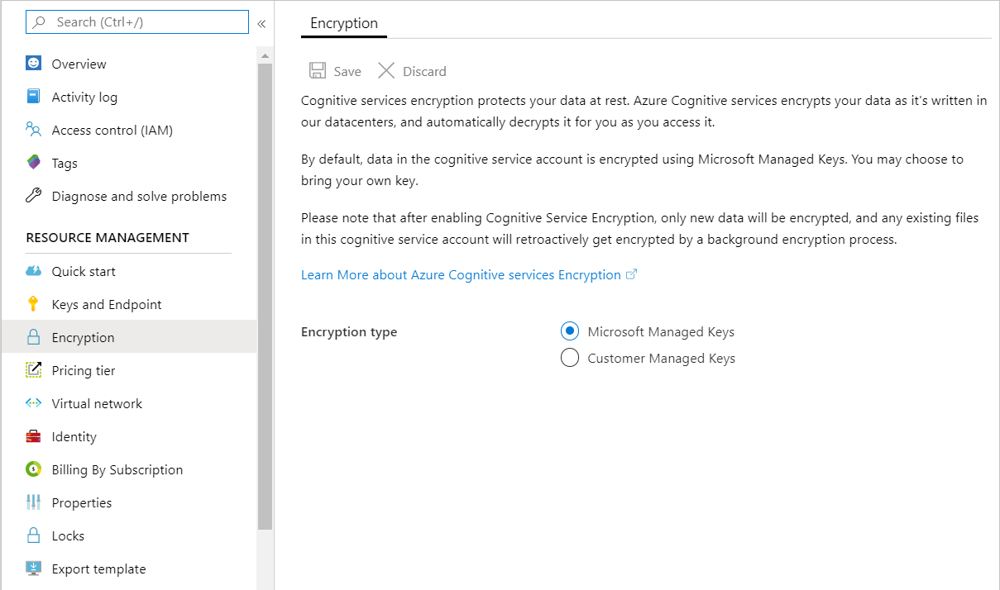

# Translator encryption of data at rest

Translator automatically encrypts your uploaded data when it's persisted to the cloud helping to meet your organizational security and compliance goals.

## About Azure AI services encryption

Data is encrypted and decrypted using [FIPS 140-2](https://en.wikipedia.org/wiki/FIPS_140-2) compliant [256-bit AES](https://en.wikipedia.org/wiki/Advanced_Encryption_Standard) encryption. Encryption and decryption are transparent, meaning encryption and access are managed for you. Your data is secure by default and you don't need to modify your code or applications to take advantage of encryption.

## About encryption key management

By default, your subscription uses Microsoft-managed encryption keys. If you're using a pricing tier that supports Customer-managed keys, you can see the encryption settings for your resource in the **Encryption** section of the [Azure portal](https://portal.azure.com), as shown in the following image.

For subscriptions that only support Microsoft-managed encryption keys, you won't have an **Encryption** section.

## Customer-managed keys with Azure Key Vault

By default, your subscription uses Microsoft-managed encryption keys. There's also the option to manage your subscription with your own keys called customer-managed keys (CMK). CMK offers greater flexibility to create, rotate, disable, and revoke access controls. You can also audit the encryption keys used to protect your data. If CMK is configured for your subscription, double encryption is provided, which offers a second layer of protection, while allowing you to control the encryption key through your Azure Key Vault.

> [!IMPORTANT]
> Customer-managed keys are available for all pricing tiers for the Translator service. To request the ability to use customer-managed keys, fill out and submit the [Translator Customer-Managed Key Request Form](https://aka.ms/cogsvc-cmk) It will take approximately 3-5 business days to hear back on the status of your request. Depending on demand, you may be placed in a queue and approved as space becomes available. Once approved for using CMK with the Translator service, you will need to create a new Translator resource. Once your Translator resource is created, you can use Azure Key Vault to set up your managed identity.

Follow these steps to enable customer-managed keys for Translator:

1. Create your new regional Translator or regional Azure AI services resource. Customer-managed keys won't work with a global resource.
2. Enabled Managed Identity in the Azure portal, and add your customer-managed key information.
3. Create a new workspace in Custom Translator and associate this subscription information.

### Enable customer-managed keys

You must use Azure Key Vault to store your customer-managed keys. You can either create your own keys and store them in a key vault, or you can use the Azure Key Vault APIs to generate keys. The Azure AI services resource and the key vault must be in the same region and in the same Azure Active Directory (Azure AD) tenant, but they can be in different subscriptions. For more information about Azure Key Vault, see [What is Azure Key Vault?](../../key-vault/general/overview.md).

A new Azure AI services resource is always encrypted using Microsoft-managed keys. It's not possible to enable customer-managed keys at the time that the resource is created. Customer-managed keys are stored in Azure Key Vault. The key vault must be provisioned with access policies that grant key permissions to the managed identity that is associated with the Azure AI services resource. The managed identity is available as soon as the resource is created.

To learn how to use customer-managed keys with Azure Key Vault for Azure AI services encryption, see:

- [Configure customer-managed keys with Key Vault for Azure AI services encryption from the Azure portal](../Encryption/cognitive-services-encryption-keys-portal.md)

Enabling customer managed keys will also enable a system assigned managed identity, a feature of Azure AD. Once the system assigned managed identity is enabled, this resource will be registered with Azure Active Directory. After being registered, the managed identity will be given access to the Key Vault selected during customer managed key setup. You can learn more about [Managed Identities](../../active-directory/managed-identities-azure-resources/overview.md).

> [!IMPORTANT]
> If you disable system assigned managed identities, access to the key vault will be removed and any data encrypted with the customer keys will no longer be accessible. Any features depended on this data will stop working. Any models that you have deployed will also be undeployed. All uploaded data will be deleted from Custom Translator. If the managed identities are re-enabled, we will not automatically redeploy the model for you.

> [!IMPORTANT]
> Managed identities do not currently support cross-directory scenarios. When you configure customer-managed keys in the Azure portal, a managed identity is automatically assigned under the covers. If you subsequently move the subscription, resource group, or resource from one Azure AD directory to another, the managed identity associated with the resource is not transferred to the new tenant, so customer-managed keys may no longer work. For more information, see **Transferring a subscription between Azure AD directories** in [FAQs and known issues with managed identities for Azure resources](../../active-directory/managed-identities-azure-resources/known-issues.md#transferring-a-subscription-between-azure-ad-directories).  

### Store customer-managed keys in Azure Key Vault

To enable customer-managed keys, you must use an Azure Key Vault to store your keys. You must enable both the **Soft Delete** and **Do Not Purge** properties on the key vault.

Only RSA keys of size 2048 are supported with Azure AI services encryption. For more information about keys, see **Key Vault keys** in [About Azure Key Vault keys, secrets and certificates](../../key-vault/general/about-keys-secrets-certificates.md).

> [!NOTE]
> If the entire key vault is deleted, your data will no longer be displayed and all your models will be undeployed. All uploaded data will be deleted from Custom Translator. 

### Revoke access to customer-managed keys

To revoke access to customer-managed keys, use PowerShell or Azure CLI. For more information, see [Azure Key Vault PowerShell](/powershell/module/az.keyvault//) or [Azure Key Vault CLI](/cli/azure/keyvault). Revoking access effectively blocks access to all data in the Azure AI services resource and your models will be undeployed, as the encryption key is inaccessible by Azure AI services. All uploaded data will also be deleted from Custom Translator.

## Next steps

> [!div class="nextstepaction"]
> [Learn more about Azure Key Vault](../../key-vault/general/overview.md)
