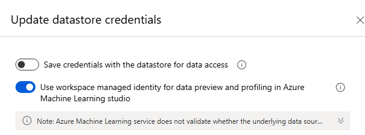

# Fine-tune Phi-3 models in Azure AI Studio

Azure AI Studio lets you tailor large language models to your personal datasets by using a process known as fine-tuning. Fine-tuning provides significant value by enabling customization and optimization for specific tasks and applications. It leads to improved performance, cost efficiency, reduced latency, and tailored outputs.

In this article, you learn how to fine-tune Phi-3 family of small language models (SLMs) in Azure AI Studio as a service with pay-as you go billing.

The Phi-3 family of SLMs is a collection of instruction-tuned generative text models.  Phi-3 models are the most capable and cost-effective small language models (SLMs) available, outperforming models of the same size and next size up across various language, reasoning, coding, and math benchmarks.

## [Phi-3-mini](#tab/phi-3-mini)

Phi-3 Mini is a 3.8B parameters, lightweight, state-of-the-art open model built upon datasets used for Phi-2 - synthetic data and filtered websites - with a focus on high-quality, reasoning dense data. The model belongs to the Phi-3 model family, and the Mini version comes in two variants 4K and 128K which is the context length (in tokens) it can support.

- [Phi-3-mini-4k-Instruct](https://ai.azure.com/explore/models/Phi-3-mini-4k-instruct/version/4/registry/azureml)
- [Phi-3-mini-128k-Instruct](https://ai.azure.com/explore/models/Phi-3-mini-128k-instruct/version/4/registry/azureml)

The model underwent a rigorous enhancement process, incorporating both supervised fine-tuning and direct preference optimization to ensure precise instruction adherence and robust safety measures. When assessed against benchmarks testing common sense, language understanding, math, code, long context and logical reasoning, Phi-3 Mini-4K-Instruct and Phi-3 Mini-128K-Instruct showcased a robust and state-of-the-art performance among models with less than 13 billion parameters.


## [Phi-3-medium](#tab/phi-3-medium)
Phi-3 Medium is a 14B parameters, lightweight, state-of-the-art open model. Phi-3-Medium was trained with Phi-3 datasets that include both synthetic data and the filtered, publicly available websites data, with a focus on high quality and reasoning-dense properties.

The model belongs to the Phi-3 model family, and the Medium version comes in two variants, 4K and 128K, which denote the context length (in tokens) that each model variant can support.

- Phi-3-medium-4k-Instruct
- Phi-3-medium-128k-Instruct

The model underwent a rigorous enhancement process, incorporating both supervised fine-tuning and direct preference optimization to ensure precise instruction adherence and robust safety measures. When assessed against benchmarks that test common sense, language understanding, math, code, long context and logical reasoning, Phi-3-Medium-4k-Instruct and Phi-3-Medium-128k-Instruct showcased a robust and state-of-the-art performance among models with less than 13 billion parameters.

---


## [Phi-3-mini](#tab/phi-3-mini)

The following models are available in Azure AI studio for Phi 3 when fine-tuning as a service with pay-as-you-go:

- `Phi-3-mini-4k-instruct` (preview)
- `Phi-3-mini-128k-instruct` (preview)

Fine-tuning of Phi-3 models is currently supported in projects located in East US 2.

## [Phi-3-medium](#tab/phi-3-medium)

The following models are available in Azure AI studio for Phi 3 when fine-tuning as a service with pay-as-you-go:

- `Phi-3-medium-4k-instruct` (preview)
- `Phi-3-medium-128k-instruct` (preview)

Fine-tuning of Phi-3 models is currently supported in projects located in East US 2.

---

### Prerequisites

- An Azure subscription. If you don't have an Azure subscription, create a [paid Azure account](https://azure.microsoft.com/pricing/purchase-options/pay-as-you-go) to begin.
- An [AI Studio hub](../how-to/create-azure-ai-resource.md).

    > [!IMPORTANT]
    > For Phi-3 family models, the pay-as-you-go model fine-tune offering is only available with hubs created in **East US 2** regions.

- An [AI Studio project](../how-to/create-projects.md).
- Azure role-based access controls (Azure RBAC) are used to grant access to operations in Azure AI Studio. To perform the steps in this article, your user account must be assigned the __Azure AI Developer role__ on the resource group.

    For more information on permissions, see [Role-based access control in Azure AI Studio](../concepts/rbac-ai-studio.md).

### Subscription provider registration

Verify the subscription is registered to the `Microsoft.Network` resource provider.
1. Sign in to the [Azure portal](https://portal.azure.com).
1. Select **Subscriptions** from the left menu.
1. Select the subscription you want to use.
1. Select **Settings** > **Resource providers** from the left menu.
1. Confirm that **Microsoft.Network** is in the list of resource providers. Otherwise add it.


### Data preparation

Prepare your training and validation data to fine-tune your model. Your training data and validation data sets consist of input and output examples for how you would like the model to perform.

Make sure all your training examples follow the expected format for inference. To fine-tune models effectively, ensure a balanced and diverse dataset.

This involves maintaining data balance, including various scenarios, and periodically refining training data to align with real-world expectations, ultimately leading to more accurate and balanced model responses.

Different model types require a different format of training data.

### Chat completion

The training and validation data you use **must** be formatted as a JSON Lines (JSONL) document. For `Phi-3-mini-128k-instruct` the fine-tuning dataset must be formatted in the conversational format that is used by the Chat completions API.

### Example file format

```json
    {"messages": [{"role": "system", "content": "You are an Xbox customer support agent whose primary goal is to help users with issues they are experiencing with their Xbox devices. You are friendly and concise. You only provide factual answers to queries, and do not provide answers that are not related to Xbox."}, {"role": "user", "content": "Is Xbox better than PlayStation?"}, {"role": "assistant", "content": "I apologize, but I cannot provide personal opinions. My primary job is to assist you with any issues related to your Xbox device. Do you have any Xbox-related issues that need addressing?"}]}
    {"messages": [{"role": "system", "content": "You are an Xbox customer support agent whose primary goal is to help users with issues they are experiencing with their Xbox devices. You are friendly and concise. You only provide factual answers to queries, and do not provide answers that are not related to Xbox."}, {"role": "user", "content": "Can I play PC games on my Xbox?"}, {"role": "assistant", "content": "While Xbox consoles don't natively support PC games, they can play an array of Xbox games, many of which are also available on PC. Can I assist you with finding games compatible with your Xbox device?"}]}
    {"messages": [{"role": "system", "content": "You are an Xbox customer support agent whose primary goal is to help users with issues they are experiencing with their Xbox devices. You are friendly and concise. You only provide factual answers to queries, and do not provide answers that are not related to Xbox."}, {"role": "user", "content": "I'm having trouble connecting my Xbox to the Wi-Fi."}, {"role": "assistant", "content": "No worries, let's go through the network settings on your Xbox. Can you please tell me what happens when you try to connect it to the Wi-Fi?"}]}
```
The supported file type is JSON Lines. Files are uploaded to the default datastore and made available in your project.

## Fine-tune a Phi-3 model

# [Phi-3-mini](#tab/phi-3-mini)

To fine-tune a Phi-3 model:

1. Sign in to [Azure AI Studio](https://ai.azure.com).
1. Choose the model you want to fine-tune from the Azure AI Studio [model catalog](https://ai.azure.com/explore/models). 

1. On the model's **Details** page, select **fine-tune**.

1. Select the project in which you want to fine-tune your models. To use the pay-as-you-go model fine-tune offering, your workspace must belong to the **East US 2** region.
1. On the fine-tune wizard, select the link to **Azure AI studio Terms** to learn more about the terms of use. You can also select the **Azure AI studio offer details** tab to learn about pricing for the selected model.
1. If this is your first time fine-tuning the model in the project, you have to subscribe your project for the particular offering (for example, Phi-3-mini-128k-instruct) from Azure AI studio. This step requires that your account has the Azure subscription permissions and resource group permissions listed in the prerequisites. Each project has its own subscription to the particular Azure AI studio offering, which allows you to control and monitor spending. Select **Subscribe and fine-tune**.

    > [!NOTE]
    > Subscribing a project to a particular Azure AI studio offering (in this case, Phi-3-mini-128k-instruct) requires that your account has **Contributor** or **Owner** access at the subscription level where the project is created. Alternatively, your user account can be assigned a custom role that has the Azure subscription permissions and resource group permissions listed in the [prerequisites](#prerequisites).

1. Once you sign up the project for the particular Azure AI studio offering, subsequent fine-tuning of the _same_ offering in the _same_ project don't require subscribing again. Therefore, you don't need to have the subscription-level permissions for subsequent fine-tune jobs. If this scenario applies to you, select **Continue to fine-tune**.

1. Enter a name for your fine-tuned model and the optional tags and description.
1. Select training data to fine-tune your model. See [data preparation](#data-preparation) for more information.

    > [!NOTE]
    > If the you have your training/validation files in a credential less datastore, you will need to allow workspace managed identity access to your datastore in order to proceed with MaaS fine-tuning with a credential less storage. On the "Datastore" page, after clicking "Update authentication" > Select the following option: 
	
	

    Make sure all your training examples follow the expected format for inference. To fine-tune models effectively, ensure a balanced and diverse dataset. This involves maintaining data balance, including various scenarios, and periodically refining training data to align with real-world expectations, ultimately leading to more accurate and balanced model responses.
    - The batch size to use for training. When set to -1, batch_size is calculated as 0.2% of examples in training set and the max is 256.
    - The fine-tuning learning rate is the original learning rate used for pretraining multiplied by this multiplier. We recommend experimenting with values between 0.5 and 2. Empirically, we've found that larger learning rates often perform better with larger batch sizes. Must be between 0.0 and 5.0.
    - Number of training epochs. An epoch refers to one full cycle through the data set.

1. Task parameters are an optional step and an advanced option- Tuning hyperparameter is essential for optimizing large language models (LLMs) in real-world applications. It allows for improved performance and efficient resource usage. Users can choose to keep he default settings or advanced users can customize parameters like epochs or learning rate.

1. Review your selections and proceed to train your model.

Once your model is fine-tuned, you can deploy the model and can use it in your own application, in the playground, or in prompt flow. For more information, see [How to deploy Phi-3 family of large language models with Azure AI Studio](./deploy-models-phi-3.md).

# [Phi-3-medium](#tab/phi-3-medium)

To fine-tune a Phi-3 model:

1. Sign in to [Azure AI Studio](https://ai.azure.com).
1. Choose the model you want to fine-tune from the Azure AI Studio [model catalog](https://ai.azure.com/explore/models). 

1. On the model's **Details** page, select **fine-tune**.

1. Select the project in which you want to fine-tune your models. To use the pay-as-you-go model fine-tune offering, your workspace must belong to the **East US 2** region.
1. On the fine-tune wizard, select the link to **Azure AI studio Terms** to learn more about the terms of use. You can also select the **Azure AI studio offer details** tab to learn about pricing for the selected model.
1. If this is your first time fine-tuning the model in the project, you have to subscribe your project for the particular offering (for example, Phi-3-medium-128k-instruct) from Azure AI studio. This step requires that your account has the Azure subscription permissions and resource group permissions listed in the prerequisites. Each project has its own subscription to the particular Azure AI studio offering, which allows you to control and monitor spending. Select **Subscribe and fine-tune**.

    > [!NOTE]
    > Subscribing a project to a particular Azure AI studio offering (in this case, Phi-3-mini-128k-instruct) requires that your account has **Contributor** or **Owner** access at the subscription level where the project is created. Alternatively, your user account can be assigned a custom role that has the Azure subscription permissions and resource group permissions listed in the [prerequisites](#prerequisites).

1. Once you sign up the project for the particular Azure AI studio offering, subsequent fine-tuning of the _same_ offering in the _same_ project don't require subscribing again. Therefore, you don't need to have the subscription-level permissions for subsequent fine-tune jobs. If this scenario applies to you, select **Continue to fine-tune**.

1. Enter a name for your fine-tuned model and the optional tags and description.
1. Select training data to fine-tune your model. See [data preparation](#data-preparation) for more information.

    > [!NOTE]
    > If you have your training/validation files in a credential less datastore, you will need to allow workspace managed identity access to your datastore in order to proceed with MaaS finetuning with a credential less storage. On the "Datastore" page, after clicking "Update authentication" > Select the following option: 
	
	

    Make sure all your training examples follow the expected format for inference. To fine-tune models effectively, ensure a balanced and diverse dataset. This involves maintaining data balance, including various scenarios, and periodically refining training data to align with real-world expectations, ultimately leading to more accurate and balanced model responses.
    - The batch size to use for training. When set to -1, batch_size is calculated as 0.2% of examples in training set and the max is 256.
    - The fine-tuning learning rate is the original learning rate used for pretraining multiplied by this multiplier. We recommend experimenting with values between 0.5 and 2. Empirically, we've found that larger learning rates often perform better with larger batch sizes. Must be between 0.0 and 5.0.
    - Number of training epochs. An epoch refers to one full cycle through the data set.

1. Task parameters are an optional step and an advanced option- Tuning hyperparameter is essential for optimizing large language models (LLMs) in real-world applications. It allows for improved performance and efficient resource usage. Users can choose to keep the default settings or advanced users can customize parameters like epochs or learning rate.

1. Review your selections and proceed to train your model.

Once your model is fine-tuned, you can deploy the model and can use it in your own application, in the playground, or in prompt flow. For more information, see [How to deploy Phi-3 family of large language models with Azure AI Studio](./deploy-models-phi-3.md).

---

## Cleaning up your fine-tuned models 

You can delete a fine-tuned model from the fine-tuning model list in [Azure AI Studio](https://ai.azure.com) or from the model details page. Select the fine-tuned model to delete from the Fine-tuning page, and then select the Delete button to delete the fine-tuned model.

>[!NOTE]
> You can't delete a custom model if it has an existing deployment. You must first delete your model deployment before you can delete your custom model.

## Cost and quotas

### Cost and quota considerations for Phi-3 models fine-tuned as a service

Phi models fine-tuned as a service are offered by Microsoft and integrated with Azure AI Studio for use. You can find the pricing when [deploying](./deploy-models-phi-3.md) or fine-tuning the models under the Pricing and terms tab on deployment wizard.


## Content filtering

Models deployed as a service with pay-as-you-go are protected by Azure AI Content Safety. When deployed to real-time endpoints, you can opt out of this capability. With Azure AI content safety enabled, both the prompt and completion pass through an ensemble of classification models aimed at detecting and preventing the output of harmful content. The content filtering system detects and takes action on specific categories of potentially harmful content in both input prompts and output completions. Learn more about [Azure AI Content Safety](../concepts/content-filtering.md).


## Next steps
- [What is Azure AI Studio?](../what-is-ai-studio.md)
- [Learn more about deploying Phi-3 models](./deploy-models-phi-3.md)
- [Azure AI FAQ article](../faq.yml)
