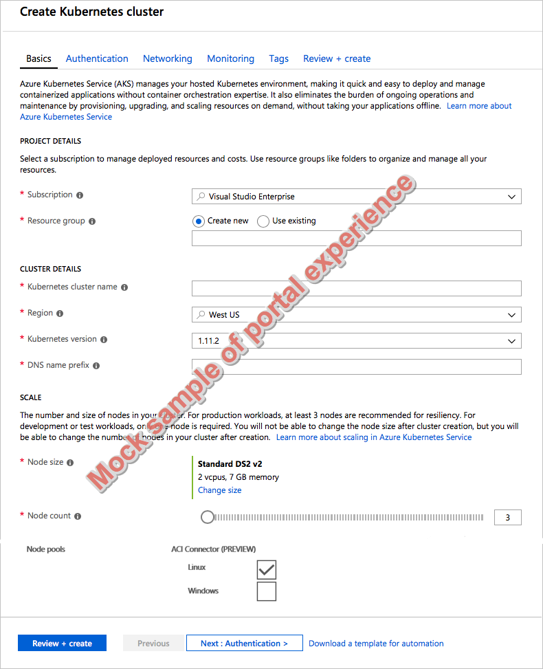
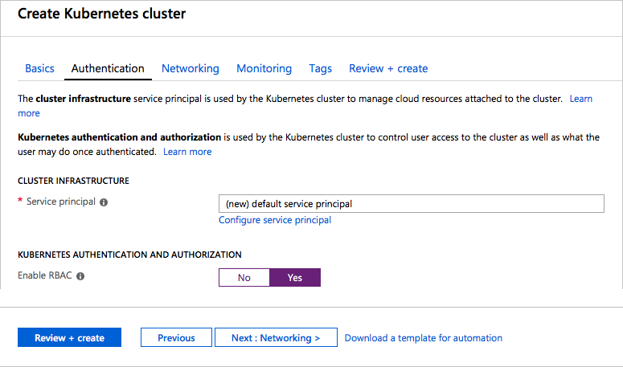
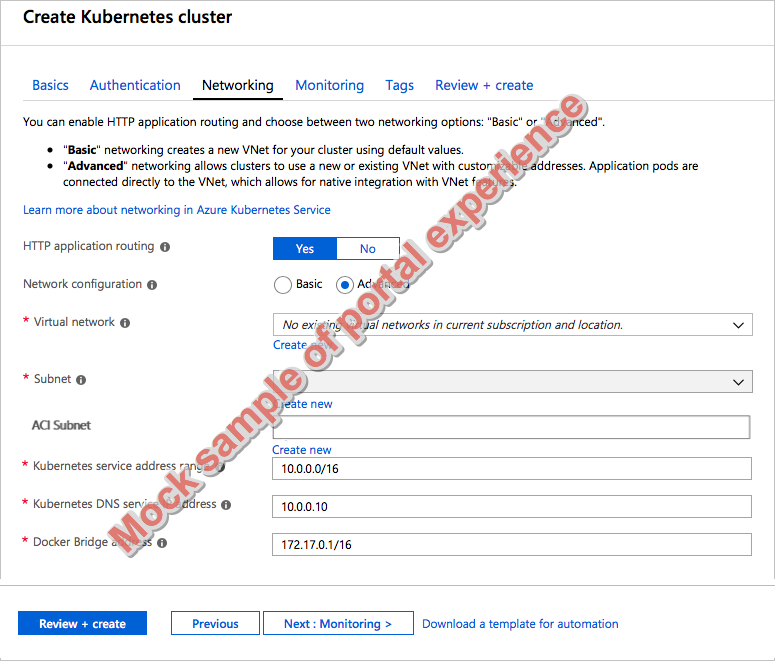

# Create and configure an Azure Kubernetes Services (AKS) cluster to use the Azure Container Instances (ACI) connector in the Azure portal

To rapidly scale application workloads in an Azure Kubernetes Service (AKS) cluster, you can connect to Azure Container Instances (ACI). With ACI, you have quick provisioning of container instances, and only pay per second for their execution time. You don't need to wait for Kubernetes cluster autoscaler to deploy underlying compute nodes to run the additional pods. This article shows you how to create and configure the virtual network resources and AKS cluster, then enable the ACI connector.

> [!IMPORTANT]
> The ACI connector for AKS is currently in **preview**. Previews are made available to you on the condition that you agree to the [supplemental terms of use](https://azure.microsoft.com/support/legal/preview-supplemental-terms/). Some aspects of this feature may change prior to general availability (GA).

## Before you begin

The ACI connector enables network communication between pods that run in ACI and the AKS cluster. To provide this communication, a virtual network subnet is created for use with ACI. The ACI connector only works with AKS clusters created using *advanced* networking. By default, AKS clusters are created with *basic* networking. This article shows you how to create a virtual network and subnets, then deploy an AKS cluster that uses advanced networking.

For more information, see [AKS advanced networking][].

The AKS cluster created in this article is also configured with Kubernetes role-based access controls. The ACI connector only works with RBAC-enabled clusters.

For more information, see [AKS security with RBAC][].

## Sign in to Azure

Sign in to the Azure portal at http://portal.azure.com.

## Create an AKS cluster

In the top left-hand corner of the Azure portal, select **Create a resource** > **Kubernetes Service**.

To create an AKS cluster, complete the following steps:

1. **Basics** - Configure the following options:
    - *PROJECT DETAILS*: Select an Azure subscription, then select or create an Azure resource group, such as *myResourceGroup*. Enter a **Kubernetes cluster name**, such as *myAKSCluster*.
    - *CLUSTER DETAILS*: Select a region, Kubernetes version, and DNS name prefix for the AKS cluster.
    - *SCALE*: Select a VM size for the AKS nodes. The VM size **cannot** be changed once an AKS cluster has been deployed.
        - Select the number of nodes to deploy into the cluster. For this article, set **Node count** to *1*. Node count **can** be adjusted after the cluster has been deployed.
        - To enable the ACI connector, under **Node pools**, check the box for either, or both, of the *Linux* and *Windows* OSes.
    
    

    Select **Next: Authentication** when complete.

1. **Authentication**: Configure the following options:
    - Create a new service principal or *Configure* to use an existing one. When using an existing SPN, you need to provide the SPN client ID and secret.
    - Enable the option for Kubernetes role-based access controls (RBAC). These controls provide more fine-grained control over access to the Kubernetes resources deployed in your AKS cluster. RBAC is required for the ACI connector.

    

    Select **Next: Networking** when complete.

1. **Networking**: Select the **Advanced** network configuration using the [Azure CNI][azure-cni] plugin. The ACI connector requires a delegated subnet for ACI, which is configured through advanced networking. For more information on networking options, see [AKS networking overview][aks-network].
    - Create a new, or select an existing, *Virtual network*.
    - Create a new, or select an existing, *Subnet* for use with the AKS cluster. The AKS nodes and resources created with the Kubernetes cluster are created in this subnet.
    - Create a new, or select an existing, *ACI subnet* for use with the ACI connector. This subnet is used to allow pods that run in ACI to communicate with the other AKS cluster resources and pods.
    
    

    Select **Review + create** and then **Create** when ready.

It takes a few minutes to create the AKS cluster and to be ready for use.

## Connect to the cluster

To manage a Kubernetes cluster, use [kubectl][kubectl], the Kubernetes command-line client. The `kubectl` client is pre-installed in the Azure Cloud Shell.

Open Cloud Shell using the button on the top right-hand corner of the Azure portal.


Use the [az aks get-credentials][az-aks-get-credentials] command to configure `kubectl` to connect to your Kubernetes cluster. The following example gets credentials for the cluster name *myAKSCluster* in the resource group named *myResourceGroup*:

```azurecli-interactive
az aks get-credentials --resource-group myResourceGroup --name myAKSCluster
```

To verify the connection to your cluster, use the [kubectl get][kubectl-get] command to return a list of the cluster nodes.

```azurecli-interactive
kubectl get nodes
```

The following example output shows the single node created and then ACI connectors for Linux and Windows:

```
# Add output showing the VK node(s), I guess?
```

## Deploy a sample app

**-- NEED SAMPLE APP TO DEPLOY THAT GENERATES STRESS TO BURST TO ACI --**

## Remove ACI connector

If you no longer wish to use the ACI connector, you can disable the connector **-- UNDER THE SCALE SETTINGS FOR AN AKS CLUSTER IN THE PORTAL???--**

## Next steps

The ACI connector is often one component of a scaling solution in AKS. For more information on scaling solutions, see the following articles:

- [Use the Kubernetes horizontal pod autoscaler][aks-hpa]
- [Use the Kubernetes cluster autoscaler][aks-cluster-autoscaler]

<!-- LINKS - external -->
[kubectl-get]: https://kubernetes.io/docs/reference/generated/kubectl/kubectl-commands#get

<!-- LINKS - internal -->
[azure-cli-install]: /cli/azure/install-azure-cli
[az-group-create]: /cli/azure/group#az-group-create
[az-network-vnet-create]: /cli/azure/network/vnet#az-network-vnet-create
[az-network-vnet-subnet-create]: /cli/azure/network/vnet/subnet#az-network-vnet-subnet-create
[az-ad-sp-create-for-rbac]: /cli/azure/ad/sp#az-ad-sp-create-for-rbac
[az-network-vnet-show]: /cli/azure/network/vnet#az-network-vnet-show
[az-role-assignment-create]: /cli/azure/role/assignment#az-role-assignment-create
[az-network-vnet-subnet-show]: /cli/azure/network/vnet/subnet#az-network-vnet-subnet-show
[az-aks-create]: /cli/azure/aks#az-aks-create
[az-aks-enable-addons]: /cli/azure/aks#az-aks-enable-addons
[az-aks-get-credentials]: /cli/azure/aks#az-aks-get-credentials
[az aks disable-addons]: /cli/azure/aks#az-aks-disable-addons
[aks-hpa]: tutorial-kubernetes-scale.md
[aks-cluster-autoscaler]: autoscaler.md
