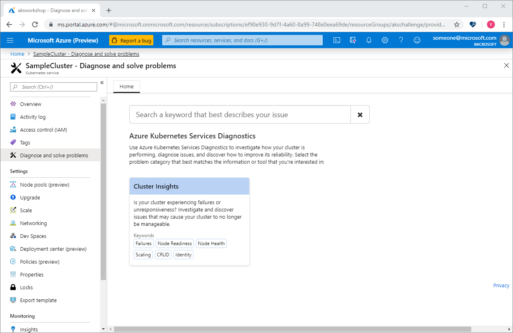
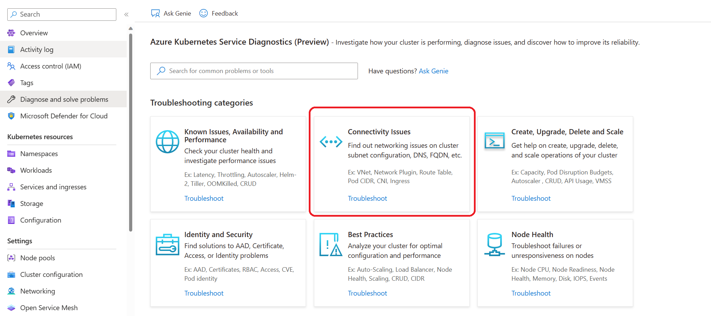
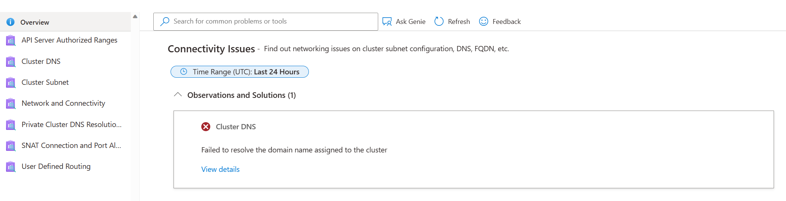
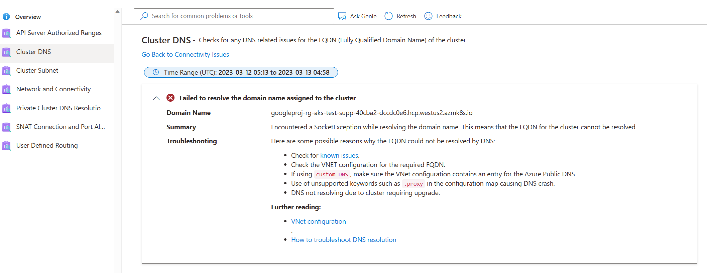
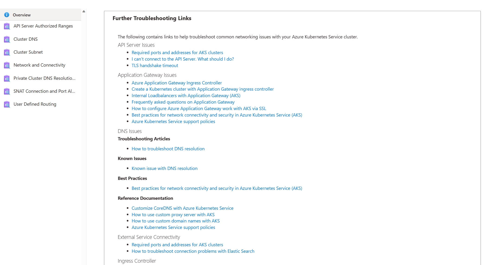
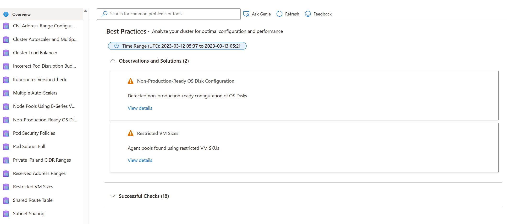
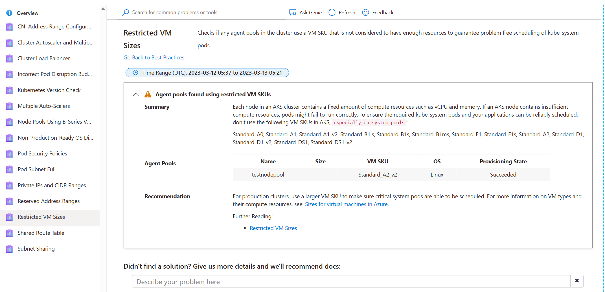

# Azure Kubernetes Service Diagnose and Solve Problems overview

Troubleshooting Azure Kubernetes Service (AKS) cluster issues plays an important role in maintaining your cluster, especially if your cluster is running mission-critical workloads. AKS Diagnose and Solve Problems is an intelligent, self-diagnostic experience that:
* Helps you identify and resolve problems in your cluster. 
* Requires no extra configuration or billing cost.
 
## Open AKS Diagnose and Solve Problems

To access AKS Diagnose and Solve Problems:

1. Navigate to your Kubernetes cluster in the [Azure portal](https://portal.azure.com).
2. Click on **Diagnose and solve problems** in the left navigation, which opens AKS Diagnose and Solve Problems.
3. Choose a category that best describes the issue of your cluster by:
    * Referring the keywords in each tile description on the homepage.
    * Typing a keyword that best describes your issue in the search bar.

## View a diagnostic report

To initiate the tool and retrieve the results in a seamless manner, click on the tile to troubleshoot. The left navigation pane has an _Overview_ option which runs all the diagnostics in that particular category. The issues that are found with the cluster will be displayed on the right panel. To obtain a comprehensive understanding of the issue, click on View details for each tile, which will provide a detailed description of:

* Issue summary
* Error details
* Recommended actions
* Links to helpful docs
* Related-metrics
* Logging data

Based on the outcome, you may follow the detailed instructions or peruse the documentation links to effectively resolve the issue at hand. 

**Example scenario 1**: I observed that my application is getting disconnected or experiencing intermittent connection issues. In response, I click **Connectivity Issues** tile to investigate the potential causes. 

I received a diagnostic alert indicating that the disconnection may be related to my *Cluster DNS*. To gather more information, I clicked on *View details*. 

Based on the diagnostic result, it appears that the issue may be related to known DNS issues or VNET configuration. Thankfully, I can use the documentation links provided to address the issue and resolve the problem.

Furthermore, if the recommended documentation based on the diagnostic results does not resolve the issue, you can return to the previous step in Diagnostics and refer to additional documentation.

## Use AKS Diagnose and Solve Problems for Best Practices

Deploying applications on AKS requires adherence to best practices to guarantee optimal performance, availability, and security. To this end, the AKS Diagnose and Solve Problems **Best Practices** tile provides an array of best practices that can assist in managing various aspects such as VM resource provisioning, cluster upgrades, scaling operations, subnet configuration, and other essential aspects of a cluster's configuration. Leveraging the AKS Diagnose and Solve Problems can be vital in ensuring that your cluster adheres to best practices and that any potential issues are identified and resolved in a timely and effective manner. By incorporating AKS Diagnose and Solve Problems into your operational practices, you can be confident in the reliability and security of your application in production.

**Example Scenario 2**: My cluster seems to be in good health. All nodes are ready, and my application runs without any issues. However, I am curious about the best practices I can follow to prevent potential problems. So, I click on the **Best Practices** tile. After reviewing the recommendations, I discovered that even though my cluster appears healthy at the moment, there are still some things I can do to avoid latency, throttling or VM uptime issues in the future. 

## Next steps

* Collect logs to help you further troubleshoot your cluster issues by using [AKS Periscope](https://aka.ms/aksperiscope).

* Read the [triage practices section](/azure/architecture/operator-guides/aks/aks-triage-practices) of the AKS day-2 operations guide.

* Post your questions or feedback at [UserVoice](https://feedback.azure.com/d365community/forum/aabe212a-f724-ec11-b6e6-000d3a4f0da0) by adding "[Diag]" in the title.
