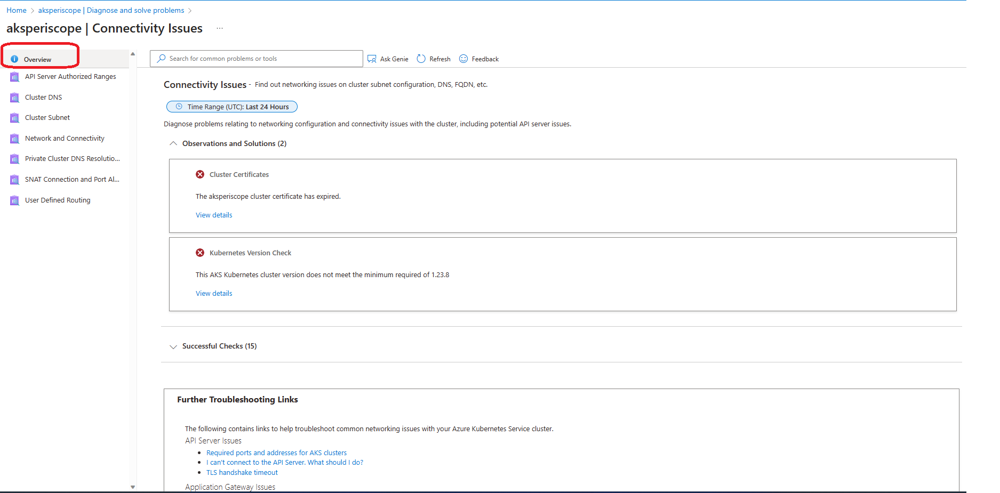
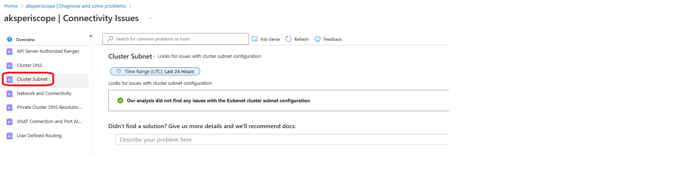

# Azure Kubernetes Service Diagnostics overview

Troubleshooting Azure Kubernetes Service (AKS) cluster issues plays an important role in maintaining your cluster, especially if your cluster is running mission-critical workloads. AKS Diagnostics is an intelligent, self-diagnostic experience that:
* Helps you identify and resolve problems in your cluster. 
* Is cloud-native.
* Requires no extra configuration or billing cost.
 

## Open AKS Diagnostics

To access AKS Diagnostics:

1. Navigate to your Kubernetes cluster in the [Azure portal](https://portal.azure.com).
1. Click on **Diagnose and solve problems** in the left navigation, which opens AKS Diagnostics.
1. Choose a category that best describes the issue of your cluster, like _Pod Disruption Budgets_, by:
    * Referring the keywords in each tile description on the homepage.
    * Typing a keyword that best describes your issue in the search bar.

## View a diagnostic report

After you click on a category, you can view a diagnostic report specific to your cluster. Diagnostic reports intelligently call out any issues in your cluster with status icons. The _Overview_ bar on the left navigation provides an overview check on your clusters. Issues that are found with this cluster will be displayed on the right panel. Click **View details** on each tile to see a detailed description of:
* Issue summary
* Error details
* Recommended actions
* Links to helpful docs
* Related-metrics
* Logging data 

You can also click on each individual bar on the left navigation to analyze one specific area. For example, you can check overview of your cluster connectivity, but you can also specifically run **Cluster Subnet** to check if there is any issues on the subnet configuration or subnet full. 

A set of useful troubleshooting documentation links are also provided at the bottom of the overview page, you can refer these to troubleshoot the most common issues that are related to your cluster connectivity. 

Diagnostic reports generate based on the current state of your cluster after running various checks. They can be useful for pinpointing the problem of your cluster and understanding next steps to resolve the issue.

Based on the most common cluster issues, the following categories are available in Diagnostics for you to check. 

## Known Issues, Availability and Performance

Known Issues, Availability and Performance checks on cluster availability and performance issues such as latency or throttling. Specifically:

- Active Service Impacting Issues
- Azure Resource Request Throttling
- ContainerD and Kubenet and Masquerading IPs
- Deprecated Node Labels
- Helm-2 Deprecation
- Kubernetes API Deprecations
- OOMKilled Pods
- Upgrade to the Standard Tier
- Windows regresion for v1.24

## Connectivity Issues

Connectivity Issues finds out networking issues on cluster subnet configuration, DNS, FQDN, etc. Specifically:

- API Server Authorized Ranges
- Cluster DNS
- Cluster Subnet
- Network and Connectivity
- Helm-2 Deprecation
- Private Cluster DNS Resolution Failures
- SNAT Connection and Port Allocation
- User Defined Routing

## Create, Upgrade, Delete and Scale

Create, Upgrade, Delete and Scale is for you to get help on create, upgrade, delete, and scale operations of your cluster. Specifically:

- Cluster Auto-Scaler
- Cluster Delete Issues
- Cluster Put, Patch and Scale Issues
- Cluster Stop/Start Issues
- Node Drain Failures
- Node Image Upgrade Issues
- Node Pool Delete Issues
- Node Pool Provisioning State
- Node Pool Put and Scale Issues

## Identity and Security

Identity and Security finds solutions to AAD, Certificate, Access, or Identity problems. Specifically:

- AKS-managed AAD Integration Issues
- Azure KeyVault KMS Integration Issues
- Client Application Failures
- Cluster Certificates
- Identity and Security Management
- Reset AAD or Service Principal Profile Issues

## Node Health

Node Health troubleshoots failures or unresponsiveness on nodes. Specifically:

- Node CPU Pressure
- Node Disk Pressure
- Node Memory Pressure
- Node PID Pressure
- IdNodes Not Ready

## Best Practice

Besides above particular focused areas, this category provides a set of checks and diagnostics to help you analyze your cluster for optimal configuration and performance. Specifically: 

- CNI Address Range Configuration
- Cluster Autoscaler and Multiple AZs
- Cluster Load Balancer
- Incorrect Pod Disruption Budgets
- Kubernetes Version Check
- Multiple Auto-Scalers
- Node Pools Using B-Series VMs
- Non-Production-Ready OS Disk Configuration
- Pod Security Policies
- Pod Subnet Full
- Private IPs and CIDR Ranges
- Reserved Address Ranges
- Restricted VM Sizes
- Shared Route Table
- Subnet Sharing

## Next steps

* Collect logs to help you further troubleshoot your cluster issues by using [AKS Periscope](https://aka.ms/aksperiscope).

* Read the [triage practices section](/azure/architecture/operator-guides/aks/aks-triage-practices) of the AKS day-2 operations guide.

* Post your questions or feedback at [UserVoice](https://feedback.azure.com/d365community/forum/aabe212a-f724-ec11-b6e6-000d3a4f0da0) by adding "[Diag]" in the title.
