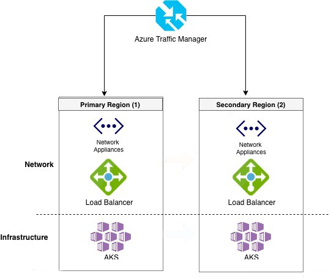

# Migrate to Azure Kubernetes Service (AKS)

To help you plan and execute a successful migration to Azure Kubernetes Service (AKS), this guide provides details for the current recommended AKS configuration. While this article doesn't cover every scenario, it contains links to more detailed information for planning a successful migration.

In this article, we summarize migration details for:

> [!div class="checklist"]
>
> * Containerizing applications through Azure Migrate
> * AKS with standard load balancer and Virtual Machine Scale Sets
> * Existing attached Azure services
> * Ensure valid quotas
> * High availability and business continuity
> * Considerations for stateless applications
> * Considerations for stateful applications
> * Deployment of your cluster configuration

> [!NOTE]
> Depending on your scenario, the following open-source tools might help with your migration:
>
> * [Velero](https://velero.io/) (Requires Kubernetes 1.7+)
> * [Azure Kube CLI extension](https://github.com/yaron2/azure-kube-cli)

## Before you begin

* Ensure your target Kubernetes version is within the supported window for AKS. Older versions may not be within the supported range and require a version upgrade for AKS support. For more information, see [AKS supported Kubernetes versions](./supported-kubernetes-versions.md).
* If you're migrating to a newer version of Kubernetes, review the [Kubernetes version and version skew support policy](https://kubernetes.io/docs/setup/release/version-skew-policy/#supported-versions).

An important practice that you should include as part of your migration process is remembering to follow commonly used deployment and testing patterns. Testing your application before deployment is an important step to ensure its quality, functionality, and compatibility with the target environment. It can help you identify and fix any errors, bugs, or issues that might affect the performance, security, or usability of the application or underlying infrastructure.

## Use Azure Migrate to migrate your applications to AKS

Azure Migrate offers a unified platform to assess and migrate to Azure on-premises servers, infrastructure, applications, and data. For AKS, you can use Azure Migrate for the following tasks:

* [Containerizing ASP.NET applications and migrating to AKS](../migrate/tutorial-app-containerization-aspnet-kubernetes.md).
* [Containerizing Java web applications and migrating to AKS](../migrate/tutorial-app-containerization-java-kubernetes.md).

## AKS with standard load balancer and Virtual Machine Scale Sets

AKS is a managed service offering unique capabilities with lower management overhead. Since AKS is a managed service, you must select from a set of AKS-supported [regions](./quotas-skus-regions.md). You may need to modify your existing applications to keep them healthy on the AKS-managed control plane during the transition from your existing cluster to AKS.

We recommend using AKS clusters backed by [Virtual Machine Scale Sets](../virtual-machine-scale-sets/index.yml) and the [Azure Standard Load Balancer](./load-balancer-standard.md) to ensure you get the following features:

* [Multiple node pools](./create-node-pools.md),
* [Availability zones](../reliability/availability-zones-overview.md),
* [Authorized IP ranges](./api-server-authorized-ip-ranges.md),
* [Cluster autoscaler](./cluster-autoscaler.md),
* [Azure Policy for AKS](../governance/policy/concepts/policy-for-kubernetes.md), and
* Other new features as they're released.

AKS clusters backed by [virtual machine availability sets](../virtual-machines/availability.md#availability-sets) lack support for many of these features.

### Create an AKS cluster with Standard Load Balancer and Virtual Machine Scale Sets

The following example creates an AKS cluster with single node pool backed by a virtual machine (VM) scale set. It enables the cluster autoscaler on the node pool for the cluster and sets a minimum of *one* and a maximum of *three* nodes.

1. Create a resource group using the [`az group create`][az-group-create] command.

    ```azurecli-interactive
    az group create --name myResourceGroup --location eastus
    ```

2. Create an AKS cluster using the [`az aks create`][az-aks-create] command.

    ```azurecli-interactive
    az aks create \
      --resource-group myResourceGroup \
      --name myAKSCluster \
      --node-count 1 \
      --vm-set-type VirtualMachineScaleSets \
      --load-balancer-sku standard \
      --enable-cluster-autoscaler \
      --min-count 1 \
      --max-count 3
    ```

## Existing attached Azure Services

When migrating clusters, you may have attached external Azure services. While the following services don't require resource recreation, they require updating connections from previous to new clusters to maintain functionality.

* Azure Container Registry
* Log Analytics
* Application Insights
* Traffic Manager
* Storage Account
* External Databases

## Ensure valid quotas

Since other VMs are deployed into your subscription during migration, you should verify your quotas and limits are sufficient for these resources. If necessary, request an increase in [vCPU quota](../azure-portal/supportability/per-vm-quota-requests.md).

You may need to request an increase for [network quotas](../azure-portal/supportability/networking-quota-requests.md) to ensure you don't exhaust IPs. For more information, see [networking and IP ranges for AKS](./configure-kubenet.md).

For more information, see [Azure subscription and service limits](../azure-resource-manager/management/azure-subscription-service-limits.md). To check your current quotas, in the Azure portal, go to the [subscriptions blade](https://portal.azure.com/#blade/Microsoft_Azure_Billing/SubscriptionsBlade), select your subscription, and then select **Usage + quotas**.

## High availability and business continuity

If your application can't handle downtime, you need to follow best practices for high availability migration scenarios. Read more about [Best practices for complex business continuity planning, disaster recovery, and maximizing uptime in Azure Kubernetes Service (AKS)](./operator-best-practices-multi-region.md).

For complex applications, you typically migrate over time rather than all at once, meaning the old and new environments might need to communicate over the network. Applications previously using `ClusterIP` services to communicate might need to be exposed as type `LoadBalancer` and secured appropriately.

To complete the migration, you want to point clients to the new services that run on AKS. We recommend you redirect traffic by updating DNS to point to the load balancer sitting in front of your AKS cluster.

[Azure Traffic Manager](../traffic-manager/index.yml) can direct customers to the desired Kubernetes cluster and application instance. Traffic Manager is a DNS-based traffic load balancer that can distribute network traffic across regions. For the best performance and redundancy, direct all application traffic through Traffic Manager before it goes to your AKS cluster.

In a multi-cluster deployment, customers should connect to a Traffic Manager DNS name that points to the services on each AKS cluster. Define these services by using Traffic Manager endpoints. Each endpoint is the *service load balancer IP*. Use this configuration to direct network traffic from the Traffic Manager endpoint in one region to the endpoint in a different region.



[Azure Front Door Service](../frontdoor/front-door-overview.md) is another option for routing traffic for AKS clusters. With Azure Front Door Service, you can define, manage, and monitor the global routing for your web traffic by optimizing for best performance and instant global failover for high availability.

### Considerations for stateless applications

Stateless application migration involves the following steps:

1. Apply your resource definitions (YAML or Helm) to the new cluster.
2. Ensure everything works as expected.
3. Redirect traffic to activate your new cluster.

### Considerations for stateful applications

Carefully plan your migration of stateful applications to avoid data loss or unexpected downtime.

* If you use Azure Files, you can mount the file share as a volume into the new cluster. See [Mount Static Azure Files as a Volume](./azure-csi-files-storage-provision.md#mount-file-share-as-a-persistent-volume).
* If you use Azure Managed Disks, you can only mount the disk if unattached to any VM. See [Mount Static Azure Disk as a Volume](./azure-csi-disk-storage-provision.md#mount-disk-as-a-volume).
* If neither of those approaches work, you can use a backup and restore options. See [Velero on Azure](https://github.com/vmware-tanzu/velero-plugin-for-microsoft-azure/blob/master/README.md).

#### Azure Files

Unlike disks, Azure Files can be mounted to multiple hosts concurrently. In your AKS cluster, Azure and Kubernetes don't prevent you from creating a pod that your AKS cluster still uses. To prevent data loss and unexpected behavior, ensure the clusters don't simultaneously write to the same files.

If your application can host multiple replicas that point to the same file share, follow the stateless migration steps and deploy your YAML definitions to your new cluster.

If not, a possible migration approach involves the following steps:

1. Validate your application is working correctly.
2. Point your live traffic to your new AKS cluster.
3. Disconnect the old cluster.

If you want to start with an empty share and make a copy of the source data, you can use the [`az storage file copy`](/cli/azure/storage/file/copy) command to migrate your data.

#### Migrating persistent volumes

If you're migrating existing persistent volumes to AKS, you generally follow these steps:

1. Quiesce writes to the application.
    * This step is optional and requires downtime.
1. Take snapshots of the disks.
1. Create new managed disks from the snapshots.
1. Create persistent volumes in AKS.
1. Update pod specifications to [use existing volumes](./azure-disk-csi.md) rather than PersistentVolumeClaims (static provisioning).
1. Deploy your application to AKS.
1. Validate your application is working correctly.
1. Point your live traffic to your new AKS cluster.

> [!IMPORTANT]
> If you choose not to quiesce writes, you need to replicate data to the new deployment. Otherwise you miss the data that was written after you took the disk snapshots.

The following open-source tools can help you create managed disks and migrate volumes between Kubernetes clusters:

* [Azure CLI Disk Copy extension](https://github.com/noelbundick/azure-cli-disk-copy-extension) copies and converts disks across resource groups and Azure regions.
* [Azure Kube CLI extension](https://github.com/yaron2/azure-kube-cli) enumerates Azure Container Service Kubernetes volumes and migrates them to an AKS cluster.

### Deployment of your cluster configuration

We recommend you use your existing Continuous Integration (CI) and Continuous Delivery (CD) pipeline to deploy a known-good configuration to AKS. You can use Azure Pipelines to [build and deploy your applications to AKS](/azure/devops/pipelines/ecosystems/kubernetes/aks-template). Clone your existing deployment tasks and ensure `kubeconfig` points to the new AKS cluster.

If that's not possible, export resource definitions from your existing Kubernetes cluster and then apply them to AKS. You can use `kubectl` to export objects. For example:

```console
kubectl get deployment -o yaml > deployments.yaml
```

Be sure to examine the output and remove any unnecessary live data fields.

### Moving existing resources to another region

You may want to move your AKS cluster to a [different region supported by AKS][region-availability]. We recommend you create a new cluster in the other region and then deploy your resources and applications to your new cluster.

If you have any services running on your AKS cluster, you need to install and configure those services on your cluster in the new region.

In this article, we summarized migration details for:

> [!div class="checklist"]
>
> * Containerizing applications through Azure Migrate
> * AKS with standard load balancer and Virtual Machine Scale Sets
> * Existing attached Azure services
> * Ensure valid quotas
> * High availability and business continuity
> * Considerations for stateless applications
> * Considerations for stateful applications
> * Deployment of your cluster configuration

<!-- LINKS - internal -->
[region-availability]: https://azure.microsoft.com/global-infrastructure/services/?products=kubernetes-service
[az-group-create]: /cli/azure/group#az_group_create
[az-aks-create]: /cli/azure/aks#az_aks_create
