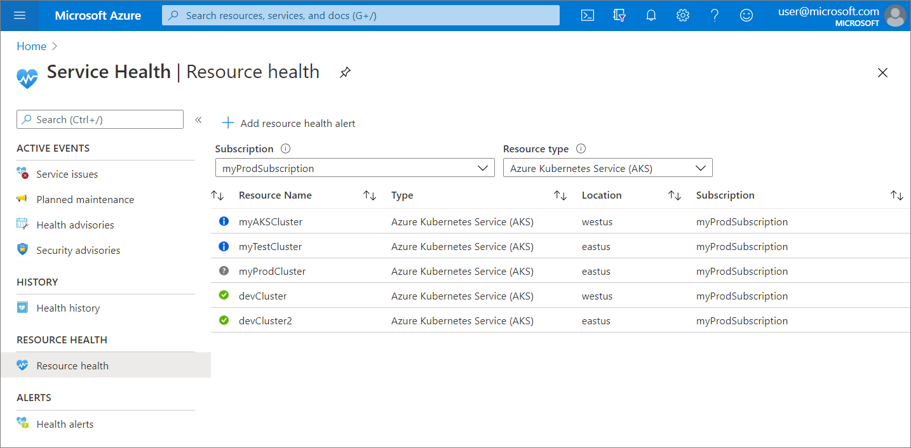
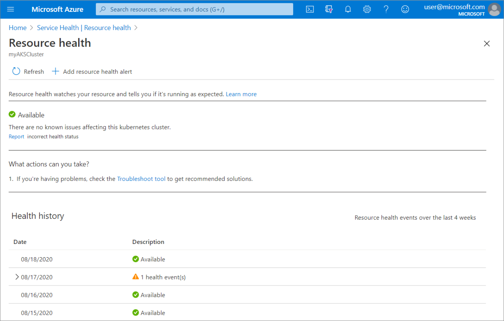

# Check for Resource Health events impacting your AKS cluster

When running your container workloads on AKS, you want to ensure you are able to troubleshoot and fix problems as soon as they arise to minimize the impact on the availability of your workloads. Now available in public preview for AKS, **Azure Resource Health** gives you visibility into various health events that may cause your AKS cluster to be unavailable.

Azure Resource Health helps you diagnose and get support for service problems that affect your Azure resources. It reports on the current and past health of your resources and helps you determine if the problem is caused by a user-initiated action or a platform event.

Azure Resource Health receives signals for your managed cluster to determine the health state of the cluster. It examines the health state of your AKS cluster and reports actions required for each health signal. These signals range from auto-resolving issues, planned updates, unplanned health events, and unavailability caused by user-initiated actions. These signals are classified using the Azure Resource Health’s health status: Available, Unavailable, Unknown, and Degraded.

[!INCLUDE [preview features callout](./includes/preview/preview-callout.md)]

## Open Resource Health

To access Resource Health for your AKS cluster:

- Navigate to your AKS cluster in the [Azure portal](https://portal.azure.com).
- Click on **Resource Health** in the left navigation.

To access Resource Health for all clusters on your subscription:

- Search for **Service Health** in the [Azure portal](https://portal.azure.com) and navigate to it.
- Click on **Resource health** in the left navigation.
- Select your subscription and set the resource type to Azure Kubernetes Service (AKS).

## Check the health status

When there is no known issue affecting your cluster’s health, Resource Health will report your cluster as available.

When Resource Health receives a signal from your managed cluster on a health issue requiring your action. It will display its health status as degraded.

For additional details on what each health status indicates, visit [Resource Health overview](https://docs.microsoft.com/azure/service-health/resource-health-overview#health-status).

### View historical data

You can also view the past 30 days of historical Resource Health information.

[Health History](./media/aks-resource-health/health-history.png)

## Next steps

Run checks on your cluster to further troubleshoot your cluster issues by using [AKS Diagnostics](https://docs.microsoft.com/azure/aks/concepts-diagnostics).